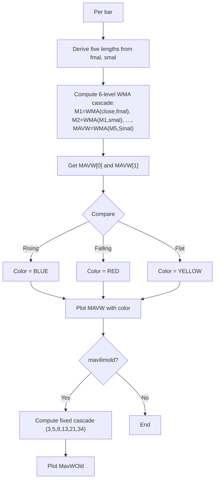

# MavilimW (Fibonacci WMA Cascade) - Technical Guide

> Cascaded WMA with Fibonacci-derived lengths and color-coded direction (blue up, red down, yellow flat).

| | |
| --- | --- |
| **Language** | Indie Script v5 |
| **Platform** | [TakeProfit](https://takeprofit.com) |
| **Category** | Trend |
| **Type** | Indicator |
| **Author** | @insurgent on TakeProfit |
| **Original** | inspired by: @mavilim0732 |
| **Original (TradingView)** | [MavilimW](https://www.tradingview.com/scripts/mavilimw/) by KivancOzbilgic (script tag page; the original page was not located) |
| **Original license** | See the header of the Pine file |
| **Original source** | [MavilimW (Fibonacci WMA Cascade).pinescript4](MavilimW%20(Fibonacci%20WMA%20Cascade).pinescript4) |
| **License** | [MPL-2.0](https://mozilla.org/MPL/2.0/) (derivative work) |
| **Live script** | [Open on TakeProfit](https://takeprofit.com/indicator/mavilimw-fibonacci-wma-cascade-33) |
| **Source file** | [MavilimW (Fibonacci WMA Cascade).indie5](MavilimW%20(Fibonacci%20WMA%20Cascade).indie5) |

## Overview

MavilimW applies a cascade of six Weighted Moving Averages (WMA) using Fibonacci-style lengths to produce a smooth trend line. The lengths are derived from two user inputs (`fmal`, `smal`) by adding successive results: `tmal = fmal+smal`, `Fmal = smal+tmal`, `Ftmal = tmal+Fmal`, `Smal = Fmal+Ftmal`. With the defaults 3 and 5, the sequence becomes 3, 5, 8, 13, 21, 34 — the Fibonacci numbers. The indicator also optionally plots an older version (MavWOld) that uses fixed Fibonacci lengths 3, 5, 8, 13, 21, 34.

The indicator is drawn in the main chart pane as a line whose color changes every bar: blue when the current value is higher than the previous bar, red when lower, and yellow when unchanged. This makes it easy to visually confirm the short‑term trend direction.

## How it works

1. Derive five lengths from user inputs `fmal` and `smal` using an additive sequence (tmal, Fmal, Ftmal, Smal).
2. Compute the first WMA of `close` with length `fmal` → M1.
3. Apply subsequent WMAs on the previous result with each derived length (M2 on M1 with `smal`, M3 on M2 with `tmal`, …).
4. The final series `MAVW` is the sixth WMA (on M5 with `Smal`).
5. Compare `MAVW[0]` (current bar) with `MAVW[1]` (previous bar) to pick the line color: blue if rising, red if falling, yellow if equal.
6. If `mavilimold` is true, compute a second cascade with fixed Fibonacci lengths (3,5,8,13,21,34) and plot it as a separate line.

## Logic flow



## Parameters

| Parameter | Type | Default | Range | Description |
| --- | --- | --- | --- | --- |
| `mavilimold` | bool | false |  | Show Previous Version of MavilimW? |
| `fmal` | int | 3 | ≥ 1 | First Moving Average length |
| `smal` | int | 5 | ≥ 1 | Second Moving Average length |

## Code walkthrough

### Length derivation and cascade

Lines 15-25 of [MavilimW (Fibonacci WMA Cascade).indie5](MavilimW%20(Fibonacci%20WMA%20Cascade).indie5):

```python
    tmal = fmal + smal
    Fmal = smal + tmal
    Ftmal = tmal + Fmal
    Smal = Fmal + Ftmal

    M1 = Wma.new(self.close, fmal)
    M2 = Wma.new(M1, smal)
    M3 = Wma.new(M2, tmal)
    M4 = Wma.new(M3, Fmal)
    M5 = Wma.new(M4, Ftmal)
    MAVW = Wma.new(M5, Smal)
```

Starting from `fmal` and `smal`, each new length is the sum of the two previous ones, producing a Fibonacci-like sequence. The cascade applies WMA six times: each step takes the previous WMA output as input, smoothing the series progressively. The final series `MAVW` is the result of the last WMA.

### Dynamic coloring logic

Lines 30-35 of [MavilimW (Fibonacci WMA Cascade).indie5](MavilimW%20(Fibonacci%20WMA%20Cascade).indie5):

```python
    col = color.YELLOW
    if mavw_val > mavw_prev:
        col = color.BLUE
    elif mavw_val < mavw_prev:
        col = color.RED

```

The color for the main line is determined by comparing the current value of MAVW with the previous bar's value. BLUE indicates an uptick, RED a downtick, and YELLOW an unchanged value. This simple ternary logic is implemented as an if/elif chain, matching the original Pine Script's conditional color assignment.

### Optional old version with fixed lengths

Lines 37-46 of [MavilimW (Fibonacci WMA Cascade).indie5](MavilimW%20(Fibonacci%20WMA%20Cascade).indie5):

```python
    M12 = Wma.new(self.close, 3)
    M22 = Wma.new(M12, 5)
    M32 = Wma.new(M22, 8)
    M42 = Wma.new(M32, 13)
    M52 = Wma.new(M42, 21)
    MAVW2 = Wma.new(M52, 34)

    mavw2_val = MAVW2[0] if mavilimold else nan

    return plot.Line(mavw_val, color=col), plot.Line(mavw2_val)
```

When the user enables `mavilimold`, a second cascade using hardcoded Fibonacci lengths (3,5,8,13,21,34) is computed. The resulting series `MAVW2` is plotted as an additional line. When the option is off, `mavw2_val` is set to `nan`, so nothing is drawn for that plot.

## Pine Script vs Indie

The Indie version follows the same logic and structure as the original Pine Script by KivancOzbilgic, using six cascaded WMAs and dynamic coloring. The main differences lie in language syntax and the absence of alert conditions.

| Pine Script | Indie | Note |
| --- | --- | --- |
| `wma(close, fmal)` | `Wma.new(self.close, fmal)` | Pine uses function; Indie uses .new() returning a series. |
| `MAVW>MAVW[1]` | `mavw_val > mavw_prev` | History reference operator [1] vs pre‑fetched variables. |
| `mavilimold and MAVW2 ? MAVW2 : na` | `MAVW2[0] if mavilimold else nan` | Direct conditional expression with nan. |

### Length derivation and cascade

Pine Script, lines 15-35 of [MavilimW (Fibonacci WMA Cascade).pinescript4](MavilimW%20(Fibonacci%20WMA%20Cascade).pinescript4):

```pine
tmal=fmal+smal

Fmal=smal+tmal

Ftmal=tmal+Fmal

Smal=Fmal+Ftmal


M1= wma(close, fmal)

M2= wma(M1, smal)

M3= wma(M2, tmal)

M4= wma(M3, Fmal)

M5= wma(M4, Ftmal)

MAVW= wma(M5, Smal)
```

Indie, lines 15-25 of [MavilimW (Fibonacci WMA Cascade).indie5](MavilimW%20(Fibonacci%20WMA%20Cascade).indie5):

```python
    tmal = fmal + smal
    Fmal = smal + tmal
    Ftmal = tmal + Fmal
    Smal = Fmal + Ftmal

    M1 = Wma.new(self.close, fmal)
    M2 = Wma.new(M1, smal)
    M3 = Wma.new(M2, tmal)
    M4 = Wma.new(M3, Fmal)
    M5 = Wma.new(M4, Ftmal)
    MAVW = Wma.new(M5, Smal)
```

Both versions compute the same additive lengths and six‑level WMA cascade. The Pine code uses `wma(close, fmal)` while Indie uses `Wma.new(self.close, fmal)`. Indie stores each series in a variable, mirroring the Pine approach exactly.

### Color assignment

Pine Script, lines 37-41 of [MavilimW (Fibonacci WMA Cascade).pinescript4](MavilimW%20(Fibonacci%20WMA%20Cascade).pinescript4):

```pine
col1= MAVW>MAVW[1]

col3= MAVW<MAVW[1]

colorM = col1 ? color.blue : col3 ? color.red : color.yellow
```

Indie, lines 30-34 of [MavilimW (Fibonacci WMA Cascade).indie5](MavilimW%20(Fibonacci%20WMA%20Cascade).indie5):

```python
    col = color.YELLOW
    if mavw_val > mavw_prev:
        col = color.BLUE
    elif mavw_val < mavw_prev:
        col = color.RED
```

Pine uses a ternary chain: `col1 ? color.blue : col3 ? color.red : color.yellow`. Indie uses an explicit if/elif structure, which produces the same result but is more readable in a Python-like language.

### Old version plotting

Pine Script, lines 49-63 of [MavilimW (Fibonacci WMA Cascade).pinescript4](MavilimW%20(Fibonacci%20WMA%20Cascade).pinescript4):

```pine
M12= wma(close, 3)

M22= wma(M12, 5)

M32= wma(M22, 8)

M42= wma(M32, 13)

M52= wma(M42, 21)

MAVW2= wma(M52, 34)


plot(mavilimold and MAVW2 ? MAVW2 : na, color=color.blue, linewidth=2, title="MavWOld")
```

Indie, lines 37-46 of [MavilimW (Fibonacci WMA Cascade).indie5](MavilimW%20(Fibonacci%20WMA%20Cascade).indie5):

```python
    M12 = Wma.new(self.close, 3)
    M22 = Wma.new(M12, 5)
    M32 = Wma.new(M22, 8)
    M42 = Wma.new(M32, 13)
    M52 = Wma.new(M42, 21)
    MAVW2 = Wma.new(M52, 34)

    mavw2_val = MAVW2[0] if mavilimold else nan

    return plot.Line(mavw_val, color=col), plot.Line(mavw2_val)
```

Both compute the second cascade with fixed Fibonacci lengths. Pine plots with `plot(mavilimold and MAVW2 ? MAVW2 : na, color=color.blue)`. Indie sets `mavw2_val = MAVW2[0] if mavilimold else nan` and returns it as the second plot, achieving the same conditional visibility.

## Reading the chart

- The main MAVW line is color-coded each bar: **blue** when the current value is higher than the previous bar, **red** when lower, **yellow** when equal.
- When the line changes from red to blue, it signals a potential upward shift; blue to red signals a downward shift. Yellow occurs rarely (price unchanged).
- The optional MavWOld line (displayed when the parameter is enabled) is always blue in the original Pine; in Indie it also uses blue.
- Both lines are plotted on the main price chart, making it easy to compare with price action.

## Implementation notes

- The WMA algorithm returns `NaN` until sufficient bars are available for the longest length (`Smal`). The indicator starts painting after `Smal` bars.
- The color decision is based solely on the current vs. previous bar; it can flicker on every tick in real time (historical bars are fixed).
- The old version (MavWOld) uses hardcoded Fibonacci lengths; if the user changes `fmal` and `smal`, the old version still uses 3,5,8,13,21,34.
- The `mavilimold` parameter controls visibility of the old line; when false, the second plot returns `nan` and nothing is drawn.

## FAQ

**How do the lengths become Fibonacci numbers?**

With default inputs fmal=3 and smal=5, the additive sequence produces tmal=8, Fmal=13, Ftmal=21, Smal=34. This matches the Fibonacci numbers 3,5,8,13,21,34.

**Can I change the colors of the indicator?**

No, the colors are hardcoded in the script: blue for rising, red for falling, yellow for flat. To modify them, you must edit the source code directly.

**Why doesn't the indicator plot on the first few bars?**

Weighted Moving Averages require at least as many bars as the length. Since the longest length used is Smal (34 by default), the indicator starts plotting only after 34 bars of data.

## License and attribution

This Indie script is a derivative work of **MavilimW by KivancOzbilgic** on TradingView. The Pine Script original states no license in its header; TradingView applies MPL-2.0 by default to open-source scripts. A modified version of MPL-2.0 code must stay under [MPL-2.0](https://mozilla.org/MPL/2.0/), so this file is distributed under that license (the notice is appended to the end of the source file). The original author keeps the credit for the algorithm; this page is not affiliated with or endorsed by them.

## Full source code

Indie Script v5, as published on TakeProfit. Copy it into the platform's script editor or [open the live script](https://takeprofit.com/indicator/mavilimw-fibonacci-wma-cascade-33).

```python
# indie:lang_version = 5
# inspired by: @mavilim0732
from math import nan
from indie import indicator, param, plot, color
from indie.algorithms import Wma


@indicator('MavilimW', overlay_main_pane=True)
@param.bool('mavilimold', default=False, title='Show Previous Version of MavilimW?')
@param.int('fmal', default=3, min=1, title='First Moving Average length')
@param.int('smal', default=5, min=1, title='Second Moving Average length')
@plot.line(color=color.BLUE, title='MAVW', line_width=2)
@plot.line(color=color.BLUE, title='MavWOld', line_width=2)
def Main(self, mavilimold, fmal, smal):
    tmal = fmal + smal
    Fmal = smal + tmal
    Ftmal = tmal + Fmal
    Smal = Fmal + Ftmal

    M1 = Wma.new(self.close, fmal)
    M2 = Wma.new(M1, smal)
    M3 = Wma.new(M2, tmal)
    M4 = Wma.new(M3, Fmal)
    M5 = Wma.new(M4, Ftmal)
    MAVW = Wma.new(M5, Smal)

    mavw_val = MAVW[0]
    mavw_prev = MAVW[1]

    col = color.YELLOW
    if mavw_val > mavw_prev:
        col = color.BLUE
    elif mavw_val < mavw_prev:
        col = color.RED

    # Old version with fixed Fibonacci lengths
    M12 = Wma.new(self.close, 3)
    M22 = Wma.new(M12, 5)
    M32 = Wma.new(M22, 8)
    M42 = Wma.new(M32, 13)
    M52 = Wma.new(M42, 21)
    MAVW2 = Wma.new(M52, 34)

    mavw2_val = MAVW2[0] if mavilimold else nan

    return plot.Line(mavw_val, color=col), plot.Line(mavw2_val)

# ---------------------------------------------------------------------------
# This Source Code Form is subject to the terms of the Mozilla Public
# License, v. 2.0. If a copy of the MPL was not distributed with this
# file, You can obtain one at https://mozilla.org/MPL/2.0/
# Derived from "MavilimW by KivancOzbilgic" (TradingView).
# ---------------------------------------------------------------------------
```
