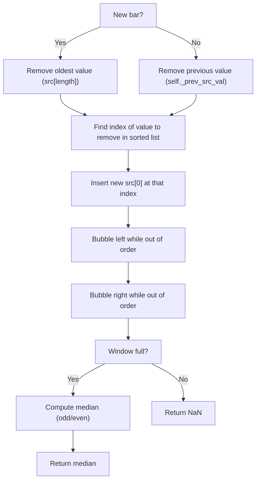

# Median Algorithm (written with Indie v4 classes) - Technical Guide

> Computes the median of the last `length` values of a series using a sliding window with a sorted list.

| | |
| --- | --- |
| **Language** | Indie Script v5 |
| **Platform** | [TakeProfit](https://takeprofit.com) |
| **Category** | Moving averages |
| **Type** | Indicator |
| **Author** | @TakeProfit on TakeProfit |
| **License** | MIT |
| **Live script** | [Open on TakeProfit](https://takeprofit.com/indicator/median-algorithm-written-with-indie-v4-classes-8) |
| **Source file** | [Median Algorithm (written with Indie v4 classes).indie5](Median%20Algorithm%20(written%20with%20Indie%20v4%20classes).indie5) |

## Overview

This indicator calculates the moving median of a given input series (by default the close price). Unlike a simple moving average, the median is robust to outliers because it takes the middle value of the sorted window. It is useful for identifying the central tendency of price without being skewed by extreme moves, making it suitable for smoothing noisy data or as a filter in trend-following systems.

The indicator draws a single white line on the main chart pane. The line appears only after the window has been filled with `length` bars. The median is computed from a sorted list of the last `length` values, which is maintained incrementally for efficiency.

## How it works

1. Detect a new bar by comparing the current bar count with the length of the input series.
2. Find the index in the sorted list where the new value will be placed, by locating the value that should be removed (the previous value on the same bar or the oldest value on a new bar).
3. Insert the new source value at that index, overwriting the removed value.
4. Restore the sorted order by swapping the inserted element left or right until it is in the correct position.
5. If the window is full (size equals `length`), compute the median: for odd length take the middle element; for even length take the average of the two middle elements.
6. Return the median value as a series; otherwise return `math.nan` until the window is full.

## Mathematical model

For a sorted window of size $n$:

$$
\text{Median} = \begin{cases}
X_{\frac{n-1}{2}} & \text{if } n \text{ is odd} \\
\frac{X_{\frac{n}{2}-1} + X_{\frac{n}{2}}}{2} & \text{if } n \text{ is even}
\end{cases}
$$

where $X$ is the sorted list (0-indexed).

## Logic flow



## Parameters

| Parameter | Type | Default | Range | Description |
| --- | --- | --- | --- | --- |
| `length` | int | 10 |  |  |

## Code walkthrough

### New bar detection

Lines 23-26 of [Median Algorithm (written with Indie v4 classes).indie5](Median%20Algorithm%20(written%20with%20Indie%20v4%20classes).indie5):

```python
    def calc(self, src: SeriesF, length: int) -> SeriesF:
        # TODO: Need self.ctx.is_new_bar here
        is_new_bar = self._bar_count != len(src)
        self._bar_count = len(src)
```

The algorithm manually detects a new bar by comparing the current bar count (`self._bar_count`) with the length of the input series. This is necessary because the Indie framework does not provide a built-in `is_new_bar` flag in this version. The count is updated after the check.

### Finding the insertion index

Lines 32-45 of [Median Algorithm (written with Indie v4 classes).indie5](Median%20Algorithm%20(written%20with%20Indie%20v4%20classes).indie5):

```python
        if len(self._sorted_vals) == length or not is_new_bar:
            val_to_remove = math.nan
            if not is_new_bar:
                val_to_remove = self._prev_src_val
            else:
                val_to_remove = src[length]
            for i in range(len(self._sorted_vals)):
                val = self._sorted_vals[i]
                if val == val_to_remove:
                    insert_index = i
                    break
        else:
            self._sorted_vals.append(math.nan)
            insert_index = len(self._sorted_vals) - 1
```

If the window is full or the bar is not new, the algorithm searches for the value that should be removed (either the previous value on the same bar or the oldest value on a new bar). That index becomes the insertion point for the new value. If the window is not yet full and it is a new bar, a new slot is appended.

### Inserting and restoring sorted order

Lines 49-57 of [Median Algorithm (written with Indie v4 classes).indie5](Median%20Algorithm%20(written%20with%20Indie%20v4%20classes).indie5):

```python
        self._sorted_vals[insert_index] = self._prev_src_val = src[0]

        # Restore sorted order in our array
        while insert_index > 0 and self._sorted_vals[insert_index - 1] > self._sorted_vals[insert_index]:
            swap(self._sorted_vals, insert_index, insert_index - 1)
            insert_index -= 1
        while insert_index < len(self._sorted_vals) - 1 and self._sorted_vals[insert_index] > self._sorted_vals[insert_index + 1]:
            swap(self._sorted_vals, insert_index, insert_index + 1)
            insert_index += 1
```

The new source value is placed at the insertion index, potentially breaking the sorted order. Two while loops then bubble the element left or right until the list is sorted again. This incremental approach avoids a full sort on every bar.

### Median calculation

Lines 61-71 of [Median Algorithm (written with Indie v4 classes).indie5](Median%20Algorithm%20(written%20with%20Indie%20v4%20classes).indie5):

```python
        if len(self._sorted_vals) == length:
            if length % 2 == 1:
                # Odd number of elements, e.g. [1, 3, 5] so the median is 3
                res = self._sorted_vals[(length - 1) // 2]
            else:
                # Even number of elements, e.g. [1, 3, 5, 7] 
                # so the median is (3 + 5) / 2 = 8
                mid_index = (length - 1) // 2
                left = self._sorted_vals[mid_index]
                right = self._sorted_vals[mid_index + 1]
                res = (left + right) / 2
```

Once the window reaches the required length, the median is computed. For an odd number of elements, the middle element is taken directly. For an even number, the average of the two middle elements is used. The result is returned as a `MutSeriesF`.

## Reading the chart

* The indicator plots a single white line on the main chart pane.
* The line is only drawn when the internal sorted list has reached the specified `length` (i.e., after the first `length` bars). Before that, no value is plotted.
* The line represents the median of the last `length` closing prices (or any input series). It will be less sensitive to extreme price spikes compared to a simple moving average.
* When the median line is rising, the central tendency of prices is increasing; when falling, it is decreasing. Crossovers with price can be used as potential signals (not part of this indicator).

## Implementation notes

- The algorithm maintains a sorted list as state (`self._sorted_vals`) and updates it incrementally, which is more efficient than re-sorting the entire window each bar.
- NaN handling: The result is `math.nan` until the window is full. The previous source value (`self._prev_src_val`) is stored to handle intra-bar updates correctly.
- New bar detection is manual using a bar counter; this may break if the series length resets (e.g., on timeframe changes). The code includes a TODO comment noting the need for a built-in `is_new_bar`.
- The indicator uses the `MutSeriesF` return type, which allows the series to be updated in place. The `Median` class inherits from `Algorithm` and uses the class syntax introduced in Indie v4.

## FAQ

**How do I change the input series from close to something else?**

Modify the `Main` function: replace `self.close` with any other series, e.g., `self.high` or `self.volume`. The `length` parameter can be adjusted in the indicator settings.

**What happens during the first `length` bars?**

The sorted list is built incrementally. Until it contains exactly `length` elements, the indicator returns `math.nan` and nothing is plotted. The median line appears only after the window is full.

**Can this indicator be used on a different timeframe?**

Yes, by using `sec_context` or `calc_on` decorators (not shown in this code). The algorithm itself is timeframe-agnostic; it processes the series as given. However, the manual new-bar detection may need adjustment if the series length changes unexpectedly.

## Full source code

Indie Script v5, as published on TakeProfit. Copy it into the platform's script editor or [open the live script](https://takeprofit.com/indicator/median-algorithm-written-with-indie-v4-classes-8).

```python
# indie:lang_version = 5
import math
from indie import indicator, Algorithm, Context, SeriesF, MutSeriesF, plot, color, param


def swap(a: list[float], i: int, j: int) -> None:
    tmp = a[i]
    a[i] = a[j]
    a[j] = tmp


# The main idea of this algorithm is to have a sliding window 
# of `length` last values of `src` series and keep them in a sorted order.
# Having such an array, the median is easily calculated as the value 
# in the middle of such an array.
class Median(Algorithm):
    def __init__(self, ctx: Context):
        super().__init__(ctx)
        self._sorted_vals: list[float] = []
        self._prev_src_val = math.nan
        self._bar_count = 0
        
    def calc(self, src: SeriesF, length: int) -> SeriesF:
        # TODO: Need self.ctx.is_new_bar here
        is_new_bar = self._bar_count != len(src)
        self._bar_count = len(src)

        # First we search in our sorted array for an index where 
        # the new element will be inserted. We add new element at position 
        # of some existing element which is need to leave the array anyway
        insert_index = -1
        if len(self._sorted_vals) == length or not is_new_bar:
            val_to_remove = math.nan
            if not is_new_bar:
                val_to_remove = self._prev_src_val
            else:
                val_to_remove = src[length]
            for i in range(len(self._sorted_vals)):
                val = self._sorted_vals[i]
                if val == val_to_remove:
                    insert_index = i
                    break
        else:
            self._sorted_vals.append(math.nan)
            insert_index = len(self._sorted_vals) - 1

        # Insert the new element in our sorted array.
        # After this line the sorted order could be broken (most likely it is)
        self._sorted_vals[insert_index] = self._prev_src_val = src[0]

        # Restore sorted order in our array
        while insert_index > 0 and self._sorted_vals[insert_index - 1] > self._sorted_vals[insert_index]:
            swap(self._sorted_vals, insert_index, insert_index - 1)
            insert_index -= 1
        while insert_index < len(self._sorted_vals) - 1 and self._sorted_vals[insert_index] > self._sorted_vals[insert_index + 1]:
            swap(self._sorted_vals, insert_index, insert_index + 1)
            insert_index += 1

        # Find the median value
        res = math.nan
        if len(self._sorted_vals) == length:
            if length % 2 == 1:
                # Odd number of elements, e.g. [1, 3, 5] so the median is 3
                res = self._sorted_vals[(length - 1) // 2]
            else:
                # Even number of elements, e.g. [1, 3, 5, 7] 
                # so the median is (3 + 5) / 2 = 8
                mid_index = (length - 1) // 2
                left = self._sorted_vals[mid_index]
                right = self._sorted_vals[mid_index + 1]
                res = (left + right) / 2

        return MutSeriesF.new(res)


@indicator('Median', overlay_main_pane=True)
@param.int('length', default=10)
@plot.line(color=color.WHITE, id='#plot_0')
def Main(self, length):
    return Median.new(self.close, length)[0]
```
