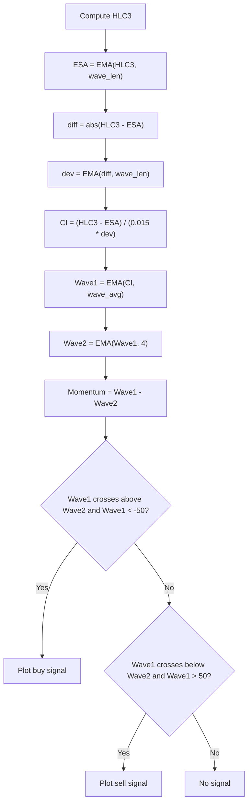

# MrktCyphr-like Osc. v3.3 - Technical Guide

> Market Cipher B-inspired oscillator with two EMAs, momentum histogram, and cross signals.

| | |
| --- | --- |
| **Language** | Indie Script v5 |
| **Platform** | [TakeProfit](https://takeprofit.com) |
| **Category** | Oscillators |
| **Type** | Indicator |
| **Author** | @slhunter444 on TakeProfit |
| **License** | licensed under the MIT License (see the header of the source file) |
| **Live script** | [Open on TakeProfit](https://takeprofit.com/indicator/mrktcyphr-like-osc-v3-3-63) |
| **Source file** | [MrktCyphr-like Osc. v3.3.indie5](MrktCyphr-like%20Osc.%20v3.3.indie5) |

## Overview

This indicator computes two smoothed wave lines (Wave 1 and Wave 2) from a normalized price deviation, plus a momentum histogram. It is designed to identify potential turning points when the waves cross at extreme levels. The chart shows a blue line (Wave 1), an orange line (Wave 2), a green histogram (momentum), a lime marker for buy signals, and a red marker for sell signals.

## How it works

1. Compute HLC3 (high + low + close) / 3 as the base price.
2. Calculate an EMA of HLC3 (Wave Channel Length) and the absolute deviation from it, then smooth the deviation with another EMA.
3. Normalize the price difference from ESA by dividing by 0.015 times the smoothed absolute deviation to get the CI value.
4. Apply an EMA to CI (Wave Average Length) to produce Wave 1, then a 4-period EMA of Wave 1 to produce Wave 2.
5. Momentum is the difference between Wave 1 and Wave 2.
6. A buy signal is plotted when Wave 1 crosses above Wave 2 and Wave 1 is below -50.
7. A sell signal is plotted when Wave 1 crosses below Wave 2 and Wave 1 is above 50.

## Mathematical model

$$
\text{HLC3} = \frac{\text{high} + \text{low} + \text{close}}{3}
$$

$$
\text{ESA} = \text{EMA}_{\text{wave\_len}}(\text{HLC3})
$$

$$
\text{diff} = |\text{HLC3} - \text{ESA}|
$$

$$
\text{dev} = \text{EMA}_{\text{wave\_len}}(\text{diff})
$$

$$
\text{CI} = \frac{\text{HLC3} - \text{ESA}}{0.015 \times \text{dev}}
$$

$$
\text{Wave1} = \text{EMA}_{\text{wave\_avg}}(\text{CI})
$$

$$
\text{Wave2} = \text{EMA}_4(\text{Wave1})
$$

$$
\text{Momentum} = \text{Wave1} - \text{Wave2}
$$

## Logic flow



## Parameters

| Parameter | Type | Default | Range | Description |
| --- | --- | --- | --- | --- |
| `wave_len` | int | 10 |  | Wave Channel Length |
| `wave_avg` | int | 21 |  | Wave Average Length |

## Code walkthrough

### Input parameters and decorators

Lines 13-22 of [MrktCyphr-like Osc. v3.3.indie5](MrktCyphr-like%20Osc.%20v3.3.indie5):

```python
@param.int('wave_len', default=10, title='Wave Channel Length')
@param.int('wave_avg', default=21, title='Wave Average Length')


@indicator('Cipher-Inspired Oscillator_v3.3[SLHunter444]')
@plot.line(color=color.BLUE, title='Wave 1')
@plot.line(color=color.ORANGE, title='Wave 2')
@plot.histogram(color=color.GREEN, title='Momentum')
@plot.marker(color=color.LIME, title='Buy')
@plot.marker(color=color.RED, title='Sell')
```

Two integer parameters define the lengths for the wave channel and wave average. Decorators configure the indicator name, plot styles (line, histogram, marker), and colors. The function signature receives these parameters.

### Core computation of CI and waves

Lines 27-35 of [MrktCyphr-like Osc. v3.3.indie5](MrktCyphr-like%20Osc.%20v3.3.indie5):

```python
    hlc3 = self.hlc3

    esa = Ema.new(hlc3, wave_len)
    diff = MutSeriesF.new(abs(hlc3[0] - esa[0]))
    dev = Ema.new(diff, wave_len)

    ci = MutSeriesF.new((hlc3[0] - esa[0]) / (0.015 * dev[0]))
    wave1 = Ema.new(ci, wave_avg)
    wave2 = Ema.new(wave1, 4)
```

HLC3 is the base price. An EMA of HLC3 (esa) is computed, then the absolute difference is smoothed into dev. The CI value normalizes the price difference from ESA by 0.015 * dev. Two EMAs produce Wave1 and Wave2.

### Momentum calculation

Lines 37-37 of [MrktCyphr-like Osc. v3.3.indie5](MrktCyphr-like%20Osc.%20v3.3.indie5):

```python
    momentum = MutSeriesF.new(wave1[0] - wave2[0])
```

Momentum is simply the difference between Wave1 and Wave2, stored as a MutSeriesF for access to previous values.

### Signal generation with cross detection

Lines 42-51 of [MrktCyphr-like Osc. v3.3.indie5](MrktCyphr-like%20Osc.%20v3.3.indie5):

```python
    buy = nan
    sell = nan

    # Cross up: wave1 crosses above wave2 (wave1[0] > wave2[0] and wave1[1] <= wave2[1])
    if wave1[0] > wave2[0] and wave1[1] <= wave2[1] and wave1[0] < -50:
        buy = wave1[0]

    # Cross down: wave1 crosses below wave2 (wave1[0] < wave2[0] and wave1[1] >= wave2[1])
    if wave1[0] < wave2[0] and wave1[1] >= wave2[1] and wave1[0] > 50:
        sell = wave1[0]
```

Buy and sell signals are set to nan initially. A buy occurs when Wave1 crosses above Wave2 and Wave1 is below -50. A sell occurs when Wave1 crosses below Wave2 and Wave1 is above 50. The cross is detected by comparing current and previous values.

### Return values

Lines 53-53 of [MrktCyphr-like Osc. v3.3.indie5](MrktCyphr-like%20Osc.%20v3.3.indie5):

```python
    return wave1[0], wave2[0], momentum[0], buy, sell
```

The function returns five values: Wave1, Wave2, momentum, buy, and sell. These correspond to the five plot decorators in order.

## Reading the chart

* **Blue line (Wave 1):** The primary smoothed oscillator line.
* **Orange line (Wave 2):** A further smoothed version of Wave 1 (4-period EMA).
* **Green histogram (Momentum):** The difference between Wave 1 and Wave 2. Positive values indicate Wave 1 above Wave 2; negative values indicate the opposite.
* **Lime marker (Buy):** Plotted when Wave 1 crosses above Wave 2 and Wave 1 is below -50.
* **Red marker (Sell):** Plotted when Wave 1 crosses below Wave 2 and Wave 1 is above 50.
* **Extreme levels:** Signals only trigger when Wave 1 is beyond ±50, suggesting overbought/oversold conditions.

## Implementation notes

- The indicator uses MutSeriesF to store intermediate series (diff, ci, momentum) so that previous bar values are accessible via [1] for cross detection.
- Signals are plotted at the value of Wave1 at the time of the cross, not at a fixed level.
- The 0.015 multiplier in the CI formula is a constant scaling factor; changing it would affect the range of Wave1 and Wave2.
- No repainting: signals are computed on the current bar using only current and previous bar data.

## FAQ

**How can I adjust the sensitivity of the oscillator?**

Change the 'wave_len' and 'wave_avg' parameters. A shorter wave_len makes the oscillator react faster to price changes, while a longer wave_avg smooths the waves more.

**Why are signals only generated when Wave1 is beyond ±50?**

The condition ensures that crosses are only considered significant when the oscillator is in overbought (>50) or oversold (<-50) territory, reducing false signals during neutral conditions.

**Can I use this indicator on lower timeframes?**

Yes, the indicator works on any timeframe. The parameters control the smoothing lengths, so you may need to adjust them for the desired responsiveness on different timeframes.

## Attribution

Inspired by the idea of Market Cipher B. Not affiliated with or endorsed by the original author.

## Full source code

Indie Script v5, as published on TakeProfit. Copy it into the platform's script editor or [open the live script](https://takeprofit.com/indicator/mrktcyphr-like-osc-v3-3-63).

```python
# Copyright (c) 2025 @slhunter444. All rights reserved.

# This work is licensed under the MIT License.
# For a copy, see <https://opensource.org/licenses/MIT>.

# indie:lang_version = 5

from math import nan
from indie import indicator, plot, color, param, MutSeriesF
from indie.algorithms import Ema


@param.int('wave_len', default=10, title='Wave Channel Length')
@param.int('wave_avg', default=21, title='Wave Average Length')


@indicator('Cipher-Inspired Oscillator_v3.3[SLHunter444]')
@plot.line(color=color.BLUE, title='Wave 1')
@plot.line(color=color.ORANGE, title='Wave 2')
@plot.histogram(color=color.GREEN, title='Momentum')
@plot.marker(color=color.LIME, title='Buy')
@plot.marker(color=color.RED, title='Sell')
def Main(self, wave_len, wave_avg):
    # ─────────────────────────────────────────────
    # Built-in HLC3 (MANDATORY — no + allowed)
    # ─────────────────────────────────────────────
    hlc3 = self.hlc3

    esa = Ema.new(hlc3, wave_len)
    diff = MutSeriesF.new(abs(hlc3[0] - esa[0]))
    dev = Ema.new(diff, wave_len)

    ci = MutSeriesF.new((hlc3[0] - esa[0]) / (0.015 * dev[0]))
    wave1 = Ema.new(ci, wave_avg)
    wave2 = Ema.new(wave1, 4)

    momentum = MutSeriesF.new(wave1[0] - wave2[0])

    # ─────────────────────────────────────────────
    # Signals
    # ─────────────────────────────────────────────
    buy = nan
    sell = nan

    # Cross up: wave1 crosses above wave2 (wave1[0] > wave2[0] and wave1[1] <= wave2[1])
    if wave1[0] > wave2[0] and wave1[1] <= wave2[1] and wave1[0] < -50:
        buy = wave1[0]

    # Cross down: wave1 crosses below wave2 (wave1[0] < wave2[0] and wave1[1] >= wave2[1])
    if wave1[0] < wave2[0] and wave1[1] >= wave2[1] and wave1[0] > 50:
        sell = wave1[0]

    return wave1[0], wave2[0], momentum[0], buy, sell
```
