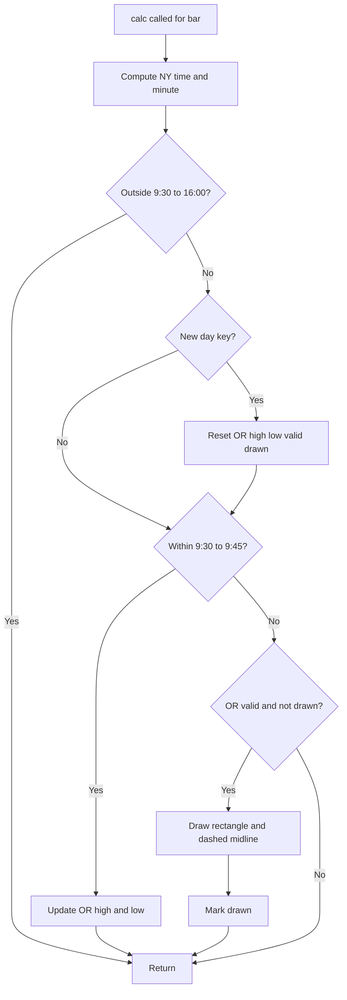

# Opening Range 9:30 - 9:45 - Technical Guide

> Draws the 9:30-9:45 NY opening range high, low and midpoint for each visible trading day as a rectangle and dashed midline.

| | |
| --- | --- |
| **Language** | Indie Script v5 |
| **Platform** | [TakeProfit](https://takeprofit.com) |
| **Category** | Support & resistance |
| **Type** | Indicator |
| **Author** | @USERNAME_NOT_SET on TakeProfit |
| **License** | MIT |
| **Live script** | [Open on TakeProfit](https://takeprofit.com/indicator/opening-range-9-30-9-45-8) |
| **Source file** | [Opening Range 930 - 945.indie5](Opening%20Range%20930%20-%20945.indie5) |

## Overview

Opening Range (9:30-9:45 NY) is an overlay indicator that marks the price extremes reached during the first 15 minutes of the New York session. For every visible trading day it collects the highest high and lowest low of bars whose New York time falls in [9:30, 9:45), then draws a white rectangle spanning from 9:30 to 16:00 at those levels.

On the chart it shows the OR high as the top edge, the OR low as the bottom edge, vertical borders at 9:30 and 16:00, and a dashed white midline at the average of the two. It is meant for intraday charts such as 1-min, 5-min and 15-min, and simply visualises the opening range without computing signals.

## How it works

1. Converts the bar's UTC timestamp to New York time using `NY_OFFSET` and computes the NY midnight base and minutes since midnight.
2. Skips bars outside 9:30-16:00 NY: `calc` returns immediately, so extended-session bars never affect the range.
3. Detects a new NY day by comparing an integer day key; on a new day it seeds OR high/low with the current bar and resets validity/drawn flags.
4. While `ny_m < OR_END`, marks the OR as valid and expands `_or_hi` / `_or_lo` using `max` and `min` against the current bar's high and low.
5. After 9:45, checks that the OR is valid and not yet drawn; then converts the OR boundary times back to UTC seconds for `AbsolutePosition`.
6. Draws four white `LineSegment` borders forming a rectangle from 9:30 to 16:00 at OR high and OR low levels.
7. Draws a dashed white midline at `(or_hi + or_lo) * 0.5` and sets `_or_drawn` so later bars of the same day do not redraw.

## Mathematical model

$$
\text{OR high} = \max_{t \in [9:30,\, 9:45)} \text{high}(t)
$$

$$
\text{OR low} = \min_{t \in [9:30,\, 9:45)} \text{low}(t)
$$

$$
\text{midline} = \frac{\text{OR high} + \text{OR low}}{2}
$$

## Logic flow



## Code walkthrough

### Timezone and session constants

Lines 23-26 of [Opening Range 930 - 945.indie5](Opening%20Range%20930%20-%20945.indie5):

```python
NY_OFFSET  = 4 * 3600      # seconds east of UTC for New York (EDT)
OR_START   = 9 * 60 + 30   # 570 min  →  9:30 NY  (session open & OR open)
OR_END     = 9 * 60 + 45   # 585 min  →  9:45 NY  (OR window closes)
SESS_CLOSE = 16 * 60        # 960 min  → 16:00 NY  (session close)
```

These four constants define every time boundary used by the script. `NY_OFFSET` is in seconds east of UTC and set for EDT; `OR_START`, `OR_END` and `SESS_CLOSE` are minutes since NY midnight. The header explicitly notes that wintertime requires changing the offset to `5 * 3600`.

### Persistent state variables

Lines 32-38 of [Opening Range 930 - 945.indie5](Opening%20Range%20930%20-%20945.indie5):

```python
    def __init__(self):
        # Persistent state variables (survive across bar-by-bar calls)
        self._day      = self.new_var(-1)      # midnight-NY timestamp of current session
        self._or_hi    = self.new_var(0.0)     # OR high accumulator
        self._or_lo    = self.new_var(0.0)     # OR low  accumulator
        self._or_valid = self.new_var(False)   # True once we have seen at least 1 OR bar
        self._or_drawn = self.new_var(False)   # True once the rectangle is drawn for this day
```

`new_var` creates state that survives across bar-by-bar calls to `calc`. `_day` identifies the current NY day, `_or_hi` and `_or_lo` accumulate the opening range, `_or_valid` records whether any OR bar was seen, and `_or_drawn` prevents redrawing the rectangle on every later bar of the same day.

### New session detection and OR accumulation

Lines 50-66 of [Opening Range 930 - 945.indie5](Opening%20Range%20930%20-%20945.indie5):

```python
        # Unique integer key for this calendar day (NY midnight as int)
        day_key = int(base)

        # ── Detect a new trading session ────────────────────────────────────
        if day_key != self._day.get():
            self._day.set(day_key)
            self._or_hi.set(self.high[0])
            self._or_lo.set(self.low[0])
            self._or_valid.set(False)
            self._or_drawn.set(False)

        # ── Accumulate Opening Range (9:30 inclusive → 9:45 exclusive) ──────
        if ny_m < OR_END:
            self._or_valid.set(True)
            self._or_hi.set(max(self._or_hi.get(), self.high[0]))
            self._or_lo.set(min(self._or_lo.get(), self.low[0]))
            return   # keep collecting until OR window closes
```

The integer NY midnight timestamp acts as a day key. On a new day, high and low are seeded from the first session bar, then the OR is expanded only while `ny_m < OR_END`. The early `return` inside the OR window keeps the script from attempting to draw before 9:45.

### Guards and UTC boundary timestamps

Lines 68-83 of [Opening Range 930 - 945.indie5](Opening%20Range%20930%20-%20945.indie5):

```python
        # Guard: only draw if we collected real OR data for this session
        if not self._or_valid.get():
            return

        # Guard: already drawn for today - nothing more to do
        if self._or_drawn.get():
            return

        # ── Compute UTC boundary timestamps for this NY day ─────────────────
        # base is midnight NY in NY-local seconds; add NY_OFFSET to get UTC
        t_open  = base + OR_START   * 60 + NY_OFFSET  # 9:30  NY in UTC seconds
        t_close = base + SESS_CLOSE * 60 + NY_OFFSET  # 16:00 NY in UTC seconds

        or_hi  = self._or_hi.get()
        or_lo  = self._or_lo.get()
        or_mid = (or_hi + or_lo) * 0.5
```

Two guards ensure the rectangle is drawn only when real OR data exists and only once per day. `t_open` and `t_close` convert the NY-local boundaries back to UTC seconds by adding `NY_OFFSET`; these are the coordinates used by `AbsolutePosition`. The midline is computed as the simple average of the OR high and low.

### Top, bottom and left borders

Lines 85-107 of [Opening Range 930 - 945.indie5](Opening%20Range%20930%20-%20945.indie5):

```python
        # ── Top border (OR high, spanning 9:30 to 16:00) ────────────────────
        self.chart.draw(LineSegment(
            AbsolutePosition(t_open,  or_hi),
            AbsolutePosition(t_close, or_hi),
            color=color.WHITE,
            line_width=1,
        ))

        # ── Bottom border (OR low, spanning 9:30 to 16:00) ──────────────────
        self.chart.draw(LineSegment(
            AbsolutePosition(t_open,  or_lo),
            AbsolutePosition(t_close, or_lo),
            color=color.WHITE,
            line_width=1,
        ))

        # ── Left border (vertical line at 9:30) ─────────────────────────────
        self.chart.draw(LineSegment(
            AbsolutePosition(t_open, or_hi),
            AbsolutePosition(t_open, or_lo),
            color=color.WHITE,
            line_width=1,
        ))
```

Three white solid `LineSegment` objects create the top edge at OR high, the bottom edge at OR low, and the left vertical edge at 9:30. Each segment uses `AbsolutePosition` with fixed timestamps and price levels, so the levels remain static once drawn.

### Right border and dashed midline

Lines 109-127 of [Opening Range 930 - 945.indie5](Opening%20Range%20930%20-%20945.indie5):

```python
        # ── Right border (vertical line at 16:00) ───────────────────────────
        self.chart.draw(LineSegment(
            AbsolutePosition(t_close, or_hi),
            AbsolutePosition(t_close, or_lo),
            color=color.WHITE,
            line_width=1,
        ))

        # ── Dashed midline at (OR high + OR low) / 2 ────────────────────────
        self.chart.draw(LineSegment(
            AbsolutePosition(t_open,  or_mid),
            AbsolutePosition(t_close, or_mid),
            color=color.WHITE,
            line_width=1,
            line_style=line_segment_style.DASHED,
        ))

        # Mark as drawn so subsequent bars of the same day don't recreate it
        self._or_drawn.set(True)
```

The right vertical edge closes the rectangle at 16:00. The midline uses `line_segment_style.DASHED` to distinguish it from the solid borders. Setting `_or_drawn` at the end ensures the same day's drawing is not recreated on subsequent bars.

## Reading the chart

- The white rectangle marks the session's opening range: top edge = OR high, bottom edge = OR low.
- The left vertical line is at 9:30 NY, the right vertical line at 16:00 NY.
- The dashed white horizontal line is the midpoint `(OR high + OR low) / 2`.
- Bars outside 9:30-16:00 NY are ignored completely.
- A day with no bars between 9:30 and 9:45 produces no rectangle for that day.

## Implementation notes

- The timezone is hard-coded as EDT (`NY_OFFSET = 4 * 3600`); the header instructs changing it to `5 * 3600` for EST in winter.
- The OR window is inclusive at 9:30 and exclusive at 9:45 because the condition is `ny_m < OR_END`.
- If no bar falls inside the 9:30-9:45 window on a given day, `_or_valid` stays `False` and the guard on line 69 prevents drawing.
- The drawing is created once per day on the first post-OR bar, using the final accumulated high and low; it is not updated later in the session.

## FAQ

**How do I switch the indicator to New York standard time?**

Change `NY_OFFSET` on line 23 from `4 * 3600` to `5 * 3600`. That is the only timezone adjustment required by this script.

**Can I change the opening range window or the session close time?**

Yes. Edit `OR_START`, `OR_END`, and `SESS_CLOSE`, which are minutes since NY midnight. For example, `9 * 60 + 30` is 9:30 and `9 * 60 + 45` is 9:45; the drawn rectangle spans from `OR_START` to `SESS_CLOSE`.

**Why does nothing appear for some days?**

If no visible bar has a NY time between 9:30 and 9:45, `_or_valid` remains `False` and the guard on line 69 returns before drawing. This can happen on partial sessions, holidays, or charts whose first bar starts after 9:45.

## Full source code

Indie Script v5, as published on TakeProfit. Copy it into the platform's script editor or [open the live script](https://takeprofit.com/indicator/opening-range-9-30-9-45-8).

```python
# indie:lang_version = 5

##############################################################################
#  Opening Range Indicator  –  9:30 to 9:45 NY time  (EDT / UTC-4)
#
#  In winter when UTC-5 change NY_OFFSET = 4 * 3600 to 5 * 3600
#
#  Draws for EVERY visible trading day:
#    • A white rectangle  : left=9:30, right=16:00, top=OR high, bottom=OR low
#    • A dashed white midline at (OR high + OR low) / 2
#
#  Works on 1-min, 5-min and 15-min charts.
#
#  ── Timezone note ──────────────────────────────────────────────────────────
#  NY_OFFSET = 4 * 3600  →  EDT (UTC-4, summer / daylight-saving time)
#  Change to 5 * 3600    →  EST (UTC-5, winter standard time)
##############################################################################

from indie import indicator, MainContext, color
from indie.drawings import LineSegment, AbsolutePosition, line_segment_style

# ── Session / timezone constants ──────────────────────────────────────────────
NY_OFFSET  = 4 * 3600      # seconds east of UTC for New York (EDT)
OR_START   = 9 * 60 + 30   # 570 min  →  9:30 NY  (session open & OR open)
OR_END     = 9 * 60 + 45   # 585 min  →  9:45 NY  (OR window closes)
SESS_CLOSE = 16 * 60        # 960 min  → 16:00 NY  (session close)

# ── Indicator ─────────────────────────────────────────────────────────────────
@indicator('Opening Range (9:30-9:45 NY)', overlay_main_pane=True)
class Main(MainContext):

    def __init__(self):
        # Persistent state variables (survive across bar-by-bar calls)
        self._day      = self.new_var(-1)      # midnight-NY timestamp of current session
        self._or_hi    = self.new_var(0.0)     # OR high accumulator
        self._or_lo    = self.new_var(0.0)     # OR low  accumulator
        self._or_valid = self.new_var(False)   # True once we have seen at least 1 OR bar
        self._or_drawn = self.new_var(False)   # True once the rectangle is drawn for this day

    def calc(self):
        ts   = self.time[0]                     # UTC seconds (per Indie docs)
        ny   = ts - NY_OFFSET                   # shift to NY local time (seconds)
        base = ny - (int(ny) % 86400)                # midnight of this NY day (NY-local seconds)
        ny_m = (int(ny) % 86400) // 60            # minutes elapsed since NY midnight

        # ── Skip bars outside the regular session ───────────────────────────
        if ny_m < OR_START or ny_m >= SESS_CLOSE:
            return

        # Unique integer key for this calendar day (NY midnight as int)
        day_key = int(base)

        # ── Detect a new trading session ────────────────────────────────────
        if day_key != self._day.get():
            self._day.set(day_key)
            self._or_hi.set(self.high[0])
            self._or_lo.set(self.low[0])
            self._or_valid.set(False)
            self._or_drawn.set(False)

        # ── Accumulate Opening Range (9:30 inclusive → 9:45 exclusive) ──────
        if ny_m < OR_END:
            self._or_valid.set(True)
            self._or_hi.set(max(self._or_hi.get(), self.high[0]))
            self._or_lo.set(min(self._or_lo.get(), self.low[0]))
            return   # keep collecting until OR window closes

        # Guard: only draw if we collected real OR data for this session
        if not self._or_valid.get():
            return

        # Guard: already drawn for today - nothing more to do
        if self._or_drawn.get():
            return

        # ── Compute UTC boundary timestamps for this NY day ─────────────────
        # base is midnight NY in NY-local seconds; add NY_OFFSET to get UTC
        t_open  = base + OR_START   * 60 + NY_OFFSET  # 9:30  NY in UTC seconds
        t_close = base + SESS_CLOSE * 60 + NY_OFFSET  # 16:00 NY in UTC seconds

        or_hi  = self._or_hi.get()
        or_lo  = self._or_lo.get()
        or_mid = (or_hi + or_lo) * 0.5

        # ── Top border (OR high, spanning 9:30 to 16:00) ────────────────────
        self.chart.draw(LineSegment(
            AbsolutePosition(t_open,  or_hi),
            AbsolutePosition(t_close, or_hi),
            color=color.WHITE,
            line_width=1,
        ))

        # ── Bottom border (OR low, spanning 9:30 to 16:00) ──────────────────
        self.chart.draw(LineSegment(
            AbsolutePosition(t_open,  or_lo),
            AbsolutePosition(t_close, or_lo),
            color=color.WHITE,
            line_width=1,
        ))

        # ── Left border (vertical line at 9:30) ─────────────────────────────
        self.chart.draw(LineSegment(
            AbsolutePosition(t_open, or_hi),
            AbsolutePosition(t_open, or_lo),
            color=color.WHITE,
            line_width=1,
        ))

        # ── Right border (vertical line at 16:00) ───────────────────────────
        self.chart.draw(LineSegment(
            AbsolutePosition(t_close, or_hi),
            AbsolutePosition(t_close, or_lo),
            color=color.WHITE,
            line_width=1,
        ))

        # ── Dashed midline at (OR high + OR low) / 2 ────────────────────────
        self.chart.draw(LineSegment(
            AbsolutePosition(t_open,  or_mid),
            AbsolutePosition(t_close, or_mid),
            color=color.WHITE,
            line_width=1,
            line_style=line_segment_style.DASHED,
        ))

        # Mark as drawn so subsequent bars of the same day don't recreate it
        self._or_drawn.set(True)
```
