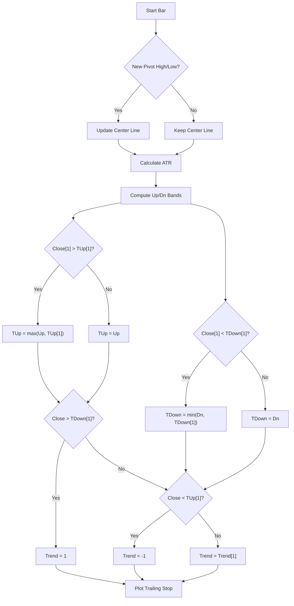

# Pivot Point SuperTrend (Indie) - Technical Guide

> Trend-following indicator combining pivot points with ATR-based trailing bands to generate buy/sell signals.

| | |
| --- | --- |
| **Language** | Indie Script v5 |
| **Platform** | [TakeProfit](https://takeprofit.com) |
| **Category** | Trend |
| **Type** | Indicator |
| **Author** | @pavel_medvedev on TakeProfit |
| **Original** | Original: Pivot Point Supertrend LonesomeTheBlue //LonesomeTheBlue |
| **Original (TradingView)** | [Pivot Point Supertrend](https://www.tradingview.com/script/L0AIiLvH-Pivot-Point-Supertrend/) by LonesomeTheBlue |
| **Original license** | MPL-2.0 |
| **Original source** | [Pivot Point SuperTrend (Indie).pinescript4](Pivot%20Point%20SuperTrend%20(Indie).pinescript4) |
| **License** | [MPL-2.0](https://mozilla.org/MPL/2.0/) (derivative work) |
| **Live script** | [Open on TakeProfit](https://takeprofit.com/indicator/pivot-point-supertrend-indie-77) |
| **Source file** | [Pivot Point SuperTrend (Indie).indie5](Pivot%20Point%20SuperTrend%20(Indie).indie5) |

## Overview

The Pivot Point SuperTrend is a trend-following indicator that anchors its baseline to confirmed pivot highs and lows rather than raw price. It uses a weighted center line, updated only when a new pivot forms, and constructs upper and lower volatility bands around it using an RMA-based ATR. The indicator is designed to filter out noise during consolidation and provide clear trend direction and reversal signals.

On the chart, the indicator draws a trailing stop line that changes color (lime for uptrend, red for downtrend) and is hidden on trend transition bars. It can optionally display pivot high/low markers (H/L), a center line, and support/resistance levels carried forward from the last pivots. Buy and Sell labels are printed at the exact point of trend validation.

## How it works

1. Detect pivot highs and pivot lows using the PivotHighLow algorithm with the specified period.
2. Maintain a weighted center line, updated only when a new pivot is detected, using a 2:1 smoothing ratio.
3. Calculate the ATR using the RMA method and derive upper and lower bands around the center line.
4. Compute trailing upper and lower bands based on previous close and previous trailing values.
5. Determine the trend direction by comparing the current close to the previous trailing bands.
6. Plot the trailing stop line, colored by trend, and hide it on the transition bar.
7. Generate Buy/Sell markers on trend reversals and optionally plot pivot markers and S/R levels.

## Mathematical model

$$
\text{center} = \begin{cases} \text{lastpp} & \text{if center is NaN} \\ \frac{2 \cdot \text{center} + \text{lastpp}}{3} & \text{otherwise} \end{cases}
$$

$$
\text{Up} = \text{center} - \text{factor} \times \text{ATR}_{\text{RMA}}(\text{pd})
$$

$$
\text{Dn} = \text{center} + \text{factor} \times \text{ATR}_{\text{RMA}}(\text{pd})
$$

$$
\text{TUp} = \begin{cases} \max(\text{Up}, \text{TUp}[1]) & \text{if close}[1] > \text{TUp}[1] \\ \text{Up} & \text{otherwise} \end{cases}
$$

$$
\text{TDown} = \begin{cases} \min(\text{Dn}, \text{TDown}[1]) & \text{if close}[1] < \text{TDown}[1] \\ \text{Dn} & \text{otherwise} \end{cases}
$$

$$
\text{Trend} = \begin{cases} 1 & \text{if close} > \text{TDown}[1] \\ -1 & \text{if close} < \text{TUp}[1] \\ \text{Trend}[1] & \text{otherwise} \end{cases}
$$

## Logic flow



## Parameters

| Parameter | Type | Default | Range | Description |
| --- | --- | --- | --- | --- |
| `prd` | int | 2 | 1 - 50 | Pivot Point Period |
| `factor` | float | 3.0 | ≥ 1.0 | ATR Factor |
| `pd` | int | 10 | ≥ 1 | ATR Period |
| `show_pivot` | bool | false |  | Show Pivot Points |
| `show_label` | bool | true |  | Show Buy/Sell Labels |
| `show_cl` | bool | false |  | Show PP Center Line |
| `show_sr` | bool | false |  | Show Support/Resistance |

## Code walkthrough

### Pivot Detection and Center Line

Lines 37-54 of [Pivot Point SuperTrend (Indie).indie5](Pivot%20Point%20SuperTrend%20(Indie).indie5):

```python
    ph, _ = PivotHighLow.new(self.high, prd, prd)
    _, pl = PivotHighLow.new(self.low, prd, prd)

    # --- Weighted center line (updated only on a new pivot) ---
    center = Var[float].new(nan)
    last_pp = nan
    if not isnan(ph[0]):
        last_pp = ph[0]
    elif not isnan(pl[0]):
        last_pp = pl[0]

    if not isnan(last_pp):
        if isnan(center.get()):
            center.set(last_pp)
        else:
            center.set((center.get() * 2.0 + last_pp) / 3.0)

    cur_center = center.get()
```

This section detects pivot highs and lows using the PivotHighLow algorithm. The center line is a weighted average that only updates when a new pivot is found, using a 2:1 smoothing ratio to maintain stability. The `Var` object is used to persist the center value between bars.

### ATR and Band Calculation

Lines 57-64 of [Pivot Point SuperTrend (Indie).indie5](Pivot%20Point%20SuperTrend%20(Indie).indie5):

```python
    atr = Atr.new(pd, 'RMA')

    # --- Up/Dn bands ---
    up = nan
    dn = nan
    if not isnan(cur_center) and not isnan(atr[0]):
        up = cur_center - factor * atr[0]
        dn = cur_center + factor * atr[0]
```

The ATR is calculated using the RMA method, which is more responsive than a simple moving average. The upper and lower bands are derived by adding/subtracting the ATR multiplied by the factor from the center line. These bands form the basis for the trailing stop logic.

### Trailing Stop Logic

Lines 67-104 of [Pivot Point SuperTrend (Indie).indie5](Pivot%20Point%20SuperTrend%20(Indie).indie5):

```python
    t_up = MutSeriesF.new(init=nan)
    t_down = MutSeriesF.new(init=nan)
    trend = MutSeriesF.new(init=1.0)

    prev_close = self.close[1]
    prev_tup = t_up[1]
    prev_tdn = t_down[1]
    prev_trend = trend[1]
    if isnan(prev_trend):
        prev_trend = 1.0

    # TUp := close[1] > TUp[1] ? max(Up, TUp[1]) : Up
    new_tup = up
    if not isnan(prev_close) and not isnan(prev_tup) and prev_close > prev_tup:
        if isnan(up):
            new_tup = prev_tup
        else:
            new_tup = max(up, prev_tup)
    t_up[0] = new_tup

    # TDown := close[1] < TDown[1] ? min(Dn, TDown[1]) : Dn
    new_tdn = dn
    if not isnan(prev_close) and not isnan(prev_tdn) and prev_close < prev_tdn:
        if isnan(dn):
            new_tdn = prev_tdn
        else:
            new_tdn = min(dn, prev_tdn)
    t_down[0] = new_tdn

    # Trend := close > TDown[1] ? 1 : close < TUp[1] ? -1 : nz(Trend[1], 1)
    cur_trend = prev_trend
    if not isnan(prev_tdn) and self.close[0] > prev_tdn:
        cur_trend = 1.0
    elif not isnan(prev_tup) and self.close[0] < prev_tup:
        cur_trend = -1.0
    trend[0] = cur_trend

    trailing_sl = new_tup if cur_trend > 0 else new_tdn
```

This is the core of the indicator. It computes the trailing upper and lower bands using the previous close and previous trailing values. The trend is determined by comparing the current close to the previous trailing bands. The `MutSeriesF` objects store the trailing values and trend state between bars.

### Plotting and Signals

Lines 106-150 of [Pivot Point SuperTrend (Indie).indie5](Pivot%20Point%20SuperTrend%20(Indie).indie5):

```python
    # --- Trailing-stop coloring (na on transition bar to mimic Pine) ---
    is_up = cur_trend > 0 and prev_trend > 0
    is_dn = cur_trend < 0 and prev_trend < 0
    trail_color = color.LIME
    if is_dn:
        trail_color = color.RED
    trail_value = trailing_sl if (is_up or is_dn) else nan

    # --- Center line plot ---
    center_value = nan
    center_color = color.BLUE
    if show_cl and not isnan(cur_center):
        hl2 = (self.high[0] + self.low[0]) / 2.0
        center_value = cur_center
        if cur_center >= hl2:
            center_color = color.RED

    # --- Buy/Sell signals ---
    bsignal = cur_trend > 0 and prev_trend < 0
    ssignal = cur_trend < 0 and prev_trend > 0
    buy_value = trailing_sl if (bsignal and show_label and not isnan(trailing_sl)) else nan
    sell_value = trailing_sl if (ssignal and show_label and not isnan(trailing_sl)) else nan

    # --- Pivot markers (offset back to actual pivot bar) ---
    pivot_h_value = ph[0] if (show_pivot and not isnan(ph[0])) else nan
    pivot_l_value = pl[0] if (show_pivot and not isnan(pl[0])) else nan

    # --- Support / Resistance (last pivots, carried forward) ---
    support = Var[float].new(nan)
    resistance = Var[float].new(nan)
    if not isnan(pl[0]):
        support.set(pl[0])
    if not isnan(ph[0]):
        resistance.set(ph[0])

    sup_value = support.get() if show_sr else nan
    res_value = resistance.get() if show_sr else nan

    return (
        plot.Line(trail_value, color=trail_color),
        plot.Line(center_value, color=center_color),
        plot.Line(sup_value, offset=-prd),
        plot.Line(res_value, offset=-prd),
        plot.Marker(pivot_h_value, text='H', offset=-prd),
        plot.Marker(pivot_l_value, text='L', offset=-prd),
```

The trailing stop line is colored based on the trend, and hidden on transition bars to mimic the original Pine behavior. Buy/Sell markers are generated on trend reversals. Pivot markers and support/resistance levels are plotted conditionally based on user settings.

## Pine Script vs Indie

This Indie port closely follows the original Pine Script v4 logic, with structural differences in how state and plotting are handled.

| Pine Script | Indie | Note |
| --- | --- | --- |
| `pivothigh(prd, prd)` | `PivotHighLow.new(self.high, prd, prd)` | Indie uses a dedicated algorithm object. |
| `var float center = na` | `center = Var[float].new(nan)` | Indie uses Var for persistent state. |
| `atr(Pd)` | `Atr.new(pd, 'RMA')` | Indie explicitly specifies the RMA method. |

### Center Line Calculation

Pine Script, lines 45-59 of [Pivot Point SuperTrend (Indie).pinescript4](Pivot%20Point%20SuperTrend%20(Indie).pinescript4):

```pine
var float center = na

float lastpp = ph ? ph : pl ? pl : na

if lastpp

    if na(center)

        center := lastpp

    else

        //weighted calculation

        center := (center * 2 + lastpp) / 3
```

Indie, lines 41-54 of [Pivot Point SuperTrend (Indie).indie5](Pivot%20Point%20SuperTrend%20(Indie).indie5):

```python
    center = Var[float].new(nan)
    last_pp = nan
    if not isnan(ph[0]):
        last_pp = ph[0]
    elif not isnan(pl[0]):
        last_pp = pl[0]

    if not isnan(last_pp):
        if isnan(center.get()):
            center.set(last_pp)
        else:
            center.set((center.get() * 2.0 + last_pp) / 3.0)

    cur_center = center.get()
```

Both use a weighted average with a 2:1 ratio. Indie uses `Var[float]` for state and explicit `isnan` checks, while Pine uses `var` and the `na()` function.

### Trailing Stop Logic

Pine Script, lines 79-85 of [Pivot Point SuperTrend (Indie).pinescript4](Pivot%20Point%20SuperTrend%20(Indie).pinescript4):

```pine
TUp := close[1] > TUp[1] ? max(Up, TUp[1]) : Up

TDown := close[1] < TDown[1] ? min(Dn, TDown[1]) : Dn

Trend := close > TDown[1] ? 1: close < TUp[1]? -1: nz(Trend[1], 1)

Trailingsl = Trend == 1 ? TUp : TDown
```

Indie, lines 78-102 of [Pivot Point SuperTrend (Indie).indie5](Pivot%20Point%20SuperTrend%20(Indie).indie5):

```python
    # TUp := close[1] > TUp[1] ? max(Up, TUp[1]) : Up
    new_tup = up
    if not isnan(prev_close) and not isnan(prev_tup) and prev_close > prev_tup:
        if isnan(up):
            new_tup = prev_tup
        else:
            new_tup = max(up, prev_tup)
    t_up[0] = new_tup

    # TDown := close[1] < TDown[1] ? min(Dn, TDown[1]) : Dn
    new_tdn = dn
    if not isnan(prev_close) and not isnan(prev_tdn) and prev_close < prev_tdn:
        if isnan(dn):
            new_tdn = prev_tdn
        else:
            new_tdn = min(dn, prev_tdn)
    t_down[0] = new_tdn

    # Trend := close > TDown[1] ? 1 : close < TUp[1] ? -1 : nz(Trend[1], 1)
    cur_trend = prev_trend
    if not isnan(prev_tdn) and self.close[0] > prev_tdn:
        cur_trend = 1.0
    elif not isnan(prev_tup) and self.close[0] < prev_tup:
        cur_trend = -1.0
    trend[0] = cur_trend
```

The core logic is identical, but Indie adds explicit NaN checks to handle edge cases where values might be undefined. Indie also uses `MutSeriesF` to store the trailing values and trend.

## Reading the chart

* **Trailing Stop Line**: The lime line indicates an uptrend, the red line indicates a downtrend. The line is hidden on the bar where the trend changes.
* **Buy/Sell Labels**: A 'Buy' label appears below the price at the trailing stop level when the trend flips from down to up. A 'Sell' label appears above the price when the trend flips from up to down.
* **Pivot Markers**: When enabled, 'H' markers appear above pivot highs and 'L' markers below pivot lows, offset back to the actual pivot bar.
* **Center Line**: When enabled, a blue line is drawn when the center is below the midpoint of the bar, and red when above.
* **Support/Resistance**: When enabled, lime circles mark the last pivot low (support) and red circles mark the last pivot high (resistance), offset back by the pivot period.

## Implementation notes

- The indicator uses `MutSeriesF` to maintain state for the trailing bands and trend, which is essential for the recursive calculations.
- NaN values are used to hide the trailing line on transition bars and to skip plotting when data is unavailable.
- The `offset=-prd` on pivot markers and S/R levels shifts them back to the bar where the pivot was confirmed.
- The center line is only updated when a new pivot is detected, which reduces noise compared to updating every bar.

## FAQ

**How do I adjust the sensitivity of the indicator?**

You can adjust the 'Pivot Point Period' to change how strict the pivot detection is, and the 'ATR Factor' to change the width of the volatility bands. A higher factor will result in fewer, but potentially more significant, signals.

**Why is the trailing line sometimes missing?**

The trailing line is intentionally hidden on the bar where the trend changes. This is a design choice to avoid visual clutter and clearly mark the transition point.

**Can I use this indicator for intraday trading?**

Yes, the indicator is designed to work on any timeframe. You may need to adjust the pivot period and ATR settings to match the volatility of your specific asset and timeframe.

## License and attribution

This Indie script is a derivative work of **Pivot Point Supertrend by LonesomeTheBlue** on TradingView. The Pine Script original carries a Mozilla Public License 2.0 notice in its header. A modified version of MPL-2.0 code must stay under [MPL-2.0](https://mozilla.org/MPL/2.0/), so this file is distributed under that license (the notice is appended to the end of the source file). The original author keeps the credit for the algorithm; this page is not affiliated with or endorsed by them.

## Full source code

Indie Script v5, as published on TakeProfit. Copy it into the platform's script editor or [open the live script](https://takeprofit.com/indicator/pivot-point-supertrend-indie-77).

```python
# indie:lang_version = 5
# Pivot Point SuperTrend
# Indie port of the Pine Script v4 indicator by LonesomeTheBlue
# Original: Pivot Point Supertrend LonesomeTheBlue //LonesomeTheBlue

from math import isnan, nan
from indie import indicator, param, plot, color, MutSeriesF, Var
from indie.algorithms import Atr, PivotHighLow


@indicator('Pivot Point SuperTrend', overlay_main_pane=True)
@param.int('prd', default=2, min=1, max=50, title='Pivot Point Period')
@param.float('factor', default=3.0, min=1.0, title='ATR Factor')
@param.int('pd', default=10, min=1, title='ATR Period')
@param.bool('show_pivot', default=False, title='Show Pivot Points')
@param.bool('show_label', default=True, title='Show Buy/Sell Labels')
@param.bool('show_cl', default=False, title='Show PP Center Line')
@param.bool('show_sr', default=False, title='Show Support/Resistance')
@plot.line(title='PP SuperTrend', line_width=2)
@plot.line(title='Center Line')
@plot.line(title='Support', color=color.LIME)
@plot.line(title='Resistance', color=color.RED)
@plot.marker(title='Pivot High', color=color.RED,
             style=plot.marker_style.LABEL,
             position=plot.marker_position.ABOVE, size=7)
@plot.marker(title='Pivot Low', color=color.LIME,
             style=plot.marker_style.LABEL,
             position=plot.marker_position.BELOW, size=7)
@plot.marker(title='Buy', color=color.LIME,
             style=plot.marker_style.LABEL,
             position=plot.marker_position.BELOW, size=7)
@plot.marker(title='Sell', color=color.RED,
             style=plot.marker_style.LABEL,
             position=plot.marker_position.ABOVE, size=7)
def Main(self, prd, factor, pd, show_pivot, show_label, show_cl, show_sr):
    # --- Pivot points (Pine: pivothigh(high, prd, prd) / pivotlow(low, prd, prd)) ---
    ph, _ = PivotHighLow.new(self.high, prd, prd)
    _, pl = PivotHighLow.new(self.low, prd, prd)

    # --- Weighted center line (updated only on a new pivot) ---
    center = Var[float].new(nan)
    last_pp = nan
    if not isnan(ph[0]):
        last_pp = ph[0]
    elif not isnan(pl[0]):
        last_pp = pl[0]

    if not isnan(last_pp):
        if isnan(center.get()):
            center.set(last_pp)
        else:
            center.set((center.get() * 2.0 + last_pp) / 3.0)

    cur_center = center.get()

    # --- ATR (Pine atr() == RMA-based ATR) ---
    atr = Atr.new(pd, 'RMA')

    # --- Up/Dn bands ---
    up = nan
    dn = nan
    if not isnan(cur_center) and not isnan(atr[0]):
        up = cur_center - factor * atr[0]
        dn = cur_center + factor * atr[0]

    # --- Trailing series ---
    t_up = MutSeriesF.new(init=nan)
    t_down = MutSeriesF.new(init=nan)
    trend = MutSeriesF.new(init=1.0)

    prev_close = self.close[1]
    prev_tup = t_up[1]
    prev_tdn = t_down[1]
    prev_trend = trend[1]
    if isnan(prev_trend):
        prev_trend = 1.0

    # TUp := close[1] > TUp[1] ? max(Up, TUp[1]) : Up
    new_tup = up
    if not isnan(prev_close) and not isnan(prev_tup) and prev_close > prev_tup:
        if isnan(up):
            new_tup = prev_tup
        else:
            new_tup = max(up, prev_tup)
    t_up[0] = new_tup

    # TDown := close[1] < TDown[1] ? min(Dn, TDown[1]) : Dn
    new_tdn = dn
    if not isnan(prev_close) and not isnan(prev_tdn) and prev_close < prev_tdn:
        if isnan(dn):
            new_tdn = prev_tdn
        else:
            new_tdn = min(dn, prev_tdn)
    t_down[0] = new_tdn

    # Trend := close > TDown[1] ? 1 : close < TUp[1] ? -1 : nz(Trend[1], 1)
    cur_trend = prev_trend
    if not isnan(prev_tdn) and self.close[0] > prev_tdn:
        cur_trend = 1.0
    elif not isnan(prev_tup) and self.close[0] < prev_tup:
        cur_trend = -1.0
    trend[0] = cur_trend

    trailing_sl = new_tup if cur_trend > 0 else new_tdn

    # --- Trailing-stop coloring (na on transition bar to mimic Pine) ---
    is_up = cur_trend > 0 and prev_trend > 0
    is_dn = cur_trend < 0 and prev_trend < 0
    trail_color = color.LIME
    if is_dn:
        trail_color = color.RED
    trail_value = trailing_sl if (is_up or is_dn) else nan

    # --- Center line plot ---
    center_value = nan
    center_color = color.BLUE
    if show_cl and not isnan(cur_center):
        hl2 = (self.high[0] + self.low[0]) / 2.0
        center_value = cur_center
        if cur_center >= hl2:
            center_color = color.RED

    # --- Buy/Sell signals ---
    bsignal = cur_trend > 0 and prev_trend < 0
    ssignal = cur_trend < 0 and prev_trend > 0
    buy_value = trailing_sl if (bsignal and show_label and not isnan(trailing_sl)) else nan
    sell_value = trailing_sl if (ssignal and show_label and not isnan(trailing_sl)) else nan

    # --- Pivot markers (offset back to actual pivot bar) ---
    pivot_h_value = ph[0] if (show_pivot and not isnan(ph[0])) else nan
    pivot_l_value = pl[0] if (show_pivot and not isnan(pl[0])) else nan

    # --- Support / Resistance (last pivots, carried forward) ---
    support = Var[float].new(nan)
    resistance = Var[float].new(nan)
    if not isnan(pl[0]):
        support.set(pl[0])
    if not isnan(ph[0]):
        resistance.set(ph[0])

    sup_value = support.get() if show_sr else nan
    res_value = resistance.get() if show_sr else nan

    return (
        plot.Line(trail_value, color=trail_color),
        plot.Line(center_value, color=center_color),
        plot.Line(sup_value, offset=-prd),
        plot.Line(res_value, offset=-prd),
        plot.Marker(pivot_h_value, text='H', offset=-prd),
        plot.Marker(pivot_l_value, text='L', offset=-prd),
        plot.Marker(buy_value, text='Buy'),
        plot.Marker(sell_value, text='Sell'),
    )

# ---------------------------------------------------------------------------
# This Source Code Form is subject to the terms of the Mozilla Public
# License, v. 2.0. If a copy of the MPL was not distributed with this
# file, You can obtain one at https://mozilla.org/MPL/2.0/
# Derived from "Pivot Point Supertrend by LonesomeTheBlue" (TradingView).
# ---------------------------------------------------------------------------
```
