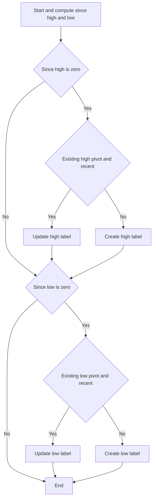

# Pivot Points High/Low (Simplified) - Technical Guide

> Labels pivot highs and pivot lows using a lookback period, updating or creating labels on the chart.

| | |
| --- | --- |
| **Language** | Indie Script v5 |
| **Platform** | [TakeProfit](https://takeprofit.com) |
| **Category** | Support & resistance |
| **Type** | Indicator |
| **Author** | @TakeProfit on TakeProfit |
| **License** | licensed under the MIT License (see the header of the source file) |
| **Live script** | [Open on TakeProfit](https://takeprofit.com/indicator/pivot-points-high-low-simplified-46) |
| **Source file** | [Pivot Points High-Low (Simplified).indie5](Pivot%20Points%20High-Low%20(Simplified).indie5) |

## Overview

Pivot Points High/Low (Simplified) is a chart overlay that marks swing highs and swing lows. It uses a lookback period to decide when the current bar is an extreme over that window, then places a price label at the extreme.

The indicator is meant for quickly spotting potential support and resistance levels. It draws green labels above pivot highs and red labels below pivot lows; when a new extreme appears close to a previous pivot, the existing label is moved instead of adding a duplicate.

## How it works

1. Compute SinceHighest and SinceLowest over length + 1 bars.
2. If since_high[0] is 0, the current high is the highest high of the window, so treat it as a pivot high.
3. If since_low[0] is 0, the current low is the lowest low of the window, so treat it as a pivot low.
4. For a pivot high, check whether a high-pivot label already exists and was set within length bars.
5. If yes, move the existing label to the current high and update its text; if no, create a new green label.
6. For a pivot low, do the same with a red label below the low.
7. Labels display the rounded price of the pivot bar.

## Mathematical model

$$
\text{High pivot at } t \iff H_t = \max_{0 \le i \le n} H_{t-i}
$$
$$
\text{Low pivot at } t \iff Lo_t = \min_{0 \le i \le n} Lo_{t-i}
$$
$$
\text{Update label if } t - t_{\text{pivot}} \le n
$$

## Logic flow



## Parameters

| Parameter | Type | Default | Range | Description |
| --- | --- | --- | --- | --- |
| `length` | int | 10 | ≥ 1 | Lookback period |

## Code walkthrough

### State variables for labels and bars

Lines 13-19 of [Pivot Points High-Low (Simplified).indie5](Pivot%20Points%20High-Low%20(Simplified).indie5):

```python
    def __init__(self, length):
        none_label: Optional[LabelAbs] = None
        self._high_pivot = self.new_var(none_label)
        self._low_pivot = self.new_var(none_label)
        self._high_pivot_bar = self.new_var(0)
        self._low_pivot_bar = self.new_var(0)
        self._length = length
```

The indicator stores the current high/low label objects and the bar index where they were last placed. These are created with new_var so the values can be read and updated between bars. The lookback length is saved for later pivot checks.

### Detecting pivot candidates

Lines 21-30 of [Pivot Points High-Low (Simplified).indie5](Pivot%20Points%20High-Low%20(Simplified).indie5):

```python
    def calc(self) -> None:
        # Search for new extremes
        since_high = SinceHighest.new(self.high, self._length + 1)
        since_low = SinceLowest.new(self.low, self._length + 1)

        if since_high[0] == 0:
            self._handle_high_pivot()

        if since_low[0] == 0:
            self._handle_low_pivot()
```

Each bar, SinceHighest and SinceLowest are computed over length + 1 bars. If since_high[0] is 0, the current high is the highest high of that window; if since_low[0] is 0, the current low is the lowest low. The corresponding handler is called only when the condition is true.

### Updating or creating a high pivot label

Lines 32-54 of [Pivot Points High-Low (Simplified).indie5](Pivot%20Points%20High-Low%20(Simplified).indie5):

```python
    def _handle_high_pivot(self) -> None:
        existing_pivot = self._high_pivot.get()

        if (existing_pivot is not None and
            self.bar_index - self._high_pivot_bar.get() <= self._length):
            # Update existing label (recent pivot)
            existing_pivot.value().position = AbsolutePosition(self.time[0], self.high[0])
            existing_pivot.value().text = str(round(self.high[0], 2))
            self.chart.draw(existing_pivot.value())
            self._high_pivot_bar.set(self.bar_index)
        else:
            # Create new label (no pivot or old pivot)
            new_label = LabelAbs(
                str(round(self.high[0], 2)),
                AbsolutePosition(self.time[0], self.high[0]),
                text_color=color.GREEN,
                bg_color=color.BLACK(0),
                callout_position=callout_position.TOP_RIGHT,
                font_size=11
            )
            self.chart.draw(new_label)
            self._high_pivot.set(new_label)
            self._high_pivot_bar.set(self.bar_index)
```

If a high-pivot label already exists and the current bar is within length bars of the previous pivot, the code moves the existing label to the new high and updates the displayed price. Otherwise it creates a new green label with a top-right callout. The stored bar index is updated in both branches.

### Updating or creating a low pivot label

Lines 56-78 of [Pivot Points High-Low (Simplified).indie5](Pivot%20Points%20High-Low%20(Simplified).indie5):

```python
    def _handle_low_pivot(self) -> None:
        existing_pivot = self._low_pivot.get()

        if (existing_pivot is not None and
            self.bar_index - self._low_pivot_bar.get() <= self._length):
            # Update existing label (recent pivot)
            existing_pivot.value().position = AbsolutePosition(self.time[0], self.low[0])
            existing_pivot.value().text = str(round(self.low[0], 2))
            self.chart.draw(existing_pivot.value())
            self._low_pivot_bar.set(self.bar_index)
        else:
            # Create new label (no pivot or old pivot)
            new_label = LabelAbs(
                str(round(self.low[0], 2)),
                AbsolutePosition(self.time[0], self.low[0]),
                text_color=color.RED,
                bg_color=color.BLACK(0),
                callout_position=callout_position.BOTTOM_LEFT,
                font_size=11
            )
            self.chart.draw(new_label)
            self._low_pivot.set(new_label)
            self._low_pivot_bar.set(self.bar_index)
```

The low-pivot logic mirrors the high-pivot logic. It updates a recent red label or creates a new one below the low with a bottom-left callout. The same distance rule prevents duplicate labels for pivots that are close together.

## Reading the chart

- Green labels with a top-right callout mark pivot highs; the text is the high price rounded to 2 decimals.
- Red labels with a bottom-left callout mark pivot lows; the text is the low price rounded to 2 decimals.
- When a new pivot appears within `length` bars of the previous pivot of the same type, the existing label is moved to the new extreme instead of drawing a second label.
- If no pivot is detected on a bar, no new label is drawn and existing labels stay unchanged.
- The labels are placed at the time and price of the pivot bar, so they act as visual support/resistance markers.

## Implementation notes

- The pivot condition uses length + 1 bars, so a bar must be the highest high or lowest low of the window including itself.
- Labels are only updated when the previous pivot of the same type is within length bars; older pivots get a new label.
- The indicator does not draw lines or levels, only absolute labels; it does not alter past bars, it only moves the most recent label forward.

## FAQ

**How do I change the sensitivity of the pivots?**

Increase the `length` parameter to require a wider lookback window, which produces fewer pivot labels. Decrease it to mark more extremes.

**Why does a label sometimes move to a new price instead of creating a new one?**

When a new high or low appears within `length` bars of the previous pivot of the same type, the code updates the existing label. This keeps nearby pivots from stacking multiple labels.

**Can I use this indicator for automated trading?**

This is a charting indicator that only draws labels; it does not generate trade signals. You can use its pivot logic as a reference when building a strategy.

## Full source code

Indie Script v5, as published on TakeProfit. Copy it into the platform's script editor or [open the live script](https://takeprofit.com/indicator/pivot-points-high-low-simplified-46).

```python
# Copyright (c) 2025 @TakeProfit. All rights reserved.
# This work is licensed under the MIT License.
# For a copy, see <https://opensource.org/licenses/MIT>.

# indie:lang_version = 5
from indie import indicator, param, color, MainContext, Optional
from indie.algorithms import SinceHighest, SinceLowest
from indie.drawings import LabelAbs, AbsolutePosition, callout_position

@indicator('PivotsHL(S)', overlay_main_pane=True)
@param.int('length', default=10, min=1, title='Lookback period')
class Main(MainContext):
    def __init__(self, length):
        none_label: Optional[LabelAbs] = None
        self._high_pivot = self.new_var(none_label)
        self._low_pivot = self.new_var(none_label)
        self._high_pivot_bar = self.new_var(0)
        self._low_pivot_bar = self.new_var(0)
        self._length = length

    def calc(self) -> None:
        # Search for new extremes
        since_high = SinceHighest.new(self.high, self._length + 1)
        since_low = SinceLowest.new(self.low, self._length + 1)

        if since_high[0] == 0:
            self._handle_high_pivot()

        if since_low[0] == 0:
            self._handle_low_pivot()

    def _handle_high_pivot(self) -> None:
        existing_pivot = self._high_pivot.get()

        if (existing_pivot is not None and
            self.bar_index - self._high_pivot_bar.get() <= self._length):
            # Update existing label (recent pivot)
            existing_pivot.value().position = AbsolutePosition(self.time[0], self.high[0])
            existing_pivot.value().text = str(round(self.high[0], 2))
            self.chart.draw(existing_pivot.value())
            self._high_pivot_bar.set(self.bar_index)
        else:
            # Create new label (no pivot or old pivot)
            new_label = LabelAbs(
                str(round(self.high[0], 2)),
                AbsolutePosition(self.time[0], self.high[0]),
                text_color=color.GREEN,
                bg_color=color.BLACK(0),
                callout_position=callout_position.TOP_RIGHT,
                font_size=11
            )
            self.chart.draw(new_label)
            self._high_pivot.set(new_label)
            self._high_pivot_bar.set(self.bar_index)

    def _handle_low_pivot(self) -> None:
        existing_pivot = self._low_pivot.get()

        if (existing_pivot is not None and
            self.bar_index - self._low_pivot_bar.get() <= self._length):
            # Update existing label (recent pivot)
            existing_pivot.value().position = AbsolutePosition(self.time[0], self.low[0])
            existing_pivot.value().text = str(round(self.low[0], 2))
            self.chart.draw(existing_pivot.value())
            self._low_pivot_bar.set(self.bar_index)
        else:
            # Create new label (no pivot or old pivot)
            new_label = LabelAbs(
                str(round(self.low[0], 2)),
                AbsolutePosition(self.time[0], self.low[0]),
                text_color=color.RED,
                bg_color=color.BLACK(0),
                callout_position=callout_position.BOTTOM_LEFT,
                font_size=11
            )
            self.chart.draw(new_label)
            self._low_pivot.set(new_label)
            self._low_pivot_bar.set(self.bar_index)
```
