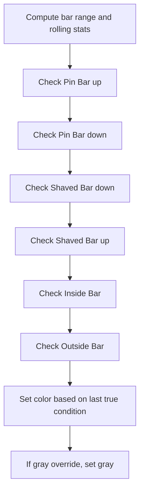

# Price Action Bar Patterns - Technical Guide

> Detects Pin Bars, Inside Bars, Outside Bars, and Shaved Bars on candlestick charts and colors bars accordingly.

| | |
| --- | --- |
| **Language** | Indie Script v5 |
| **Platform** | [TakeProfit](https://takeprofit.com) |
| **Category** | Candlestick patterns |
| **Type** | Indicator |
| **Author** | @chartjunkie on TakeProfit |
| **License** | MIT |
| **Live script** | [Open on TakeProfit](https://takeprofit.com/indicator/price-action-bar-patterns-50) |
| **Source file** | [Price Action Bar Patterns.indie5](Price%20Action%20Bar%20Patterns.indie5) |

## Overview

This indicator identifies common price action candlestick patterns – Pin Bars, Inside Bars, Outside Bars, and Shaved Bars – and highlights them directly on the chart by coloring the bars. Each pattern type can be enabled or disabled independently, allowing traders to focus on specific structures. It is designed as a visual scanning tool to quickly locate potential reversal, continuation, or volatility expansion setups across any timeframe.

On the chart, bars are painted in distinct colors based on the detected pattern: deep sky blue for bullish Pin Bars, white for bearish Pin Bars, fuchsia for bearish Shaved Bars, aqua for bullish Shaved Bars, yellow for Inside Bars, and crimson for Outside Bars. If the gray override option is enabled, all bar colors are replaced with gray, regardless of pattern detection.

## How it works

1. Calculate the current bar's range (high - low).
2. Compute the lowest low and highest high over the configurable lookback period to provide trend context for Pin Bars.
3. Check Pin Bar conditions: a bullish Pin Bar requires the open and close to be in the top (1 - pct_p/100) of the range and the low to be the lowest low over the lookback; a bearish Pin Bar requires open and close in the bottom (1 - pct_p/100) of the range and the high to be the highest high.
4. Check Shaved Bar conditions: the close is within pct_s/100 of the range from the high (bullish) or low (bearish).
5. Check Inside Bar: current high <= previous high and current low >= previous low.
6. Check Outside Bar: current high > previous high and current low < previous low.
7. Assign bar color in the following order of precedence: bullish Pin Bar, bearish Pin Bar, bearish Shaved Bar, bullish Shaved Bar, Inside Bar, Outside Bar. If the gray override is enabled, the final color becomes gray regardless.

## Logic flow



## Parameters

| Parameter | Type | Default | Range | Description |
| --- | --- | --- | --- | --- |
| `pct_p` | int | 66 | 1 - 99 | Percentage Input For PBars, What % The Wick Of Candle Has To Be |
| `pblb` | int | 6 | 1 - 100 | PBars Look Back Period To Define The Trend of Highs and Lows |
| `pct_s` | int | 5 | 1 - 99 | Percentage Input For Shaved Bars, Percent of Range it Has To Close On The Lows or Highs |
| `spb` | bool | true |  | Show Pin Bars? |
| `ssb` | bool | true |  | Show Shaved Bars? |
| `sib` | bool | true |  | Show Inside Bars? |
| `sob` | bool | true |  | Show Outside Bars? |
| `sgb` | bool | false |  | Check Box To Turn Bars Gray? |

## Code walkthrough

### Percentage conversion

Lines 17-19 of [Price Action Bar Patterns.indie5](Price%20Action%20Bar%20Patterns.indie5):

```python
    pct_cp = pct_p * 0.01
    pct_cpo = 1.0 - pct_cp
    pct_cs = pct_s * 0.01
```

Converts the user-provided integer percentages into decimal form for use in conditions. pct_cp is used for Pin Bar thresholds and pct_cs for Shaved Bars. The multiplications by 0.01 are the only arithmetic transformations applied.

### Range and lookback statistics

Lines 21-24 of [Price Action Bar Patterns.indie5](Price%20Action%20Bar%20Patterns.indie5):

```python
    rng = self.high[0] - self.low[0]

    lowest_low = Lowest.new(self.low, pblb)
    highest_high = Highest.new(self.high, pblb)
```

Computes the current bar's range (high minus low) and obtains the lowest low and highest high over the user-defined lookback period. These values are used to give trend context for Pin Bars – a Pin Bar must break the recent low or high.

### Pin Bar conditions

Lines 27-28 of [Price Action Bar Patterns.indie5](Price%20Action%20Bar%20Patterns.indie5):

```python
    p_bar_up = spb and self.open[0] > self.high[0] - (rng * pct_cpo) and self.close[0] > self.high[0] - (rng * pct_cpo) and self.low[0] <= lowest_low[0]
    p_bar_dn = spb and self.open[0] < self.high[0] - (rng * pct_cp) and self.close[0] < self.high[0] - (rng * pct_cp) and self.high[0] >= highest_high[0]
```

Defines bullish and bearish Pin Bar detection. For a bullish Pin Bar (p_bar_up), both open and close must lie above the line that is (1-pct_cp) of the range from the high, and the low must be less than or equal to the lowest low of the lookback. For a bearish Pin Bar (p_bar_dn), both open and close must lie below a line pct_cp of the range from the high, and the high must be greater than or equal to the highest high. This ensures the wick is long enough and extends to a new extreme.

### Inside/Outside Bar conditions

Lines 35-36 of [Price Action Bar Patterns.indie5](Price%20Action%20Bar%20Patterns.indie5):

```python
    inside_bar = sib and self.high[0] <= self.high[1] and self.low[0] >= self.low[1]
    outside_bar = sob and self.high[0] > self.high[1] and self.low[0] < self.low[1]
```

Inside Bar is true when the current bar's high is not greater than the previous bar's high and its low is not lower than the previous bar's low, meaning the current range is fully contained. Outside Bar is true when the current high is strictly higher and the current low is strictly lower than the previous bar, indicating full engulfment.

### Color assignment

Lines 38-54 of [Price Action Bar Patterns.indie5](Price%20Action%20Bar%20Patterns.indie5):

```python
    bar_clr: Optional[Color] = None
    if p_bar_up:
        bar_clr = rgba(0, 191, 255, 1.0)      # deep sky blue
    if p_bar_dn:
        bar_clr = rgba(255, 255, 255, 1.0)    # white
    if s_bar_down:
        bar_clr = color.FUCHSIA
    if s_bar_up:
        bar_clr = color.AQUA
    if inside_bar:
        bar_clr = color.YELLOW
    if outside_bar:
        bar_clr = rgba(220, 20, 60, 1.0)      # crimson
    if sgb:
        bar_clr = color.GRAY

    return plot.BarColor(bar_clr)
```

A series of independent if statements assign a color to bar_clr, each overriding the previous. The order gives priority to the last pattern that evaluated to true. If the gray override (sgb) is true, all colors are replaced with gray. The function returns a plot.BarColor object with the final color.

## Reading the chart

- Bars colored deep sky blue indicate a bullish Pin Bar (long lower wick, low at new low).
- Bars colored white indicate a bearish Pin Bar (long upper wick, high at new high).
- Bars colored fuchsia indicate a bearish Shaved Bar (close near low).
- Bars colored aqua indicate a bullish Shaved Bar (close near high).
- Bars colored yellow indicate an Inside Bar (range contained by prior bar).
- Bars colored crimson indicate an Outside Bar (range engulfs prior bar).
- If multiple patterns are true, the color of the last pattern in the order (Outside Bar > Inside Bar > Shaved Bar up > Shaved Bar down > Pin Bar down > Pin Bar up) is shown.
- When the gray override toggle is enabled, all bars become gray, overriding pattern colors.

## Implementation notes

- Pin Bar conditions require the wick to extend to a new low/high over the lookback period; they are not just based on wick length alone.
- Inside and Outside Bars compare only to the immediately preceding bar; they are not lookback-based.
- The gray override (sgb) takes precedence over all pattern colors; when checked, pattern detection still runs but colors are overwritten.
- The indicator does not repaint because it uses only current and previous bar values; no future data is referenced.

## FAQ

**How do I enable or disable specific patterns?**

Use the parameters Show Pin Bars, Show Shaved Bars, Show Inside Bars, and Show Outside Bars. Set any to false to hide that pattern's coloring.

**What does the 'Check Box To Turn Bars Gray' do?**

When enabled, it overrides all pattern-specific colors and makes every bar gray. This can be used to temporarily suppress pattern highlighting without removing the indicator.

**How are the lookback period and percentage inputs used for Pin Bars?**

The lookback period (pblb) defines the window to find the lowest low and highest high. The percentage (pct_p) determines the portion of the candle's range that must be the wick (upper or lower) for it to be considered a valid Pin Bar.

## Attribution

Inspired by the idea of Chris Moody's Price Action Bars. Not affiliated with or endorsed by the original author.

## Full source code

Indie Script v5, as published on TakeProfit. Copy it into the platform's script editor or [open the live script](https://takeprofit.com/indicator/price-action-bar-patterns-50).

```python
# indie:lang_version = 5
from indie import indicator, param, plot, color, Optional, Color
from indie.algorithms import Lowest, Highest
from indie.color import rgba

@indicator('Price Action Bar Patterns', overlay_main_pane=True)
@param.int('pct_p', default=66, min=1, max=99, title='Percentage Input For PBars, What % The Wick Of Candle Has To Be')
@param.int('pblb', default=6, min=1, max=100, title='PBars Look Back Period To Define The Trend of Highs and Lows')
@param.int('pct_s', default=5, min=1, max=99, title='Percentage Input For Shaved Bars, Percent of Range it Has To Close On The Lows or Highs')
@param.bool('spb', default=True, title='Show Pin Bars?')
@param.bool('ssb', default=True, title='Show Shaved Bars?')
@param.bool('sib', default=True, title='Show Inside Bars?')
@param.bool('sob', default=True, title='Show Outside Bars?')
@param.bool('sgb', default=False, title='Check Box To Turn Bars Gray?')
@plot.bar_color()
def Main(self, pct_p, pblb, pct_s, spb, ssb, sib, sob, sgb):
    pct_cp = pct_p * 0.01
    pct_cpo = 1.0 - pct_cp
    pct_cs = pct_s * 0.01

    rng = self.high[0] - self.low[0]

    lowest_low = Lowest.new(self.low, pblb)
    highest_high = Highest.new(self.high, pblb)

    # PinBars
    p_bar_up = spb and self.open[0] > self.high[0] - (rng * pct_cpo) and self.close[0] > self.high[0] - (rng * pct_cpo) and self.low[0] <= lowest_low[0]
    p_bar_dn = spb and self.open[0] < self.high[0] - (rng * pct_cp) and self.close[0] < self.high[0] - (rng * pct_cp) and self.high[0] >= highest_high[0]

    # Shaved Bars
    s_bar_up = ssb and self.close[0] >= (self.high[0] - (rng * pct_cs))
    s_bar_down = ssb and self.close[0] <= (self.low[0] + (rng * pct_cs))

    # Inside / Outside Bars
    inside_bar = sib and self.high[0] <= self.high[1] and self.low[0] >= self.low[1]
    outside_bar = sob and self.high[0] > self.high[1] and self.low[0] < self.low[1]

    bar_clr: Optional[Color] = None
    if p_bar_up:
        bar_clr = rgba(0, 191, 255, 1.0)      # deep sky blue
    if p_bar_dn:
        bar_clr = rgba(255, 255, 255, 1.0)    # white
    if s_bar_down:
        bar_clr = color.FUCHSIA
    if s_bar_up:
        bar_clr = color.AQUA
    if inside_bar:
        bar_clr = color.YELLOW
    if outside_bar:
        bar_clr = rgba(220, 20, 60, 1.0)      # crimson
    if sgb:
        bar_clr = color.GRAY

    return plot.BarColor(bar_clr)
```
