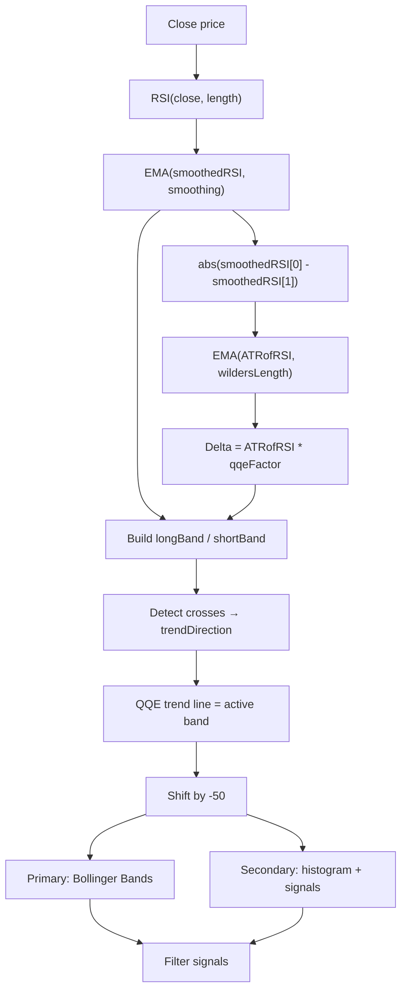

# QQE MOD Indicator (Mihkel00 Concept, Port) - Technical Guide

> Dual QQE oscillator with RSI, ATR-based bands, and Bollinger Band filtering for trend and momentum signals.

| | |
| --- | --- |
| **Language** | Indie Script v5 |
| **Platform** | [TakeProfit](https://takeprofit.com) |
| **Category** | Oscillators |
| **Type** | Indicator |
| **Author** | @traderx on TakeProfit |
| **Original (TradingView)** | [QQE MOD](https://www.tradingview.com/u/Mihkel00/) by Mihkel00 (author's profile; the original page was not located) |
| **Original license** | See the header of the Pine file |
| **Original source** | [QQE MOD Indicator (Mihkel00 Concept, Port).pinescript6](QQE%20MOD%20Indicator%20(Mihkel00%20Concept,%20Port).pinescript6) |
| **License** | [MPL-2.0](https://mozilla.org/MPL/2.0/) (derivative work) |
| **Live script** | [Open on TakeProfit](https://takeprofit.com/indicator/qqe-mod-indicator-mihkel00-concept-port-12) |
| **Source file** | [QQE MOD Indicator (Mihkel00 Concept, Port).indie5](QQE%20MOD%20Indicator%20(Mihkel00%20Concept,%20Port).indie5) |

## Overview

QQE MOD is a dual-QQE oscillator that applies Quantitative Qualitative Estimation (QQE) to the RSI. It computes two QQE lines (primary and secondary) from the same price source but with independent parameters, then shifts them by -50 for centered display. The primary QQE line is further processed through Bollinger Bands to create volatility-based thresholds, while the secondary QQE line drives histogram coloring and signal markers.

The indicator is designed to identify momentum shifts, trend strength, and potential reversals. It draws a white trend line (secondary QQE shifted), a gray histogram (secondary RSI shifted) that becomes transparent inside the threshold zone, and cyan/magenta column markers when both the secondary RSI exceeds its threshold and the primary RSI is outside the Bollinger Band. A dotted zero line provides a reference center.

## How it works

1. Compute RSI from the close price with the configured length.
2. Smooth the RSI with an EMA (smoothing factor) to produce the smoothed RSI.
3. Calculate the absolute bar-to-bar change of the smoothed RSI, then smooth it with an EMA using Wilder's length (2×RSI length − 1) to get the ATR of RSI.
4. Multiply the ATR of RSI by the QQE factor to obtain a dynamic delta, then build upper and lower bands around the smoothed RSI.
5. Track the trend direction by detecting crosses between the smoothed RSI and the bands; the QQE trend line follows the active band (long when uptrend, short when downtrend).
6. Repeat the same QQE calculation for both primary and secondary parameter sets, then shift all series by −50 for centered display.
7. Compute Bollinger Bands on the shifted primary QQE line; use the upper/lower bands as additional filters for signal generation.
8. Plot the secondary QQE trend line, color the secondary RSI histogram gray when outside the threshold (transparent inside), and draw cyan/magenta columns when both the secondary RSI exceeds threshold and the primary RSI is outside the Bollinger Band.

## Mathematical model

$$
\text{WildersLength} = \text{RSILength} \times 2 - 1
$$

$$
\text{SmoothedRSI} = \text{EMA}(\text{RSI}(\text{close}, \text{RSILength}), \text{SmoothingFactor})
$$

$$
\text{ATRofRSI} = \text{EMA}(|\text{SmoothedRSI}[0] - \text{SmoothedRSI}[1]|, \text{WildersLength})
$$

$$
\text{Delta} = \text{ATRofRSI} \times \text{QQEFactor}
$$

$$
\text{LongBand} = \begin{cases}
\max(\text{LongBand}[1], \text{SmoothedRSI} - \text{Delta}) & \text{if } \text{SmoothedRSI}[1] > \text{LongBand}[1] \text{ and } \text{SmoothedRSI} > \text{LongBand}[1] \\
\text{SmoothedRSI} - \text{Delta} & \text{otherwise}
\end{cases}
$$

$$
\text{ShortBand} = \begin{cases}
\min(\text{ShortBand}[1], \text{SmoothedRSI} + \text{Delta}) & \text{if } \text{SmoothedRSI}[1] < \text{ShortBand}[1] \text{ and } \text{SmoothedRSI} < \text{ShortBand}[1] \\
\text{SmoothedRSI} + \text{Delta} & \text{otherwise}
\end{cases}
$$

## Logic flow



## Parameters

| Parameter | Type | Default | Range | Description |
| --- | --- | --- | --- | --- |
| `rsi_length_primary` | int | 6 | ≥ 1 | Primary RSI Length |
| `rsi_smoothing_primary` | int | 5 | ≥ 1 | Primary RSI Smoothing |
| `qqe_factor_primary` | float | 3.0 | ≥ 0.1 | Primary QQE Factor |
| `threshold_primary` | float | 3.0 | ≥ 0.0 | Primary Threshold |
| `rsi_length_secondary` | int | 6 | ≥ 1 | Secondary RSI Length |
| `rsi_smoothing_secondary` | int | 5 | ≥ 1 | Secondary RSI Smoothing |
| `qqe_factor_secondary` | float | 1.61 | ≥ 0.1 | Secondary QQE Factor |
| `threshold_secondary` | float | 3.0 | ≥ 0.0 | Secondary Threshold |
| `bollinger_length` | int | 50 | ≥ 1 | Bollinger Length |
| `bollinger_multiplier` | float | 0.35 | 0.001 - 5.0 | Bollinger Multiplier |

## Code walkthrough

### QQE Calculation Function

Lines 9-53 of [QQE MOD Indicator (Mihkel00 Concept, Port).indie5](QQE%20MOD%20Indicator%20(Mihkel00%20Concept,%20Port).indie5):

```python
def CalculateQQE(self, src: SeriesF, rsi_length: int, smoothing_factor: int, qqe_factor: float) -> tuple[SeriesF, SeriesF]:
    """
    Calculate QQE Bands
    Returns: (qqeTrendLine, smoothedRsi)
    """
    wilders_length = rsi_length * 2 - 1
    
    # Calculate RSI and smooth it
    rsi = Rsi.new(src, rsi_length)
    smoothed_rsi = Ema.new(rsi, smoothing_factor)
    
    # Calculate ATR of RSI (absolute change between bars)
    rsi_change = abs(smoothed_rsi[0] - smoothed_rsi[1])
    atr_rsi = MutSeriesF.new(rsi_change)
    smoothed_atr_rsi = Ema.new(atr_rsi, wilders_length)
    dynamic_atr_rsi = smoothed_atr_rsi[0] * qqe_factor
    
    # Calculate bands
    atr_delta = dynamic_atr_rsi
    new_short_band = smoothed_rsi[0] + atr_delta
    new_long_band = smoothed_rsi[0] - atr_delta
    
    # Initialize long and short bands with persistence
    long_band = MutSeriesF.new(init=0.0)
    short_band = MutSeriesF.new(init=0.0)
    trend_direction = MutSeries[int].new(init=0)
    
    # Calculate longBand
    if smoothed_rsi[1] > long_band[1] and smoothed_rsi[0] > long_band[1]:
        long_band[0] = max(long_band[1], new_long_band)
    else:
        long_band[0] = new_long_band
    
    # Calculate shortBand
    if smoothed_rsi[1] < short_band[1] and smoothed_rsi[0] < short_band[1]:
        short_band[0] = min(short_band[1], new_short_band)
    else:
        short_band[0] = new_short_band
    
    # Check for crosses to determine trend direction
    # Pine: ta.cross(longBand[1], smoothedRsi) compares longBand[1] vs smoothedRsi
    # Cross = sign change between bars
    # longBandCross: comparing long_band[2] vs smoothed_rsi[1] AND long_band[1] vs smoothed_rsi[0]
    long_band_cross = (long_band[2] < smoothed_rsi[1] and long_band[1] >= smoothed_rsi[0]) or \
                      (long_band[2] > smoothed_rsi[1] and long_band[1] <= smoothed_rsi[0])
```

The `CalculateQQE` function encapsulates the core QQE logic. It computes RSI, smooths it with an EMA, derives an ATR-based dynamic delta, builds long/short bands with persistence rules, detects crosses to determine trend direction, and returns the QQE trend line and smoothed RSI. The function uses mutable series types (`MutSeriesF` and `MutSeries[int]`) for stateful band and trend variables that persist across bars.

### Band Persistence Logic

Lines 37-46 of [QQE MOD Indicator (Mihkel00 Concept, Port).indie5](QQE%20MOD%20Indicator%20(Mihkel00%20Concept,%20Port).indie5):

```python
    if smoothed_rsi[1] > long_band[1] and smoothed_rsi[0] > long_band[1]:
        long_band[0] = max(long_band[1], new_long_band)
    else:
        long_band[0] = new_long_band
    
    # Calculate shortBand
    if smoothed_rsi[1] < short_band[1] and smoothed_rsi[0] < short_band[1]:
        short_band[0] = min(short_band[1], new_short_band)
    else:
        short_band[0] = new_short_band
```

The long band only increases (takes the max of previous band and new lower band) when the smoothed RSI is above the previous band on both the current and prior bar; otherwise it resets to the new lower band. The short band only decreases (takes the min) when the smoothed RSI is below the previous band on both bars; otherwise it resets to the new upper band. This creates a trailing-stop-like behavior.

### Cross Detection for Trend Direction

Lines 52-63 of [QQE MOD Indicator (Mihkel00 Concept, Port).indie5](QQE%20MOD%20Indicator%20(Mihkel00%20Concept,%20Port).indie5):

```python
    long_band_cross = (long_band[2] < smoothed_rsi[1] and long_band[1] >= smoothed_rsi[0]) or \
                      (long_band[2] > smoothed_rsi[1] and long_band[1] <= smoothed_rsi[0])
    # shortBandCross: comparing smoothed_rsi[1] vs short_band[2] AND smoothed_rsi[0] vs short_band[1]
    short_band_cross = (smoothed_rsi[1] < short_band[2] and smoothed_rsi[0] >= short_band[1]) or \
                       (smoothed_rsi[1] > short_band[2] and smoothed_rsi[0] <= short_band[1])
    
    if short_band_cross:
        trend_direction[0] = 1
    elif long_band_cross:
        trend_direction[0] = -1
    else:
        trend_direction[0] = trend_direction[1]
```

Crosses are detected by comparing band values and smoothed RSI across three bars using indices [2], [1], and [0]. A short band cross (smoothed RSI crossing the short band) sets trend direction to +1 (uptrend), while a long band cross sets it to -1 (downtrend). If no cross occurs, the previous trend direction persists. This replaces Pine's `ta.cross()` with explicit bar-to-bar comparisons.

### Bollinger Bands on Primary QQE

Lines 119-123 of [QQE MOD Indicator (Mihkel00 Concept, Port).indie5](QQE%20MOD%20Indicator%20(Mihkel00%20Concept,%20Port).indie5):

```python
    primary_qqe_shifted = MutSeriesF.new(primary_qqe_trend_line[0] - 50)
    bollinger_basis = Sma.new(primary_qqe_shifted, bollinger_length)
    std_dev = StdDev.new(primary_qqe_shifted, bollinger_length)
    bollinger_upper = bollinger_basis[0] + bollinger_multiplier * std_dev[0]
    bollinger_lower = bollinger_basis[0] - bollinger_multiplier * std_dev[0]
```

The primary QQE trend line is shifted by -50 (to center around zero) and then used as input to a simple moving average and standard deviation calculation. The Bollinger upper and lower bands are computed as basis ± multiplier × stddev. These bands serve as volatility-based thresholds for signal filtering.

### Signal Generation with Dual Conditions

Lines 137-149 of [QQE MOD Indicator (Mihkel00 Concept, Port).indie5](QQE%20MOD%20Indicator%20(Mihkel00%20Concept,%20Port).indie5):

```python
    # QQE Up Signal - Cyan (#00c3ff)
    qqe_up_value = nan
    qqe_up_color = rgba(0, 0, 0, 0)  # Transparent by default
    if secondary_rsi_shifted > threshold_secondary and primary_rsi_shifted > bollinger_upper:
        qqe_up_value = secondary_rsi_shifted
        qqe_up_color = rgba(0, 195, 255, 1.0)  # Cyan
    
    # QQE Down Signal - Magenta (#ff0062)
    qqe_down_value = nan
    qqe_down_color = rgba(0, 0, 0, 0)  # Transparent by default
    if secondary_rsi_shifted < -threshold_secondary and primary_rsi_shifted < bollinger_lower:
        qqe_down_value = secondary_rsi_shifted
        qqe_down_color = rgba(255, 0, 98, 1.0)  # Magenta/Pink
```

Up signals (cyan) are plotted when the secondary RSI shifted exceeds the positive threshold AND the primary RSI shifted exceeds the Bollinger upper band. Down signals (magenta) are plotted when the secondary RSI shifted is below the negative threshold AND the primary RSI shifted is below the Bollinger lower band. Both conditions must be met simultaneously, reducing false signals.

## Pine Script vs Indie

The Indie port follows the same dual-QQE structure as the provided original Pine Script, with adaptations for the Indie platform's syntax and state management.

| Pine Script | Indie | Note |
| --- | --- | --- |
| `ta.rsi(source, rsiLength)` | `Rsi.new(src, rsi_length)` | Indie uses object-oriented .new() pattern for algorithms. |
| `ta.ema(rsi, smoothingFactor)` | `Ema.new(rsi, smoothing_factor)` | Same EMA calculation, different instantiation syntax. |
| `math.abs(smoothedRsi[1] - smoothedRsi)` | `abs(smoothed_rsi[0] - smoothed_rsi[1])` | Pine uses [1] for previous; Indie uses [0] for current, [1] for previous. |

### QQE Function Definition

Pine Script, lines 55-79 of [QQE MOD Indicator (Mihkel00 Concept, Port).pinescript6](QQE%20MOD%20Indicator%20(Mihkel00%20Concept,%20Port).pinescript6):

```pine
calculateQQE(rsiLength, smoothingFactor, qqeFactor, source) =>

    wildersLength = rsiLength * 2 - 1

    rsi = ta.rsi(source, rsiLength)

    smoothedRsi = ta.ema(rsi, smoothingFactor)

    atrRsi = math.abs(smoothedRsi[1] - smoothedRsi)

    smoothedAtrRsi = ta.ema(atrRsi, wildersLength)

    dynamicAtrRsi = smoothedAtrRsi * qqeFactor


    // Initialize variables

    longBand = 0.0

    shortBand = 0.0

    trendDirection = 0


```

Indie, lines 9-33 of [QQE MOD Indicator (Mihkel00 Concept, Port).indie5](QQE%20MOD%20Indicator%20(Mihkel00%20Concept,%20Port).indie5):

```python
def CalculateQQE(self, src: SeriesF, rsi_length: int, smoothing_factor: int, qqe_factor: float) -> tuple[SeriesF, SeriesF]:
    """
    Calculate QQE Bands
    Returns: (qqeTrendLine, smoothedRsi)
    """
    wilders_length = rsi_length * 2 - 1
    
    # Calculate RSI and smooth it
    rsi = Rsi.new(src, rsi_length)
    smoothed_rsi = Ema.new(rsi, smoothing_factor)
    
    # Calculate ATR of RSI (absolute change between bars)
    rsi_change = abs(smoothed_rsi[0] - smoothed_rsi[1])
    atr_rsi = MutSeriesF.new(rsi_change)
    smoothed_atr_rsi = Ema.new(atr_rsi, wilders_length)
    dynamic_atr_rsi = smoothed_atr_rsi[0] * qqe_factor
    
    # Calculate bands
    atr_delta = dynamic_atr_rsi
    new_short_band = smoothed_rsi[0] + atr_delta
    new_long_band = smoothed_rsi[0] - atr_delta
    
    # Initialize long and short bands with persistence
    long_band = MutSeriesF.new(init=0.0)
    short_band = MutSeriesF.new(init=0.0)
```

Both define a function that computes QQE bands. Pine uses a function with `=>` syntax and returns an array via `[qqeTrendLine, smoothedRsi]`. Indie uses a decorated `@algorithm` function with type annotations and returns a tuple. The core logic is identical, but Indie requires explicit `MutSeriesF` for stateful variables.

### Band Persistence

Pine Script, lines 89-91 of [QQE MOD Indicator (Mihkel00 Concept, Port).pinescript6](QQE%20MOD%20Indicator%20(Mihkel00%20Concept,%20Port).pinescript6):

```pine
    longBand := smoothedRsi[1] > longBand[1] and smoothedRsi > longBand[1] ? math.max(longBand[1], newLongBand) : newLongBand

    shortBand := smoothedRsi[1] < shortBand[1] and smoothedRsi < shortBand[1] ? math.min(shortBand[1], newShortBand) : newShortBand
```

Indie, lines 37-46 of [QQE MOD Indicator (Mihkel00 Concept, Port).indie5](QQE%20MOD%20Indicator%20(Mihkel00%20Concept,%20Port).indie5):

```python
    if smoothed_rsi[1] > long_band[1] and smoothed_rsi[0] > long_band[1]:
        long_band[0] = max(long_band[1], new_long_band)
    else:
        long_band[0] = new_long_band
    
    # Calculate shortBand
    if smoothed_rsi[1] < short_band[1] and smoothed_rsi[0] < short_band[1]:
        short_band[0] = min(short_band[1], new_short_band)
    else:
        short_band[0] = new_short_band
```

Pine uses ternary operators with `:=` for reassignment. Indie uses `if/else` blocks with `MutSeriesF[0]` assignment. Both implement the same logic: the band only expands in the favorable direction when the smoothed RSI stays on the same side for two consecutive bars.

### Signal Plotting

Pine Script, lines 169-171 of [QQE MOD Indicator (Mihkel00 Concept, Port).pinescript6](QQE%20MOD%20Indicator%20(Mihkel00%20Concept,%20Port).pinescript6):

```pine
plot(secondaryRSI - 50 > thresholdSecondary and primaryRSI - 50 > bollingerUpper ? secondaryRSI - 50 : na, title="QQE Up Signal", style=plot.style_columns, color=#00c3ff)

plot(secondaryRSI - 50 < -thresholdSecondary and primaryRSI - 50 < bollingerLower ? secondaryRSI - 50 : na, title="QQE Down Signal", style=plot.style_columns, color=#ff0062)
```

Indie, lines 137-155 of [QQE MOD Indicator (Mihkel00 Concept, Port).indie5](QQE%20MOD%20Indicator%20(Mihkel00%20Concept,%20Port).indie5):

```python
    # QQE Up Signal - Cyan (#00c3ff)
    qqe_up_value = nan
    qqe_up_color = rgba(0, 0, 0, 0)  # Transparent by default
    if secondary_rsi_shifted > threshold_secondary and primary_rsi_shifted > bollinger_upper:
        qqe_up_value = secondary_rsi_shifted
        qqe_up_color = rgba(0, 195, 255, 1.0)  # Cyan
    
    # QQE Down Signal - Magenta (#ff0062)
    qqe_down_value = nan
    qqe_down_color = rgba(0, 0, 0, 0)  # Transparent by default
    if secondary_rsi_shifted < -threshold_secondary and primary_rsi_shifted < bollinger_lower:
        qqe_down_value = secondary_rsi_shifted
        qqe_down_color = rgba(255, 0, 98, 1.0)  # Magenta/Pink
    
    return (
        secondary_qqe_shifted,  # Secondary QQE Trend Line
        plot.Columns(value=secondary_rsi_shifted, color=rsi_color_secondary),  # Secondary RSI Histogram
        plot.Columns(value=qqe_up_value if qqe_up_value == qqe_up_value else 0, color=qqe_up_color),  # QQE Up Signal
        plot.Columns(value=qqe_down_value if qqe_down_value == qqe_down_value else 0, color=qqe_down_color)  # QQE Down Signal
```

Pine uses inline ternary operators within `plot()` calls, returning `na` when conditions are false. Indie pre-computes values and colors, using a transparent color and a NaN self-check that converts `nan` to `0` for the plotted value when conditions are false. The Indie version also includes a NaN self-check (`qqe_up_value == qqe_up_value`) to avoid plotting issues.

## Reading the chart

* **White Trend Line**: The secondary QQE trend line (shifted by -50). Its direction and slope indicate the secondary trend; rising values suggest bullish momentum, falling values suggest bearish momentum.
* **Gray Histogram**: The secondary RSI shifted by -50. It is drawn with partial transparency (alpha 0.8) when outside the threshold range (±threshold_secondary) and fully transparent (invisible) when inside. Visible columns indicate the secondary RSI has moved beyond the threshold, suggesting momentum.
* **Cyan Columns (QQE Up Signal)**: Appear when both the secondary RSI shifted exceeds the positive threshold AND the primary RSI shifted exceeds the Bollinger upper band. This confluence suggests strong bullish momentum.
* **Magenta Columns (QQE Down Signal)**: Appear when both the secondary RSI shifted is below the negative threshold AND the primary RSI shifted is below the Bollinger lower band. This confluence suggests strong bearish momentum.
* **Dotted Zero Line**: A reference line at 0 (the center after the -50 shift). Crossings of the histogram or trend line relative to zero can indicate directional bias.

## Implementation notes

- The indicator uses mutable series types (`MutSeriesF` and `MutSeries[int]`) for stateful variables (long_band, short_band, trend_direction) that persist between bars, which is essential for the trailing-band logic.
- The cross detection in lines 52-56 manually replicates `ta.cross()` from Pine Script by comparing values across three bars using indices [0], [1], and [2].
- The signal columns use `rgba(0,0,0,0)` (fully transparent) as the default color; the histogram switches to that transparent color only inside the threshold, making them invisible when conditions are not met, rather than plotting NaN values.
- The Bollinger Bands are computed on the primary QQE line shifted by -50, not on the raw price, which is a distinctive feature of this MOD version.

## FAQ

**How do I adjust the sensitivity of the QQE signals?**

Lower the RSI Length and RSI Smoothing values to make the indicator more responsive. Decrease the QQE Factor to tighten the bands, generating more frequent cross signals. Adjust the Threshold parameter to change when the histogram becomes visible.

**What do the cyan and magenta signal columns mean?**

Cyan columns appear when both the secondary RSI exceeds its positive threshold AND the primary RSI exceeds the Bollinger upper band, indicating strong bullish momentum. Magenta columns appear under the opposite conditions (below negative threshold and below Bollinger lower band), indicating strong bearish momentum.

**Why is the histogram sometimes invisible?**

The histogram becomes fully transparent (invisible) when the secondary RSI shifted value is within the threshold range (±threshold_secondary). It only becomes visible (gray with partial transparency) when the value exceeds the threshold, indicating momentum beyond the normal range.

## License and attribution

This Indie script is a derivative work of **QQE MOD by Mihkel00** on TradingView. The Pine Script original states no license in its header; TradingView applies MPL-2.0 by default to open-source scripts. A modified version of MPL-2.0 code must stay under [MPL-2.0](https://mozilla.org/MPL/2.0/), so this file is distributed under that license (the notice is appended to the end of the source file). The original author keeps the credit for the algorithm; this page is not affiliated with or endorsed by them.

## Full source code

Indie Script v5, as published on TakeProfit. Copy it into the platform's script editor or [open the live script](https://takeprofit.com/indicator/qqe-mod-indicator-mihkel00-concept-port-12).

```python
# indie:lang_version = 5
from math import nan
from indie import indicator, param, plot, color, level, line_style, algorithm, MutSeriesF, SeriesF, MutSeries
from indie.algorithms import Rsi, Ema, Sma, StdDev
from indie.color import rgba


@algorithm
def CalculateQQE(self, src: SeriesF, rsi_length: int, smoothing_factor: int, qqe_factor: float) -> tuple[SeriesF, SeriesF]:
    """
    Calculate QQE Bands
    Returns: (qqeTrendLine, smoothedRsi)
    """
    wilders_length = rsi_length * 2 - 1
    
    # Calculate RSI and smooth it
    rsi = Rsi.new(src, rsi_length)
    smoothed_rsi = Ema.new(rsi, smoothing_factor)
    
    # Calculate ATR of RSI (absolute change between bars)
    rsi_change = abs(smoothed_rsi[0] - smoothed_rsi[1])
    atr_rsi = MutSeriesF.new(rsi_change)
    smoothed_atr_rsi = Ema.new(atr_rsi, wilders_length)
    dynamic_atr_rsi = smoothed_atr_rsi[0] * qqe_factor
    
    # Calculate bands
    atr_delta = dynamic_atr_rsi
    new_short_band = smoothed_rsi[0] + atr_delta
    new_long_band = smoothed_rsi[0] - atr_delta
    
    # Initialize long and short bands with persistence
    long_band = MutSeriesF.new(init=0.0)
    short_band = MutSeriesF.new(init=0.0)
    trend_direction = MutSeries[int].new(init=0)
    
    # Calculate longBand
    if smoothed_rsi[1] > long_band[1] and smoothed_rsi[0] > long_band[1]:
        long_band[0] = max(long_band[1], new_long_band)
    else:
        long_band[0] = new_long_band
    
    # Calculate shortBand
    if smoothed_rsi[1] < short_band[1] and smoothed_rsi[0] < short_band[1]:
        short_band[0] = min(short_band[1], new_short_band)
    else:
        short_band[0] = new_short_band
    
    # Check for crosses to determine trend direction
    # Pine: ta.cross(longBand[1], smoothedRsi) compares longBand[1] vs smoothedRsi
    # Cross = sign change between bars
    # longBandCross: comparing long_band[2] vs smoothed_rsi[1] AND long_band[1] vs smoothed_rsi[0]
    long_band_cross = (long_band[2] < smoothed_rsi[1] and long_band[1] >= smoothed_rsi[0]) or \
                      (long_band[2] > smoothed_rsi[1] and long_band[1] <= smoothed_rsi[0])
    # shortBandCross: comparing smoothed_rsi[1] vs short_band[2] AND smoothed_rsi[0] vs short_band[1]
    short_band_cross = (smoothed_rsi[1] < short_band[2] and smoothed_rsi[0] >= short_band[1]) or \
                       (smoothed_rsi[1] > short_band[2] and smoothed_rsi[0] <= short_band[1])
    
    if short_band_cross:
        trend_direction[0] = 1
    elif long_band_cross:
        trend_direction[0] = -1
    else:
        trend_direction[0] = trend_direction[1]
    
    # Determine the trend line
    qqe_trend_line = MutSeriesF.new(0.0)
    if trend_direction[0] == 1:
        qqe_trend_line[0] = long_band[0]
    else:
        qqe_trend_line[0] = short_band[0]
    
    return qqe_trend_line, smoothed_rsi


@indicator('QQE MOD')
# === PRIMARY QQE SETTINGS ===
@param.int('rsi_length_primary', default=6, min=1, title='Primary RSI Length')
@param.int('rsi_smoothing_primary', default=5, min=1, title='Primary RSI Smoothing')
@param.float('qqe_factor_primary', default=3.0, min=0.1, title='Primary QQE Factor')
@param.float('threshold_primary', default=3.0, min=0.0, title='Primary Threshold')
# === SECONDARY QQE SETTINGS ===
@param.int('rsi_length_secondary', default=6, min=1, title='Secondary RSI Length')
@param.int('rsi_smoothing_secondary', default=5, min=1, title='Secondary RSI Smoothing')
@param.float('qqe_factor_secondary', default=1.61, min=0.1, title='Secondary QQE Factor')
@param.float('threshold_secondary', default=3.0, min=0.0, title='Secondary Threshold')
# === BOLLINGER BANDS SETTINGS ===
@param.int('bollinger_length', default=50, min=1, title='Bollinger Length')
@param.float('bollinger_multiplier', default=0.35, min=0.001, max=5.0, step=0.1, title='Bollinger Multiplier')
# === PLOT DECORATORS ===
@plot.line(id='sec_qqe_line', title='Secondary QQE Trend Line', color=color.WHITE, line_width=2)
@plot.columns(id='sec_rsi_hist', title='Secondary RSI Histogram')
@plot.columns(id='qqe_up', title='QQE Up Signal')
@plot.columns(id='qqe_down', title='QQE Down Signal')
@level(value=0, title='Zero Line', line_color=color.WHITE, line_style=line_style.DOTTED, line_width=1)
def Main(self, 
         rsi_length_primary, rsi_smoothing_primary, qqe_factor_primary, threshold_primary,
         rsi_length_secondary, rsi_smoothing_secondary, qqe_factor_secondary, threshold_secondary,
         bollinger_length, bollinger_multiplier):
    
    # === MAIN CALCULATIONS ===
    # Calculate Primary QQE
    primary_qqe_trend_line, primary_rsi = CalculateQQE.new(
        self.close, 
        rsi_length_primary, 
        rsi_smoothing_primary, 
        qqe_factor_primary
    )
    
    # Calculate Secondary QQE
    secondary_qqe_trend_line, secondary_rsi = CalculateQQE.new(
        self.close, 
        rsi_length_secondary, 
        rsi_smoothing_secondary, 
        qqe_factor_secondary
    )
    
    # Calculate Bollinger Bands for the Primary QQE Trend Line (shifted by -50)
    # Create series for BB calculation
    primary_qqe_shifted = MutSeriesF.new(primary_qqe_trend_line[0] - 50)
    bollinger_basis = Sma.new(primary_qqe_shifted, bollinger_length)
    std_dev = StdDev.new(primary_qqe_shifted, bollinger_length)
    bollinger_upper = bollinger_basis[0] + bollinger_multiplier * std_dev[0]
    bollinger_lower = bollinger_basis[0] - bollinger_multiplier * std_dev[0]
    
    # Calculate shifted values for plotting
    secondary_qqe_shifted = secondary_qqe_trend_line[0] - 50
    secondary_rsi_shifted = secondary_rsi[0] - 50
    primary_rsi_shifted = primary_rsi[0] - 50
    
    # Color Conditions for Secondary RSI Histogram
    rsi_color_secondary = rgba(112, 112, 112, 0.8)  # Gray with some transparency
    if secondary_rsi_shifted > threshold_secondary or secondary_rsi_shifted < -threshold_secondary:
        rsi_color_secondary = rgba(112, 112, 112, 0.8)
    else:
        rsi_color_secondary = rgba(0, 0, 0, 0)  # Transparent when within threshold
    
    # QQE Up Signal - Cyan (#00c3ff)
    qqe_up_value = nan
    qqe_up_color = rgba(0, 0, 0, 0)  # Transparent by default
    if secondary_rsi_shifted > threshold_secondary and primary_rsi_shifted > bollinger_upper:
        qqe_up_value = secondary_rsi_shifted
        qqe_up_color = rgba(0, 195, 255, 1.0)  # Cyan
    
    # QQE Down Signal - Magenta (#ff0062)
    qqe_down_value = nan
    qqe_down_color = rgba(0, 0, 0, 0)  # Transparent by default
    if secondary_rsi_shifted < -threshold_secondary and primary_rsi_shifted < bollinger_lower:
        qqe_down_value = secondary_rsi_shifted
        qqe_down_color = rgba(255, 0, 98, 1.0)  # Magenta/Pink
    
    return (
        secondary_qqe_shifted,  # Secondary QQE Trend Line
        plot.Columns(value=secondary_rsi_shifted, color=rsi_color_secondary),  # Secondary RSI Histogram
        plot.Columns(value=qqe_up_value if qqe_up_value == qqe_up_value else 0, color=qqe_up_color),  # QQE Up Signal
        plot.Columns(value=qqe_down_value if qqe_down_value == qqe_down_value else 0, color=qqe_down_color)  # QQE Down Signal
    )

# ---------------------------------------------------------------------------
# This Source Code Form is subject to the terms of the Mozilla Public
# License, v. 2.0. If a copy of the MPL was not distributed with this
# file, You can obtain one at https://mozilla.org/MPL/2.0/
# Derived from "QQE MOD by Mihkel00" (TradingView).
# ---------------------------------------------------------------------------
```
