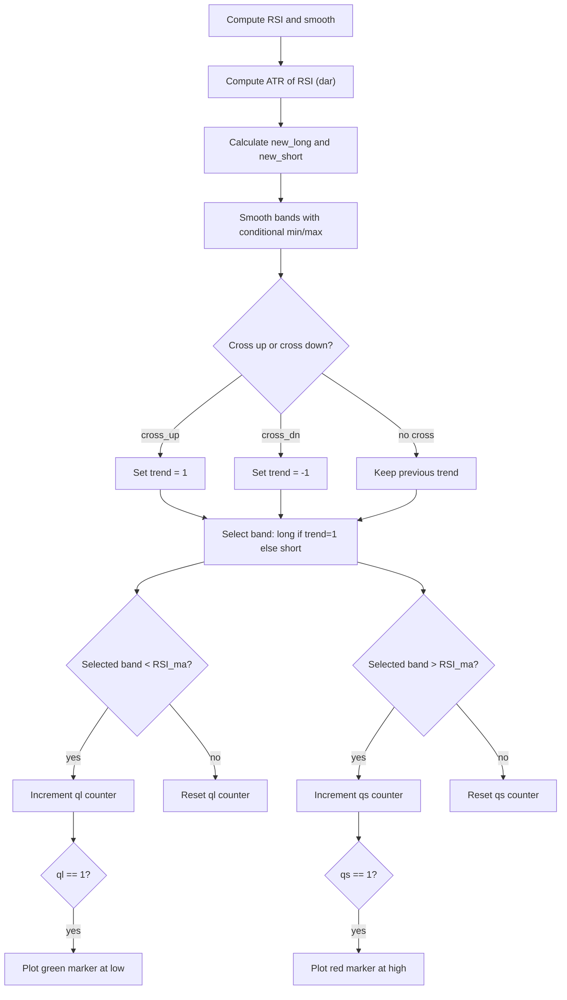

# QQE Signals - Indie Port Guide

> Computes QQE trend signals using smoothed RSI and ATR-based bands, plotting long/short markers on price.

| | |
| --- | --- |
| **Language** | Indie Script v5 |
| **Platform** | [TakeProfit](https://takeprofit.com) |
| **Category** | Oscillators |
| **Type** | Indicator, port from Pine Script |
| **Original** | QQE signals by colinmck (Pine Script v4) |
| **License** | MPL-2.0 (see the header of the source files) |
| **Original source** | [QQE Signals.pinescript4](QQE%20Signals.pinescript4) |
| **Source file** | [QQE Signals.indie5](QQE%20Signals.indie5) |

## Overview

This indicator is an Indie port of the "QQE signals" script by colinmck. It derives a trend direction from a smoothed RSI and dynamic bands based on an ATR-like measure of RSI volatility. The QQE (Quantitative Qualitative Estimation) oscillator is designed to identify trend reversals and filter out noise, making it suitable for trending markets or range-bound conditions with clear breakouts.

The indicator plots green markers below the bar when a long signal is generated and red markers above the bar for short signals. No lines or fills are drawn on the chart; only discrete markers appear at the moment a signal fires.

## How it works

1. Compute RSI of the close price over the given period.
2. Smooth the RSI with an EMA (smoothing factor sf).
3. Calculate the ATR of the smoothed RSI using a Wilders smoothing length (2*RSI_period-1) and multiply by qqe_factor to get the band width dar.
4. Derive upper and lower bands: new_short = smoothed RSI + dar, new_long = smoothed RSI - dar.
5. Smooth the bands: if the smoothed RSI has been above the previous long band for two consecutive bars (both current and previous values), take the maximum of the previous long band and new_long; otherwise reset to new_long. Similarly for the short band using minimum.
6. Detect crosses: a cross up occurs when smoothed RSI crosses the previous short band (in either direction); a cross down occurs when the previous long band crosses the smoothed RSI (in either direction).
7. Maintain a trend state (1 for uptrend, -1 for downtrend) that flips on crosses.
8. Count consecutive bars where the selected band (long in uptrend, short in downtrend) is below/above the smoothed RSI; a count of 1 triggers a long or short signal.
9. Plot a green marker at 99.8% of the bar low on a long signal, and a red marker at 100.2% of the bar high on a short signal.

## Mathematical model

The band width is computed as:

$$
dar = \text{EMA}(\text{EMA}(|\text{RSI}_{\text{ma}} - \text{RSI}_{\text{ma,prev}}|, \text{wilders}), \text{wilders}) \times \text{qqe\_factor}
$$

The smoothed bands are updated conditionally:

$$
\text{long}_t = \begin{cases}
\max(\text{long}_{t-1},\, \text{RSI}_{\text{ma}} - dar) & \text{if } \text{RSI}_{\text{ma,prev}} > \text{long}_{t-1} \text{ and } \text{RSI}_{\text{ma}} > \text{long}_{t-1} \\
\text{RSI}_{\text{ma}} - dar & \text{otherwise}
\end{cases}
$$

$$
\text{short}_t = \begin{cases}
\min(\text{short}_{t-1},\, \text{RSI}_{\text{ma}} + dar) & \text{if } \text{RSI}_{\text{ma,prev}} < \text{short}_{t-1} \text{ and } \text{RSI}_{\text{ma}} < \text{short}_{t-1} \\
\text{RSI}_{\text{ma}} + dar & \text{otherwise}
\end{cases}
$$

## Logic flow



## Parameters

| Parameter | Type | Default | Range | Description |
| --- | --- | --- | --- | --- |
| `rsi_period` | int | 14 | ≥ 1 | RSI Length |
| `sf` | int | 5 | ≥ 1 | RSI Smoothing |
| `qqe_factor` | float | 4.238 | ≥ 0.0 | Fast QQE Factor |
| `threshold` | int | 10 | ≥ 0 | Thresh-hold |

## Code walkthrough

### Cross detection helper

Lines 15-16 of [QQE Signals.indie5](QQE%20Signals.indie5):

```python
def _cross(x: float, y: float, xp: float, yp: float) -> bool:
    return (x > y and xp <= yp) or (x < y and xp >= yp)
```

The `_cross` function checks if two series have crossed in either direction between the current and previous bar. It returns true if x > y and xp <= yp (upward cross) or x < y and xp >= yp (downward cross). This is used later to detect trend flips.

### RSI smoothing and ATR-based band width

Lines 29-36 of [QQE Signals.indie5](QQE%20Signals.indie5):

```python
        rsi_s    = Rsi.new(self.close, rsi_period)
        rsi_ma_s = Ema.new(rsi_s, sf)
        rsi_ma: float      = rsi_ma_s[0]
        rsi_ma_prev: float = rsi_ma_s[1]

        atr_rsi_s = MutSeriesF.new(abs(rsi_ma_prev - rsi_ma))
        ma_atr_s = Ema.new(atr_rsi_s, wilders)
        dar: float = Ema.new(ma_atr_s, wilders)[0] * qqe_factor
```

RSI is computed from the close price, then smoothed with an EMA. The absolute difference between consecutive smoothed RSI values is fed into a double EMA (Wilders length) to produce an ATR-like measure, which is multiplied by `qqe_factor` to get the band width `dar`. This forms the dynamic channel around the smoothed RSI.

### Band smoothing with conditional logic

Lines 41-46 of [QQE Signals.indie5](QQE%20Signals.indie5):

```python
        long_s = MutSeriesF.new(new_long)
        short_s = MutSeriesF.new(new_short)
        long_p1: float = long_s[1]
        short_p1: float = short_s[1]
        long_s[0] = max(long_p1, new_long) if (rsi_ma_prev > long_p1 and rsi_ma > long_p1) else new_long
        short_s[0] = min(short_p1, new_short) if (rsi_ma_prev < short_p1 and rsi_ma < short_p1) else new_short
```

The raw bands `new_long` and `new_short` are further smoothed using a conditional rule: if the smoothed RSI has been above the previous long band for two consecutive bars, the long band is raised to the maximum of the previous and new value; otherwise it resets to the new value. The short band uses a minimum rule. This prevents the bands from contracting prematurely.

### Trend state and cross detection

Lines 48-58 of [QQE Signals.indie5](QQE%20Signals.indie5):

```python
        cross_up: bool = _cross(rsi_ma, short_s[1], rsi_ma_prev, short_s[2])
        cross_dn: bool = _cross(long_s[1], rsi_ma, long_s[2], rsi_ma_prev)

        trend_s = MutSeriesF.new(1.0)
        trend_prev: float = trend_s[1] if not isnan(trend_s[1]) else 1.0
        if cross_up:
            trend_s[0] = 1.0
        elif cross_dn:
            trend_s[0] = -1.0
        else:
            trend_s[0] = trend_prev
```

A cross up occurs when the smoothed RSI crosses the previous short band (in either direction); a cross down occurs when the previous long band crosses the smoothed RSI (in either direction). The trend state (`trend_s`) is set to 1 on a cross up, -1 on a cross down, and persists otherwise. The selected band for signal generation is `long_s` in uptrend and `short_s` in downtrend.

### Signal counters and marker output

Lines 62-75 of [QQE Signals.indie5](QQE%20Signals.indie5):

```python
        ql_s = MutSeriesF.new(0.0)
        ql_prev: float = ql_s[1] if not isnan(ql_s[1]) else 0.0
        ql_s[0] = (ql_prev + 1.0) if fast_tl < rsi_ma else 0.0

        qs_s = MutSeriesF.new(0.0)
        qs_prev: float = qs_s[1] if not isnan(qs_s[1]) else 0.0
        qs_s[0] = (qs_prev + 1.0) if fast_tl > rsi_ma else 0.0

        is_long: bool  = ql_s[0] == 1.0
        is_short: bool = qs_s[0] == 1.0

        return (
            plot.Marker(self.low[0]  * 0.998 if is_long  else nan),
            plot.Marker(self.high[0] * 1.002 if is_short else nan),
```

Two counters track consecutive bars where the selected band is below (`ql`) or above (`qs`) the smoothed RSI. When a counter reaches exactly 1, a signal is triggered. The marker is placed at 99.8% of the bar low for long signals (green) and 100.2% of the bar high for short signals (red). The `nan` values suppress markers when no signal occurs.

## Reading the chart

- **Green marker below the bar**: A long signal has been generated. It appears when the QQE trend turns up and the smoothed RSI is above the long band for the first bar.
- **Red marker above the bar**: A short signal has been generated. It appears when the QQE trend turns down and the smoothed RSI is below the short band for the first bar.
- No markers are plotted on bars without a signal. The indicator does not draw lines or fills on the chart.
- The marker positions are slightly offset from the bar low/high (0.998 and 1.002 multipliers) to avoid overlapping with price action.

## Implementation notes

- The `threshold` parameter is declared but never used in the logic; it is kept for compatibility with the original Pine script.
- State variables (`MutSeriesF`) are used for the smoothed bands, trend, and counters. They persist across bars and are accessed via index [0] (current) and [1] (previous).
- The cross detection function `_cross` checks both directions simultaneously, which is essential for detecting trend flips on the exact bar of the crossover.
- Markers are plotted at a fixed percentage of the bar's low/high, which may appear outside the visible price range on very small bars; consider adjusting the multipliers if needed.

## Port notes

Differences and decisions in the Indie port of the Pine Script v4 original (taken from the header of [QQE Signals.indie5](QQE%20Signals.indie5)):

- alertcondition() — no Indie equivalent
- Logic ported 1:1 from the Pine original, incl. cross() in BOTH directions for the trend flip
- threshold param kept for compat but unused (as in the original)
- labels: belowbar/abovebar -> markers at bar low/high

The plotted series of the port were compared bar by bar with the original script running on the same candles, and the compared series matched.

## FAQ

**How can I adjust the sensitivity of the signals?**

Increase the `RSI Length` or `RSI Smoothing` to reduce sensitivity, or decrease them for more frequent signals. The `Fast QQE Factor` also widens or narrows the bands; a larger factor makes signals less frequent.

**What does the 'Thresh-hold' parameter do?**

The `threshold` parameter is declared but not used in the calculation. It is retained for compatibility with the original Pine script and has no effect on the indicator output.

**Can I use this indicator on intraday timeframes?**

Yes, the indicator works on any timeframe. The RSI and EMA calculations are timeframe-agnostic. However, the ATR-like band width may behave differently on lower timeframes due to increased noise.

## Full source code

Indie Script v5. Copy it into the platform's script editor. The original Pine Script is published next to it as [QQE Signals.pinescript4](QQE%20Signals.pinescript4).

```python
# indie:lang_version = 5
# QQE Signals — Indie port
# Original Pine Script by colinmck (© colinmck)
# License: Mozilla Public License 2.0
# Migration notes:
#   alertcondition() — no Indie equivalent
#   Logic ported 1:1 from the Pine original, incl. cross() in BOTH directions for the trend flip
#   threshold param kept for compat but unused (as in the original)
#   labels: belowbar/abovebar -> markers at bar low/high

from math import nan, isnan
from indie import indicator, param, plot, MainContext, color, format, MutSeriesF
from indie.algorithms import Rsi, Ema

def _cross(x: float, y: float, xp: float, yp: float) -> bool:
    return (x > y and xp <= yp) or (x < y and xp >= yp)

@indicator('QQE Signals', overlay_main_pane=True)
@param.int('rsi_period', default=14, min=1, title='RSI Length')
@param.int('sf', default=5, min=1, title='RSI Smoothing')
@param.float('qqe_factor', default=4.238, min=0.0, step=0.001, title='Fast QQE Factor')
@param.int('threshold', default=10, min=0, title='Thresh-hold')
@plot.marker('long_signal',  color=color.GREEN, style=plot.marker_style.LABEL)
@plot.marker('short_signal', color=color.RED,   style=plot.marker_style.LABEL)
class Main(MainContext):
    def calc(self, rsi_period, sf, qqe_factor, threshold):
        wilders: int = rsi_period * 2 - 1

        rsi_s    = Rsi.new(self.close, rsi_period)
        rsi_ma_s = Ema.new(rsi_s, sf)
        rsi_ma: float      = rsi_ma_s[0]
        rsi_ma_prev: float = rsi_ma_s[1]

        atr_rsi_s = MutSeriesF.new(abs(rsi_ma_prev - rsi_ma))
        ma_atr_s = Ema.new(atr_rsi_s, wilders)
        dar: float = Ema.new(ma_atr_s, wilders)[0] * qqe_factor

        new_long: float  = rsi_ma - dar
        new_short: float = rsi_ma + dar

        long_s = MutSeriesF.new(new_long)
        short_s = MutSeriesF.new(new_short)
        long_p1: float = long_s[1]
        short_p1: float = short_s[1]
        long_s[0] = max(long_p1, new_long) if (rsi_ma_prev > long_p1 and rsi_ma > long_p1) else new_long
        short_s[0] = min(short_p1, new_short) if (rsi_ma_prev < short_p1 and rsi_ma < short_p1) else new_short

        cross_up: bool = _cross(rsi_ma, short_s[1], rsi_ma_prev, short_s[2])
        cross_dn: bool = _cross(long_s[1], rsi_ma, long_s[2], rsi_ma_prev)

        trend_s = MutSeriesF.new(1.0)
        trend_prev: float = trend_s[1] if not isnan(trend_s[1]) else 1.0
        if cross_up:
            trend_s[0] = 1.0
        elif cross_dn:
            trend_s[0] = -1.0
        else:
            trend_s[0] = trend_prev

        fast_tl: float = long_s[0] if trend_s[0] == 1.0 else short_s[0]

        ql_s = MutSeriesF.new(0.0)
        ql_prev: float = ql_s[1] if not isnan(ql_s[1]) else 0.0
        ql_s[0] = (ql_prev + 1.0) if fast_tl < rsi_ma else 0.0

        qs_s = MutSeriesF.new(0.0)
        qs_prev: float = qs_s[1] if not isnan(qs_s[1]) else 0.0
        qs_s[0] = (qs_prev + 1.0) if fast_tl > rsi_ma else 0.0

        is_long: bool  = ql_s[0] == 1.0
        is_short: bool = qs_s[0] == 1.0

        return (
            plot.Marker(self.low[0]  * 0.998 if is_long  else nan),
            plot.Marker(self.high[0] * 1.002 if is_short else nan),
        )
```
