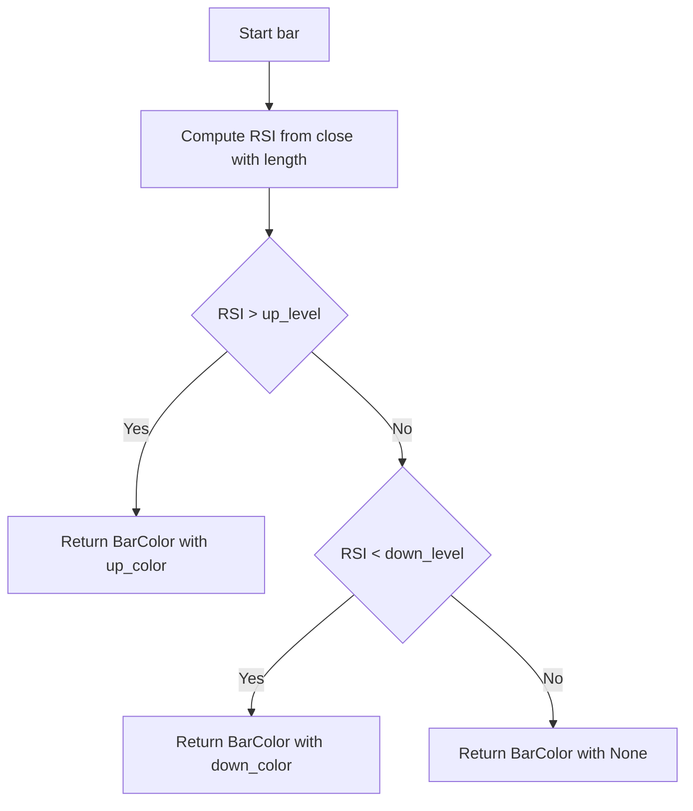

# RSI Candles (RSI Chart Bar) - Technical Guide

> Colors chart bars based on RSI: overbought above up_level, oversold below down_level, neutral otherwise.

| | |
| --- | --- |
| **Language** | Indie Script v5 |
| **Platform** | [TakeProfit](https://takeprofit.com) |
| **Category** | Oscillators |
| **Type** | Indicator |
| **Author** | @pavel_medvedev on TakeProfit |
| **License** | MIT |
| **Live script** | [Open on TakeProfit](https://takeprofit.com/indicator/rsi-candles-rsi-chart-bar-55) |
| **Source file** | [RSI Candles (RSI Chart Bar).indie5](RSI%20Candles%20(RSI%20Chart%20Bar).indie5) |

## Overview

RSI Chart Bars is an overlay indicator that colors each price bar according to the Relative Strength Index of that bar's close. It uses a configurable RSI length (default 14) and two thresholds: `up_level` (default 70) and `down_level` (default 30). When RSI is above `up_level`, the bar is painted with `up_color`; when below `down_level`, it is painted with `down_color`; otherwise no color override is applied.

Because it works on the main chart pane (`overlay_main_pane=True`), it is meant for situations where an overbought/oversold RSI read should be visible without switching to a separate oscillator pane: trend exhaustion, pullback timing, and momentum filtering. The indicator does not draw lines, markers, or levels; its only output is the bar color returned through `plot.BarColor`.

## How it works

1. An RSI series is created from the close series with `Rsi.new(self.close, length)`.
2. The current bar's RSI value is read with `rsi[0]`.
3. If `rsi_val > up_level`, the bar color is set to `up_color`.
4. Otherwise, if `rsi_val < down_level`, the bar color is set to `down_color`.
5. If neither condition holds, `None` is returned as the color, leaving the default bar appearance.
6. The final `plot.BarColor` object tells the platform which color to paint the current bar.

## Mathematical model

The code delegates RSI computation to the built-in `Rsi` algorithm. The conventional calculation represented by that algorithm is:

$$
RS = \frac{U}{D}
$$

$$
RSI = 100 - \frac{100}{1 + RS}
$$

where `U` and `D` are the smoothed average gain and average loss over the configured `length` period.

## Logic flow



## Parameters

| Parameter | Type | Default | Range | Description |
| --- | --- | --- | --- | --- |
| `length` | int | 14 | ≥ 1 | Length |
| `up_level` | int | 70 | ≥ 1 | UpLevel |
| `down_level` | int | 30 | ≥ 1 | DownLevel |
| `up_color` | color | color.LIME |  | Overbought Color |
| `down_color` | color | color.FUCHSIA |  | Oversold Color |

## Code walkthrough

### Indicator registration and settings

Lines 6-12 of [RSI Candles (RSI Chart Bar).indie5](RSI%20Candles%20(RSI%20Chart%20Bar).indie5):

```python
@indicator('RSI Chart Bars', overlay_main_pane=True)
@param.int('length', default=14, min=1, title='Length')
@param.int('up_level', default=70, min=1, title='UpLevel')
@param.int('down_level', default=30, min=1, title='DownLevel')
@param.color('up_color', default=color.LIME, title='Overbought Color')
@param.color('down_color', default=color.FUCHSIA, title='Oversold Color')
@plot.bar_color(title='Bar Color')
```

`@indicator` places the script on the main chart rather than a separate pane. The `@param.int` and `@param.color` decorators define the UI settings for RSI length, thresholds, and bar colors. `@plot.bar_color` declares that the returned value is a bar color.

### RSI calculation and current value

Lines 14-15 of [RSI Candles (RSI Chart Bar).indie5](RSI%20Candles%20(RSI%20Chart%20Bar).indie5):

```python
    rsi = Rsi.new(self.close, length)
    rsi_val = rsi[0]
```

`Rsi.new(self.close, length)` returns an RSI series. Reading `rsi[0]` gets the value for the current bar, while `rsi[1]` would refer to the previous completed bar.

### Color decision and return value

Lines 17-19 of [RSI Candles (RSI Chart Bar).indie5](RSI%20Candles%20(RSI%20Chart%20Bar).indie5):

```python
    return plot.BarColor(
        up_color if rsi_val > up_level else down_color if rsi_val < down_level else None
    )
```

The nested conditional picks `up_color` for overbought RSI, `down_color` for oversold RSI, and `None` otherwise. Returning `plot.BarColor` with `None` means the chart uses the default bar style for that bar.

## Reading the chart

- When a bar is painted with `up_color` (default lime), the current RSI is strictly above `up_level`, indicating an overbought condition.
- When a bar is painted with `down_color` (default fuchsia), the current RSI is strictly below `down_level`, indicating an oversold condition.
- Unpainted bars mean RSI is between `down_level` and `up_level`; the indicator does not draw anything else on the chart.
- The color is recalculated every bar from the current close, so the color on the active bar can change as price moves.

## Implementation notes

- The comparison uses strict `>` and `<`; an RSI exactly equal to a threshold leaves the bar unpainted.
- `rsi[0]` is a same-bar value, so on the in-progress bar the color can change until the bar closes.
- The two thresholds are independent and do not need to be symmetric around 50.
- All RSI math is inside the built-in `Rsi` algorithm; this script only consumes its series.

## FAQ

**How do I change the overbought and oversold thresholds?**

Change `up_level` and `down_level` in the indicator settings or in the `@param.int` defaults. They are independent, so you can use values such as 80 and 20.

**Why are some bars unpainted when RSI is exactly 70 or 30?**

The condition uses strict greater-than and less-than comparisons. If you want equality to count, edit lines 17-18 to use `>=` and `<=`.

**Can I base the color on the previous bar instead of the current bar?**

Yes, change `rsi_val = rsi[0]` to `rsi_val = rsi[1]` on line 15. This reads the previous completed bar's RSI and makes the coloring one bar delayed.

## Full source code

Indie Script v5, as published on TakeProfit. Copy it into the platform's script editor or [open the live script](https://takeprofit.com/indicator/rsi-candles-rsi-chart-bar-55).

```python
# indie:lang_version = 5
from indie import indicator, param, plot, color
from indie.algorithms import Rsi


@indicator('RSI Chart Bars', overlay_main_pane=True)
@param.int('length', default=14, min=1, title='Length')
@param.int('up_level', default=70, min=1, title='UpLevel')
@param.int('down_level', default=30, min=1, title='DownLevel')
@param.color('up_color', default=color.LIME, title='Overbought Color')
@param.color('down_color', default=color.FUCHSIA, title='Oversold Color')
@plot.bar_color(title='Bar Color')
def Main(self, length, up_level, down_level, up_color, down_color):
    rsi = Rsi.new(self.close, length)
    rsi_val = rsi[0]

    return plot.BarColor(
        up_color if rsi_val > up_level else down_color if rsi_val < down_level else None
    )
```
