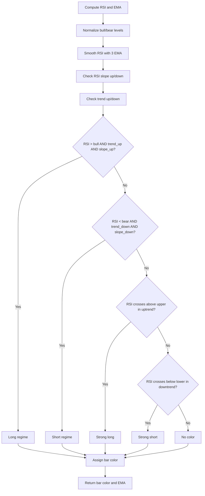

# RSI Candles Pro (Trend Regime Edition) - Technical Guide

> Colors bars based on RSI levels, trend regime, and RSI slope with an optional trend EMA line.

| | |
| --- | --- |
| **Language** | Indie Script v5 |
| **Platform** | [TakeProfit](https://takeprofit.com) |
| **Category** | Oscillators |
| **Type** | Indicator |
| **Author** | @pavel_medvedev on TakeProfit |
| **License** | MIT |
| **Live script** | [Open on TakeProfit](https://takeprofit.com/indicator/rsi-candles-pro-trend-regime-edition-22) |
| **Source file** | [RSI Candles Pro (Trend Regime Edition).indie5](RSI%20Candles%20Pro%20(Trend%20Regime%20Edition).indie5) |

## Overview

This indicator combines RSI readings with a trend filter (EMA) and RSI slope to color each bar according to the prevailing market regime. It is designed to help traders quickly identify strong momentum moves and trend-aligned conditions without looking at a separate RSI pane.

The chart displays colored bars (up/down/strong up/strong down) based on the logic, and optionally overlays a trend EMA line. The indicator normalizes user-defined bull/bear levels to prevent misconfiguration.

## How it works

1. Computes RSI and EMA from the close price.
2. Normalizes bull and bear regime levels so bull is always above bear.
3. Smooths RSI with a 3-period EMA and computes its slope direction.
4. Determines trend direction by comparing close to the trend EMA.
5. Checks for long regime (RSI above bull level, uptrend, RSI rising) and short regime (RSI below bear level, downtrend, RSI falling).
6. Detects strong impulses when RSI crosses above upper level in uptrend or below lower level in downtrend.
7. Assigns bar color based on priority: strong impulse first, then regime, else no color.
8. Returns bar color and optionally the EMA line value (NaN hides the line).

## Logic flow



## Parameters

| Parameter | Type | Default | Range | Description |
| --- | --- | --- | --- | --- |
| `rsi_length` | int | 14 | ≥ 2 | RSI Length |
| `ema_length` | int | 200 | ≥ 1 | Trend EMA Length |
| `upper_level` | int | 70 |  | Upper Level |
| `lower_level` | int | 30 |  | Lower Level |
| `bull_level` | int | 55 |  | Bull Regime Level |
| `bear_level` | int | 45 |  | Bear Regime Level |
| `show_ema` | bool | true |  | Show EMA |
| `strong_up_color` | color | color.rgba(200 |  | Strong Up Color |
| `strong_down_color` | color | color.rgba(255 |  | Strong Down Color |
| `up_color` | color | color.rgba(0 |  | Up Color |
| `down_color` | color | color.rgba(220 |  | Down Color |

## Code walkthrough

### Parameter and indicator setup

Lines 7-23 of [RSI Candles Pro (Trend Regime Edition).indie5](RSI%20Candles%20Pro%20(Trend%20Regime%20Edition).indie5):

```python
@indicator('RSI Candles Pro', overlay_main_pane=True)
@param.int('rsi_length', default=14, min=2, title='RSI Length')
@param.int('ema_length', default=200, min=1, title='Trend EMA Length')
@param.int('upper_level', default=70, title='Upper Level')
@param.int('lower_level', default=30, title='Lower Level')
@param.int('bull_level', default=55, title='Bull Regime Level')
@param.int('bear_level', default=45, title='Bear Regime Level')
@param.bool('show_ema', default=True, title='Show EMA')
@param.color('strong_up_color', default=color.rgba(200, 255, 150, 1.0), title='Strong Up Color')
@param.color('strong_down_color', default=color.rgba(255, 0, 200, 1.0), title='Strong Down Color')
@param.color('up_color', default=color.rgba(0, 200, 50, 1.0), title='Up Color')
@param.color('down_color', default=color.rgba(220, 0, 60, 1.0), title='Down Color')
@plot.bar_color(title='RSI Bar Color')
@plot.line(color=color.ORANGE, title='EMA')
def Main(self, rsi_length, ema_length, upper_level, lower_level,
         bull_level, bear_level, show_ema,
         strong_up_color, strong_down_color, up_color, down_color):
```

The indicator is declared with `overlay_main_pane=True` so it draws directly on the price chart. Parameters include RSI length, EMA length, and multiple level thresholds for regime detection and strong impulse detection. Color parameters allow full customization of the four bar color states.

### Core calculations and level normalization

Lines 24-29 of [RSI Candles Pro (Trend Regime Edition).indie5](RSI%20Candles%20Pro%20(Trend%20Regime%20Edition).indie5):

```python
    rsi = Rsi.new(self.close, rsi_length)
    ema = Ema.new(self.close, ema_length)

    # Normalize levels to prevent user misconfiguration
    bull = max(bull_level, bear_level + 1)
    bear = min(bear_level, bull_level - 1)
```

RSI and EMA are computed from the close price. The bull and bear regime levels are normalized to ensure bull is always at least 1 point above bear, preventing contradictory regime states from user misconfiguration.

### RSI smoothing and slope detection

Lines 31-34 of [RSI Candles Pro (Trend Regime Edition).indie5](RSI%20Candles%20Pro%20(Trend%20Regime%20Edition).indie5):

```python
    # Smoothed RSI slope (fix flickering)
    rsi_smooth = Ema.new(rsi, 3)
    rsi_slope_up = rsi_smooth[0] > rsi_smooth[1]
    rsi_slope_down = rsi_smooth[0] < rsi_smooth[1]
```

A 3-period EMA of RSI is used to smooth out noise and reduce flickering in slope detection. The slope is determined by comparing the current smoothed value to the previous bar's value, giving boolean flags for rising or falling RSI.

### Regime and impulse logic

Lines 36-46 of [RSI Candles Pro (Trend Regime Edition).indie5](RSI%20Candles%20Pro%20(Trend%20Regime%20Edition).indie5):

```python
    # Trend filter
    trend_up = self.close[0] > ema[0]
    trend_down = self.close[0] < ema[0]

    # Regime logic (normalized levels)
    long_regime = rsi[0] > bull and trend_up and rsi_slope_up
    short_regime = rsi[0] < bear and trend_down and rsi_slope_down

    # Strong impulse (crossover / crossunder, trend-aligned only)
    strong_long = rsi[0] > upper_level and rsi[1] <= upper_level and trend_up
    strong_short = rsi[0] < lower_level and rsi[1] >= lower_level and trend_down
```

Trend direction is determined by comparing close to EMA. Long regime requires RSI above bull level, uptrend, and rising RSI. Short regime requires the opposite. Strong impulses detect RSI crossing above upper level (in uptrend) or below lower level (in downtrend), capturing breakout-like moves.

### Bar color assignment and output

Lines 48-62 of [RSI Candles Pro (Trend Regime Edition).indie5](RSI%20Candles%20Pro%20(Trend%20Regime%20Edition).indie5):

```python
    # Bar color
    bar_col: Optional[Color] = None
    if strong_long:
        bar_col = strong_up_color
    elif strong_short:
        bar_col = strong_down_color
    elif long_regime:
        bar_col = up_color
    elif short_regime:
        bar_col = down_color

    # EMA line (nan hides the line — Indie idiom, same as Pine's `na`)
    ema_value = ema[0] if show_ema else nan

    return plot.BarColor(bar_col), plot.Line(ema_value)
```

Bar color is assigned with priority: strong impulses override regime colors, which override no color. The EMA line is returned only if `show_ema` is true; otherwise NaN is used, which hides the line in Indie (similar to Pine Script's `na`).

## Reading the chart

- **Strong Up Color** (default light green): Bar is colored when RSI crosses above the upper level during an uptrend, indicating strong bullish momentum.
- **Strong Down Color** (default magenta): Bar is colored when RSI crosses below the lower level during a downtrend, indicating strong bearish momentum.
- **Up Color** (default green): Bar is colored when in a long regime (RSI above bull level, price above EMA, RSI rising).
- **Down Color** (default red): Bar is colored when in a short regime (RSI below bear level, price below EMA, RSI falling).
- **Orange EMA line**: Optional trend EMA overlay, shown when `show_ema` is enabled.
- Bars with no color indicate neutral or conflicting conditions.

## Implementation notes

- The bull and bear levels are normalized internally: bull is set to max(bull_level, bear_level + 1) and bear to min(bear_level, bull_level - 1), preventing overlapping regimes.
- RSI slope uses a 3-period EMA of RSI to reduce flickering; this introduces a slight lag in slope detection.
- The EMA line is hidden by returning `nan` when `show_ema` is false, following Indie's convention for optional plot lines.
- Strong impulse conditions require both a level crossover and trend alignment, so they only trigger in the direction of the prevailing trend.

## FAQ

**How do I adjust the sensitivity of the regime detection?**

Lower the `bull_level` and `bear_level` parameters to make regime detection more sensitive, or raise them to require stronger RSI readings. The levels are automatically normalized so bull is always above bear.

**Why do some bars have no color?**

Bars are uncolored when none of the conditions are met: no strong impulse, no long regime, and no short regime. This typically happens in ranging markets or when RSI is between the bull and bear levels.

**Can I use this indicator on lower timeframes?**

Yes, but the RSI slope smoothing with a 3-period EMA may introduce more lag on lower timeframes. Consider increasing the RSI length for less noisy signals.

## Full source code

Indie Script v5, as published on TakeProfit. Copy it into the platform's script editor or [open the live script](https://takeprofit.com/indicator/rsi-candles-pro-trend-regime-edition-22).

```python
# indie:lang_version = 5
from math import nan
from indie import indicator, param, plot, color, Color, Optional
from indie.algorithms import Rsi, Ema


@indicator('RSI Candles Pro', overlay_main_pane=True)
@param.int('rsi_length', default=14, min=2, title='RSI Length')
@param.int('ema_length', default=200, min=1, title='Trend EMA Length')
@param.int('upper_level', default=70, title='Upper Level')
@param.int('lower_level', default=30, title='Lower Level')
@param.int('bull_level', default=55, title='Bull Regime Level')
@param.int('bear_level', default=45, title='Bear Regime Level')
@param.bool('show_ema', default=True, title='Show EMA')
@param.color('strong_up_color', default=color.rgba(200, 255, 150, 1.0), title='Strong Up Color')
@param.color('strong_down_color', default=color.rgba(255, 0, 200, 1.0), title='Strong Down Color')
@param.color('up_color', default=color.rgba(0, 200, 50, 1.0), title='Up Color')
@param.color('down_color', default=color.rgba(220, 0, 60, 1.0), title='Down Color')
@plot.bar_color(title='RSI Bar Color')
@plot.line(color=color.ORANGE, title='EMA')
def Main(self, rsi_length, ema_length, upper_level, lower_level,
         bull_level, bear_level, show_ema,
         strong_up_color, strong_down_color, up_color, down_color):
    rsi = Rsi.new(self.close, rsi_length)
    ema = Ema.new(self.close, ema_length)

    # Normalize levels to prevent user misconfiguration
    bull = max(bull_level, bear_level + 1)
    bear = min(bear_level, bull_level - 1)

    # Smoothed RSI slope (fix flickering)
    rsi_smooth = Ema.new(rsi, 3)
    rsi_slope_up = rsi_smooth[0] > rsi_smooth[1]
    rsi_slope_down = rsi_smooth[0] < rsi_smooth[1]

    # Trend filter
    trend_up = self.close[0] > ema[0]
    trend_down = self.close[0] < ema[0]

    # Regime logic (normalized levels)
    long_regime = rsi[0] > bull and trend_up and rsi_slope_up
    short_regime = rsi[0] < bear and trend_down and rsi_slope_down

    # Strong impulse (crossover / crossunder, trend-aligned only)
    strong_long = rsi[0] > upper_level and rsi[1] <= upper_level and trend_up
    strong_short = rsi[0] < lower_level and rsi[1] >= lower_level and trend_down

    # Bar color
    bar_col: Optional[Color] = None
    if strong_long:
        bar_col = strong_up_color
    elif strong_short:
        bar_col = strong_down_color
    elif long_regime:
        bar_col = up_color
    elif short_regime:
        bar_col = down_color

    # EMA line (nan hides the line — Indie idiom, same as Pine's `na`)
    ema_value = ema[0] if show_ema else nan

    return plot.BarColor(bar_col), plot.Line(ema_value)
```
