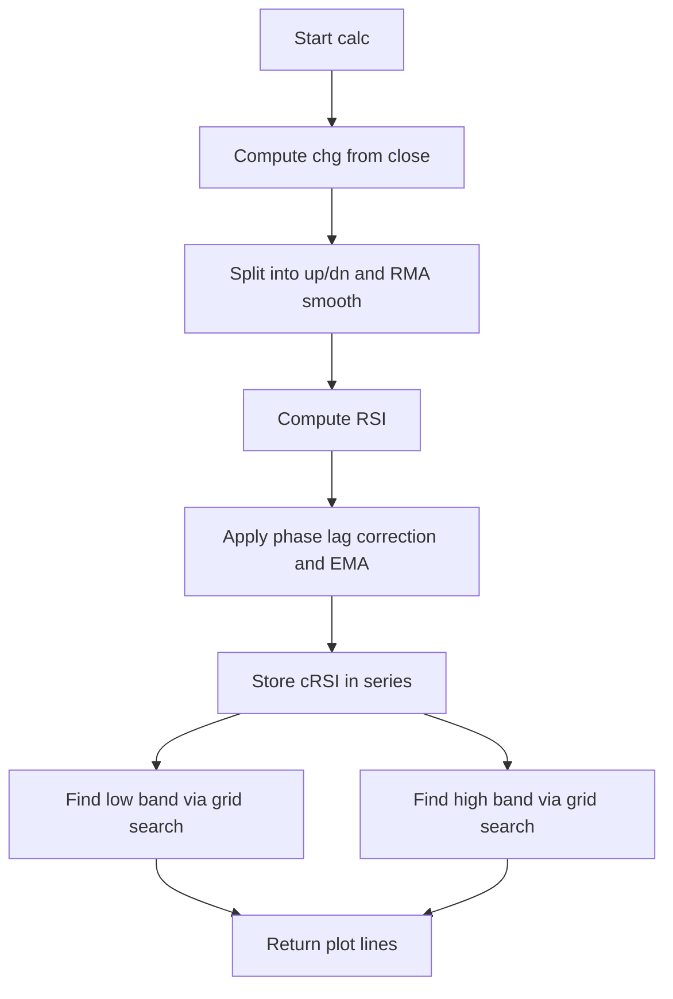

# RSI Cyclic Smoothed - Indie Port Guide

> Computes a cyclically smoothed RSI (cRSI) with adaptive high/low bands based on a dominant cycle length.

| | |
| --- | --- |
| **Language** | Indie Script v5 |
| **Platform** | [TakeProfit](https://takeprofit.com) |
| **Category** | Oscillators |
| **Type** | Indicator, port from Pine Script |
| **Original** | RSI cyclic smoothed v2 by whentotrade / Lars von Thienen (Pine Script v4) |
| **License** | CC BY 4.0 (see the header of the source files) |
| **Original source** | [RSI Cyclic Smoothed.pinescript4](RSI%20Cyclic%20Smoothed.pinescript4) |
| **Source file** | [RSI Cyclic Smoothed.indie5](RSI%20Cyclic%20Smoothed.indie5) |

## Overview

This indicator is a port of the "RSI cyclic smoothed v2" by whentotrade / Lars von Thienen. It computes a smoothed RSI variant that incorporates a phase lag correction and then derives dynamic high and low bands around the cRSI value. The indicator is intended for identifying cyclical turning points and overbought/oversold conditions in a market.

The chart displays the cRSI line (magenta), the low band (cyan), the high band (cyan), and constant reference lines at 30 and 70 (gray). A subtle fill is drawn between the bands and between the 30/70 lines to visually highlight the zones.

## How it works

1. Calculates the price change (chg) as the difference between the current and previous close.
2. Splits the change into positive (up) and negative (down) components and smooths each with a Wilder RMA over half the dominant cycle length.
3. Computes a standard RSI from the smoothed up/down values, with special handling for zero denominators.
4. Applies a phase-lag correction by subtracting the RSI value from 'phasinglag' bars ago (hardcoded to 4) and smoothing the result with an EMA using a torque factor.
5. Performs a stepped grid search over the last 'cyclicmemory' cRSI values to find the low band (level where a given percentage of values fall below) and the high band (level where a given percentage fall above).
6. Returns the cRSI, bands, and constant reference lines for plotting.

## Mathematical model

$$
\text{chg} = \text{close}[0] - \text{close}[1]
$$

$$
\text{up} = \max(\text{chg}, 0), \quad \text{dn} = \max(-\text{chg}, 0)
$$

$$
\text{RSI} = 100 - \frac{100}{1 + \frac{\text{RMA}(\text{up}, \text{cyclelen})}{\text{RMA}(\text{dn}, \text{cyclelen})}}
$$

$$
\text{cRSI} = \text{torque} \cdot (2 \cdot \text{RSI} - \text{RSI}[\text{phasinglag}]) + (1 - \text{torque}) \cdot \text{cRSI}[1]
$$

$$
\text{torque} = \frac{2}{\text{vibration} + 1}
$$

## Logic flow



## Parameters

| Parameter | Type | Default | Range | Description |
| --- | --- | --- | --- | --- |
| `domcycle` | int | 20 | ≥ 10 | Dominant Cycle Length |

## Code walkthrough

### Initialization and Price Change

Lines 26-38 of [RSI Cyclic Smoothed.indie5](RSI%20Cyclic%20Smoothed.indie5):

```python
        cyclelen: int    = domcycle // 2
        cyclicmemory: int = domcycle * 2

        vibration: int   = 10
        leveling: float  = 10.0
        phasinglag: int  = (vibration - 1) // 2   # = 4

        torque: float    = 2.0 / (vibration + 1)  # = 2/11

        src_val: float  = self.close[0]
        src_prev: float = self.close[1] if not isnan(self.close[1]) else src_val

        chg: float = src_val - src_prev
```

The dominant cycle length is halved to get the RMA smoothing period, and doubled to get the memory window for band calculation. The price change is computed as the difference between the current and previous close, with a fallback to the current close if the previous is NaN.

### RSI Calculation with Wilder Smoothing

Lines 41-51 of [RSI Cyclic Smoothed.indie5](RSI%20Cyclic%20Smoothed.indie5):

```python
        chg_up_s = MutSeriesF.new(max(chg, 0.0))
        chg_up_s[0] = max(chg, 0.0)
        chg_dn_s = MutSeriesF.new(max(-chg, 0.0))
        chg_dn_s[0] = max(-chg, 0.0)

        up_s  = Rma.new(chg_up_s, cyclelen)
        dn_s  = Rma.new(chg_dn_s, cyclelen)
        up_val: float = up_s[0]
        dn_val: float = dn_s[0]

        rsi_val: float = 100.0 if dn_val == 0.0 else (0.0 if up_val == 0.0 else 100.0 - 100.0 / (1.0 + up_val / dn_val))
```

Positive and negative changes are stored in mutable series and smoothed with RMA (Wilder's method). The RSI is computed with explicit handling for zero up or down values to avoid division by zero, returning 100 or 0 respectively.

### Phase Lag Correction and EMA Smoothing

Lines 54-62 of [RSI Cyclic Smoothed.indie5](RSI%20Cyclic%20Smoothed.indie5):

```python
        rsi_s = MutSeriesF.new(rsi_val)
        rsi_s[0] = rsi_val
        rsi_lag: float = rsi_s[phasinglag] if not isnan(rsi_s[phasinglag]) else rsi_val

        # cRSI: EMA of (2*rsi - rsi[lag]) with phase correction
        crsi_s = MutSeriesF.new(rsi_val)
        crsi_prev: float = crsi_s[1] if not isnan(crsi_s[1]) else rsi_val
        crsi_s[0] = torque * (2.0 * rsi_val - rsi_lag) + (1.0 - torque) * crsi_prev
        crsi_val: float = crsi_s[0]
```

The RSI is stored in a series to access its value from 'phasinglag' bars ago (hardcoded to 4). The cRSI is then computed as an EMA of the phase-corrected RSI, using a torque factor derived from the vibration constant. The previous cRSI value is used with a NaN fallback.

### Band Search via Stepped Grid

Lines 65-102 of [RSI Cyclic Smoothed.indie5](RSI%20Cyclic%20Smoothed.indie5):

```python
        lmax: float = -999999.0
        lmin: float = 999999.0
        for i in range(cyclicmemory):
            x: float = crsi_s[i]
            xa: float = -999999.0 if isnan(x) else x
            xb: float = 999999.0 if isnan(x) else x
            if xa > lmax:
                lmax = xa
            elif xb < lmin:
                lmin = xb
        mstep: float = (lmax - lmin) / 100.0
        aperc: float = leveling / 100.0
        low_band: float = 0.0
        found_lo: bool = False
        for st in range(101):
            if not found_lo:
                tv: float = lmin + mstep * st
                below: int = 0
                for m in range(cyclicmemory):
                    xm: float = crsi_s[m]
                    if not isnan(xm) and xm < tv:
                        below += 1
                if below / cyclicmemory >= aperc:
                    low_band = tv
                    found_lo = True
        high_band: float = 0.0
        found_hi: bool = False
        for st2 in range(101):
            if not found_hi:
                tv2: float = lmax - mstep * st2
                above: int = 0
                for m2 in range(cyclicmemory):
                    xm2: float = crsi_s[m2]
                    if not isnan(xm2) and xm2 >= tv2:
                        above += 1
                if above / cyclicmemory >= aperc:
                    high_band = tv2
                    found_hi = True
```

The low and high bands are found by scanning the cRSI series over the cyclic memory window. A grid of 101 steps between the min and max cRSI values is tested, and the first level where the required percentage of values fall below (for low band) or above (for high band) is selected. This mirrors the original Pine logic exactly.

### Return Plot Data

Lines 107-115 of [RSI Cyclic Smoothed.indie5](RSI%20Cyclic%20Smoothed.indie5):

```python
        return (
            plot.Line(crsi_val),
            plot.Line(low_band),
            plot.Line(high_band),
            plot.Fill(fill_band_c),
            plot.Line(30.0),
            plot.Line(70.0),
            plot.Fill(fill_hline_c),
        )
```

The function returns a tuple of plot lines and fills: the cRSI line, the low and high bands, a fill between the bands, constant lines at 30 and 70, and a fill between those constants. The colors and widths are defined in the decorators.

## Reading the chart

- The magenta cRSI line oscillates between 0 and 100, with values above 70 typically considered overbought and below 30 oversold (reference lines at 70 and 30).
- The cyan low and high bands dynamically adapt to the cRSI's recent range, providing a visual envelope. When the cRSI crosses above the high band, it may indicate strong upward momentum; crossing below the low band may indicate strong downward momentum.
- The gray fill between 30 and 70 highlights the neutral zone, while the subtle fill between the bands shows the current volatility range.

## Implementation notes

- The phasinglag, vibration, and leveling parameters are hardcoded constants (4, 10, and 10.0 respectively) and are not exposed as inputs.
- NaN handling is implemented for the previous close, lagged RSI, and previous cRSI, falling back to current values to avoid propagation of NaN.
- The band search uses a stepped grid of 101 steps, which is computationally heavier than a percentile-based approach but matches the original Pine implementation exactly.
- The indicator does not repaint, as it only uses past values within the cyclic memory window.

## Port notes

Differences and decisions in the Indie port of the Pine Script v4 original (taken from the header of [RSI Cyclic Smoothed.indie5](RSI%20Cyclic%20Smoothed.indie5)):

- hline() replaced with plot.Line at constant values
- Band search ported 1:1 from the Pine original (stepped grid search, not Percentile)
- phasingLag = 4 (hardcoded: vibration=10, (10-1)//2=4)
- vibration/leveling are hardcoded constants (not inputs in original)

The plotted series of the port were compared bar by bar with the original script running on the same candles, and the compared series matched.

## FAQ

**How do I change the dominant cycle length?**

The 'domcycle' parameter is exposed as an input with a default of 20 and a minimum of 10. Adjusting it changes the RMA smoothing period and the memory window for band calculation.

**Can I modify the phase lag or vibration constants?**

No, these are hardcoded in the source (phasinglag=4, vibration=10, leveling=10.0). To change them, you would need to edit the code directly.

**Why do the bands sometimes appear flat or jump?**

The bands are computed via a stepped grid search over the last 'cyclicmemory' cRSI values. If the cRSI range is narrow or the percentage threshold is not met, the bands may stay at zero or jump between grid steps.

## Full source code

Indie Script v5. Copy it into the platform's script editor. The original Pine Script is published next to it as [RSI Cyclic Smoothed.pinescript4](RSI%20Cyclic%20Smoothed.pinescript4).

```python
# indie:lang_version = 5
# RSI Cyclic Smoothed (cRSI) v2 — Indie port
# Original Pine Script by whentotrade / Lars von Thienen (CC BY 4.0)
# Source: "Decoding The Hidden Market Rhythm" book, Chapter 4
# Migration notes:
#   hline() replaced with plot.Line at constant values
#   Band search ported 1:1 from the Pine original (stepped grid search, not Percentile)
#   phasingLag = 4 (hardcoded: vibration=10, (10-1)//2=4)
#   vibration/leveling are hardcoded constants (not inputs in original)

from math import nan, isnan
from indie import indicator, param, plot, MainContext, color, format, MutSeriesF
from indie.algorithms import Rma

@indicator('RSI Cyclic Smoothed', overlay_main_pane=False)
@param.int('domcycle', default=20, min=10, title='Dominant Cycle Length')
@plot.line('crsi_line',   color=color.rgba(255, 0, 255, 1.0), line_width=1, title='cRSI')
@plot.line('low_band',    color=color.rgba(0, 210, 210, 1.0), line_width=1, title='Low Band')
@plot.line('high_band',   color=color.rgba(0, 210, 210, 1.0), line_width=1, title='High Band')
@plot.fill('low_band', 'high_band', id='band_fill')
@plot.line('hline30',     color=color.rgba(192, 192, 192, 1.0), line_width=1, title='30')
@plot.line('hline70',     color=color.rgba(192, 192, 192, 1.0), line_width=1, title='70')
@plot.fill('hline30', 'hline70', id='hline_fill')
class Main(MainContext):
    def calc(self, domcycle):
        cyclelen: int    = domcycle // 2
        cyclicmemory: int = domcycle * 2

        vibration: int   = 10
        leveling: float  = 10.0
        phasinglag: int  = (vibration - 1) // 2   # = 4

        torque: float    = 2.0 / (vibration + 1)  # = 2/11

        src_val: float  = self.close[0]
        src_prev: float = self.close[1] if not isnan(self.close[1]) else src_val

        chg: float = src_val - src_prev

        # up/down RMA series (Wilder smoothing of positive/negative changes)
        chg_up_s = MutSeriesF.new(max(chg, 0.0))
        chg_up_s[0] = max(chg, 0.0)
        chg_dn_s = MutSeriesF.new(max(-chg, 0.0))
        chg_dn_s[0] = max(-chg, 0.0)

        up_s  = Rma.new(chg_up_s, cyclelen)
        dn_s  = Rma.new(chg_dn_s, cyclelen)
        up_val: float = up_s[0]
        dn_val: float = dn_s[0]

        rsi_val: float = 100.0 if dn_val == 0.0 else (0.0 if up_val == 0.0 else 100.0 - 100.0 / (1.0 + up_val / dn_val))

        # Store RSI as series to access rsi[phasinglag]
        rsi_s = MutSeriesF.new(rsi_val)
        rsi_s[0] = rsi_val
        rsi_lag: float = rsi_s[phasinglag] if not isnan(rsi_s[phasinglag]) else rsi_val

        # cRSI: EMA of (2*rsi - rsi[lag]) with phase correction
        crsi_s = MutSeriesF.new(rsi_val)
        crsi_prev: float = crsi_s[1] if not isnan(crsi_s[1]) else rsi_val
        crsi_s[0] = torque * (2.0 * rsi_val - rsi_lag) + (1.0 - torque) * crsi_prev
        crsi_val: float = crsi_s[0]

        # Bands: stepped search exactly as in the Pine original (101 grid steps)
        lmax: float = -999999.0
        lmin: float = 999999.0
        for i in range(cyclicmemory):
            x: float = crsi_s[i]
            xa: float = -999999.0 if isnan(x) else x
            xb: float = 999999.0 if isnan(x) else x
            if xa > lmax:
                lmax = xa
            elif xb < lmin:
                lmin = xb
        mstep: float = (lmax - lmin) / 100.0
        aperc: float = leveling / 100.0
        low_band: float = 0.0
        found_lo: bool = False
        for st in range(101):
            if not found_lo:
                tv: float = lmin + mstep * st
                below: int = 0
                for m in range(cyclicmemory):
                    xm: float = crsi_s[m]
                    if not isnan(xm) and xm < tv:
                        below += 1
                if below / cyclicmemory >= aperc:
                    low_band = tv
                    found_lo = True
        high_band: float = 0.0
        found_hi: bool = False
        for st2 in range(101):
            if not found_hi:
                tv2: float = lmax - mstep * st2
                above: int = 0
                for m2 in range(cyclicmemory):
                    xm2: float = crsi_s[m2]
                    if not isnan(xm2) and xm2 >= tv2:
                        above += 1
                if above / cyclicmemory >= aperc:
                    high_band = tv2
                    found_hi = True

        fill_band_c = color.rgba(128, 128, 128, 0.1)
        fill_hline_c = color.rgba(192, 192, 192, 0.1)

        return (
            plot.Line(crsi_val),
            plot.Line(low_band),
            plot.Line(high_band),
            plot.Fill(fill_band_c),
            plot.Line(30.0),
            plot.Line(70.0),
            plot.Fill(fill_hline_c),
        )
```
