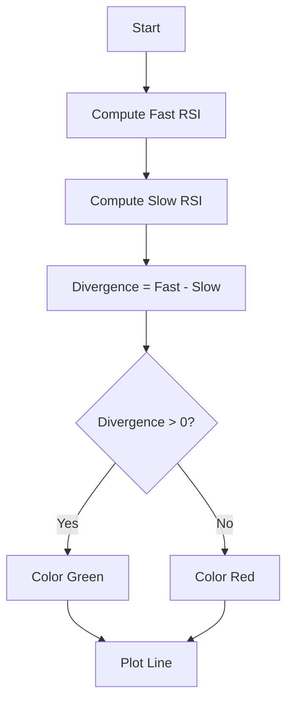

# RSI Divergence Indicator - Technical Guide

> Measures the difference between fast and slow RSI to visualize internal momentum shifts.

| | |
| --- | --- |
| **Language** | Indie Script v5 |
| **Platform** | [TakeProfit](https://takeprofit.com) |
| **Category** | Oscillators |
| **Type** | Indicator |
| **Author** | @chartjunkie on TakeProfit |
| **License** | MIT |
| **Live script** | [Open on TakeProfit](https://takeprofit.com/indicator/rsi-divergence-indicator-92) |
| **Source file** | [RSI Divergence Indicator.indie5](RSI%20Divergence%20Indicator.indie5) |

## Overview

This indicator computes the difference between a fast RSI and a slow RSI, producing a single oscillator line that reflects internal momentum changes. It is designed to help traders identify momentum shifts, trend transitions, and potential reversal zones earlier than traditional RSI signals. The indicator works on all markets and timeframes, commonly used on intraday charts as a momentum confirmation tool.

The oscillator line is color-coded: lime when the fast RSI is above the slow RSI (bullish momentum) and red when the fast RSI is below the slow RSI (bearish momentum). A zero line is drawn for reference, and crossovers of this line indicate a change in momentum direction.

## How it works

1. Compute the fast RSI over the user-defined period (default 5).
2. Compute the slow RSI over the user-defined period (default 14).
3. Subtract the slow RSI from the fast RSI to obtain the divergence value.
4. Color the line lime if the divergence is positive, red if negative.
5. Plot the colored line on the chart with a zero reference level.

## Mathematical model

$$
\text{Divergence} = \text{RSI}_{\text{fast}} - \text{RSI}_{\text{slow}}
$$

## Logic flow



## Parameters

| Parameter | Type | Default | Range | Description |
| --- | --- | --- | --- | --- |
| `len_fast` | int | 5 | ≥ 1 | Length Fast RSI |
| `len_slow` | int | 14 | ≥ 1 | Length Slow RSI |

## Code walkthrough

### Main function and parameters

Lines 10-10 of [RSI Divergence Indicator.indie5](RSI%20Divergence%20Indicator.indie5):

```python
def Main(self, len_fast, len_slow):
```

The Main function receives two integer parameters: len_fast and len_slow, which control the RSI periods. These are exposed in the settings UI via the @param.int decorators.

### RSI calculation and divergence

Lines 11-14 of [RSI Divergence Indicator.indie5](RSI%20Divergence%20Indicator.indie5):

```python
    rsi_fast = Rsi.new(self.close, len_fast)
    rsi_slow = Rsi.new(self.close, len_slow)
    
    divergence = rsi_fast[0] - rsi_slow[0]
```

Two RSI series are created using the built-in Rsi.new algorithm. The divergence is computed as the difference between the current fast RSI value (rsi_fast[0]) and the current slow RSI value (rsi_slow[0]). This subtraction isolates the relative momentum between the two timeframes.

### Color coding and plot output

Lines 16-18 of [RSI Divergence Indicator.indie5](RSI%20Divergence%20Indicator.indie5):

```python
    div_color = color.LIME if divergence > 0 else color.RED
    
    return plot.Line(divergence, color=div_color)
```

The divergence value is colored lime if positive, red otherwise. The colored line is returned as a plot.Line object, which is rendered on the chart. The zero level is drawn automatically via the @level decorator.

## Reading the chart

- **Positive values (lime line):** Fast RSI is above slow RSI, indicating bullish momentum.
- **Negative values (red line):** Fast RSI is below slow RSI, indicating bearish momentum.
- **Zero line crossover:** A change from positive to negative (or vice versa) signals a shift in momentum direction.
- **Line color** provides immediate visual feedback on the current momentum state.

## Implementation notes

- The RSI algorithm returns NaN until enough bars have elapsed (at least the RSI period). The divergence will also be NaN during that initial period.
- The color condition uses strict inequality (> 0), so a divergence of exactly zero is colored red.
- No smoothing or additional filtering is applied to the divergence line; it is the raw difference of two RSI values.
- The indicator does not repaint because it only uses current bar values (no lookahead).

## FAQ

**How do I change the RSI periods?**

Adjust the 'Length Fast RSI' and 'Length Slow RSI' parameters in the indicator settings. Defaults are 5 and 14 respectively.

**What does a zero line crossover mean?**

When the line crosses from positive to negative, fast RSI drops below slow RSI, suggesting bearish momentum. The opposite crossover suggests bullish momentum.

**Can I use this indicator on lower timeframes?**

Yes, the indicator works on any timeframe. However, the default periods may need adjustment for very short or very long timeframes to avoid excessive noise or lag.

## Full source code

Indie Script v5, as published on TakeProfit. Copy it into the platform's script editor or [open the live script](https://takeprofit.com/indicator/rsi-divergence-indicator-92).

```python
# indie:lang_version = 5
from indie import indicator, param, plot, color, level
from indie.algorithms import Rsi

@indicator('RSI Divergence')
@param.int('len_fast', default=5, min=1, title='Length Fast RSI')
@param.int('len_slow', default=14, min=1, title='Length Slow RSI')
@level(0, line_color=color.GRAY)
@plot.line(line_width=2, title='Divergence')
def Main(self, len_fast, len_slow):
    rsi_fast = Rsi.new(self.close, len_fast)
    rsi_slow = Rsi.new(self.close, len_slow)
    
    divergence = rsi_fast[0] - rsi_slow[0]
    
    div_color = color.LIME if divergence > 0 else color.RED
    
    return plot.Line(divergence, color=div_color)
```
