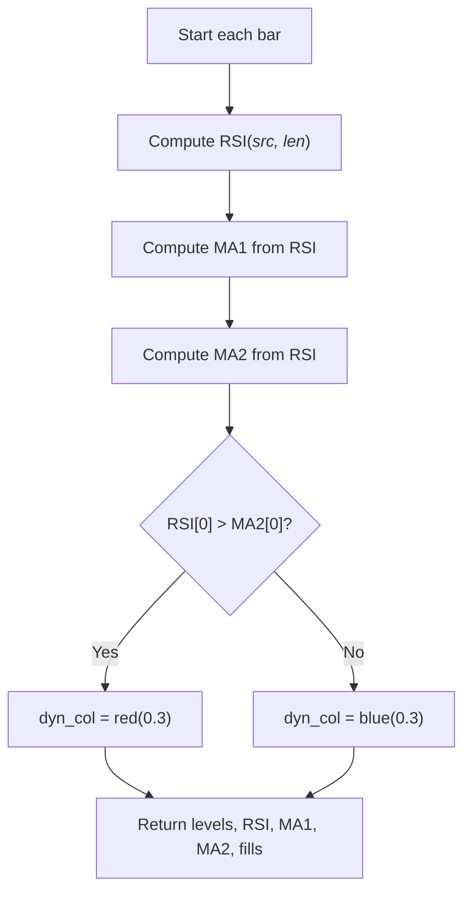

# RSI LacQuanTeu Pub - Technical Guide

> Computes RSI with two moving averages (default EMA9 and WMA45) and plots static overbought/oversold levels with colored fills.

| | |
| --- | --- |
| **Language** | Indie Script v5 |
| **Platform** | [TakeProfit](https://takeprofit.com) |
| **Category** | Oscillators |
| **Type** | Indicator |
| **Author** | @tam_mt on TakeProfit |
| **License** | licensed under the MIT License (see the header of the source file) |
| **Live script** | [Open on TakeProfit](https://takeprofit.com/indicator/rsi-lacquanteu-pub-43) |
| **Source file** | [RSI LacQuanTeu Pub.indie5](RSI%20LacQuanTeu%20Pub.indie5) |

## Overview

This indicator displays the classic RSI oscillator along with two moving averages applied to the RSI value itself. The first moving average (default EMA9) reacts quickly to RSI changes, while the second (default WMA45) provides a smoother longer-term view.

Seven horizontal level lines (20, 30, 33.3, 50, 66.6, 70, 80) mark conventional overbought/oversold territories and mid-line. A dynamic fill between the RSI and the second moving average colors the gap red when RSI is above its second MA and blue when below. Additional static fills highlight the 70–80 and 20–30 zones in yellow.

## How it works

1. Computes RSI from the selected price source using the platform's built-in RSI algorithm.
2. Calculates a first moving average (MA1) of the RSI using the chosen type and length (default EMA 9).
3. Calculates a second moving average (MA2) of the RSI using the chosen type and length (default WMA 45).
4. Determines the dynamic fill color: red if RSI[0] > MA2[0], blue otherwise.
5. Returns the seven static level values, the RSI value, both MA values, and three plot.Fill objects that control the fills between RSI & MA2, and the two horizontal zones.

## Mathematical model

$$
RSI = 100 - \frac{100}{1 + \frac{\text{average gain}}{\text{average loss}}}
$$

The moving averages follow standard definitions for SMA, EMA, SMMA (RMA), WMA, and VWMA as implemented by the platform's `Ma.new` function.

## Logic flow



## Parameters

| Parameter | Type | Default | Range | Description |
| --- | --- | --- | --- | --- |
| `rsi_length` | int | 14 | ≥ 1 | RSI Length |
| `src` | source | source.CLOSE |  | Source |
| `ma_length1` | int | 9 | ≥ 1 | MA-1 Length |
| `ma_length2` | int | 45 | ≥ 1 | MA-2 Length |

## Code walkthrough

### Computing the core series

Lines 40-42 of [RSI LacQuanTeu Pub.indie5](RSI%20LacQuanTeu%20Pub.indie5):

```python
    rsi = Rsi.new(src, rsi_length)
    ma1 = Ma.new(rsi, ma_length1, ma_type1)
    ma2 = Ma.new(rsi, ma_length2, ma_type2)
```

Lines 40–42 instantiate the RSI and both moving averages using the platform's built-in algorithms. The `.new()` call returns a series; the actual values are retrieved later with `[0]` for the current bar.

### Dynamic fill color logic

Lines 48-48 of [RSI LacQuanTeu Pub.indie5](RSI%20LacQuanTeu%20Pub.indie5):

```python
    dyn_col = color.rgba(255, 82, 82, 0.3) if rsi[0] > ma2[0] else color.rgba(0, 187, 212, 0.3)
```

Line 48 defines the fill color between the RSI line and the second MA. If RSI is above the MA, the fill becomes red (rgba 255,82,82,0.3); otherwise it turns blue (rgba 0,187,212,0.3). This helps visualise when RSI is trending above or below its slower average.

### Returning all plot values and fills

Lines 50-56 of [RSI LacQuanTeu Pub.indie5](RSI%20LacQuanTeu%20Pub.indie5):

```python
    return (
        v50, v80, v70, v66, v33, v30, v20,   # 5 đường level
        rsi[0], ma1[0], ma2[0],    # RSI + 2 MA
        plot.Fill(color=dyn_col),  # fill RSI vs WMA45
        plot.Fill(),               # fill l70-l80
        plot.Fill(),               # fill l20-l30
    )
```

The Main function returns a tuple that maps to the previously declared `@plot.line` and `@plot.fill` decorators. The first seven numbers are the horizontal levels, followed by the three dynamic series (RSI, MA1, MA2). The three `plot.Fill()` objects override the default fill colors: the first one applies the dynamic color, the other two use the colors from their respective decorators (yellow, semi-transparent).

## Reading the chart

- **RSI line** (aqua) oscillates between 0 and 100. Values above 70 are often considered overbought, below 30 oversold.
- **MA1** (green, thicker) and **MA2** (red, thicker) are moving averages of the RSI itself. Crossings of the RSI line through these MAs can indicate momentum shifts.
- **Horizontal levels** at 80, 70, 66.6, 50, 33.3, 30, 20 serve as reference zones. The 66.6 and 33.3 lines are blue; 80,70,30,20 are red; 50 is yellow. All are dotted.
- **Fills**: A dynamic fill between RSI and MA2 appears red when RSI > MA2 and blue when RSI < MA2. Two static yellow fills highlight the 70–80 and 20–30 bands.

## Implementation notes

- The moving average types are limited to the five choices listed in the parameters: SMA, EMA, SMMA (RMA), WMA, VWMA. The default for MA1 is EMA and for MA2 is WMA.
- The static levels (20,30,33.3,50,66.6,70,80) are hardcoded values and cannot be changed through parameters.
- The dynamic fill between RSI and MA2 is controlled by the condition `rsi[0] > ma2[0]`; no smoothing or delay is applied to the comparison.
- The `@plot.fill` decorators define the default fill colours, but the actual fill colour for the RSI-MA2 fill is overridden by the `plot.Fill(color=dyn_col)` returned in Main.

## FAQ

**How can I change the RSI length or the moving average lengths?**

Use the indicator settings panel: adjust 'RSI Length' (default 14), 'MA-1 Length' (default 9), and 'MA-2 Length' (default 45).

**Can I use a different type of moving average for MA1 or MA2?**

Yes. The parameters 'MA-1 Type' and 'MA-2 Type' offer SMA, EMA, SMMA (RMA), WMA, and VWMA. Select whichever you prefer.

**What does the coloured fill between RSI and the second moving average mean?**

The fill changes colour based on whether RSI is above (red) or below (blue) its second MA. It visually highlights when RSI is in a bullish vs. bearish position relative to its slower average.

## Full source code

Indie Script v5, as published on TakeProfit. Copy it into the platform's script editor or [open the live script](https://takeprofit.com/indicator/rsi-lacquanteu-pub-43).

```python
# Copyright (c) 2025 @tam_mt. All rights reserved.

# This work is licensed under the MIT License.
# For a copy, see <https://opensource.org/licenses/MIT>.

# indie:lang_version = 5
from indie import indicator, format, param, source, color, plot, line_style
from indie.algorithms import Rsi, Ma
from indie.plot import LineDisplayOptions

@indicator('RSI + Dual MA', format=format.PRICE)
@param.int('rsi_length', default=14, title='RSI Length', min=1)
@param.source('src', default=source.CLOSE, title='Source')
@param.str('ma_type1', default='EMA', title='MA-1 Type',
           options=['SMA','EMA','SMMA (RMA)','WMA','VWMA'])
@param.int('ma_length1', default=9, title='MA-1 Length', min=1)
@param.str('ma_type2', default='WMA', title='MA-2 Type',
           options=['SMA','EMA','SMMA (RMA)','WMA','VWMA'])
@param.int('ma_length2', default=45, title='MA-2 Length', min=1)

# --- các đường level (dạng line ngang, để fill được) ---
@plot.line(id="l50",  title="Level 50", color=color.YELLOW(0.8), line_style=line_style.DOTTED, display_options=plot.LineDisplayOptions(pane=True, status_line=False, price_label=False))
@plot.line(id="l80",  title="Level 80", color=color.RED(0.5), line_style=line_style.DOTTED, display_options=plot.LineDisplayOptions(pane=True, status_line=False, price_label=False))
@plot.line(id="l70",  title="Level 70", color=color.RED(0.5), line_style=line_style.DOTTED, display_options=plot.LineDisplayOptions(pane=True, status_line=False, price_label=False))
@plot.line(id="l66",  title="Level 66", color=color.BLUE(0.5), line_style=line_style.DOTTED, display_options=plot.LineDisplayOptions(pane=True, status_line=False, price_label=False))
@plot.line(id="l33",  title="Level 33", color=color.BLUE(0.5), line_style=line_style.DOTTED, display_options=plot.LineDisplayOptions(pane=True, status_line=False, price_label=False))
@plot.line(id="l30",  title="Level 30", color=color.RED(0.5), line_style=line_style.DOTTED, display_options=plot.LineDisplayOptions(pane=True, status_line=False, price_label=False))
@plot.line(id="l20",  title="Level 20", color=color.RED(0.5), line_style=line_style.DOTTED, display_options=plot.LineDisplayOptions(pane=True, status_line=False, price_label=False))

# --- đường RSI và 2 MA ---
@plot.line(id="rsi", color=color.AQUA,  title='RSI')
@plot.line(id="ma1", color=color.GREEN, line_width=2, title='EMA9', display_options=plot.LineDisplayOptions(pane=True, status_line=False, price_label=False))
@plot.line(id="ma2", color=color.RED, line_width=2, title='WMA45', display_options=plot.LineDisplayOptions(pane=True, status_line=False, price_label=False))

# --- fill ---
@plot.fill("rsi", "ma2")                                   # động giữa RSI & WMA45
@plot.fill("l70", "l80", color=color.rgba(255, 215, 0, 0.1))  # vàng giữa 70-80
@plot.fill("l20", "l30", color=color.rgba(255, 215, 0, 0.1))  # vàng giữa 20-30
def Main(self, rsi_length, src, ma_type1, ma_length1, ma_type2, ma_length2):
    rsi = Rsi.new(src, rsi_length)
    ma1 = Ma.new(rsi, ma_length1, ma_type1)
    ma2 = Ma.new(rsi, ma_length2, ma_type2)

    # giá trị cho các đường level ngang (giống @level nhưng chủ động)
    v50, v80, v70, v66, v33, v30, v20 = 50.0, 80.0, 70.0, 66.6, 33.3, 30.0, 20.0

    # dynamic fill giữa rsi và ma2
    dyn_col = color.rgba(255, 82, 82, 0.3) if rsi[0] > ma2[0] else color.rgba(0, 187, 212, 0.3)

    return (
        v50, v80, v70, v66, v33, v30, v20,   # 5 đường level
        rsi[0], ma1[0], ma2[0],    # RSI + 2 MA
        plot.Fill(color=dyn_col),  # fill RSI vs WMA45
        plot.Fill(),               # fill l70-l80
        plot.Fill(),               # fill l20-l30
    )
```
