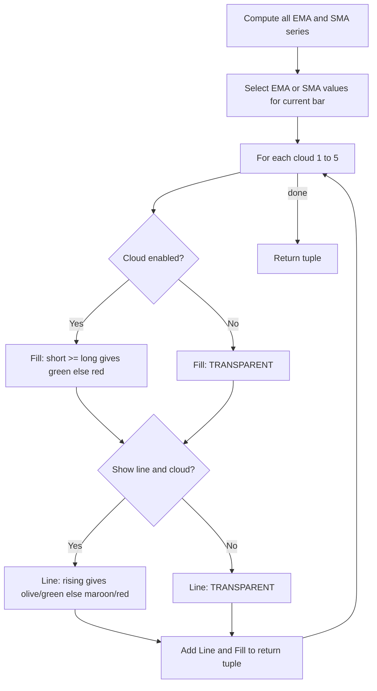

# Ripster EMA Clouds - Indie Port Guide

> Plots five pairs of short and long moving averages (EMA or SMA) with colored fills between them to visualize trend strength and direction.

| | |
| --- | --- |
| **Language** | Indie Script v5 |
| **Platform** | [TakeProfit](https://takeprofit.com) |
| **Category** | Moving averages |
| **Type** | Indicator, port from Pine Script |
| **Original** | Ripster EMA Clouds by ripster47 (Pine Script v4) |
| **License** | MPL-2.0 (see the header of the source files) |
| **Original source** | [Ripster EMA Clouds.pinescript4](Ripster%20EMA%20Clouds.pinescript4) |
| **Source file** | [Ripster EMA Clouds.indie5](Ripster%20EMA%20Clouds.indie5) |

## Overview

Ripster EMA Clouds is a trend visualization indicator that computes five pairs of short and long moving averages (either EMA or SMA) on a user-selected source. By comparing the short MA to the long MA, it gauges the strength and direction of the current trend. It is designed for traders who want to see multiple time‑frame relationships at a glance.

On the chart, each cloud pair is drawn as a filled area between the short and long MA lines. The fill color is greenish when the short MA is above or equal to the long MA (uptrend) and reddish when below (downtrend). Optionally, the MA lines themselves are displayed with colors that indicate whether each line is rising (olive for short, green for long) or falling (maroon for short, red for long).

## How it works

1. Compute both EMA and SMA series for all five cloud pairs using the user‑supplied lengths.
2. Select the current and previous values of either EMA or SMA based on the `matype` parameter.
3. For each cloud, determine the fill color: if the short MA is greater than or equal to the long MA, use a green‑based color; otherwise use a red‑based color. If the cloud is disabled, use transparent.
4. If line display is enabled, determine the line colors: the short MA line is olive if rising (current ≥ previous) else maroon; the long MA line is green if rising else red. If disabled or cloud hidden, use transparent.
5. Return the plot objects: for each cloud, a `Line` for the short MA, a `Line` for the long MA, and a `Fill` between them.

## Logic flow



## Parameters

| Parameter | Type | Default | Range | Description |
| --- | --- | --- | --- | --- |
| `matype` | str | EMA |  | MA Type: EMA/SMA |
| `src` | source | source.HL2 |  | Source |
| `len1s` | int | 8 | ≥ 1 | Cloud-1 Short Length |
| `len1l` | int | 9 | ≥ 1 | Cloud-1 Long Length |
| `len2s` | int | 5 | ≥ 1 | Cloud-2 Short Length |
| `len2l` | int | 12 | ≥ 1 | Cloud-2 Long Length |
| `len3s` | int | 34 | ≥ 1 | Cloud-3 Short Length |
| `len3l` | int | 50 | ≥ 1 | Cloud-3 Long Length |
| `len4s` | int | 72 | ≥ 1 | Cloud-4 Short Length |
| `len4l` | int | 89 | ≥ 1 | Cloud-4 Long Length |
| `len5s` | int | 180 | ≥ 1 | Cloud-5 Short Length |
| `len5l` | int | 200 | ≥ 1 | Cloud-5 Long Length |
| `show_line` | bool | false |  | Display MA Lines |
| `show1` | bool | true |  | Show Cloud-1 (8/9) |
| `show2` | bool | true |  | Show Cloud-2 (5/12) |
| `show3` | bool | true |  | Show Cloud-3 (34/50) |
| `show4` | bool | false |  | Show Cloud-4 (72/89) |
| `show5` | bool | false |  | Show Cloud-5 (180/200) |

## Code walkthrough

### Unconditional series computation

Lines 53-62 of [Ripster EMA Clouds.indie5](Ripster%20EMA%20Clouds.indie5):

```python
        e1s = Ema.new(src, len1s);  e1l = Ema.new(src, len1l)
        e2s = Ema.new(src, len2s);  e2l = Ema.new(src, len2l)
        e3s = Ema.new(src, len3s);  e3l = Ema.new(src, len3l)
        e4s = Ema.new(src, len4s);  e4l = Ema.new(src, len4l)
        e5s = Ema.new(src, len5s);  e5l = Ema.new(src, len5l)
        m1s = Sma.new(src, len1s);  m1l = Sma.new(src, len1l)
        m2s = Sma.new(src, len2s);  m2l = Sma.new(src, len2l)
        m3s = Sma.new(src, len3s);  m3l = Sma.new(src, len3l)
        m4s = Sma.new(src, len4s);  m4l = Sma.new(src, len4l)
        m5s = Sma.new(src, len5s);  m5l = Sma.new(src, len5l)
```

Both EMA and SMA series are computed for all five cloud pairs regardless of the `matype` setting. This is required by Indie because all series referenced in the return tuple must be called. The actual selection between EMA and SMA happens later.

### Selecting current and previous values

Lines 64-76 of [Ripster EMA Clouds.indie5](Ripster%20EMA%20Clouds.indie5):

```python
        use_ema: bool = matype.upper() != 'SMA'

        sv1: float = e1s[0] if use_ema else m1s[0];  lv1: float = e1l[0] if use_ema else m1l[0]
        sv2: float = e2s[0] if use_ema else m2s[0];  lv2: float = e2l[0] if use_ema else m2l[0]
        sv3: float = e3s[0] if use_ema else m3s[0];  lv3: float = e3l[0] if use_ema else m3l[0]
        sv4: float = e4s[0] if use_ema else m4s[0];  lv4: float = e4l[0] if use_ema else m4l[0]
        sv5: float = e5s[0] if use_ema else m5s[0];  lv5: float = e5l[0] if use_ema else m5l[0]

        sp1: float = e1s[1] if use_ema else m1s[1];  lp1: float = e1l[1] if use_ema else m1l[1]
        sp2: float = e2s[1] if use_ema else m2s[1];  lp2: float = e2l[1] if use_ema else m2l[1]
        sp3: float = e3s[1] if use_ema else m3s[1];  lp3: float = e3l[1] if use_ema else m3l[1]
        sp4: float = e4s[1] if use_ema else m4s[1];  lp4: float = e4l[1] if use_ema else m4l[1]
        sp5: float = e5s[1] if use_ema else m5s[1];  lp5: float = e5l[1] if use_ema else m5l[1]
```

The `matype` parameter determines whether EMA or SMA values are used. For each cloud, the current bar value (`[0]`) and previous bar value (`[1]`) are retrieved for both the short and long lengths. These are used for fill and line color decisions.

### Fill color logic

Lines 78-83 of [Ripster EMA Clouds.indie5](Ripster%20EMA%20Clouds.indie5):

```python
        # Fill colors (Pine transparency 45->alpha 0.55, 65->0.35, 70->0.30)
        fill1 = (color.rgba(3, 97, 3, 0.55)    if sv1 >= lv1 else color.rgba(136, 14, 79, 0.55))  if show1 else color.TRANSPARENT
        fill2 = (color.rgba(76, 175, 80, 0.35)  if sv2 >= lv2 else color.rgba(244, 67, 54, 0.35))  if show2 else color.TRANSPARENT
        fill3 = (color.rgba(33, 150, 243, 0.30) if sv3 >= lv3 else color.rgba(255, 183, 77, 0.30)) if show3 else color.TRANSPARENT
        fill4 = (color.rgba(0, 150, 136, 0.35)  if sv4 >= lv4 else color.rgba(240, 98, 146, 0.35)) if show4 else color.TRANSPARENT
        fill5 = (color.rgba(5, 190, 213, 0.35)  if sv5 >= lv5 else color.rgba(230, 81, 0, 0.35))   if show5 else color.TRANSPARENT
```

For each cloud, the fill color is greenish if the short MA is greater than or equal to the long MA, and reddish otherwise. The transparency values (0.55, 0.35, 0.30) are mapped from the original Pine Script (45→0.55, 65→0.35, 70→0.30). If a cloud is disabled, the fill is set to `color.TRANSPARENT`.

### Line color logic

Lines 86-99 of [Ripster EMA Clouds.indie5](Ripster%20EMA%20Clouds.indie5):

```python
        olive  = color.rgba(128, 128, 0, 1.0)
        maroon = color.rgba(128, 0,   0, 1.0)
        trans  = color.TRANSPARENT

        sc1 = (olive if (not isnan(sp1) and sv1 >= sp1) else maroon) if (show_line and show1) else trans
        lc1 = (color.GREEN if (not isnan(lp1) and lv1 >= lp1) else color.RED) if (show_line and show1) else trans
        sc2 = (olive if (not isnan(sp2) and sv2 >= sp2) else maroon) if (show_line and show2) else trans
        lc2 = (color.GREEN if (not isnan(lp2) and lv2 >= lp2) else color.RED) if (show_line and show2) else trans
        sc3 = (olive if (not isnan(sp3) and sv3 >= sp3) else maroon) if (show_line and show3) else trans
        lc3 = (color.GREEN if (not isnan(lp3) and lv3 >= lp3) else color.RED) if (show_line and show3) else trans
        sc4 = (olive if (not isnan(sp4) and sv4 >= sp4) else maroon) if (show_line and show4) else trans
        lc4 = (color.GREEN if (not isnan(lp4) and lv4 >= lp4) else color.RED) if (show_line and show4) else trans
        sc5 = (olive if (not isnan(sp5) and sv5 >= sp5) else maroon) if (show_line and show5) else trans
        lc5 = (color.GREEN if (not isnan(lp5) and lv5 >= lp5) else color.RED) if (show_line and show5) else trans
```

When line display is enabled and the cloud is visible, the short MA line color is olive if rising (current ≥ previous) and maroon if falling. The long MA line is green if rising and red if falling. The `isnan` check prevents using the previous value when it is not available (e.g., first bar), defaulting to the falling color.

### Return tuple of plot objects

Lines 108-124 of [Ripster EMA Clouds.indie5](Ripster%20EMA%20Clouds.indie5):

```python
        return (
            plot.Line(s1v, color=sc1),
            plot.Line(l1v, color=lc1),
            plot.Fill(fill1),
            plot.Line(s2v, color=sc2),
            plot.Line(l2v, color=lc2),
            plot.Fill(fill2),
            plot.Line(s3v, color=sc3),
            plot.Line(l3v, color=lc3),
            plot.Fill(fill3),
            plot.Line(s4v, color=sc4),
            plot.Line(l4v, color=lc4),
            plot.Fill(fill4),
            plot.Line(s5v, color=sc5),
            plot.Line(l5v, color=lc5),
            plot.Fill(fill5),
        )
```

The function returns a tuple containing a `plot.Line` for the short MA, a `plot.Line` for the long MA, and a `plot.Fill` for each cloud. The colors for lines and fills are computed earlier. If a cloud is disabled, its values are set to `nan` so nothing is drawn.

## Reading the chart

- Each cloud is a filled area between a short and long moving average.
- Fill color: greenish when short MA ≥ long MA (uptrend), reddish when short MA < long MA (downtrend).
- If a cloud is disabled, no fill is drawn.
- When line display is enabled, the short MA line is olive when rising (current ≥ previous) and maroon when falling.
- The long MA line is green when rising and red when falling.
- If line display is disabled or cloud hidden, lines are transparent.

## Implementation notes

- All EMA and SMA series are computed unconditionally on every bar; the `matype` parameter only selects which values are used for plotting.
- The previous bar value (`[1]`) is used for line color direction; if it is NaN (e.g., first bar), the line defaults to the falling color.
- Fill colors use fixed transparency values (0.55, 0.35, 0.30) mapped from the original Pine Script (45→0.55, 65→0.35, 70→0.30).
- The `show_line` parameter controls line visibility independently of cloud visibility; lines only appear when both `show_line` and the respective cloud toggle are true.

## Port notes

Differences and decisions in the Indie port of the Pine Script v4 original (taken from the header of [Ripster EMA Clouds.indie5](Ripster%20EMA%20Clouds.indie5)):

- offset= parameter not supported in @plot.line; default=0 so no visual difference
- alertcondition() — no Indie equivalent
- Both EMA and SMA series called unconditionally; selection via matype param
- Dynamic fill and line colors computed per-bar

The plotted series of the port were compared bar by bar with the original script running on the same candles, and the compared series matched.

## FAQ

**How do I change the moving average type from EMA to SMA?**

Set the `matype` parameter to "SMA". The default is "EMA".

**Can I display only some of the clouds?**

Yes, each cloud has a separate boolean parameter (`show1` through `show5`). Disabling a cloud hides both its fill and lines.

**What do the line colors indicate?**

When line display is enabled, the short MA line is olive if rising and maroon if falling; the long MA line is green if rising and red if falling. Rising means the current value is greater than or equal to the previous bar's value.

## Full source code

Indie Script v5. Copy it into the platform's script editor. The original Pine Script is published next to it as [Ripster EMA Clouds.pinescript4](Ripster%20EMA%20Clouds.pinescript4).

```python
# indie:lang_version = 5
# Ripster EMA Clouds — Indie port
# Original Pine Script by ripster47 (© ripster47)
# License: Mozilla Public License 2.0
# Migration notes:
#   offset= parameter not supported in @plot.line; default=0 so no visual difference
#   alertcondition() — no Indie equivalent
#   Both EMA and SMA series called unconditionally; selection via matype param
#   Dynamic fill and line colors computed per-bar

from math import nan, isnan
from indie import indicator, param, plot, MainContext, color, source
from indie.algorithms import Ema, Sma

@indicator('Ripster EMA Clouds', overlay_main_pane=True)
@param.str('matype',   default='EMA',  title='MA Type: EMA/SMA')
@param.source('src',   default=source.HL2, title='Source')
@param.int('len1s',  default=8,   min=1, title='Cloud-1 Short Length')
@param.int('len1l',  default=9,   min=1, title='Cloud-1 Long Length')
@param.int('len2s',  default=5,   min=1, title='Cloud-2 Short Length')
@param.int('len2l',  default=12,  min=1, title='Cloud-2 Long Length')
@param.int('len3s',  default=34,  min=1, title='Cloud-3 Short Length')
@param.int('len3l',  default=50,  min=1, title='Cloud-3 Long Length')
@param.int('len4s',  default=72,  min=1, title='Cloud-4 Short Length')
@param.int('len4l',  default=89,  min=1, title='Cloud-4 Long Length')
@param.int('len5s',  default=180, min=1, title='Cloud-5 Short Length')
@param.int('len5l',  default=200, min=1, title='Cloud-5 Long Length')
@param.bool('show_line', default=False, title='Display MA Lines')
@param.bool('show1', default=True,  title='Show Cloud-1 (8/9)')
@param.bool('show2', default=True,  title='Show Cloud-2 (5/12)')
@param.bool('show3', default=True,  title='Show Cloud-3 (34/50)')
@param.bool('show4', default=False, title='Show Cloud-4 (72/89)')
@param.bool('show5', default=False, title='Show Cloud-5 (180/200)')
@plot.line('s1', color=color.rgba(3,  97,  3,   1.0), line_width=1, title='Short MA1')
@plot.line('l1', color=color.rgba(3,  97,  3,   1.0), line_width=2, title='Long MA1')
@plot.fill('s1', 'l1', id='cloud1')
@plot.line('s2', color=color.rgba(76, 175, 80,  1.0), line_width=1, title='Short MA2')
@plot.line('l2', color=color.rgba(76, 175, 80,  1.0), line_width=2, title='Long MA2')
@plot.fill('s2', 'l2', id='cloud2')
@plot.line('s3', color=color.rgba(33, 150, 243, 1.0), line_width=1, title='Short MA3')
@plot.line('l3', color=color.rgba(33, 150, 243, 1.0), line_width=2, title='Long MA3')
@plot.fill('s3', 'l3', id='cloud3')
@plot.line('s4', color=color.rgba(0,  150, 136, 1.0), line_width=1, title='Short MA4')
@plot.line('l4', color=color.rgba(0,  150, 136, 1.0), line_width=2, title='Long MA4')
@plot.fill('s4', 'l4', id='cloud4')
@plot.line('s5', color=color.rgba(5,  190, 213, 1.0), line_width=1, title='Short MA5')
@plot.line('l5', color=color.rgba(5,  190, 213, 1.0), line_width=2, title='Long MA5')
@plot.fill('s5', 'l5', id='cloud5')
class Main(MainContext):
    def calc(self, matype, src, len1s, len1l, len2s, len2l, len3s, len3l, len4s, len4l, len5s, len5l,
             show_line, show1, show2, show3, show4, show5):
        # All series computed unconditionally (Indie requirement)
        e1s = Ema.new(src, len1s);  e1l = Ema.new(src, len1l)
        e2s = Ema.new(src, len2s);  e2l = Ema.new(src, len2l)
        e3s = Ema.new(src, len3s);  e3l = Ema.new(src, len3l)
        e4s = Ema.new(src, len4s);  e4l = Ema.new(src, len4l)
        e5s = Ema.new(src, len5s);  e5l = Ema.new(src, len5l)
        m1s = Sma.new(src, len1s);  m1l = Sma.new(src, len1l)
        m2s = Sma.new(src, len2s);  m2l = Sma.new(src, len2l)
        m3s = Sma.new(src, len3s);  m3l = Sma.new(src, len3l)
        m4s = Sma.new(src, len4s);  m4l = Sma.new(src, len4l)
        m5s = Sma.new(src, len5s);  m5l = Sma.new(src, len5l)

        use_ema: bool = matype.upper() != 'SMA'

        sv1: float = e1s[0] if use_ema else m1s[0];  lv1: float = e1l[0] if use_ema else m1l[0]
        sv2: float = e2s[0] if use_ema else m2s[0];  lv2: float = e2l[0] if use_ema else m2l[0]
        sv3: float = e3s[0] if use_ema else m3s[0];  lv3: float = e3l[0] if use_ema else m3l[0]
        sv4: float = e4s[0] if use_ema else m4s[0];  lv4: float = e4l[0] if use_ema else m4l[0]
        sv5: float = e5s[0] if use_ema else m5s[0];  lv5: float = e5l[0] if use_ema else m5l[0]

        sp1: float = e1s[1] if use_ema else m1s[1];  lp1: float = e1l[1] if use_ema else m1l[1]
        sp2: float = e2s[1] if use_ema else m2s[1];  lp2: float = e2l[1] if use_ema else m2l[1]
        sp3: float = e3s[1] if use_ema else m3s[1];  lp3: float = e3l[1] if use_ema else m3l[1]
        sp4: float = e4s[1] if use_ema else m4s[1];  lp4: float = e4l[1] if use_ema else m4l[1]
        sp5: float = e5s[1] if use_ema else m5s[1];  lp5: float = e5l[1] if use_ema else m5l[1]

        # Fill colors (Pine transparency 45->alpha 0.55, 65->0.35, 70->0.30)
        fill1 = (color.rgba(3, 97, 3, 0.55)    if sv1 >= lv1 else color.rgba(136, 14, 79, 0.55))  if show1 else color.TRANSPARENT
        fill2 = (color.rgba(76, 175, 80, 0.35)  if sv2 >= lv2 else color.rgba(244, 67, 54, 0.35))  if show2 else color.TRANSPARENT
        fill3 = (color.rgba(33, 150, 243, 0.30) if sv3 >= lv3 else color.rgba(255, 183, 77, 0.30)) if show3 else color.TRANSPARENT
        fill4 = (color.rgba(0, 150, 136, 0.35)  if sv4 >= lv4 else color.rgba(240, 98, 146, 0.35)) if show4 else color.TRANSPARENT
        fill5 = (color.rgba(5, 190, 213, 0.35)  if sv5 >= lv5 else color.rgba(230, 81, 0, 0.35))   if show5 else color.TRANSPARENT

        # Line colors: olive=rising/maroon=falling for short; green=rising/red=falling for long
        olive  = color.rgba(128, 128, 0, 1.0)
        maroon = color.rgba(128, 0,   0, 1.0)
        trans  = color.TRANSPARENT

        sc1 = (olive if (not isnan(sp1) and sv1 >= sp1) else maroon) if (show_line and show1) else trans
        lc1 = (color.GREEN if (not isnan(lp1) and lv1 >= lp1) else color.RED) if (show_line and show1) else trans
        sc2 = (olive if (not isnan(sp2) and sv2 >= sp2) else maroon) if (show_line and show2) else trans
        lc2 = (color.GREEN if (not isnan(lp2) and lv2 >= lp2) else color.RED) if (show_line and show2) else trans
        sc3 = (olive if (not isnan(sp3) and sv3 >= sp3) else maroon) if (show_line and show3) else trans
        lc3 = (color.GREEN if (not isnan(lp3) and lv3 >= lp3) else color.RED) if (show_line and show3) else trans
        sc4 = (olive if (not isnan(sp4) and sv4 >= sp4) else maroon) if (show_line and show4) else trans
        lc4 = (color.GREEN if (not isnan(lp4) and lv4 >= lp4) else color.RED) if (show_line and show4) else trans
        sc5 = (olive if (not isnan(sp5) and sv5 >= sp5) else maroon) if (show_line and show5) else trans
        lc5 = (color.GREEN if (not isnan(lp5) and lv5 >= lp5) else color.RED) if (show_line and show5) else trans

        # Plot values: nan when cloud disabled
        s1v: float = sv1 if show1 else nan;  l1v: float = lv1 if show1 else nan
        s2v: float = sv2 if show2 else nan;  l2v: float = lv2 if show2 else nan
        s3v: float = sv3 if show3 else nan;  l3v: float = lv3 if show3 else nan
        s4v: float = sv4 if show4 else nan;  l4v: float = lv4 if show4 else nan
        s5v: float = sv5 if show5 else nan;  l5v: float = lv5 if show5 else nan

        return (
            plot.Line(s1v, color=sc1),
            plot.Line(l1v, color=lc1),
            plot.Fill(fill1),
            plot.Line(s2v, color=sc2),
            plot.Line(l2v, color=lc2),
            plot.Fill(fill2),
            plot.Line(s3v, color=sc3),
            plot.Line(l3v, color=lc3),
            plot.Fill(fill3),
            plot.Line(s4v, color=sc4),
            plot.Line(l4v, color=lc4),
            plot.Fill(fill4),
            plot.Line(s5v, color=sc5),
            plot.Line(l5v, color=lc5),
            plot.Fill(fill5),
        )
```
