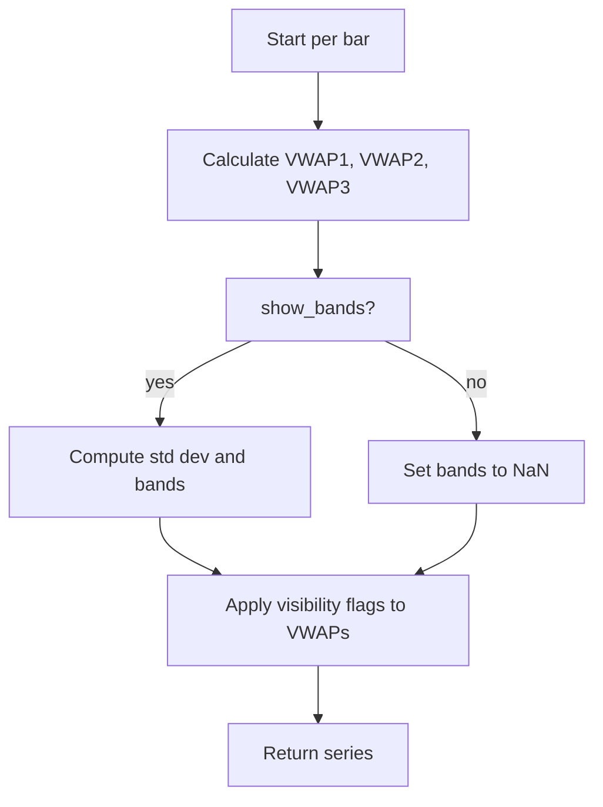

# RollingWVAP - Technical Guide

> Computes up to three rolling volume-weighted average price (VWAP) lines with optional standard deviation bands.

| | |
| --- | --- |
| **Language** | Indie Script v5 |
| **Platform** | [TakeProfit](https://takeprofit.com) |
| **Category** | Volume |
| **Type** | Indicator |
| **Author** | @USERNAME_NOT_SET on TakeProfit |
| **License** | MIT |
| **Live script** | [Open on TakeProfit](https://takeprofit.com/indicator/rollingwvap-1) |
| **Source file** | [RollingWVAP.indie5](RollingWVAP.indie5) |

## Overview

The Rolling VWAP indicator calculates the volume-weighted average price over user-defined rolling periods. Unlike a simple moving average, VWAP weights each price by the volume traded at that price, giving more influence to price levels where significant volume occurred. This makes it useful for identifying value areas or support/resistance levels based on volume.

The indicator can display up to three VWAP lines (blue, orange, purple) for different periods (default 14, 21, 50). Optionally, it can show upper and lower bands (red lines with a translucent red fill) calculated as the primary VWAP (period 1) plus/minus a user-specified number of standard deviations of price deviations from that VWAP. This band helps visualize the dispersion of prices around the volume-weighted average.

## How it works

1. For each of the three periods, compute the sum of (price × volume) and the sum of volume over the last N bars.
2. If the volume sum is positive, VWAP = weighted sum / volume sum; otherwise fall back to the current price of the source series.
3. Calculate the sample standard deviation of price deviations from the primary VWAP (period 1) over the same rolling window.
4. Multiply the standard deviation by the user-defined multiplier (std_dev) and add/subtract from the primary VWAP to obtain upper and lower bands.
5. If show_bands is false, set both band series to NaN (not plotted).
6. If any individual VWAP visibility toggle is off, set that series to NaN after band calculations.
7. Return a tuple of five series and a fill object for plotting.

## Mathematical model

$$
\text{VWAP} = \frac{\sum_{i=0}^{N-1} P_i \cdot V_i}{\sum_{i=0}^{N-1} V_i}
$$

$$
\sigma = \sqrt{\frac{1}{n-1} \sum_{i=0}^{n-1} (P_i - \text{VWAP})^2}
$$

$$
\text{Upper} = \text{VWAP} + k \sigma, \quad \text{Lower} = \text{VWAP} - k \sigma
$$

## Logic flow



## Parameters

| Parameter | Type | Default | Range | Description |
| --- | --- | --- | --- | --- |
| `period_1` | int | 14 | 7 - 365 | VWAP Period 1 |
| `show_vwap_1` | bool | true |  | Show VWAP 1 |
| `period_2` | int | 21 | 7 - 365 | VWAP Period 2 |
| `show_vwap_2` | bool | true |  | Show VWAP 2 |
| `period_3` | int | 50 | 7 - 365 | VWAP Period 3 |
| `show_vwap_3` | bool | false |  | Show VWAP 3 |
| `src` | source | source.CLOSE |  | Source |
| `std_dev` | float | 2.0 | 0.1 - 5.0 | StdDev Band |
| `show_bands` | bool | true |  | Show Bands |

## Code walkthrough

### Parameter and plot decorators

Lines 5-20 of [RollingWVAP.indie5](RollingWVAP.indie5):

```python
@indicator('Rolling VWAP', overlay_main_pane=True)
@param.int('period_1', default=14, min=7, max=365, title='VWAP Period 1')
@param.bool('show_vwap_1', default=True, title='Show VWAP 1')
@param.int('period_2', default=21, min=7, max=365, title='VWAP Period 2')
@param.bool('show_vwap_2', default=True, title='Show VWAP 2')
@param.int('period_3', default=50, min=7, max=365, title='VWAP Period 3')
@param.bool('show_vwap_3', default=False, title='Show VWAP 3')
@param.source('src', default=source.CLOSE, title='Source')
@param.float('std_dev', default=2.0, min=0.1, max=5.0, title='StdDev Band')
@param.bool('show_bands', default=True, title='Show Bands')
@plot.line('vwap_1', color=color.BLUE, line_width=2, title='VWAP 1')
@plot.line('vwap_2', color=color.ORANGE, line_width=2, title='VWAP 2')
@plot.line('vwap_3', color=color.PURPLE, line_width=2, title='VWAP 3')
@plot.line('upper_band', color=color.RED, title='Upper Band')
@plot.line('lower_band', color=color.RED, title='Lower Band')
@plot.fill('upper_band', 'lower_band', color=color.RED(0.05))
```

The @indicator decorator sets the display name and overlay mode. @param decorators define user-configurable settings: three periods with visibility toggles, source price, standard deviation multiplier, and band toggle. @plot decorators declare the output series with colors and line widths; the @plot.fill creates a translucent fill between the upper and lower bands.

### VWAP calculation (_calculate_vwap)

Lines 57-75 of [RollingWVAP.indie5](RollingWVAP.indie5):

```python
    def _calculate_vwap(self, src: SeriesF, period: int) -> float:
        # Calculate volume-weighted sum and volume sum for the period
        pv_sum = 0.0  # price * volume sum
        v_sum = 0.0   # volume sum
        
        # Sum over the rolling period
        i = 0
        while i < period and i < self.bar_count:
            price = src[i]
            volume = self.volume[i]
            if not isnan(price) and not isnan(volume):
                pv_sum = pv_sum + (price * volume)
                v_sum = v_sum + volume
            i = i + 1
        
        # Calculate VWAP
        if v_sum > 0.0:
            return pv_sum / v_sum
        return src[0]  # fallback
```

This method loops over the last `period` bars (or up to `bar_count`), accumulating price*volume and volume. It uses `self.volume`, a built-in series for volume. If the total volume is zero, it falls back to the current price (`src[0]`) to avoid division by zero. The result is a single float for the current bar.

### Standard deviation calculation (_calculate_std_dev)

Lines 77-96 of [RollingWVAP.indie5](RollingWVAP.indie5):

```python
    def _calculate_std_dev(self, src: SeriesF, vwap_value: float, period: int) -> float:
        # Calculate standard deviation of price deviations from VWAP
        deviation_sum = 0.0
        valid_count = 0
        
        # Calculate variance manually for the rolling period
        j = 0
        while j < period and j < self.bar_count:
            price = src[j]
            if not isnan(price):
                deviation = price - vwap_value
                deviation_sum = deviation_sum + (deviation * deviation)
                valid_count = valid_count + 1
            j = j + 1
        
        # Calculate standard deviation
        if valid_count > 1:
            variance = deviation_sum / float(valid_count - 1)
            return variance ** 0.5
        return 0.0
```

This method computes the sample standard deviation of price deviations from the given VWAP value over the same rolling window. It sums squared deviations and divides by `valid_count - 1` (Bessel's correction). If fewer than two valid prices exist, it returns 0.0 to avoid division by zero.

### Band construction and visibility toggles

Lines 38-55 of [RollingWVAP.indie5](RollingWVAP.indie5):

```python
        if show_bands:
            std_dev_value = self._calculate_std_dev(src, primary_vwap, period_1)
            if not isnan(std_dev_value):
                upper_band = primary_vwap + (std_dev_value * std_dev)
                lower_band = primary_vwap - (std_dev_value * std_dev)
        else:
            upper_band = nan
            lower_band = nan
        
        # Hide VWAPs if disabled
        if not show_vwap_1:
            vwap_1 = nan
        if not show_vwap_2:
            vwap_2 = nan
        if not show_vwap_3:
            vwap_3 = nan
        
        return (vwap_1, vwap_2, vwap_3, upper_band, lower_band, plot.Fill())
```

If `show_bands` is true, the standard deviation is multiplied by the user's `std_dev` parameter and added/subtracted from the primary VWAP to form bands. Otherwise, bands are set to NaN. Similarly, each VWAP series is set to NaN if its visibility toggle is off. The method returns a tuple matching the plot decorators, including a `plot.Fill()` instance for the fill.

## Reading the chart

- **Blue line (VWAP 1)**: Volume-weighted average price for the shortest period (default 14).
- **Orange line (VWAP 2)**: VWAP for the medium period (default 21).
- **Purple line (VWAP 3)**: VWAP for the longest period (default 50, hidden by default).
- **Red lines (Upper/Lower Band)**: Boundaries set at primary VWAP ± (std_dev × σ). The area between them is filled with translucent red.
- When a VWAP visibility toggle is off, that line is not drawn. When bands are disabled, only the VWAP lines appear.

## Implementation notes

- The indicator relies on `self.volume`, which must be available in the charting context (e.g., from volume data).
- If volume sum is zero for a period, VWAP falls back to the current price (`src[0]`), which may cause sudden jumps.
- Standard deviation uses sample formula (n-1 denominator); with only one valid price it returns 0.0.
- Bands are always based on the primary VWAP (period 1), regardless of whether VWAP 1 is visible.

## FAQ

**How is VWAP different from a simple moving average?**

VWAP weights each price by the volume traded at that price, so periods with higher volume have more influence on the average. This gives a better sense of the 'typical' price where most trading occurred.

**What does the StdDev Band parameter do?**

It multiplies the calculated standard deviation of price deviations from the primary VWAP. A higher value widens the bands, making them more inclusive of price variation. The default is 2.0, corresponding to approximately two standard deviations.

**Can I use a different source than Close price?**

Yes, the 'Source' parameter lets you choose any available price series (e.g., Open, High, Low, Close). The VWAP will be computed using that price and the volume data.

## Full source code

Indie Script v5, as published on TakeProfit. Copy it into the platform's script editor or [open the live script](https://takeprofit.com/indicator/rollingwvap-1).

```python
# indie:lang_version = 5
from indie import indicator, MainContext, param, source, color, plot, MutSeriesF, SeriesF
from math import isnan, nan

@indicator('Rolling VWAP', overlay_main_pane=True)
@param.int('period_1', default=14, min=7, max=365, title='VWAP Period 1')
@param.bool('show_vwap_1', default=True, title='Show VWAP 1')
@param.int('period_2', default=21, min=7, max=365, title='VWAP Period 2')
@param.bool('show_vwap_2', default=True, title='Show VWAP 2')
@param.int('period_3', default=50, min=7, max=365, title='VWAP Period 3')
@param.bool('show_vwap_3', default=False, title='Show VWAP 3')
@param.source('src', default=source.CLOSE, title='Source')
@param.float('std_dev', default=2.0, min=0.1, max=5.0, title='StdDev Band')
@param.bool('show_bands', default=True, title='Show Bands')
@plot.line('vwap_1', color=color.BLUE, line_width=2, title='VWAP 1')
@plot.line('vwap_2', color=color.ORANGE, line_width=2, title='VWAP 2')
@plot.line('vwap_3', color=color.PURPLE, line_width=2, title='VWAP 3')
@plot.line('upper_band', color=color.RED, title='Upper Band')
@plot.line('lower_band', color=color.RED, title='Lower Band')
@plot.fill('upper_band', 'lower_band', color=color.RED(0.05))
class Main(MainContext):
    def __init__(self, period_1, show_vwap_1, period_2, show_vwap_2, period_3, show_vwap_3, src, std_dev, show_bands):
        pass
        
    def calc(self, period_1, show_vwap_1, period_2, show_vwap_2, period_3, show_vwap_3, src, std_dev, show_bands):
        # Calculate VWAP for each period
        vwap_1 = self._calculate_vwap(src, period_1)
        vwap_2 = self._calculate_vwap(src, period_2)
        vwap_3 = self._calculate_vwap(src, period_3)
        
        # Use the first VWAP for band calculations (shortest period typically)
        primary_vwap = vwap_1
        
        # Calculate standard deviation bands based on primary VWAP
        upper_band = primary_vwap
        lower_band = primary_vwap
        
        if show_bands:
            std_dev_value = self._calculate_std_dev(src, primary_vwap, period_1)
            if not isnan(std_dev_value):
                upper_band = primary_vwap + (std_dev_value * std_dev)
                lower_band = primary_vwap - (std_dev_value * std_dev)
        else:
            upper_band = nan
            lower_band = nan
        
        # Hide VWAPs if disabled
        if not show_vwap_1:
            vwap_1 = nan
        if not show_vwap_2:
            vwap_2 = nan
        if not show_vwap_3:
            vwap_3 = nan
        
        return (vwap_1, vwap_2, vwap_3, upper_band, lower_band, plot.Fill())
    
    def _calculate_vwap(self, src: SeriesF, period: int) -> float:
        # Calculate volume-weighted sum and volume sum for the period
        pv_sum = 0.0  # price * volume sum
        v_sum = 0.0   # volume sum
        
        # Sum over the rolling period
        i = 0
        while i < period and i < self.bar_count:
            price = src[i]
            volume = self.volume[i]
            if not isnan(price) and not isnan(volume):
                pv_sum = pv_sum + (price * volume)
                v_sum = v_sum + volume
            i = i + 1
        
        # Calculate VWAP
        if v_sum > 0.0:
            return pv_sum / v_sum
        return src[0]  # fallback
    
    def _calculate_std_dev(self, src: SeriesF, vwap_value: float, period: int) -> float:
        # Calculate standard deviation of price deviations from VWAP
        deviation_sum = 0.0
        valid_count = 0
        
        # Calculate variance manually for the rolling period
        j = 0
        while j < period and j < self.bar_count:
            price = src[j]
            if not isnan(price):
                deviation = price - vwap_value
                deviation_sum = deviation_sum + (deviation * deviation)
                valid_count = valid_count + 1
            j = j + 1
        
        # Calculate standard deviation
        if valid_count > 1:
            variance = deviation_sum / float(valid_count - 1)
            return variance ** 0.5
        return 0.0
```
