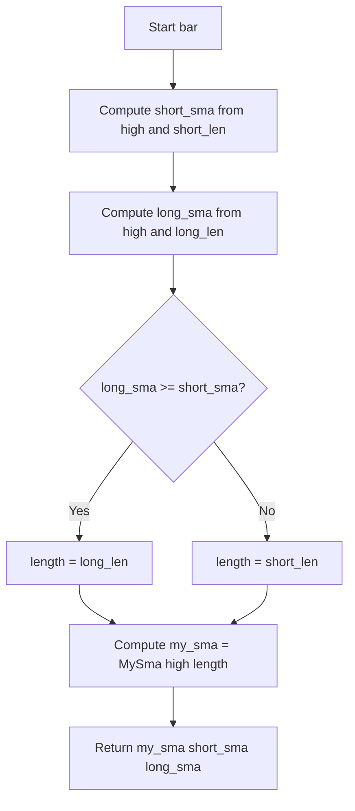

# SMA algorithm that accepts 'series' length - Technical Guide

> Computes an SMA whose length switches between two user parameters based on comparing short and long SMAs of high.

| | |
| --- | --- |
| **Language** | Indie Script v5 |
| **Platform** | [TakeProfit](https://takeprofit.com) |
| **Category** | Moving averages |
| **Type** | Indicator |
| **Author** | @TakeProfit on TakeProfit |
| **License** | MIT |
| **Live script** | [Open on TakeProfit](https://takeprofit.com/indicator/sma-algorithm-that-accepts-series-length-29) |
| **Source file** | [SMA algorithm that accepts 'series' length.indie5](SMA%20algorithm%20that%20accepts%20'series'%20length.indie5) |

## Overview

This indicator demonstrates a custom SMA algorithm that accepts a length value which can change from bar to bar. It is an educational example of writing algorithms with `@algorithm` and using `MutSeriesF` to return series from custom functions.

The main pane overlay draws three lines: a blue variable-length SMA, a red short SMA, and a green long SMA. The blue line uses the long length when the long SMA is greater than or equal to the short SMA, otherwise it uses the short length.

## How it works

1. Define `MySum` using `CumSum.new(src)` and return `cs[0] - cs[length]` as a `MutSeriesF`.
2. Define `MySma` by calling `MySum.new(src, length)` and dividing the result by `length`.
3. In `Main`, compute reference `short_sma` and `long_sma` with the built-in `Sma.new(self.high, ...)`.
4. Choose `length = short_len` initially, then set `length = long_len` when `long_sma[0] >= short_sma[0]`.
5. Compute `MySma.new(self.high, length)[0]` with the chosen length.
6. Return the variable-length SMA, the short SMA, and the long SMA for plotting.

## Mathematical model

$$
\text{MySum}_t(L) = C_t - C_{t-L}, \quad C_t = \text{CumSum}(\text{src})_t
$$

$$
\text{MySma}_t(L) = \frac{\text{MySum}_t(L)}{L}
$$

$$
L_t = \text{long\_len} \text{ if } \text{Sma}_t(\text{long\_len}) \ge \text{Sma}_t(\text{short\_len}), \text{ otherwise } \text{short\_len}
$$

## Logic flow



## Parameters

| Parameter | Type | Default | Range | Description |
| --- | --- | --- | --- | --- |
| `short_len` | int | 12 |  |  |
| `long_len` | int | 24 |  |  |

## Code walkthrough

### Custom sum and SMA algorithms

Lines 8-17 of [SMA algorithm that accepts 'series' length.indie5](SMA%20algorithm%20that%20accepts%20'series'%20length.indie5):

```python
@algorithm
def MySum(self, src: SeriesF, length: int) -> SeriesF:
    cs = CumSum.new(src)
    return MutSeriesF.new(cs[0] - cs[length])


@algorithm
def MySma(self, src: SeriesF, length: int) -> SeriesF:
    s = MySum.new(src, length)
    return MutSeriesF.new(s[0] / length)
```

`MySum` creates a cumulative sum series with `CumSum.new(src)` and returns the difference between the current cumulative sum and the cumulative sum `length` bars ago. `MySma` calls `MySum` and divides by `length`, producing the average of the last `length` values. Both are decorated with `@algorithm` and return `MutSeriesF` so they can be used as series in the indicator.

### Indicator and plot decorators

Lines 20-25 of [SMA algorithm that accepts 'series' length.indie5](SMA%20algorithm%20that%20accepts%20'series'%20length.indie5):

```python
@indicator("Sma with 'series' length", overlay_main_pane=True)
@param.int('short_len', default=12)
@param.int('long_len', default=24)
@plot.line(color=color.BLUE(alpha=0.65), line_width=7, id='#plot_0')
@plot.line(color=color.RED, id='#plot_1')
@plot.line(color=color.GREEN, id='#plot_2')
```

The `@indicator` decorator names the script and places it in the main price pane. `@param.int` declares the two user-adjustable lengths. The three `@plot.line` decorators define the colors and line style for the three returned series, with the blue line made semi-transparent and thick.

### Choosing the length per bar

Lines 26-39 of [SMA algorithm that accepts 'series' length.indie5](SMA%20algorithm%20that%20accepts%20'series'%20length.indie5):

```python
def Main(self, short_len, long_len):
    # The long and short `Sma`s are calculated here with the algorithm 
    # from the `indie.algorithms` standard library, they accept only 
    # non-series lengths and they are plotted to be a reference that 
    # proves that MySma gives correct results.
    short_sma = Sma.new(self.high, short_len)
    long_sma = Sma.new(self.high, long_len)
    
    length = short_len
    if long_sma[0] >= short_sma[0]:
        length = long_len
    # So, strictly speaking, `length` is not a series, but just a number.
    # But it is kinda series, because it may have different values on different bars.
    # NOTE: If you need a truly series length, wrap it with `MutSeriesF.new(length)`.
```

Inside `Main`, the built-in `Sma.new` computes the reference short and long SMAs of `self.high`. The code starts with `length = short_len`, then switches to `long_len` when `long_sma[0] >= short_sma[0]`. The comment explains that `length` is not a true series but a number that can differ on different bars.

### Returning the series to plot

Lines 41-48 of [SMA algorithm that accepts 'series' length.indie5](SMA%20algorithm%20that%20accepts%20'series'%20length.indie5):

```python
    return (
        MySma.new(self.high, length)[0], # Do not use indie.algorithms.Sma here, 
                                         # because `length` is not constant over 
                                         # different bars. You may try and see how 
                                         # indicator starts giving bad results.
        short_sma[0],
        long_sma[0], 
    )
```

The return tuple contains the custom `MySma` value and the two reference SMAs. The comment warns not to use `indie.algorithms.Sma` for the variable-length line because that built-in expects a constant length. The order of the tuple matches the order of the `@plot.line` decorators.

## Reading the chart

- The blue line is `MySma` with the per-bar chosen length; it is semi-transparent and thick.
- The red line is the short SMA (`short_len`).
- The green line is the long SMA (`long_len`).
- When blue overlaps red, the chosen length was `short_len`; when blue overlaps green, the chosen length was `long_len`.
- Because the condition uses `>=`, equality between the two reference SMAs selects `long_len`.

## Implementation notes

- `MySma` uses a cumulative-sum difference instead of the built-in `Sma`, so it can accept a length that changes per bar.
- The `length` variable is a plain integer chosen per bar, not a true series; the comment says to wrap it with `MutSeriesF.new(length)` for a truly series length.
- The built-in `Sma.new` is used only for the reference lines and requires a constant length.
- The blue plot has `alpha=0.65` and `line_width=7`; red and green use default line width.

## FAQ

**How is the blue line calculated?**

The blue line is `MySma.new(self.high, length)[0]`, where `length` is `long_len` when the long SMA is greater than or equal to the short SMA, and `short_len` otherwise.

**Why are there red and green lines?**

They are reference SMAs computed with the built-in `Sma.new` using `short_len` and `long_len`. They show what the standard SMA looks like and help verify that `MySma` matches when the chosen length equals the corresponding parameter.

**Can I change the two lengths?**

Yes, edit the defaults in `@param.int('short_len', default=12)` and `@param.int('long_len', default=24)` or change them in the settings UI.

## Full source code

Indie Script v5, as published on TakeProfit. Copy it into the platform's script editor or [open the live script](https://takeprofit.com/indicator/sma-algorithm-that-accepts-series-length-29).

```python
# indie:lang_version = 5
from indie import (
    indicator, MutSeriesF, algorithm, SeriesF, plot, 
    color, param, line_style)
from indie.algorithms import CumSum, Sma


@algorithm
def MySum(self, src: SeriesF, length: int) -> SeriesF:
    cs = CumSum.new(src)
    return MutSeriesF.new(cs[0] - cs[length])


@algorithm
def MySma(self, src: SeriesF, length: int) -> SeriesF:
    s = MySum.new(src, length)
    return MutSeriesF.new(s[0] / length)


@indicator("Sma with 'series' length", overlay_main_pane=True)
@param.int('short_len', default=12)
@param.int('long_len', default=24)
@plot.line(color=color.BLUE(alpha=0.65), line_width=7, id='#plot_0')
@plot.line(color=color.RED, id='#plot_1')
@plot.line(color=color.GREEN, id='#plot_2')
def Main(self, short_len, long_len):
    # The long and short `Sma`s are calculated here with the algorithm 
    # from the `indie.algorithms` standard library, they accept only 
    # non-series lengths and they are plotted to be a reference that 
    # proves that MySma gives correct results.
    short_sma = Sma.new(self.high, short_len)
    long_sma = Sma.new(self.high, long_len)
    
    length = short_len
    if long_sma[0] >= short_sma[0]:
        length = long_len
    # So, strictly speaking, `length` is not a series, but just a number.
    # But it is kinda series, because it may have different values on different bars.
    # NOTE: If you need a truly series length, wrap it with `MutSeriesF.new(length)`.
    
    return (
        MySma.new(self.high, length)[0], # Do not use indie.algorithms.Sma here, 
                                         # because `length` is not constant over 
                                         # different bars. You may try and see how 
                                         # indicator starts giving bad results.
        short_sma[0],
        long_sma[0], 
    )
```
