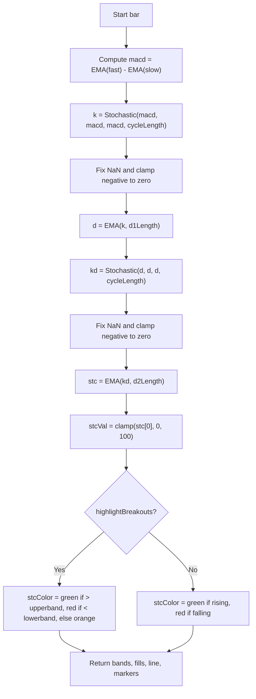

# Schaff Trend Cycle (STC) - Technical Guide

> Computes the Schaff Trend Cycle (STC) oscillator, a double-smoothed stochastic of MACD, with overbought/oversold bands and crossover signals.

| | |
| --- | --- |
| **Language** | Indie Script v5 |
| **Platform** | [TakeProfit](https://takeprofit.com) |
| **Category** | Oscillators |
| **Type** | Indicator |
| **Author** | @juan on TakeProfit |
| **License** | licensed under the MIT License (see the header of the source file) |
| **Live script** | [Open on TakeProfit](https://takeprofit.com/indicator/schaff-trend-cycle-stc-95) |
| **Source file** | [Schaff Trend Cycle (STC).indie5](Schaff%20Trend%20Cycle%20(STC).indie5) |

## Overview

The Schaff Trend Cycle (STC) is a trend-following oscillator that combines MACD and double stochastic smoothing to produce a fast-reacting line bounded between 0 and 100. It is designed to identify trend direction, momentum shifts, and potential entry/exit points. The indicator plots a main STC line, upper and lower bands (default 75 and 25), and optional buy/sell markers when the line crosses these bands.
On the chart, the STC line is colored green when above the upper band, red when below the lower band, and orange otherwise (if breakout highlighting is enabled). Fills between the line and bands highlight overbought (green tint) and oversold (red tint) zones. Buy markers appear when the line crosses above the lower band, sell markers when it crosses below the upper band.

## How it works

1. Compute MACD as the difference between fast and slow EMAs of the source price.
2. Apply a stochastic calculation to the MACD series (using the same series for high, low, close) to obtain a raw %K, then fix NaN and replace NaN with zero.
3. Smooth the raw %K with a first EMA (%D) of length d1Length.
4. Apply a second stochastic to the %D series (again using the same series for all inputs) to produce a second %K, then fix NaN and replace NaN with zero.
5. Smooth the second %K with a second EMA (%D) of length d2Length to obtain the final STC value.
6. Clamp the STC value between 0 and 100, then determine its color based on direction or breakout status.
7. Plot the STC line, upper/lower bands, fills, and optional markers when the STC crosses a band.
8. Return all plot elements in a single tuple from Main.

## Logic flow



## Parameters

| Parameter | Type | Default | Range | Description |
| --- | --- | --- | --- | --- |
| `src` | source | source.CLOSE |  | Source |
| `fastLength` | int | 23 | ≥ 1 | MACD Fast Length |
| `slowLength` | int | 50 | ≥ 1 | MACD Slow Length |
| `cycleLength` | int | 10 | ≥ 1 | Cycle Length |
| `d1Length` | int | 3 | ≥ 1 | 1st %D Length |
| `d2Length` | int | 3 | ≥ 1 | 2nd %D Length |
| `showSignals` | bool | true |  | Show signals? |
| `highlightBreakouts` | bool | true |  | Highlight Breakouts? |
| `upperband` | float | 75 |  | Upper Band |
| `lowerband` | float | 25 |  | Lower Band |

## Code walkthrough

### Helper algorithm SeriesDif

Lines 12-14 of [Schaff Trend Cycle (STC).indie5](Schaff%20Trend%20Cycle%20(STC).indie5):

```python
@algorithm
def SeriesDif(self, serie1: SeriesF, serie2: SeriesF) -> SeriesF:
    return MutSeriesF.new(serie1[0] - serie2[0])
```

Defines a simple algorithm that returns the difference between two series at the current bar. It uses MutSeriesF.new to create a new series from the computed value, which allows the result to be used in subsequent calculations.

### MACD and double stochastic smoothing

Lines 47-51 of [Schaff Trend Cycle (STC).indie5](Schaff%20Trend%20Cycle%20(STC).indie5):

```python
    macd = SeriesDif.new(Ema.new(src, fastLength), Ema.new(src, slowLength))
    k = NanToZero.new(FixNan.new((Stoch.new(macd, macd, macd, cycleLength))))
    d = Ema.new(k, d1Length)
    kd = NanToZero.new(FixNan.new(Stoch.new(d, d, d, cycleLength)))
    stc = Ema.new(kd, d2Length)
```

The core computation: MACD is the difference of two EMAs. Then a stochastic is applied to the MACD series using the same series for high, low, and close – an unusual but intentional step. After fixing NaN and clamping, an EMA smooths it. The process repeats with a second stochastic and EMA to produce the final STC value.

### Clamping and color logic

Lines 52-55 of [Schaff Trend Cycle (STC).indie5](Schaff%20Trend%20Cycle%20(STC).indie5):

```python
    stcVal = max(min(stc[0], 100), 0)
    stcColor1 =  color.GREEN if stcVal > stc[1] else color.RED
    stcColor2 =  color.GREEN if stcVal > upperband else color.RED if stc[0] <= lowerband else color.rgba(255, 165, 0, 1)
    stcColor = stcColor2 if highlightBreakouts else stcColor1
```

The STC value is clamped between 0 and 100 to stay within the oscillator range. Two color schemes are defined: stcColor1 based on direction (green if rising, red if falling), stcColor2 based on breakout levels (green above upper band, red below lower band, orange otherwise). The final color depends on the highlightBreakouts parameter.

### Return tuple with fills and markers

Lines 56-63 of [Schaff Trend Cycle (STC).indie5](Schaff%20Trend%20Cycle%20(STC).indie5):

```python
    return upperband,\
        lowerband,\
        plot.Fill(),\
        plot.Line(stc[0], color=stcColor),\
        plot.Fill(color=color.GREEN(0.1 if stc[0] > upperband else 0)),\
        plot.Fill(color=color.RED(0.1 if stc[0] < lowerband else 0)),\
        plot.Marker(value=upperband if (showSignals and (stc[1] < lowerband and stc[0] > lowerband)) else nan, color=color.GREEN),\
        plot.Marker(value=lowerband if (showSignals and (stc[1] > upperband and stc[0] < upperband)) else nan, color=color.RED)
```

The Main function returns a tuple containing the band levels, a Fill object (for the band fill), the STC line with its color, two conditional fills for overbought/oversold zones, and two markers for buy/sell signals. Markers are placed at the band levels only when the STC crosses them in the appropriate direction and showSignals is enabled.

## Reading the chart

- **STC line**: oscillates between 0 and 100. Color indicates trend direction or breakout status.
  - If *highlightBreakouts* is enabled: green when above upper band (overbought), red when below lower band (oversold), orange otherwise.
  - If *highlightBreakouts* is disabled: green when rising (current > previous), red when falling.
- **Upper band (75) and lower band (25)**: dotted gray lines. The area between them is filled with a faint purple.
- **Fills**: green tint (10% opacity) when STC is above upper band; red tint (10% opacity) when STC is below lower band.
- **Buy signals**: a green circle appears at the upper band level when the STC crosses *above* the lower band (i.e., previous bar below lower band, current bar above lower band).
- **Sell signals**: a red circle appears at the lower band level when the STC crosses *below* the upper band (i.e., previous bar above upper band, current bar below upper band).
- Signals are only shown when the `showSignals` parameter is true.

## Implementation notes

- The stochastic function is called with the same series for high, low, and close, which effectively computes a stochastic of the series against itself – this is a non-standard usage but matches the original STC definition.
- FixNan and NanToZero are applied after each stochastic to handle potential division-by-zero or NaN values, ensuring the series remains valid.
- The indicator does not repaint because it only uses current and previous bar values (stc[0] and stc[1]) – no future data is accessed.
- The commented @band decorator (line 27) is replaced by explicit plot lines and fills, giving more control over styling.

## FAQ

**What do the fastLength and slowLength parameters control?**

They set the periods for the two EMAs used to compute the MACD component. fastLength (default 23) is the shorter EMA, slowLength (default 50) is the longer EMA. Their difference drives the initial momentum calculation.

**How should I interpret the buy and sell markers?**

A buy marker appears when the STC line crosses above the lower band (25) from below, suggesting a shift from oversold to neutral. A sell marker appears when the STC line crosses below the upper band (75) from above, suggesting a shift from overbought to neutral. These are potential entry/exit signals.

**Can I change the overbought/oversold levels?**

Yes, the upperband and lowerband parameters (default 75 and 25) can be adjusted to any value between 0 and 100. The bands are plotted as dotted lines and used for coloring and signal generation.

## Full source code

Indie Script v5, as published on TakeProfit. Copy it into the platform's script editor or [open the live script](https://takeprofit.com/indicator/schaff-trend-cycle-stc-95).

```python
# Copyright (c) 2025 @juan. All rights reserved.

# This work is licensed under the MIT License.
# For a copy, see <https://opensource.org/licenses/MIT>.

# indie:lang_version = 5
from indie import algorithm, band, color, indicator, line_style, MutSeriesF, param, plot, SeriesF, source
from indie.algorithms import Ema, FixNan, NanToZero, Stoch
from math import nan
from indie.plot import marker_position

@algorithm
def SeriesDif(self, serie1: SeriesF, serie2: SeriesF) -> SeriesF:
    return MutSeriesF.new(serie1[0] - serie2[0])

@indicator('Schaff Trend Cycle', overlay_main_pane=False)
@param.source('src', default=source.CLOSE, title='Source')
@param.int('fastLength', default=23, min=1, title='MACD Fast Length')
@param.int('slowLength', default=50, min=1, title='MACD Slow Length')
@param.int('cycleLength', default=10, min=1, title='Cycle Length')
@param.int('d1Length', default=3, min=1, title='1st %D Length')
@param.int('d2Length', default=3, min=1, title='2nd %D Length')
@param.bool('showSignals', default=True, title='Show signals?')
@param.bool('highlightBreakouts', default=True, title='Highlight Breakouts?')
@param.float('upperband', default=75, title='Upper Band')
@param.float('lowerband', default=25, title='Lower Band')
#@band(25, 75, line_color=color.GRAY, line_style=line_style.DASHED)
@plot.line('upperline', line_style=line_style.DOTTED, color=color.GRAY(0.4), title='Upper band')
@plot.line('lowerline', line_style=line_style.DOTTED, color=color.GRAY(0.4), title='Lower band')
@plot.fill('upperline', 'lowerline', color=color.PURPLE(0.05), title='Fill color')
@plot.line('stcLine', title='STC line')
@plot.fill('stcLine', 'upperline')
@plot.fill('lowerline', 'stcLine')
@plot.marker(title='Buy', style=plot.marker_style.CIRCLE, position=marker_position.CENTER, size=7)
@plot.marker(title='Sell', style=plot.marker_style.CIRCLE, position=marker_position.CENTER, size=7)
def Main(self,
         src,
         fastLength,
         slowLength,
         cycleLength,
         d1Length,
         d2Length,
         upperband,
         lowerband,
         showSignals,
         highlightBreakouts):
    macd = SeriesDif.new(Ema.new(src, fastLength), Ema.new(src, slowLength))
    k = NanToZero.new(FixNan.new((Stoch.new(macd, macd, macd, cycleLength))))
    d = Ema.new(k, d1Length)
    kd = NanToZero.new(FixNan.new(Stoch.new(d, d, d, cycleLength)))
    stc = Ema.new(kd, d2Length)
    stcVal = max(min(stc[0], 100), 0)
    stcColor1 =  color.GREEN if stcVal > stc[1] else color.RED
    stcColor2 =  color.GREEN if stcVal > upperband else color.RED if stc[0] <= lowerband else color.rgba(255, 165, 0, 1)
    stcColor = stcColor2 if highlightBreakouts else stcColor1
    return upperband,\
        lowerband,\
        plot.Fill(),\
        plot.Line(stc[0], color=stcColor),\
        plot.Fill(color=color.GREEN(0.1 if stc[0] > upperband else 0)),\
        plot.Fill(color=color.RED(0.1 if stc[0] < lowerband else 0)),\
        plot.Marker(value=upperband if (showSignals and (stc[1] < lowerband and stc[0] > lowerband)) else nan, color=color.GREEN),\
        plot.Marker(value=lowerband if (showSignals and (stc[1] > upperband and stc[0] < upperband)) else nan, color=color.RED)
```
