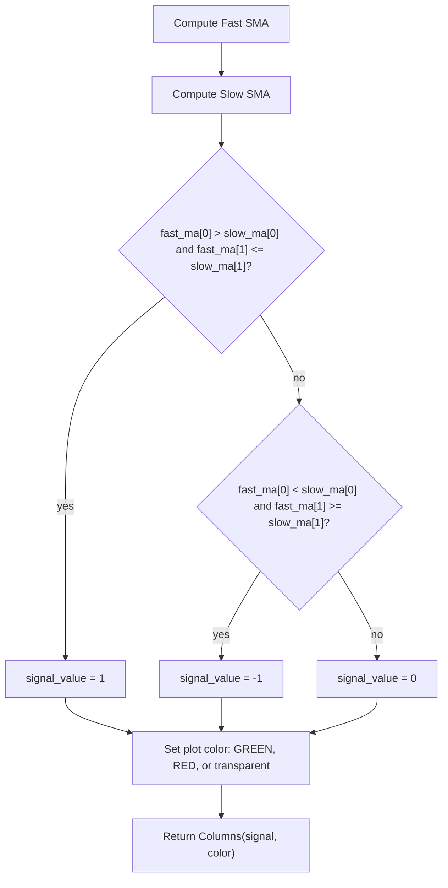

# Simple Crossover Signal Bars for Visual Backtesting - Technical Guide

> Plots colored bars in a separate pane when fast SMA crosses above (green) or below (red) slow SMA.

| | |
| --- | --- |
| **Language** | Indie Script v5 |
| **Platform** | [TakeProfit](https://takeprofit.com) |
| **Category** | Moving averages |
| **Type** | Indicator |
| **Author** | @mustermann84 on TakeProfit |
| **License** | MIT |
| **Live script** | [Open on TakeProfit](https://takeprofit.com/indicator/simple-crossover-signal-bars-for-visual-backtesting-16) |
| **Source file** | [Simple Crossover Signal Bars for Visual Backtesting.indie5](Simple%20Crossover%20Signal%20Bars%20for%20Visual%20Backtesting.indie5) |

## Overview

This indicator detects crossovers between a fast and a slow simple moving average (SMA) of the closing price. It is intended for trend-following or visual backtesting: bullish crossovers (fast MA crossing above slow MA) are highlighted with green bars, bearish crossovers (fast crossing below slow) with red bars, and neutral periods show no bar. The indicator runs in a separate window below the price chart with a dashed gray midline at 0 for reference.

## How it works

1. Compute the fast SMA of the close price using the user-set period (`fast_ma_length`, default 50).
2. Compute the slow SMA of the close price using the user-set period (`slow_ma_length`, default 200).
3. Compare the current bar's SMA values with the previous bar's values to detect a crossover: fast > slow and previously fast ≤ slow means bullish crossover; fast < slow and previously fast ≥ slow means bearish crossover.
4. Store a signal value: +1 for bullish, -1 for bearish, 0 otherwise in a `MutSeriesF` series.
5. Assign a plot color based on the signal: green for +1, red for -1, fully transparent for 0.
6. Return a `plot.Columns` object with the signal value and color, plotted in a separate pane with a midline at 0.

## Logic flow



## Parameters

| Parameter | Type | Default | Range | Description |
| --- | --- | --- | --- | --- |
| `fast_ma_length` | int | 50 | ≥ 1 | Fast MA Length |
| `slow_ma_length` | int | 200 | ≥ 1 | Slow MA Length |

## Code walkthrough

### Parameter and Plot Setup

Lines 5-9 of [Simple Crossover Signal Bars for Visual Backtesting.indie5](Simple%20Crossover%20Signal%20Bars%20for%20Visual%20Backtesting.indie5):

```python
@indicator('Simple Crossover Signal Bars for Visual Backtesting', overlay_main_pane=False)
@param.int('fast_ma_length', default=50, min=1, title='Fast MA Length')
@param.int('slow_ma_length', default=200, min=1, title='Slow MA Length')
@plot.columns(title='Crossover Signal', id='#plot_0')
@level(value=0, title='Mittellinie', line_color=color.GRAY, line_style=line_style.DASHED, line_width=1)
```

The indicator is registered with `overlay_main_pane=False` so it appears in a separate pane. Two integer parameters (`fast_ma_length` and `slow_ma_length`) are exposed in the settings UI. A `@plot.columns` decorator configures the histogram output, and a `@level` adds a dashed gray midline at 0.

### Crossover Detection Logic

Lines 16-23 of [Simple Crossover Signal Bars for Visual Backtesting.indie5](Simple%20Crossover%20Signal%20Bars%20for%20Visual%20Backtesting.indie5):

```python
    signal_value = MutSeriesF.new(init=0)

    if fast_ma[0] > slow_ma[0] and fast_ma[1] <= slow_ma[1]:
        signal_value[0] = 1  # Bullisches Signal
    elif fast_ma[0] < slow_ma[0] and fast_ma[1] >= slow_ma[1]:
        signal_value[0] = -1  # Bärisches Signal
    else:
        signal_value[0] = 0  # Kein Signal
```

A `MutSeriesF` named `signal_value` is initialized to 0 for each bar. Using the current (index 0) and previous (index 1) values of the two SMAs, the code checks for a bullish crossover (fast crosses above slow) or bearish crossover (fast crosses below slow). If neither condition holds, the signal remains 0. The `MutSeriesF` stores the signal for the current bar, which is later used for the plot.

### Dynamic Color Assignment

Lines 26-30 of [Simple Crossover Signal Bars for Visual Backtesting.indie5](Simple%20Crossover%20Signal%20Bars%20for%20Visual%20Backtesting.indie5):

```python
    plot_color = (
        color.GREEN if signal_value[0] == 1
        else color.RED if signal_value[0] == -1
        else color.rgba(0, 0, 0, 0)  # Transparent, wenn kein Signal
    )
```

The plot color is chosen based on the current signal value: green for bullish, red for bearish, and a fully transparent `rgba(0,0,0,0)` when there is no signal. This hides bars during neutral periods while still allowing the indicator to occupy a pane.

## Reading the chart

- **Green bar** at value 1: Bullish crossover – fast MA crossed above slow MA.
- **Red bar** at value -1: Bearish crossover – fast MA crossed below slow MA.
- **No bar** (transparent): No crossover occurred on that bar.
- The **dashed gray line at 0** serves as a midline to quickly distinguish positive (bullish) from negative (bearish) signals.
- Bars are plotted in a separate window below the price chart, not overlaid on price.

## Implementation notes

- Both SMAs must have at least `max(fast_ma_length, slow_ma_length)` bars of data before a valid crossover can be detected; earlier bars will show no signal due to NaN values in the SMA series.
- The signal is derived purely from the current and previous bar's SMA values – it is not repainted once a bar closes.
- The transparent color for neutral signals (`color.rgba(0,0,0,0)`) effectively hides the column, so no bar is drawn when there is no crossover.
- The indicator operates on the chart's primary timeframe; multi-timeframe analysis requires modifying the source or using `sec_context`.

## FAQ

**Can I change the moving average type from SMA to EMA or others?**

Yes, replace `Sma.new` with the desired algorithm (e.g., `Ema.new`) and adjust the import accordingly. The crossover logic remains the same.

**Why do no bars appear on my chart?**

The indicator requires enough bars to compute both SMAs (e.g., at least 200 bars for default settings). Also ensure the indicator is added to a separate pane (not overlaid on price).

**Can I use this indicator for real-time trading?**

Yes, the signal updates on each new bar based on the close price. However, crossovers may lag due to the slow MA length; this is a characteristic of lagging moving average systems.

## Full source code

Indie Script v5, as published on TakeProfit. Copy it into the platform's script editor or [open the live script](https://takeprofit.com/indicator/simple-crossover-signal-bars-for-visual-backtesting-16).

```python
# indie:lang_version = 5
from indie import indicator, plot, color, MutSeriesF, level, line_style, param
from indie.algorithms import Sma

@indicator('Simple Crossover Signal Bars for Visual Backtesting', overlay_main_pane=False)
@param.int('fast_ma_length', default=50, min=1, title='Fast MA Length')
@param.int('slow_ma_length', default=200, min=1, title='Slow MA Length')
@plot.columns(title='Crossover Signal', id='#plot_0')
@level(value=0, title='Mittellinie', line_color=color.GRAY, line_style=line_style.DASHED, line_width=1)
def Main(self, fast_ma_length, slow_ma_length):
    # Berechnung der gleitenden Durchschnitte
    fast_ma = Sma.new(self.close, fast_ma_length)  # Einstellbare Länge für den schnellen MA
    slow_ma = Sma.new(self.close, slow_ma_length)  # Einstellbare Länge für den langsamen MA

    # Signal-Logik: 1 für bullisches Crossover, -1 für bärisches Crossover
    signal_value = MutSeriesF.new(init=0)

    if fast_ma[0] > slow_ma[0] and fast_ma[1] <= slow_ma[1]:
        signal_value[0] = 1  # Bullisches Signal
    elif fast_ma[0] < slow_ma[0] and fast_ma[1] >= slow_ma[1]:
        signal_value[0] = -1  # Bärisches Signal
    else:
        signal_value[0] = 0  # Kein Signal

    # Farbe basierend auf dem Signalwert
    plot_color = (
        color.GREEN if signal_value[0] == 1
        else color.RED if signal_value[0] == -1
        else color.rgba(0, 0, 0, 0)  # Transparent, wenn kein Signal
    )

    # Rückgabe der Balkenanzeige
    return plot.Columns(value=signal_value[0], color=plot_color)
```
