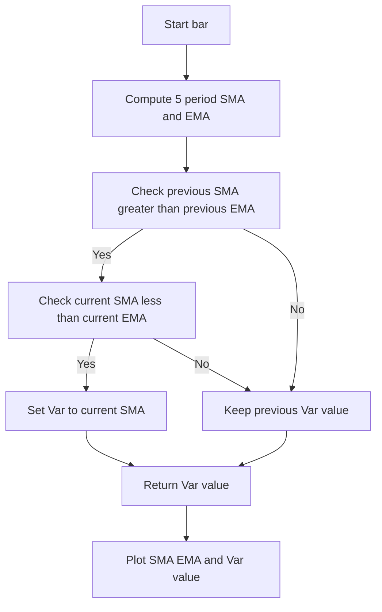

# Sma-Ema Crossover - usage example of indie.Var[T] - Technical Guide

> Computes a 5-period SMA and EMA and plots the retained SMA value on downward crossovers, demonstrating indie.Var[T] state storage.

| | |
| --- | --- |
| **Language** | Indie Script v5 |
| **Platform** | [TakeProfit](https://takeprofit.com) |
| **Category** | Demos & templates |
| **Type** | Indicator |
| **Author** | @TakeProfit on TakeProfit |
| **License** | licensed under the MIT License (see the header of the source file) |
| **Live script** | [Open on TakeProfit](https://takeprofit.com/indicator/sma-ema-crossover-usage-example-of-indie-var-t-90) |
| **Source file** | [Sma-Ema Crossover - usage example of indie.VarT.indie5](Sma-Ema%20Crossover%20-%20usage%20example%20of%20indie.VarT.indie5) |

## Overview

This indicator draws a 5-period simple moving average and a 5-period exponential moving average of the close price. It is a language example for `indie.Var[T]`: `CrossoverWithVar` detects a downward crossover and stores the SMA value at that bar, while the included `CrossoverWithSeries` shows the same logic with `MutSeriesF`.

The chart shows the SMA as a maroon line, the EMA as a lime line, and the retained crossover value as a thicker blue line (color.BLUE, line_width=2). Because only the downward crossover updates the stored state, the blue line remains constant after a crossover until the next crossover occurs.

## How it works

1. `Main` computes a 5-period `Sma` from `self.close` and a 5-period `Ema` from `self.close`.
2. The two series are passed to `CrossoverWithVar.new`, which returns a float series.
3. On each bar, the algorithm reads the previous values `s1[1]` and `s2[1]` to test whether SMA was above EMA on the previous bar.
4. It then reads the current values `s1[0]` and `s2[0]` to test whether SMA is now below EMA on the current bar.
5. If both conditions are true, it calls `my_var.set(s1[0])` to store the current SMA value.
6. If the crossover condition is false, `my_var.get()` returns the last stored value, which may be from the previous crossover or the initial value.
7. `Main` returns `sma[0]`, `ema[0]`, and the crossover state; the plot decorators draw them as maroon, lime, and blue lines (with the blue line having width 2).

## Mathematical model

$$
\text{SMA}_t = \frac{1}{5}\sum_{i=0}^{4} \text{close}_{t-i}
$$

$$
\text{EMA}_t = \alpha \cdot \text{close}_t + (1-\alpha)\cdot \text{EMA}_{t-1}, \quad \alpha = \frac{2}{5+1}
$$

## Logic flow



## Code walkthrough

### State storage with Var

Lines 10-15 of [Sma-Ema Crossover - usage example of indie.VarT.indie5](Sma-Ema%20Crossover%20-%20usage%20example%20of%20indie.VarT.indie5):

```python
@algorithm
def CrossoverWithVar(self, s1: SeriesF, s2: SeriesF) -> float:
    my_var = Var[float].new(0)
    if s1[1] > s2[1] and s1[0] < s2[0]:
        my_var.set(s1[0])
    return my_var.get()
```

`Var[float].new(0)` creates a single mutable state value initialized to zero. The `if` checks that the previous bar had SMA above EMA and the current bar has SMA below EMA. On that event, the current SMA value is stored, and every later bar returns the last stored value until the next crossover.

### Equivalent MutSeriesF implementation

Lines 18-23 of [Sma-Ema Crossover - usage example of indie.VarT.indie5](Sma-Ema%20Crossover%20-%20usage%20example%20of%20indie.VarT.indie5):

```python
@algorithm
def CrossoverWithSeries(self, s1: SeriesF, s2: SeriesF) -> float:
    my_ser = MutSeriesF.new(init=0)
    if s1[1] > s2[1] and s1[0] < s2[0]:
        my_ser[0] = s1[0]
    return my_ser[0]
```

This block performs the same crossover retention by assigning to `my_ser[0]` instead of calling `set`. It is provided as a comparison and is not used in `Main`. The unconditional read of `my_ser[0]` returns the last assigned value or the initial value 0 on bars without a crossover.

### Indicator composition

Lines 25-32 of [Sma-Ema Crossover - usage example of indie.VarT.indie5](Sma-Ema%20Crossover%20-%20usage%20example%20of%20indie.VarT.indie5):

```python
@indicator('Sma-Ema Crossover', overlay_main_pane=True)
@plot.line(color=color.MAROON, id='#plot_0')
@plot.line(color=color.LIME, id='#plot_1')
@plot.line(color=color.BLUE, line_width=2, id='#plot_2')
def Main(self):
    sma = Sma.new(self.close, 5)
    ema = Ema.new(self.close, 5)
    return sma[0], ema[0], CrossoverWithVar.new(sma, ema)
```

The decorators define the indicator name, main-pane overlay, and three colored plot lines. `Sma.new` and `Ema.new` return series, so `[0]` extracts the current bar value. The third return value is the `CrossoverWithVar` series, which is the blue line on the chart.

## Reading the chart

- Maroon line `#plot_0`: 5-period SMA of the close price.
- Lime line `#plot_1`: 5-period EMA of the close price.
- Blue line `#plot_2` with width 2: the retained crossover value. It starts at 0 and becomes the current SMA value on the first bar where SMA crosses below EMA (previous SMA > previous EMA and current SMA < current EMA).
- The blue line remains flat after a crossover because the stored value is only replaced when another downward crossover (SMA crossing below EMA) occurs.
- During real-time intrabar updates, `Var` reverts to its last confirmed closing-bar value before each new intrabar calculation.

## Implementation notes

- Only `CrossoverWithVar` is returned from `Main`; `CrossoverWithSeries` is included to illustrate the equivalent `MutSeriesF` approach and is not plotted.
- The condition is strictly downward: SMA must be above EMA on the previous bar and below EMA on the current bar. Equal values do not trigger it.
- Before any crossover, the blue line is 0 due to the initial value passed to `Var[float].new(0)`.
- `Var[T]` is not a series and does not keep historical values; it only remembers the last state set, which is updated on each bar where the condition is true.

## FAQ

**How do I change the indicator to detect an upward crossover?**

In `CrossoverWithVar`, replace the condition on line 13 with `s1[1] < s2[1] and s1[0] > s2[0]` to detect SMA crossing above EMA. If you also test `CrossoverWithSeries`, apply the same change to line 21 (replace `s1[1] > s2[1] and s1[0] < s2[0]` with `s1[1] < s2[1] and s1[0] > s2[0]`).

**Can I use different periods for the SMA and EMA?**

Yes. Change the second argument of `Sma.new(self.close, 5)` or `Ema.new(self.close, 5)` on lines 30 and 31, for example `Sma.new(self.close, 10)` and `Ema.new(self.close, 20)`.

**Why is the blue line constant between crossovers?**

Because `my_var` is only updated inside the crossover `if`. On every other bar, `my_var.get()` returns the most recently stored SMA value.

## Full source code

Indie Script v5, as published on TakeProfit. Copy it into the platform's script editor or [open the live script](https://takeprofit.com/indicator/sma-ema-crossover-usage-example-of-indie-var-t-90).

```python
# Copyright (c) 2024 @TakeProfit. All rights reserved.

# This work is licensed under the MIT License.
# For a copy, see <https://opensource.org/licenses/MIT>.

# indie:lang_version = 5
from indie import indicator, Var, plot, MutSeriesF, SeriesF, color, algorithm
from indie.algorithms import Sma, Ema

@algorithm
def CrossoverWithVar(self, s1: SeriesF, s2: SeriesF) -> float:
    my_var = Var[float].new(0)
    if s1[1] > s2[1] and s1[0] < s2[0]:
        my_var.set(s1[0])
    return my_var.get()

# Note: this function does the same thing but using MutSeriesF
@algorithm
def CrossoverWithSeries(self, s1: SeriesF, s2: SeriesF) -> float:
    my_ser = MutSeriesF.new(init=0)
    if s1[1] > s2[1] and s1[0] < s2[0]:
        my_ser[0] = s1[0]
    return my_ser[0]

@indicator('Sma-Ema Crossover', overlay_main_pane=True)
@plot.line(color=color.MAROON, id='#plot_0')
@plot.line(color=color.LIME, id='#plot_1')
@plot.line(color=color.BLUE, line_width=2, id='#plot_2')
def Main(self):
    sma = Sma.new(self.close, 5)
    ema = Ema.new(self.close, 5)
    return sma[0], ema[0], CrossoverWithVar.new(sma, ema)
```
