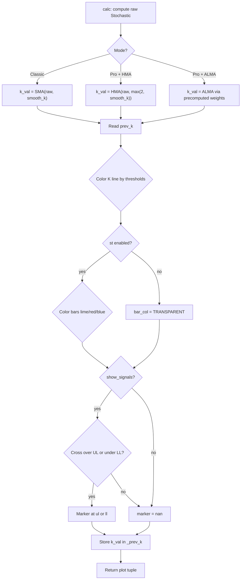

# Stochastic POP Method 2 Classic+Pro - Technical Guide

> Stochastic oscillator with classic SMA or zero-lag HMA/ALMA smoothing, trading above 55 and below 45, with crossover signals.

| | |
| --- | --- |
| **Language** | Indie Script v5 |
| **Platform** | [TakeProfit](https://takeprofit.com) |
| **Category** | Oscillators |
| **Type** | Indicator |
| **Author** | @insurgent on TakeProfit |
| **Original** | Original: ChrisMoody (2015), based on Jake Bernstein's algo, |
| **Original (TradingView)** | [CM Stochastic POP Method 2 - Jake Bernstein](https://www.tradingview.com/script/grzVchLi-CM-Stochastic-POP-Method-2-Jake-Bernstein-V1/) by ChrisMoody |
| **License** | [MPL-2.0](https://mozilla.org/MPL/2.0/) (derivative work) |
| **Live script** | [Open on TakeProfit](https://takeprofit.com/indicator/stochastic-pop-method-2-classic-pro-13) |
| **Source file** | [Stochastic POP Method 2 Classic+Pro.indie5](Stochastic%20POP%20Method%202%20Classic+Pro.indie5) |

## Overview

The indicator calculates a Stochastic oscillator from high, low, and close prices, then smooths it with one of three engines: Classic SMA, Pro HMA, or Pro ALMA. The chart shows the 100/0 bounds, the upper/lower breakout lines, a color-coded Stochastic line, and zone fills. Optionally, candles can be colored Lime/Red/Blue to distinguish long, short, and no-trade regimes. Lime/red circular markers appear at the exact bar where K crosses through the upper or lower level.

## How it works

1. Calculate raw Stochastic %K with Stoch.new using the configured length.
2. Smooth raw Stochastic: SMA in Classic mode, HMA (three WMA passes) in Pro/HMA mode, or ALMA using precomputed Gaussian weights in Pro/ALMA mode.
3. Read the previous bar's smoothed K from _prev_k, stored via new_var/set/get to survive realtime rollback.
4. Color the Stochastic line green when k_val >= ul, red when k_val <= ll, blue otherwise.
5. If st is enabled, color bars lime (long), red (short), or blue (no trade) based on the same thresholds.
6. On show_signals, emit a long marker when prev_k <= ul and k_val > ul, and a short marker when prev_k >= ll and k_val < ll; otherwise return math.nan.
7. Store the current k_val into _prev_k for the next bar.
8. Return plot lines, fills, markers, and bar color in the order declared by the decorators.

## Mathematical model

For a raw Stochastic oscillator of period n, %K is calculated per the Stoch algorithm. The indicator then applies SMA or HMA smoothing:

$$
K_{\text{raw}} = 100 \cdot \frac{C - L_n}{H_n - L_n}
$$

Hull MA is computed as:

$$
\text{HMA}(x, n) = \text{WMA}\left( 2 \cdot \text{WMA}(x, \lfloor n/2 \rfloor) - \text{WMA}(x, n), \lfloor \sqrt{n} \rfloor \right)
$$

ALMA weights are precomputed once per window m and sigma s:

$$
w_i = \exp\left( -\frac{(i - m)^2}{2 s^2} \right), \quad m = \text{offset} \cdot (\text{window} - 1), \quad s = \frac{\text{window}}{\text{sigma}}
$$

$$
K_{\text{alma}} = \frac{\sum_{i=0}^{W-1} x_{[W-i-1]} \cdot w_i}{\sum w_i}
$$

## Logic flow



## Parameters

| Parameter | Type | Default | Range | Description |
| --- | --- | --- | --- | --- |
| `length` | int | 14 | ≥ 1 | Stochastic Length |
| `smooth_k` | int | 5 | ≥ 1 | Smooth K |
| `mode` | str | Classic |  | Mode |
| `ul` | float | 55.0 | ≥ 50.0 | Buy Entry/Exit Line |
| `ll` | float | 45.0 | ≤ 50.0 | Sell Entry/Exit Line |
| `st` | bool | false |  | Color Bars (Long / Short / NoTrade) |
| `show_signals` | bool | true |  | Show Crossover Signals |

## Code walkthrough

### Precomputed ALMA weights

Lines 66-81 of [Stochastic POP Method 2 Classic+Pro.indie5](Stochastic%20POP%20Method%202%20Classic+Pro.indie5):

```python
        # Precompute ALMA weights once at indicator init.
        # Weights depend only on window/offset/sigma — never on per-bar data.
        # On a 50K-bar history with window=10 this saves ~500K exp/pow calls.
        window = max(2, smooth_k)
        self._alma_window = window
        self._alma_weights: list[float] = []
        self._alma_norm = 1.0
        if mode == 'Pro' and pro_algo == 'ALMA':
            m = alma_offset * (window - 1)
            s = window / alma_sigma
            norm_acc = 0.0
            for i in range(window):
                w = exp(-1 * pow(i - m, 2) / (2 * pow(s, 2)))
                self._alma_weights.append(w)
                norm_acc += w
            self._alma_norm = norm_acc
```

The ALMA Gaussian weights depend only on the window, offset, and sigma. By computing them once in __init__ and storing them with the indicator instance, the calc loop still gets O(window) multiplications but avoids repeated exp/pow calls. The window is clamped to at least 2 even though smooth_k has a minimum of 1.

### Smoothing dispatch

Lines 87-100 of [Stochastic POP Method 2 Classic+Pro.indie5](Stochastic%20POP%20Method%202%20Classic+Pro.indie5):

```python
        # k_val is declared above the if-block — Indie's scoping ends with
        # indentation, so vars defined inside if/elif don't survive outside.
        k_val = 0.0
        if self._mode == 'Classic':
            k_val = Sma.new(raw_stoch, self._smooth_k)[0]
        elif self._pro_algo == 'HMA':
            k_val = Hma.new(raw_stoch, max(2, self._smooth_k))[0]
        else:  # Pro + ALMA — uses precomputed weights from __init__
            window = self._alma_window
            raw_stoch.request_size(window)
            weighted_sum = 0.0
            for i in range(window):
                weighted_sum += raw_stoch[window - i - 1] * self._alma_weights[i]
            k_val = divide(weighted_sum, self._alma_norm)
```

k_val is declared before the if/elif chain because Indie scoping is indentation-based; variables created inside branches do not survive outside the branch. ALMA indexing pulls the raw Stochastic from the current bar backward: raw_stoch[window-i-1] is multiplied by the precomputed weight for i.

### Stateful previous K

Lines 102-133 of [Stochastic POP Method 2 Classic+Pro.indie5](Stochastic%20POP%20Method%202%20Classic+Pro.indie5):

```python
        prev_k = self._prev_k.get()

        # Stochastic line color.
        line_col = color.BLUE
        if k_val >= ul:
            line_col = color.GREEN
        elif k_val <= ll:
            line_col = color.RED

        # Bar coloring (only when st toggle is on).
        bar_col = color.TRANSPARENT
        if st:
            if k_val >= ul:
                bar_col = color.LIME
            elif k_val <= ll:
                bar_col = color.RED
            else:
                bar_col = color.BLUE

        # Crossover signals — fire on the bar where K crosses through a level.
        # Long: K crosses up through UL (entry / short-exit).
        # Short: K crosses down through LL (entry / long-exit).
        long_signal = nan
        short_signal = nan
        if show_signals:
            if prev_k <= ul and k_val > ul:
                long_signal = ul
            if prev_k >= ll and k_val < ll:
                short_signal = ll

        # Persist current K for next bar's crossover comparison.
        self._prev_k.set(k_val)
```

The previous bar's K value is read from a Var so realtime rollback works, then the current K is stored using set(). This is what prevents crossover signals from repainting or blinking when the last bar is updated during live trading.

### Signal and output tuple

Lines 121-146 of [Stochastic POP Method 2 Classic+Pro.indie5](Stochastic%20POP%20Method%202%20Classic+Pro.indie5):

```python
        # Crossover signals — fire on the bar where K crosses through a level.
        # Long: K crosses up through UL (entry / short-exit).
        # Short: K crosses down through LL (entry / long-exit).
        long_signal = nan
        short_signal = nan
        if show_signals:
            if prev_k <= ul and k_val > ul:
                long_signal = ul
            if prev_k >= ll and k_val < ll:
                short_signal = ll

        # Persist current K for next bar's crossover comparison.
        self._prev_k.set(k_val)

        return (
            plot.Line(ul),
            plot.Line(100.0),
            plot.Line(ll),
            plot.Line(0.0),
            plot.Line(k_val, color=line_col),
            plot.Fill(),
            plot.Fill(),
            plot.Fill(),
            plot.Marker(long_signal),
            plot.Marker(short_signal),
            plot.BarColor(color=bar_col),
```

Crossover signals are computed as the numeric level value, not a boolean. When no crossover occurs, plot.Marker receives math.nan, which tells the chart to draw nothing. The return tuple must contain one plot object per declared decorator in the same order: four lines, three fills, two markers, and one bar color.

## Reading the chart

- The Stochastic line is GREEN when k_val >= upper line, RED when k_val <= lower line, BLUE otherwise.
- The upper and lower lines act as trade-state thresholds: above upper means long regime, below lower means short regime, between is no-trade/neutral.
- Zone fills: green above upper, blue between upper and lower, red below lower.
- Lime/Red circular markers at the threshold levels mark the exact bar of a bullish cross above the upper line or bearish cross below the lower line.
- If 'st' is enabled, candles are Lime (long), Red (short), or Blue (no trade); if disabled, candles keep their default color because bar_color returns transparent.

## Implementation notes

- ALMA weights are computed in __init__ only when mode is Pro and pro_algo is ALMA; switching modes via UI recreates the indicator instance.
- The raw Stochastic passes through a separate smoothing length (smooth_k), so the final line is not the raw %K.
- min/max constraints on ul and ll enforce ul >= 50 and ll <= 50; a user could still set ul very close to ll, leaving a thin neutral band.
- The markers are plotted at the threshold value itself (ul or ll), not at the Stochastic value, so they sit on the level line rather than on the K line.

## FAQ

**What is the difference between Classic, HMA, and ALMA modes?**

Classic applies SMA smoothing to the raw Stochastic. HMA applies a Hull Moving Average which reduces lag. ALMA applies a Gaussian-weighted moving average with configurable offset and sigma to filter noise; ALMA weights are precomputed once for performance.

**How can I make the indicator show fewer or more signals?**

Change the breakout lines with the ul and ll parameters. Raising ul above 55 requires a stronger bullish momentum to trigger a long signal; lowering ll below 45 makes short signals harder. You can also smooth the Stochastic more heavily by increasing smooth_k.

**Why do the markers sometimes not appear at the Stochastic line?**

Markers are placed at the threshold value that was crossed (ul or ll), not at the K value. That is why a long marker is drawn at 55 while K could be 55.1 on the same bar.

## License and attribution

This Indie script is a derivative work of **CM Stochastic POP Method 2 by ChrisMoody** on TradingView. This is a port of an open-source TradingView script whose header we could not retrieve; TradingView applies MPL-2.0 by default to open-source scripts, so that license is assumed. A modified version of MPL-2.0 code must stay under [MPL-2.0](https://mozilla.org/MPL/2.0/), so this file is distributed under that license (the notice is appended to the end of the source file). The original author keeps the credit for the algorithm; this page is not affiliated with or endorsed by them.

## Full source code

Indie Script v5, as published on TakeProfit. Copy it into the platform's script editor or [open the live script](https://takeprofit.com/indicator/stochastic-pop-method-2-classic-pro-13).

```python
# indie:lang_version = 5
# CM_Stochastic POP Method 2 — V3 (2026 ultimate)
# Original: ChrisMoody (2015), based on Jake Bernstein's algo, 
# V3 changes:
#   - ALMA weights precomputed once in __init__ (massive speedup on long history)
#   - Crossover signal markers (Long when K crosses up through UL, Short for LL)
#   - Class-based Main for stateful initialization
#   - Thinner default lines, English comments, ASCII-only marker titles
from math import exp, pow, sqrt, floor, nan
from indie import (
    indicator, algorithm, format, param, color, plot,
    SeriesF, MutSeriesF, MainContext,
)
from indie.algorithms import Sma, Stoch, Wma
from indie.math import divide


@algorithm
def Hma(self, src: SeriesF, length: int) -> SeriesF:
    """Hull MA: WMA(2*WMA(n/2) - WMA(n)) finished with sqrt(n) WMA pass."""
    half = max(1, length // 2)
    sqrt_len = max(1, floor(sqrt(length)))
    wma_l2 = Wma.new(src, half)[0]
    wma_l = Wma.new(src, length)[0]
    return Wma.new(MutSeriesF.new(2 * wma_l2 - wma_l), sqrt_len)


@indicator('Stochastic POP Method 2 Classic+Pro', format=format.PRICE)
@param.int('length', default=14, min=1, title='Stochastic Length')
@param.int('smooth_k', default=5, min=1, title='Smooth K')
@param.str('mode', default='Classic', options=['Classic', 'Pro'], title='Mode')
@param.str('pro_algo', default='HMA', options=['HMA', 'ALMA'],
           title='Pro: Smoothing Algorithm')
@param.float('alma_offset', default=0.85, min=0.0, max=1.0, step=0.05,
             title='Pro/ALMA: Offset (only used when Pro+ALMA)')
@param.float('alma_sigma', default=6.0, min=0.5, step=0.5,
             title='Pro/ALMA: Sigma (only used when Pro+ALMA)')
@param.float('ul', default=55.0, min=50.0, title='Buy Entry/Exit Line')
@param.float('ll', default=45.0, max=50.0, title='Sell Entry/Exit Line')
@param.bool('st', default=False, title='Color Bars (Long / Short / NoTrade)')
@param.bool('show_signals', default=True, title='Show Crossover Signals')
@plot.line('upper', line_width=2, color=color.GREEN, title='Upper Line')
@plot.line('top', color=color.GRAY(0.3), title='100 Line')
@plot.line('lower', line_width=2, color=color.RED, title='Lower Line')
@plot.line('bottom', color=color.GRAY(0.3), title='0 Line')
@plot.line('k', line_width=2, title='Stochastic')
@plot.fill('upper', 'top', color=color.GREEN(0.1), title='Long Trade Fill')
@plot.fill('upper', 'lower', color=color.BLUE(0.1), title='No Trade Fill')
@plot.fill('lower', 'bottom', color=color.RED(0.1), title='Short Trade Fill')
@plot.marker(color=color.LIME, style=plot.marker_style.CIRCLE,
             position=plot.marker_position.CENTER, size=6, title='Long Signal')
@plot.marker(color=color.RED, style=plot.marker_style.CIRCLE,
             position=plot.marker_position.CENTER, size=6, title='Short Signal')
@plot.bar_color(title='Bar Color')
class Main(MainContext):
    def __init__(self, smooth_k, mode, pro_algo, alma_offset, alma_sigma):
        # Cache mode-related params for fast access in calc().
        self._smooth_k = smooth_k
        self._mode = mode
        self._pro_algo = pro_algo

        # Var holds the previous bar's K value for crossover detection.
        # Var supports rollback on realtime updates — correct in live mode.
        self._prev_k = self.new_var(nan)

        # Precompute ALMA weights once at indicator init.
        # Weights depend only on window/offset/sigma — never on per-bar data.
        # On a 50K-bar history with window=10 this saves ~500K exp/pow calls.
        window = max(2, smooth_k)
        self._alma_window = window
        self._alma_weights: list[float] = []
        self._alma_norm = 1.0
        if mode == 'Pro' and pro_algo == 'ALMA':
            m = alma_offset * (window - 1)
            s = window / alma_sigma
            norm_acc = 0.0
            for i in range(window):
                w = exp(-1 * pow(i - m, 2) / (2 * pow(s, 2)))
                self._alma_weights.append(w)
                norm_acc += w
            self._alma_norm = norm_acc

    def calc(self, length, ul, ll, st, show_signals):
        raw_stoch = Stoch.new(self.close, self.low, self.high, length)

        # Smoothing dispatch.
        # k_val is declared above the if-block — Indie's scoping ends with
        # indentation, so vars defined inside if/elif don't survive outside.
        k_val = 0.0
        if self._mode == 'Classic':
            k_val = Sma.new(raw_stoch, self._smooth_k)[0]
        elif self._pro_algo == 'HMA':
            k_val = Hma.new(raw_stoch, max(2, self._smooth_k))[0]
        else:  # Pro + ALMA — uses precomputed weights from __init__
            window = self._alma_window
            raw_stoch.request_size(window)
            weighted_sum = 0.0
            for i in range(window):
                weighted_sum += raw_stoch[window - i - 1] * self._alma_weights[i]
            k_val = divide(weighted_sum, self._alma_norm)

        prev_k = self._prev_k.get()

        # Stochastic line color.
        line_col = color.BLUE
        if k_val >= ul:
            line_col = color.GREEN
        elif k_val <= ll:
            line_col = color.RED

        # Bar coloring (only when st toggle is on).
        bar_col = color.TRANSPARENT
        if st:
            if k_val >= ul:
                bar_col = color.LIME
            elif k_val <= ll:
                bar_col = color.RED
            else:
                bar_col = color.BLUE

        # Crossover signals — fire on the bar where K crosses through a level.
        # Long: K crosses up through UL (entry / short-exit).
        # Short: K crosses down through LL (entry / long-exit).
        long_signal = nan
        short_signal = nan
        if show_signals:
            if prev_k <= ul and k_val > ul:
                long_signal = ul
            if prev_k >= ll and k_val < ll:
                short_signal = ll

        # Persist current K for next bar's crossover comparison.
        self._prev_k.set(k_val)

        return (
            plot.Line(ul),
            plot.Line(100.0),
            plot.Line(ll),
            plot.Line(0.0),
            plot.Line(k_val, color=line_col),
            plot.Fill(),
            plot.Fill(),
            plot.Fill(),
            plot.Marker(long_signal),
            plot.Marker(short_signal),
            plot.BarColor(color=bar_col),
        )

# ---------------------------------------------------------------------------
# This Source Code Form is subject to the terms of the Mozilla Public
# License, v. 2.0. If a copy of the MPL was not distributed with this
# file, You can obtain one at https://mozilla.org/MPL/2.0/
# Derived from "CM Stochastic POP Method 2 by ChrisMoody" (TradingView).
# ---------------------------------------------------------------------------
```
