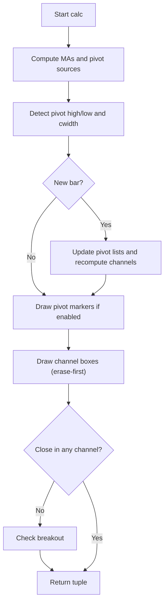

# Support Resistance Channels - Technical Guide

> Computes historical support and resistance zones by clustering pivot points into channels, scoring them by strength, and displaying the strongest non-overlapping levels.

| | |
| --- | --- |
| **Language** | Indie Script v5 |
| **Platform** | [TakeProfit](https://takeprofit.com) |
| **Category** | Support & resistance |
| **Type** | Indicator |
| **Author** | @insurgent on TakeProfit |
| **Original (TradingView)** | [Support Resistance Channels](https://www.tradingview.com/script/Ej53t8Wv-Support-Resistance-Channels/) by LonesomeTheBlue |
| **Original license** | MPL-2.0 |
| **Original source** | [Support Resistance Channels.pinescript6](Support%20Resistance%20Channels.pinescript6) |
| **License** | [MPL-2.0](https://mozilla.org/MPL/2.0/) (derivative work) |
| **Live script** | [Open on TakeProfit](https://takeprofit.com/indicator/support-resistance-channels-5) |
| **Source file** | [Support Resistance Channels.indie5](Support%20Resistance%20Channels.indie5) |

## Overview

Support Resistance Channels is an automated technical indicator that identifies, calculates, and plots historical support and resistance zones. It scans historical data for pivot highs and lows, clusters overlapping pivots into unified price channels based on a user-defined maximum width, and evaluates each channel using a dynamic scoring system. The indicator is designed for markets where price tends to respect horizontal levels, helping traders visualize key price levels that have acted as support or resistance in the past.

On the chart, the indicator draws colored rectangles representing support (green), resistance (red), or neutral (gray) channels. The rectangles are anchored to cover the last 4999 bars, ensuring they remain visible regardless of zoom. Optional moving average lines (SMA or EMA) can be overlaid. Pivot points can be shown as 'H' and 'L' labels. When the price breaks out of a channel, arrow markers appear below (resistance broken) or above (support broken) the bar.

## How it works

1. Detect pivot highs and lows using configurable left/right periods from either High/Low or Close/Open sources.
2. Calculate the maximum channel width as a percentage of the highest-lowest range over the last 300 bars.
3. Cluster overlapping pivots into channels: for each pivot, expand hi/lo to include any other pivot within the max width, counting each pivot as 20 strength points.
4. Add to each channel's strength the number of historical bars (within the loopback period) whose high or low touches the channel.
5. Greedily select the strongest non-overlapping channels up to the maximum number (max 10), then sort them by strength descending.
6. Draw colored rectangles for each selected channel, with color determined by whether the current close is above (resistance), below (support), or inside (neutral) the channel.
7. Check if the current close is outside all channels; if so, detect breakouts (close crosses a channel boundary) and draw arrow markers if enabled.

## Mathematical model

$$
\text{cwidth} = (\text{highest}_{300} - \text{lowest}_{300}) \times \frac{\text{channel\_w}}{100}
$$

$$
\text{strength}_i = 20 \times (\text{number of pivots in cluster}) + \sum_{y=0}^{\text{loopback}} \mathbb{1}_{\text{high}[y] \text{ or low}[y] \text{ touches channel}}
$$

## Logic flow



## Parameters

| Parameter | Type | Default | Range | Description |
| --- | --- | --- | --- | --- |
| `prd` | int | 10 | 4 - 30 | Pivot Period |
| `ppsrc` | str | High/Low |  | Source |
| `channel_w` | int | 5 | 1 - 8 | Maximum Channel Width % |
| `min_strength` | int | 1 | ≥ 1 | Minimum Strength |
| `max_num_sr` | int | 6 | 1 - 10 | Maximum Number of S/R |
| `loopback` | int | 290 | 100 - 400 | Loopback Period |
| `show_pp` | bool | false |  | Show Pivot Points |
| `show_sr_broken` | bool | false |  | Show Broken Support/Resistance |
| `ma1_en` | bool | false |  | MA 1 on |
| `ma1_len` | int | 50 | ≥ 1 | MA 1 Length |
| `ma1_type` | str | SMA |  | MA 1 Type |
| `ma2_en` | bool | false |  | MA 2 on |
| `ma2_len` | int | 200 | ≥ 1 | MA 2 Length |
| `ma2_type` | str | SMA |  | MA 2 Type |

## Code walkthrough

### Clustering pivots into channels

Lines 74-90 of [Support Resistance Channels.indie5](Support%20Resistance%20Channels.indie5):

```python
    def _get_sr_vals(self, ind: int, cwidth: float) -> tuple[float, float, int]:
        lo = self._pivotvals[ind]
        hi = lo
        numpp = 0
        n = len(self._pivotvals)
        y = 0
        while y < n:
            cpp = self._pivotvals[y]
            wdth = (hi - cpp) if cpp <= hi else (cpp - lo)
            if wdth <= cwidth:
                if cpp <= hi:
                    lo = min(lo, cpp)
                else:
                    hi = max(hi, cpp)
                numpp += 20
            y += 1
        return hi, lo, numpp
```

This function takes an index into `_pivotvals` and expands hi/lo to include any other pivot within `cwidth`. Each included pivot adds 20 to the strength. This is the core of channel formation: overlapping pivots are merged into a single zone.

### Channel width and pivot storage

Lines 133-150 of [Support Resistance Channels.indie5](Support%20Resistance%20Channels.indie5):

```python
        # --- Maximum S/R channel width (Highest/Lowest over 300 bars) ---
        cwidth = (Highest.new(self.high, 300)[0] - Lowest.new(self.low, 300)[0]) * float(channel_w) / 100.0

        # --- Update pivot store and recompute channels once per new bar ---
        if self.bar_index != self._last_bar:
            self._last_bar = self.bar_index

            if has_ph or has_pl:
                pv = ph[0] if has_ph else pl[0]
                self._pivotvals.insert(0, pv)
                self._pivotlocs.insert(0, self.bar_index)
                # drop pivots older than loopback (kept at the tail)
                while len(self._pivotvals) > 0 and \
                        self.bar_index - self._pivotlocs[len(self._pivotlocs) - 1] > loopback:
                    self._pivotvals.pop()
                    self._pivotlocs.pop()

                self._recompute_sr(cwidth, min_strength, loopback)
```

The maximum channel width is computed as a percentage of the 300-bar high-low range. On a new bar with a pivot, the pivot value and its bar index are inserted at the front of the lists, and pivots older than `loopback` are removed. This triggers `_recompute_sr` to rebuild the channel set.

### Drawing channel boxes

Lines 168-192 of [Support Resistance Channels.indie5](Support%20Resistance%20Channels.indie5):

```python
        max_sr = max_num_sr - 1
        last_idx = min(9, max_sr)
        span = min(self.bar_index, DRAW_LOOKBACK)
        left_time = self.time[span]
        right_time = self.time[0]
        cl = self.close[0]
        x = 0
        while x < 10:
            box_var = self._boxes[x]
            if box_var.get() is not None:
                self.chart.erase(box_var.get().value())
                box_var.set(None)
            if x <= last_idx and self._sr[x * 2] != 0.0:
                hi = self._sr[x * 2]
                lo = self._sr[x * 2 + 1]
                col = self._level_color(hi, lo, cl)
                # Anchored to real bars; left edge sits DRAW_LOOKBACK bars back so
                # the band keeps covering history when zoomed out / scrolled left.
                rect = Rectangle(
                    AbsolutePosition(left_time, hi),
                    AbsolutePosition(right_time, lo),
                    line_color=col, line_width=1, bg_color=col,
                )
                box_var.set(rect)
                self.chart.draw(rect)
```

Each bar, all previously drawn boxes are erased. For each channel slot up to `max_num_sr-1`, if the channel is non-zero, a rectangle is drawn from `DRAW_LOOKBACK` bars ago to the current bar. The color is determined by `_level_color` based on whether the close is above, below, or inside the channel.

### Breakout detection

Lines 195-213 of [Support Resistance Channels.indie5](Support%20Resistance%20Channels.indie5):

```python
        # --- Broken support/resistance detection ---
        not_in_channel = True
        x = 0
        while x <= last_idx:
            if cl <= self._sr[x * 2] and cl >= self._sr[x * 2 + 1]:
                not_in_channel = False
            x += 1

        res_broken = False
        sup_broken = False
        if not_in_channel:
            prev_cl = self.close[1]
            x = 0
            while x <= last_idx:
                if prev_cl <= self._sr[x * 2] and cl > self._sr[x * 2]:
                    res_broken = True
                if prev_cl >= self._sr[x * 2 + 1] and cl < self._sr[x * 2 + 1]:
                    sup_broken = True
                x += 1
```

First checks if the current close is inside any channel. If not, it compares the previous close: if the previous close was inside a channel and the current close has crossed the upper boundary, a resistance breakout is flagged; if it crossed the lower boundary, a support breakout is flagged. These flags control the marker colors.

## Pine Script vs Indie

The Indie port follows the same algorithm as LonesomeTheBlue's Pine Script v6 indicator. The main differences are in syntax and API: Indie uses Python-like syntax with decorators for parameters and plots, while Pine uses a custom scripting language with input functions and array operations.

| Pine Script | Indie | Note |
| --- | --- | --- |
| `ta.pivothigh(src1, prd, prd)` | `PivotHighLow.new(src1, left_bars=prd, right_bars=prd)` | Pine's built-in pivot function is replaced by the Indie algorithm class. |
| `ta.highest(300)` | `Highest.new(self.high, 300)[0]` | Pine's ta.highest returns a series; Indie's Highest.new returns a series accessed with [0]. |
| `array.new_float(0)` | `[]` | Indie uses Python lists directly instead of Pine's array functions. |
| `color.new(color.red, 75)` | `color.RED(0.25)` | Pine uses integer alpha (0-255); Indie uses float alpha (0-1). |
| `array.get(supres, y*3)` | `supres[y*3]` | Pine's array.get is replaced by direct list indexing in Indie. |

### Pivot detection and storage

Pine Script, lines 95-111 of [Support Resistance Channels.pinescript6](Support%20Resistance%20Channels.pinescript6):

```pine
if bool(ph) or bool(pl)

    array.unshift(pivotvals, bool(ph) ? ph : pl)

    array.unshift(pivotlocs, bar_index)

    for x = array.size(pivotvals) - 1 to 0 by 1

        if bar_index - array.get(pivotlocs, x) > loopback // remove old pivot points

            array.pop(pivotvals)

            array.pop(pivotlocs)

            continue

        break
```

Indie, lines 140-148 of [Support Resistance Channels.indie5](Support%20Resistance%20Channels.indie5):

```python
            if has_ph or has_pl:
                pv = ph[0] if has_ph else pl[0]
                self._pivotvals.insert(0, pv)
                self._pivotlocs.insert(0, self.bar_index)
                # drop pivots older than loopback (kept at the tail)
                while len(self._pivotvals) > 0 and \
                        self.bar_index - self._pivotlocs[len(self._pivotlocs) - 1] > loopback:
                    self._pivotvals.pop()
                    self._pivotlocs.pop()
```

Both versions check for a new pivot and insert it at the front of the lists. Pine uses `array.unshift` and a `for` loop with `continue`/`break` to remove old pivots, while Indie uses `list.insert(0, ...)` and a `while` loop that pops from the end. The logic is identical: keep pivots within the loopback period.

### Clustering pivots (get_sr_vals)

Pine Script, lines 117-141 of [Support Resistance Channels.pinescript6](Support%20Resistance%20Channels.pinescript6):

```pine
get_sr_vals(ind) =>

    float lo = array.get(pivotvals, ind)

    float hi = lo

    int numpp = 0

    for y = 0 to array.size(pivotvals) - 1 by 1

        float cpp = array.get(pivotvals, y)

        float wdth = cpp <= hi ? hi - cpp : cpp - lo

        if wdth <= cwidth // fits the max channel width?

            if cpp <= hi

                lo := math.min(lo, cpp)

                lo

            else

                hi := math.max(hi, cpp)
```

Indie, lines 74-90 of [Support Resistance Channels.indie5](Support%20Resistance%20Channels.indie5):

```python
    def _get_sr_vals(self, ind: int, cwidth: float) -> tuple[float, float, int]:
        lo = self._pivotvals[ind]
        hi = lo
        numpp = 0
        n = len(self._pivotvals)
        y = 0
        while y < n:
            cpp = self._pivotvals[y]
            wdth = (hi - cpp) if cpp <= hi else (cpp - lo)
            if wdth <= cwidth:
                if cpp <= hi:
                    lo = min(lo, cpp)
                else:
                    hi = max(hi, cpp)
                numpp += 20
            y += 1
        return hi, lo, numpp
```

Both implement the same clustering algorithm: start with hi=lo=current pivot, iterate all pivots, expand hi/lo if another pivot is within `cwidth`, and add 20 to strength for each included pivot. Pine uses a `for` loop and returns an array; Indie uses a `while` loop and returns a tuple.

### Drawing channel boxes

Pine Script, lines 323-334 of [Support Resistance Channels.pinescript6](Support%20Resistance%20Channels.pinescript6):

```pine
var srchannels = array.new_box(10)

for x = 0 to math.min(9, maxnumsr) by 1

    box.delete(array.get(srchannels, x))

    srcol = get_color(x * 2)

    if not na(srcol)

        array.set(srchannels, x, box.new(left = bar_index, top = get_level(x * 2), right = bar_index + 1, bottom = get_level(x * 2 + 1), border_color = srcol, border_width = 1, extend = extend.both, bgcolor = srcol))

```

Indie, lines 168-192 of [Support Resistance Channels.indie5](Support%20Resistance%20Channels.indie5):

```python
        max_sr = max_num_sr - 1
        last_idx = min(9, max_sr)
        span = min(self.bar_index, DRAW_LOOKBACK)
        left_time = self.time[span]
        right_time = self.time[0]
        cl = self.close[0]
        x = 0
        while x < 10:
            box_var = self._boxes[x]
            if box_var.get() is not None:
                self.chart.erase(box_var.get().value())
                box_var.set(None)
            if x <= last_idx and self._sr[x * 2] != 0.0:
                hi = self._sr[x * 2]
                lo = self._sr[x * 2 + 1]
                col = self._level_color(hi, lo, cl)
                # Anchored to real bars; left edge sits DRAW_LOOKBACK bars back so
                # the band keeps covering history when zoomed out / scrolled left.
                rect = Rectangle(
                    AbsolutePosition(left_time, hi),
                    AbsolutePosition(right_time, lo),
                    line_color=col, line_width=1, bg_color=col,
                )
                box_var.set(rect)
                self.chart.draw(rect)
```

Pine uses `box.delete` to remove the previous box and `box.new` with `extend=extend.both` to draw a new one. Indie uses an erase-first pattern: it erases the previous `Rectangle` via `chart.erase` and draws a new one with `AbsolutePosition` anchored to `DRAW_LOOKBACK` bars ago. Both achieve the same visual result of persistent horizontal bands.

## Reading the chart

- **Colored rectangles**: Green (support) when both hi and lo are below the current close; red (resistance) when both are above; gray when the close is inside the channel.
- **Rectangle extent**: Each rectangle spans from `DRAW_LOOKBACK` (4999) bars ago to the current bar, so channels appear as horizontal bands covering the full visible history.
- **Pivot markers**: Red 'H' labels at pivot highs, lime 'L' labels at pivot lows, offset by `prd` bars.
- **Breakout markers**: Lime triangle up below the bar for resistance broken; red triangle down above the bar for support broken. Only drawn when `show_sr_broken` is enabled.
- **Moving averages**: Blue line for MA1, red line for MA2 (optional, SMA or EMA).

## Implementation notes

- `DRAW_LOOKBACK` is fixed at 4999, the engine's maximum lookback, so channels always cover the full history regardless of zoom.
- Colors are hardcoded with alpha 0.25; there is no user color input in this port.
- The strength threshold is `min_strength * 20` because each pivot point contributes 20 to the strength score.
- Channels are only recomputed on bars where a new pivot is detected (not every bar), reducing CPU load.
- The erase-first pattern for boxes (`chart.erase` then `chart.draw`) prevents stale rectangles from persisting when channels change.

## FAQ

**How can I adjust the number of channels displayed?**

Use the 'Maximum Number of S/R' parameter (max_num_sr). It accepts values from 1 to 10. The indicator will display up to that many channels, sorted by strength.

**What does the 'Minimum Strength' parameter control?**

It sets a threshold: channels with a total strength score below `min_strength * 20` are discarded. Each pivot point contributes 20, and each historical bar touching the channel adds 1. Increase this value to show only the most significant channels.

**Why do the channels sometimes disappear?**

Channels are only recomputed when a new pivot point is detected. If no new pivot appears for many bars, the channel set remains unchanged. Also, if the current close moves inside a channel, its color changes to gray but the rectangle remains. Channels disappear only if they are no longer among the strongest non-overlapping set after a pivot update.

## License and attribution

This Indie script is a derivative work of **Support Resistance Channels by LonesomeTheBlue** on TradingView. The Pine Script original carries a Mozilla Public License 2.0 notice in its header. A modified version of MPL-2.0 code must stay under [MPL-2.0](https://mozilla.org/MPL/2.0/), so this file is distributed under that license (the notice is appended to the end of the source file). The original author keeps the credit for the algorithm; this page is not affiliated with or endorsed by them.

## Full source code

Indie Script v5, as published on TakeProfit. Copy it into the platform's script editor or [open the live script](https://takeprofit.com/indicator/support-resistance-channels-5).

```python
# indie:lang_version = 5
# Support Resistance Channels — Indie port of LonesomeTheBlue's Pine v6 script
from math import isnan
from indie import (
    indicator, param, plot, color, Color, MainContext, Optional, Var,
    SeriesF, MutSeriesF,
)
from indie.algorithms import Sma, Ema, Highest, Lowest, PivotHighLow
from indie.drawings import Rectangle, LabelAbs, AbsolutePosition, callout_position

# Colors (Indie has no color input params, so these are fixed; alpha = opacity 0..1)
RES_COL = color.RED(0.25)
SUP_COL = color.LIME(0.25)
INCH_COL = color.GRAY(0.25)

# How far back (in bars) to anchor the left edge of each channel. Anchored to
# real bars (offsets misbehave), and 4999 is the engine's hard max series
# look-back, so this is the practical "extend.both" limit: the band always
# covers this much history regardless of zoom/scroll.
DRAW_LOOKBACK = 4999


@indicator('Support Resistance Channels', overlay_main_pane=True)
@plot.line(color=color.BLUE, title='MA 1')
@plot.line(color=color.RED, title='MA 2')
@plot.marker(title='Resistance Broken', color=color.LIME, text='^',
             style=plot.marker_style.LABEL, position=plot.marker_position.BELOW, size=3)
@plot.marker(title='Support Broken', color=color.RED, text='v',
             style=plot.marker_style.LABEL, position=plot.marker_position.ABOVE, size=3)
@param.int('prd', default=10, min=4, max=30, title='Pivot Period')
@param.str('ppsrc', default='High/Low', options=['High/Low', 'Close/Open'], title='Source')
@param.int('channel_w', default=5, min=1, max=8, title='Maximum Channel Width %')
@param.int('min_strength', default=1, min=1, title='Minimum Strength')
@param.int('max_num_sr', default=6, min=1, max=10, title='Maximum Number of S/R')
@param.int('loopback', default=290, min=100, max=400, title='Loopback Period')
@param.bool('show_pp', default=False, title='Show Pivot Points')
@param.bool('show_sr_broken', default=False, title='Show Broken Support/Resistance')
@param.bool('ma1_en', default=False, title='MA 1 on')
@param.int('ma1_len', default=50, min=1, title='MA 1 Length')
@param.str('ma1_type', default='SMA', options=['SMA', 'EMA'], title='MA 1 Type')
@param.bool('ma2_en', default=False, title='MA 2 on')
@param.int('ma2_len', default=200, min=1, title='MA 2 Length')
@param.str('ma2_type', default='SMA', options=['SMA', 'EMA'], title='MA 2 Type')
class Main(MainContext):
    def __init__(self):
        self._pivotvals: list[float] = []
        self._pivotlocs: list[int] = []

        # current S/R channels: flat list of (hi, lo) pairs -> 10 channels * 2
        sr: list[float] = []
        stren: list[float] = []
        i = 0
        while i < 20:
            sr.append(0.0)
            i += 1
        i = 0
        while i < 10:
            stren.append(0.0)
            i += 1
        self._sr = sr
        self._stren = stren

        # one persistent box-var per channel slot (erase-first redraw pattern)
        none_rect: Optional[Rectangle] = None
        boxes: list[Var[Optional[Rectangle]]] = []
        i = 0
        while i < 10:
            boxes.append(self.new_var(none_rect))
            i += 1
        self._boxes = boxes

        self._last_bar = -1

    def _get_sr_vals(self, ind: int, cwidth: float) -> tuple[float, float, int]:
        lo = self._pivotvals[ind]
        hi = lo
        numpp = 0
        n = len(self._pivotvals)
        y = 0
        while y < n:
            cpp = self._pivotvals[y]
            wdth = (hi - cpp) if cpp <= hi else (cpp - lo)
            if wdth <= cwidth:
                if cpp <= hi:
                    lo = min(lo, cpp)
                else:
                    hi = max(hi, cpp)
                numpp += 20
            y += 1
        return hi, lo, numpp

    def _changeit(self, x: int, y: int) -> None:
        tmp = self._sr[y * 2]
        self._sr[y * 2] = self._sr[x * 2]
        self._sr[x * 2] = tmp
        tmp = self._sr[y * 2 + 1]
        self._sr[y * 2 + 1] = self._sr[x * 2 + 1]
        self._sr[x * 2 + 1] = tmp

    def _level_color(self, hi: float, lo: float, cl: float) -> Color:
        if hi > cl and lo > cl:
            return RES_COL
        elif hi < cl and lo < cl:
            return SUP_COL
        return INCH_COL

    def calc(self, prd, ppsrc, channel_w, min_strength, max_num_sr, loopback,
             show_pp, show_sr_broken, ma1_en, ma1_len, ma1_type, ma2_en, ma2_len, ma2_type):
        # --- Moving averages (optional) ---
        ma1: float = float('nan')
        if ma1_en:
            if ma1_type == 'SMA':
                ma1 = Sma.new(self.close, ma1_len)[0]
            else:
                ma1 = Ema.new(self.close, ma1_len)[0]
        ma2: float = float('nan')
        if ma2_en:
            if ma2_type == 'SMA':
                ma2 = Sma.new(self.close, ma2_len)[0]
            else:
                ma2 = Ema.new(self.close, ma2_len)[0]

        # --- Pivot sources ---
        use_hl = ppsrc == 'High/Low'
        src1: SeriesF = self.high if use_hl else MutSeriesF.new(max(self.close[0], self.open[0]))
        src2: SeriesF = self.low if use_hl else MutSeriesF.new(min(self.close[0], self.open[0]))

        ph, _ = PivotHighLow.new(src1, left_bars=prd, right_bars=prd)
        _, pl = PivotHighLow.new(src2, left_bars=prd, right_bars=prd)
        has_ph = not isnan(ph[0])
        has_pl = not isnan(pl[0])

        # --- Maximum S/R channel width (Highest/Lowest over 300 bars) ---
        cwidth = (Highest.new(self.high, 300)[0] - Lowest.new(self.low, 300)[0]) * float(channel_w) / 100.0

        # --- Update pivot store and recompute channels once per new bar ---
        if self.bar_index != self._last_bar:
            self._last_bar = self.bar_index

            if has_ph or has_pl:
                pv = ph[0] if has_ph else pl[0]
                self._pivotvals.insert(0, pv)
                self._pivotlocs.insert(0, self.bar_index)
                # drop pivots older than loopback (kept at the tail)
                while len(self._pivotvals) > 0 and \
                        self.bar_index - self._pivotlocs[len(self._pivotlocs) - 1] > loopback:
                    self._pivotvals.pop()
                    self._pivotlocs.pop()

                self._recompute_sr(cwidth, min_strength, loopback)

        # --- Pivot point markers (drawn at the actual pivot bar) ---
        if show_pp:
            if has_ph:
                self.chart.draw(LabelAbs(
                    'H', AbsolutePosition(self.time[prd], ph[0]),
                    text_color=color.RED, bg_color=color.TRANSPARENT,
                    callout_position=callout_position.BOTTOM_LEFT, font_size=11,
                ))
            if has_pl:
                self.chart.draw(LabelAbs(
                    'L', AbsolutePosition(self.time[prd], pl[0]),
                    text_color=color.LIME, bg_color=color.TRANSPARENT,
                    callout_position=callout_position.TOP_RIGHT, font_size=11,
                ))

        # --- Draw S/R channel boxes (erase-first each bar) ---
        max_sr = max_num_sr - 1
        last_idx = min(9, max_sr)
        span = min(self.bar_index, DRAW_LOOKBACK)
        left_time = self.time[span]
        right_time = self.time[0]
        cl = self.close[0]
        x = 0
        while x < 10:
            box_var = self._boxes[x]
            if box_var.get() is not None:
                self.chart.erase(box_var.get().value())
                box_var.set(None)
            if x <= last_idx and self._sr[x * 2] != 0.0:
                hi = self._sr[x * 2]
                lo = self._sr[x * 2 + 1]
                col = self._level_color(hi, lo, cl)
                # Anchored to real bars; left edge sits DRAW_LOOKBACK bars back so
                # the band keeps covering history when zoomed out / scrolled left.
                rect = Rectangle(
                    AbsolutePosition(left_time, hi),
                    AbsolutePosition(right_time, lo),
                    line_color=col, line_width=1, bg_color=col,
                )
                box_var.set(rect)
                self.chart.draw(rect)
            x += 1

        # --- Broken support/resistance detection ---
        not_in_channel = True
        x = 0
        while x <= last_idx:
            if cl <= self._sr[x * 2] and cl >= self._sr[x * 2 + 1]:
                not_in_channel = False
            x += 1

        res_broken = False
        sup_broken = False
        if not_in_channel:
            prev_cl = self.close[1]
            x = 0
            while x <= last_idx:
                if prev_cl <= self._sr[x * 2] and cl > self._sr[x * 2]:
                    res_broken = True
                if prev_cl >= self._sr[x * 2 + 1] and cl < self._sr[x * 2 + 1]:
                    sup_broken = True
                x += 1

        res_color = color.LIME if (show_sr_broken and res_broken) else color.TRANSPARENT
        sup_color = color.RED if (show_sr_broken and sup_broken) else color.TRANSPARENT

        return (
            ma1,
            ma2,
            plot.Marker(value=self.low[0], color=res_color),
            plot.Marker(value=self.high[0], color=sup_color),
        )

    def _recompute_sr(self, cwidth: float, min_strength: int, loopback: int) -> None:
        n = len(self._pivotvals)

        # build (strength, hi, lo) triples for every pivot
        supres: list[float] = []
        x = 0
        while x < n:
            hi, lo, strength = self._get_sr_vals(x, cwidth)
            supres.append(float(strength))
            supres.append(hi)
            supres.append(lo)
            x += 1

        # add to each channel's strength the count of bars touching it
        x = 0
        while x < n:
            h = supres[x * 3 + 1]
            l = supres[x * 3 + 2]
            s = 0
            y = 0
            while y <= loopback:
                hy = self.high[y]
                ly = self.low[y]
                if (hy <= h and hy >= l) or (ly <= h and ly >= l):
                    s += 1
                y += 1
            supres[x * 3] = supres[x * 3] + float(s)
            x += 1

        # reset current channels
        i = 0
        while i < 20:
            self._sr[i] = 0.0
            i += 1
        i = 0
        while i < 10:
            self._stren[i] = 0.0
            i += 1

        # greedily pick the strongest non-overlapping channels
        thr = float(min_strength * 20)
        src_cnt = 0
        x = 0
        while x < n:
            stv = -1.0
            stl = -1
            y = 0
            while y < n:
                if supres[y * 3] > stv and supres[y * 3] >= thr:
                    stv = supres[y * 3]
                    stl = y
                y += 1
            if stl >= 0:
                hh = supres[stl * 3 + 1]
                ll = supres[stl * 3 + 2]
                self._sr[src_cnt * 2] = hh
                self._sr[src_cnt * 2 + 1] = ll
                self._stren[src_cnt] = supres[stl * 3]
                # zero out every pivot already covered by this channel
                y = 0
                while y < n:
                    if (supres[y * 3 + 1] <= hh and supres[y * 3 + 1] >= ll) or \
                            (supres[y * 3 + 2] <= hh and supres[y * 3 + 2] >= ll):
                        supres[y * 3] = -1.0
                    y += 1
                src_cnt += 1
                if src_cnt >= 10:
                    break
            x += 1

        # sort channels by strength (descending)
        x = 0
        while x < 9:
            y = x + 1
            while y < 10:
                if self._stren[y] > self._stren[x]:
                    tmp = self._stren[y]
                    self._stren[y] = self._stren[x]
                    self._stren[x] = tmp
                    self._changeit(x, y)
                y += 1
            x += 1

# ---------------------------------------------------------------------------
# This Source Code Form is subject to the terms of the Mozilla Public
# License, v. 2.0. If a copy of the MPL was not distributed with this
# file, You can obtain one at https://mozilla.org/MPL/2.0/
# Derived from "Support Resistance Channels by LonesomeTheBlue" (TradingView).
# ---------------------------------------------------------------------------
```
