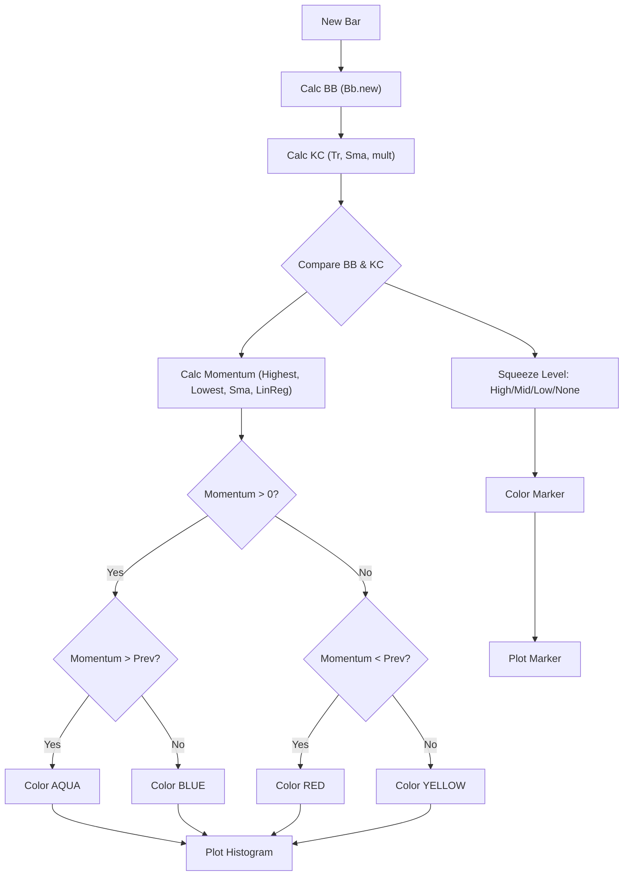

# TTM Squeeze Pro [BLC] - Technical Guide

> Computes Bollinger Bands, Keltner Channels, squeeze conditions, and a momentum oscillator to identify volatility contractions.

| | |
| --- | --- |
| **Language** | Indie Script v5 |
| **Platform** | [TakeProfit](https://takeprofit.com) |
| **Category** | Volatility |
| **Type** | Indicator |
| **Author** | @belegendarycapital on TakeProfit |
| **License** | MIT |
| **Live script** | [Open on TakeProfit](https://takeprofit.com/indicator/ttm-squeeze-pro-blc-90) |
| **Source file** | [TTM Squeeze Pro BLC.indie5](TTM%20Squeeze%20Pro%20BLC.indie5) |

## Overview

This indicator measures volatility contraction and expansion by comparing Bollinger Bands against multiple Keltner Channels. It is designed to identify periods of price consolidation (squeeze) that often precede significant breakouts.

The indicator draws a momentum histogram and a squeeze marker on the chart. The histogram is colored by momentum direction and acceleration. The marker is colored by the squeeze level.

## How it works

1. Calculate Bollinger Bands (basis, upper, lower) over the specified length.
2. Calculate Keltner Channels using the True Range smoothed by a Simple Moving Average, scaled by three user-defined multipliers.
3. Determine squeeze conditions (high, mid, low, none) by comparing Bollinger Band boundaries to Keltner Channel boundaries.
4. Calculate a momentum oscillator: average of highest/lowest and SMA of close, then linear regression of the difference.
5. Color the momentum histogram based on the sign and change in momentum value.
6. Color the squeeze marker dot based on the determined squeeze level.
7. Return a Histogram and a Marker plot object.

## Mathematical model

**Bollinger Bands**

$$
BB_{basis} = \text{SMA}(\text{close}, length)
$$

$$
BB_{upper/lower} = BB_{basis} \pm \text{std}(\text{close}, length) \times bb_{mult}
$$

**Keltner Channels**

$$
dev_{kc} = \text{SMA}(\text{TR}, length)
$$

$$
KC_{upper/lower} = BB_{basis} \pm dev_{kc} \times kc_{mult}
$$

**Momentum Oscillator**

$$
avg_{hl} = \frac{\text{Highest}(\text{high}, length) + \text{Lowest}(\text{low}, length)}{2}
$$

$$
avg_{all} = \frac{avg_{hl} + \text{SMA}(\text{close}, length)}{2}
$$

$$
diff = \text{close} - avg_{all}
$$

$$
mom = \text{LinReg}(diff, length)
$$

## Logic flow



## Parameters

| Parameter | Type | Default | Range | Description |
| --- | --- | --- | --- | --- |
| `length` | int | 20 |  | Squeeze Length |
| `bb_mult` | float | 2.0 |  | Bollinger Band STD Multiplier |
| `kc_mult_high` | float | 1.0 |  | Keltner Channel #1 |
| `kc_mult_mid` | float | 1.5 |  | Keltner Channel #2 |
| `kc_mult_low` | float | 2.0 |  | Keltner Channel #3 |

## Code walkthrough

### Bollinger Bands Setup

Lines 16-20 of [TTM Squeeze Pro BLC.indie5](TTM%20Squeeze%20Pro%20BLC.indie5):

```python
    # Bollinger Bands
    bb_lower_series, bb_basis_series, bb_upper_series = Bb.new(self.close, length, bb_mult)
    bb_lower = bb_lower_series[0]
    bb_upper = bb_upper_series[0]
    bb_basis = bb_basis_series[0]
```

Initializes the Bollinger Bands using the `Bb.new` algorithm. The `[0]` index retrieves the current bar's value for the lower band, basis (SMA), and upper band.

### Keltner Channel Calculation

Lines 22-31 of [TTM Squeeze Pro BLC.indie5](TTM%20Squeeze%20Pro%20BLC.indie5):

```python
    # Keltner Channels
    kc_basis = bb_basis  
    tr_series = Tr.new()
    dev_kc = Sma.new(tr_series, length)[0]
    kc_upper_high = kc_basis + dev_kc * kc_mult_high
    kc_lower_high = kc_basis - dev_kc * kc_mult_high
    kc_upper_mid = kc_basis + dev_kc * kc_mult_mid
    kc_lower_mid = kc_basis - dev_kc * kc_mult_mid
    kc_upper_low = kc_basis + dev_kc * kc_mult_low
    kc_lower_low = kc_basis - dev_kc * kc_mult_low
```

Calculates the Keltner Channels. The deviation is derived from the True Range (`Tr.new`) smoothed by an SMA. This deviation is scaled by three multipliers to create three sets of upper/lower channels.

### Squeeze Condition Logic

Lines 33-37 of [TTM Squeeze Pro BLC.indie5](TTM%20Squeeze%20Pro%20BLC.indie5):

```python
    # Squeeze Conditions
    no_sqz = bb_lower < kc_lower_low or bb_upper > kc_upper_low
    low_sqz = bb_lower >= kc_lower_low or bb_upper <= kc_upper_low
    mid_sqz = bb_lower >= kc_lower_mid or bb_upper <= kc_upper_mid
    high_sqz = bb_lower >= kc_lower_high or bb_upper <= kc_upper_high
```

Defines the squeeze levels by comparing the Bollinger Band boundaries against the Keltner Channel boundaries. The conditions are evaluated from high to low squeeze, but the code uses separate boolean variables and does not enforce a priority order; the marker color is determined by a chained ternary that checks high_sqz first, then mid_sqz, then low_sqz.

### Momentum Oscillator Calculation

Lines 39-48 of [TTM Squeeze Pro BLC.indie5](TTM%20Squeeze%20Pro%20BLC.indie5):

```python
    # Momentum Oscillator
    highest = Highest.new(self.high, length)[0]
    lowest = Lowest.new(self.low, length)[0]
    avg_hl = (highest + lowest) / 2.0
    sma_close = Sma.new(self.close, length)[0]
    avg_all = (avg_hl + sma_close) / 2.0
    diff = self.close[0] - avg_all
    diff_series = MutSeriesF.new(diff)
    mom = LinReg.new(diff_series, length)[0]
    mom_series = MutSeriesF.new(mom)
```

Calculates a momentum oscillator by averaging the highest/lowest prices and the SMA of the close. The difference from this average is fed into a linear regression to produce the momentum value. `MutSeriesF` stores the values for the next bar's calculation.

### Coloring and Plotting

Lines 50-60 of [TTM Squeeze Pro BLC.indie5](TTM%20Squeeze%20Pro%20BLC.indie5):

```python
    # Momentum Histogram Colo
    prev_mom = 0.0 if isnan(mom_series[1]) else mom_series[1]
    iff_1 = color.AQUA if mom > prev_mom else color.BLUE
    iff_2 = color.RED if mom < prev_mom else color.YELLOW
    mom_color = iff_1 if mom > 0 else iff_2

    # Squeeze Dot Colors
    sq_color = color.MAROON if high_sqz else color.RED if mid_sqz else color.BLACK if low_sqz else color.GREEN

    # Plots
    return plot.Histogram(mom, color=mom_color), plot.Marker(value=0.0, color=sq_color)
```

Determines the colors for the histogram and marker based on momentum direction/acceleration and squeeze level. Returns the `plot.Histogram` and `plot.Marker` objects.

## Reading the chart

- The **Histogram** represents the momentum oscillator. Positive momentum is colored AQUA (accelerating) or BLUE (decelerating). Negative momentum is colored RED (accelerating downward) or YELLOW (decelerating downward).
- The **Marker** is a circle plotted at a value of 0.0. Its color indicates the squeeze level: GREEN (no squeeze), BLACK (low squeeze), RED (mid squeeze), MAROON (high squeeze).

## Implementation notes

- The `MutSeriesF` objects for `diff` and `mom` are essential for the `LinReg` calculation and the `prev_mom` comparison across bars.
- The first bar's `mom_series[1]` will be `nan`, so the code initializes `prev_mom` to `0.0` in that case.
- The Keltner Channel basis is explicitly set to the Bollinger Band basis (`bb_basis`), linking the two volatility measures. Note that the code uses `bb_basis` (the SMA of close) as the Keltner basis, not a separate SMA of the typical price.

## FAQ

**How do I adjust the sensitivity of the squeeze detection?**

Modify the `Squeeze Length`, `Bollinger Band STD Multiplier`, and the three `Keltner Channel` multipliers. Higher multipliers make the channels wider, requiring tighter BB consolidation for a squeeze.

**What does the histogram color mean?**

The color indicates momentum direction and acceleration. AQUA/BLUE for positive, RED/YELLOW for negative. AQUA/RED indicate acceleration, BLUE/YELLOW indicate deceleration.

**What is the difference between the squeeze levels?**

The levels (High, Mid, Low, No) indicate how much the Bollinger Bands have contracted relative to the Keltner Channels. Higher squeeze implies tighter consolidation.

## Full source code

Indie Script v5, as published on TakeProfit. Copy it into the platform's script editor or [open the live script](https://takeprofit.com/indicator/ttm-squeeze-pro-blc-90).

```python
# indie:lang_version = 5
from indie import indicator, param, plot, color, line_style, MutSeriesF
from indie.algorithms import Sma, Bb, Tr, Highest, Lowest, LinReg
from math import nan, isnan

@indicator('Squeeze Pro')
@param.int('length', default=20, title="Squeeze Length")
@param.float('bb_mult', default=2.0, title="Bollinger Band STD Multiplier")
@param.float('kc_mult_high', default=1.0, title="Keltner Channel #1")
@param.float('kc_mult_mid', default=1.5, title="Keltner Channel #2")
@param.float('kc_mult_low', default=2.0, title="Keltner Channel #3")
@plot.histogram(title='Momentum', line_width=5)
@plot.marker(title='Squeeze', style=plot.marker_style.CIRCLE, position=plot.marker_position.CENTER, size=5, display_options=plot.MarkerDisplayOptions(pane=True, status_line=False, price_label=False))
def Main(self, length: int, bb_mult: float, kc_mult_high: float, kc_mult_mid: float, kc_mult_low: float):
   
    # Bollinger Bands
    bb_lower_series, bb_basis_series, bb_upper_series = Bb.new(self.close, length, bb_mult)
    bb_lower = bb_lower_series[0]
    bb_upper = bb_upper_series[0]
    bb_basis = bb_basis_series[0]

    # Keltner Channels
    kc_basis = bb_basis  
    tr_series = Tr.new()
    dev_kc = Sma.new(tr_series, length)[0]
    kc_upper_high = kc_basis + dev_kc * kc_mult_high
    kc_lower_high = kc_basis - dev_kc * kc_mult_high
    kc_upper_mid = kc_basis + dev_kc * kc_mult_mid
    kc_lower_mid = kc_basis - dev_kc * kc_mult_mid
    kc_upper_low = kc_basis + dev_kc * kc_mult_low
    kc_lower_low = kc_basis - dev_kc * kc_mult_low

    # Squeeze Conditions
    no_sqz = bb_lower < kc_lower_low or bb_upper > kc_upper_low
    low_sqz = bb_lower >= kc_lower_low or bb_upper <= kc_upper_low
    mid_sqz = bb_lower >= kc_lower_mid or bb_upper <= kc_upper_mid
    high_sqz = bb_lower >= kc_lower_high or bb_upper <= kc_upper_high

    # Momentum Oscillator
    highest = Highest.new(self.high, length)[0]
    lowest = Lowest.new(self.low, length)[0]
    avg_hl = (highest + lowest) / 2.0
    sma_close = Sma.new(self.close, length)[0]
    avg_all = (avg_hl + sma_close) / 2.0
    diff = self.close[0] - avg_all
    diff_series = MutSeriesF.new(diff)
    mom = LinReg.new(diff_series, length)[0]
    mom_series = MutSeriesF.new(mom)

    # Momentum Histogram Colo
    prev_mom = 0.0 if isnan(mom_series[1]) else mom_series[1]
    iff_1 = color.AQUA if mom > prev_mom else color.BLUE
    iff_2 = color.RED if mom < prev_mom else color.YELLOW
    mom_color = iff_1 if mom > 0 else iff_2

    # Squeeze Dot Colors
    sq_color = color.MAROON if high_sqz else color.RED if mid_sqz else color.BLACK if low_sqz else color.GREEN

    # Plots
    return plot.Histogram(mom, color=mom_color), plot.Marker(value=0.0, color=sq_color)
```
