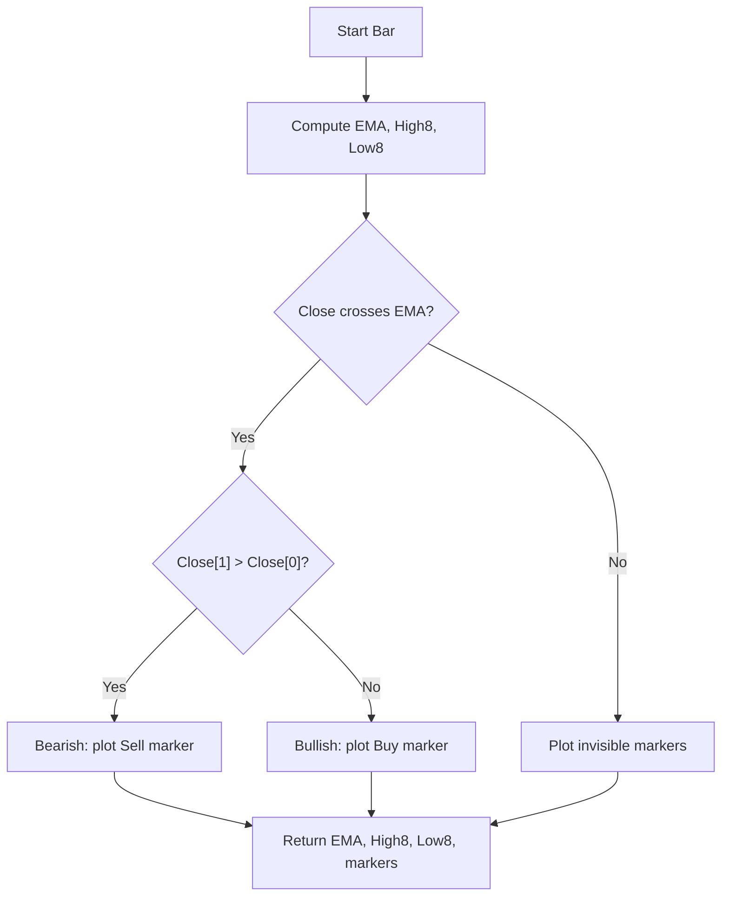

# TonyUX EMA Scalper Buy / Sell (Indie Port) - Technical Guide

> Plots EMA, recent 8-bar high/low, and buy/sell markers on EMA cross with close direction confirmation.

| | |
| --- | --- |
| **Language** | Indie Script v5 |
| **Platform** | [TakeProfit](https://takeprofit.com) |
| **Category** | Moving averages |
| **Type** | Indicator |
| **Author** | @insurgent on TakeProfit |
| **Original** | Original indicator “TonyUX EMA Scalper – Buy / Sell” |
| **License** | MIT |
| **Live script** | [Open on TakeProfit](https://takeprofit.com/indicator/tonyux-ema-scalper-buy-sell-indie-port-72) |
| **Source file** | [TonyUX EMA Scalper Buy - Sell (Indie Port).indie5](TonyUX%20EMA%20Scalper%20Buy%20-%20Sell%20(Indie%20Port).indie5) |

## Overview

This indicator combines an Exponential Moving Average (EMA) with recent price extremes and cross detection to generate short-term momentum signals. It is designed for scalping and intraday workflows, performing best in trending or mildly volatile markets.

The chart displays a blue EMA line, a red line for the highest close over the last 8 bars, and a green line for the lowest close over the last 8 bars. When the close crosses the EMA and the current close is lower than the previous close, a red "Sell" label appears above the bar. When the close crosses the EMA and the current close is higher than the previous close, a green "Buy" label appears below the bar.

## How it works

1. Compute an Exponential Moving Average (EMA) of the user-defined source (default close) with a user-defined length (default 20).
2. Calculate the highest closing price over the last 8 bars and the lowest closing price over the last 8 bars.
3. Detect whether the close price crosses the EMA on the current bar using the built-in cross function.
4. If a cross occurs, compare the current close with the previous close to determine momentum direction.
5. If the close crosses the EMA and the current close is lower than the previous close, set a bearish condition and plot a red 'Sell' marker above the bar.
6. If the close crosses the EMA and the current close is higher than the previous close, set a bullish condition and plot a green 'Buy' marker below the bar.
7. If no cross occurs, plot invisible markers (NaN) to avoid drawing anything.

## Logic flow



## Parameters

| Parameter | Type | Default | Range | Description |
| --- | --- | --- | --- | --- |
| `length` | int | 20 | ≥ 1 | Length |
| `src` | source | source.CLOSE |  | Source |

## Code walkthrough

### Decorators and Plot Definitions

Lines 10-17 of [TonyUX EMA Scalper Buy - Sell (Indie Port).indie5](TonyUX%20EMA%20Scalper%20Buy%20-%20Sell%20(Indie%20Port).indie5):

```python
@indicator("TonyUX EMA Scalper – Buy / Sell (Indie Port)", overlay_main_pane=True)
@param.int('length', default=20, min=1, title='Length')
@param.source('src', default=source.CLOSE, title='Source')
@plot.line(title='EMA', color=color.BLUE)
@plot.line(title='Recent High', color=color.RED, line_width=2)
@plot.line(title='Recent Low', color=color.GREEN, line_width=2)
@plot.marker(title='Sell', color=color.RED, style=plot.marker_style.LABEL, position=plot.marker_position.ABOVE)
@plot.marker(title='Buy', color=color.GREEN, style=plot.marker_style.LABEL, position=plot.marker_position.BELOW)
```

The @indicator decorator sets the indicator name and places it in the main chart pane (overlay). @param.int and @param.source define user-configurable inputs: EMA length (default 20) and source price (default close). @plot.line and @plot.marker decorators declare the output series and their visual properties (colors, line widths, marker styles and positions).

### Algorithm Instances

Lines 19-21 of [TonyUX EMA Scalper Buy - Sell (Indie Port).indie5](TonyUX%20EMA%20Scalper%20Buy%20-%20Sell%20(Indie%20Port).indie5):

```python
    ema_out = Ema.new(src, length)
    last8h = Highest.new(self.close, 8)
    lastl8 = Lowest.new(self.close, 8)
```

Three built-in algorithms are instantiated: Ema.new for the moving average, Highest.new for the highest close over 8 bars, and Lowest.new for the lowest close over 8 bars. These return series objects that are accessed with [0] for the current bar value.

### Cross Detection and Momentum Logic

Lines 23-25 of [TonyUX EMA Scalper Buy - Sell (Indie Port).indie5](TonyUX%20EMA%20Scalper%20Buy%20-%20Sell%20(Indie%20Port).indie5):

```python
    is_cross = cross(self.close, ema_out)
    bearish = is_cross and self.close[1] > self.close[0]
    bullish = is_cross and self.close[1] < self.close[0]
```

The cross function returns True when the close price crosses the EMA on the current bar. Then, the direction of the close (current vs previous) determines whether the cross is bearish (close falling) or bullish (close rising). This adds a momentum confirmation filter to the simple cross.

### Marker Construction

Lines 27-28 of [TonyUX EMA Scalper Buy - Sell (Indie Port).indie5](TonyUX%20EMA%20Scalper%20Buy%20-%20Sell%20(Indie%20Port).indie5):

```python
    sell_marker = plot.Marker(value=self.high[0], color=color.RED, text="Sell") if bearish else plot.Marker(value=float('nan'), color=color.rgba(0,0,0,0))
    buy_marker = plot.Marker(value=self.low[0], color=color.GREEN, text="Buy") if bullish else plot.Marker(value=float('nan'), color=color.rgba(0,0,0,0))
```

Markers are created using plot.Marker with a value (price level), color, and text. When the condition is false, a marker with float('nan') and transparent color is used to suppress drawing. This ensures only valid signals appear on the chart.

### Return Statement

Lines 30-30 of [TonyUX EMA Scalper Buy - Sell (Indie Port).indie5](TonyUX%20EMA%20Scalper%20Buy%20-%20Sell%20(Indie%20Port).indie5):

```python
    return ema_out[0], last8h[0], lastl8[0], sell_marker, buy_marker
```

The Main function returns a tuple of five values matching the @plot decorators: EMA value, recent high, recent low, sell marker, and buy marker. The [0] indexing retrieves the current bar's value from each series.

## Reading the chart

- **Blue line**: Exponential Moving Average (EMA) of the selected source (default close). Acts as dynamic trend reference.
- **Red line**: Highest closing price over the last 8 bars. Provides short-term resistance context.
- **Green line**: Lowest closing price over the last 8 bars. Provides short-term support context.
- **Red "Sell" label** above a bar: Appears when the close crosses the EMA and the current close is lower than the previous close (bearish momentum).
- **Green "Buy" label** below a bar: Appears when the close crosses the EMA and the current close is higher than the previous close (bullish momentum).
- No marker means no cross occurred or the close direction did not confirm the cross.

## Implementation notes

- The indicator uses built-in Ema, Highest, and Lowest algorithms which handle series internally; no manual loop is needed.
- Markers are suppressed by returning float('nan') and a transparent color when conditions are false, ensuring only valid signals are plotted.
- The cross detection is based on the current bar's close and EMA; it does not repaint because it uses only confirmed data at bar close.
- The EMA length parameter has a minimum of 1, but very short lengths may produce excessive signals.

## FAQ

**How can I change the EMA length?**

In the indicator settings, adjust the 'Length' parameter (default 20). Lower values make the EMA more sensitive to price changes, potentially increasing signal frequency.

**What do the Buy and Sell markers mean?**

A Buy marker appears when the close crosses the EMA and the current close is higher than the previous close. A Sell marker appears when the close crosses the EMA and the current close is lower than the previous close. They indicate short-term momentum shifts.

**Can I use this indicator on timeframes other than the chart's?**

The indicator operates on the chart's current timeframe. To use a different timeframe, you would need to modify the code to include sec_context or calc_on, which are not present in this version.

## Full source code

Indie Script v5, as published on TakeProfit. Copy it into the platform's script editor or [open the live script](https://takeprofit.com/indicator/tonyux-ema-scalper-buy-sell-indie-port-72).

```python
# indie:lang_version = 5
# Original indicator “TonyUX EMA Scalper – Buy / Sell”
# Author: tux
# Published on TradingView
# Adapted and rewritten for TakeProfit Platform.
from indie import indicator, param, source, plot, color
from indie.algorithms import Ema, Highest, Lowest
from indie.math import cross

@indicator("TonyUX EMA Scalper – Buy / Sell (Indie Port)", overlay_main_pane=True)
@param.int('length', default=20, min=1, title='Length')
@param.source('src', default=source.CLOSE, title='Source')
@plot.line(title='EMA', color=color.BLUE)
@plot.line(title='Recent High', color=color.RED, line_width=2)
@plot.line(title='Recent Low', color=color.GREEN, line_width=2)
@plot.marker(title='Sell', color=color.RED, style=plot.marker_style.LABEL, position=plot.marker_position.ABOVE)
@plot.marker(title='Buy', color=color.GREEN, style=plot.marker_style.LABEL, position=plot.marker_position.BELOW)
def Main(self, length, src):
    ema_out = Ema.new(src, length)
    last8h = Highest.new(self.close, 8)
    lastl8 = Lowest.new(self.close, 8)
    
    is_cross = cross(self.close, ema_out)
    bearish = is_cross and self.close[1] > self.close[0]
    bullish = is_cross and self.close[1] < self.close[0]
    
    sell_marker = plot.Marker(value=self.high[0], color=color.RED, text="Sell") if bearish else plot.Marker(value=float('nan'), color=color.rgba(0,0,0,0))
    buy_marker = plot.Marker(value=self.low[0], color=color.GREEN, text="Buy") if bullish else plot.Marker(value=float('nan'), color=color.rgba(0,0,0,0))
    
    return ema_out[0], last8h[0], lastl8[0], sell_marker, buy_marker
```
