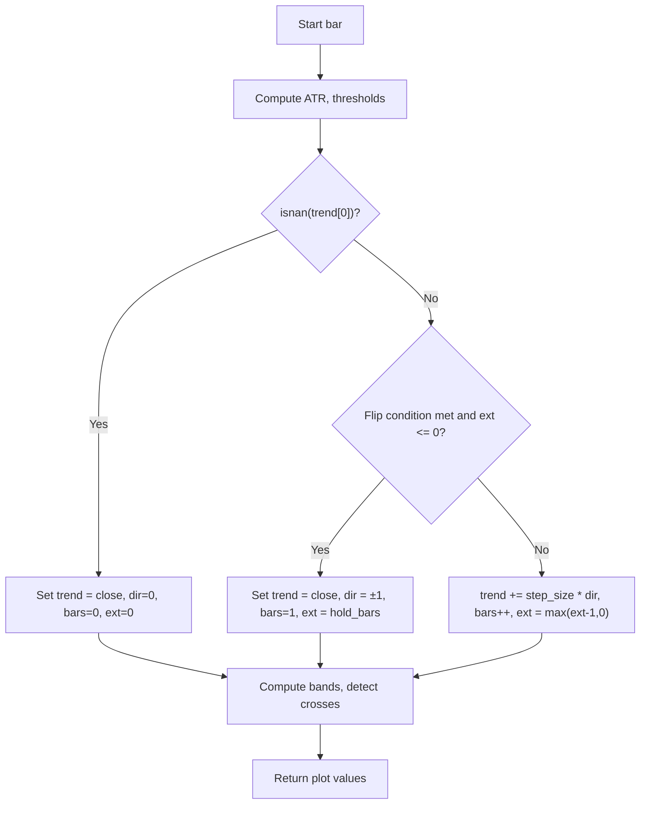

# Trend Impulse Channels - Technical Guide

> A trend-following indicator that discretizes price movement into ATR-based steps with volatility-adaptive channels and retest signals.

| | |
| --- | --- |
| **Language** | Indie Script v5 |
| **Platform** | [TakeProfit](https://takeprofit.com) |
| **Category** | Trend |
| **Type** | Indicator |
| **Author** | @dr_jones on TakeProfit |
| **Original** | Ported to Indie from https://www.tradingview.com/script/d3IaFa7c-Trend-Impulse-Channels-Zeiierman/ created by @Zeiierman |
| **License** | CC BY-NC-SA 4.0, non-commercial (see the header of the source file) |
| **Live script** | [Open on TakeProfit](https://takeprofit.com/indicator/trend-impulse-channels-62) |
| **Source file** | [Trend Impulse Channels.indie5](Trend%20Impulse%20Channels.indie5) |

## Overview

Trend Impulse Channels is a trend-following framework that represents market progression as discrete, stepwise movements rather than continuous slopes. Each new trend step is confirmed only when price crosses an ATR-based threshold, filtering out noise and highlighting meaningful momentum shifts. The indicator is designed for traders who prefer structured visualization over curved lines and rely on momentum-based channels to identify conviction breakouts, pullback retests, and consolidation phases.

The system draws a step line (colored by trend direction), upper and lower ATR-based bands, and optional fill. It marks retests of the channel boundaries (lower retests in lime, upper retests in red) and optionally shows circular markers at each new trend step. The channel width adjusts dynamically to volatility via ATR, and the step logic ensures only significant changes are captured, aligning with the impulse → pause → continuation market rhythm.

## How it works

1. Computes a 200-period ATR and derives three thresholds: step_base (ATR × 2.52), max_step (ATR × max_step_atr), and trigger (ATR × flip_mult).
2. Initializes state variables: trend line (MutSeriesF), direction (Var int), bars_in_trend, and extension counter.
3. On each bar, checks if price has moved beyond the previous trend value ± trigger to start a new trend step (flip condition).
4. If flip is true and extension counter ≤ 0, sets trend to current close, updates direction (+1 or -1), resets bars_in_trend, and sets extension to hold_bars.
5. Otherwise, increments trend by step_size in the current direction (step_size = min(step_base + 0.0093 × bars_in_trend × ATR, max_step)), increments bars_in_trend, and decrements extension.
6. Computes upper and lower bands as trend ± ATR × band_mult, and detects crossunder of low with lower band and crossover of high with upper band for retest signals (optionally filtered by trend direction).
7. Returns plot lines, fill, and marker values for retests and trend steps based on user settings.

## Mathematical model

$$
\text{step\_base} = \text{ATR} \times 2.52
$$

$$
\text{max\_step} = \text{ATR} \times \text{max\_step\_atr}
$$

$$
\text{trigger} = \text{ATR} \times \text{flip\_mult}
$$

$$
\text{step\_size} = \min\left(\text{step\_base} + 0.0093 \times \text{bars\_in\_trend} \times \text{ATR},\; \text{max\_step}\right)
$$

$$
\text{upper} = \text{trend} + \text{ATR} \times \text{band\_mult}
$$

$$
\text{lower} = \text{trend} - \text{ATR} \times \text{band\_mult}
$$

## Logic flow



## Parameters

| Parameter | Type | Default | Range | Description |
| --- | --- | --- | --- | --- |
| `flip_mult` | float | 2.86 |  | Trigger Threshold |
| `max_step_atr` | float | -0.034 |  | Max Step Size |
| `band_mult` | float | 2.02 |  | Band Multiplier |
| `hold_bars` | int | 0 | ≥ 0 | Trend Hold |
| `show_fill` | bool | true |  | Channel Fill |
| `channel_retest_signal` | bool | true |  | Retest Signals |
| `trend_filter` | bool | true |  | Filter by Trend |
| `trend_step_signal` | bool | false |  | Trend Step Signals |

## Code walkthrough

### ATR and Threshold Calculation

Lines 32-35 of [Trend Impulse Channels.indie5](Trend%20Impulse%20Channels.indie5):

```python
    atr = Atr.new(200)[0]
    step_base = atr * 2.52
    max_step  = atr * max_step_atr
    trigger  = atr * flip_mult
```

A 200-period ATR is computed and used to derive three key thresholds: step_base (ATR × 2.52), max_step (ATR × max_step_atr), and trigger (ATR × flip_mult). These thresholds control step sensitivity and channel width. The ATR period is fixed at 200, which provides a long-term volatility baseline.

### State Variables and Flip Condition

Lines 37-45 of [Trend Impulse Channels.indie5](Trend%20Impulse%20Channels.indie5):

```python
    trend = MutSeriesF.new(init=nan)
    dir = Var[int].new(0)
    bars_in_trend = Var[int].new(0)
    extension = Var[int].new(0)

    start_long = self.close[0] > (trend[0] if not isnan(trend[0]) else 0) + trigger
    start_short = self.close[0] < (trend[0] if not isnan(trend[0]) else 0) - trigger
    flip = (start_long or start_short) and bars_in_trend.get() >= 0
    step_size = min(step_base + 0.0093 * bars_in_trend.get() * atr, max_step)
```

State is maintained via MutSeriesF for the trend line and Var integers for direction, bars_in_trend, and extension. The flip condition checks if price has moved beyond the previous trend value ± trigger, and also requires bars_in_trend >= 0 (always true after initialization). The step_size formula adds a small linear component based on bars_in_trend to allow steps to grow over time, capped by max_step.

### Trend Update Logic

Lines 47-61 of [Trend Impulse Channels.indie5](Trend%20Impulse%20Channels.indie5):

```python
    if isnan(trend[0]):
        trend[0] = self.close[0]
        dir.set(0)
        bars_in_trend.set(0)
        extension.set(0)
    else:
        if flip and extension.get() <= 0:
            trend[0] = self.close[0]
            dir.set(1 if start_long else -1)
            bars_in_trend.set(1)
            extension.set(hold_bars)
        else:
            trend[0] += step_size if dir.get() == 1 else -step_size if dir.get() == -1 else 0
            bars_in_trend.set(bars_in_trend.get() + 1)
            extension.set(max(extension.get() - 1, 0))
```

On the first bar (isnan(trend[0])), the trend is initialized to the current close. On subsequent bars, if a flip is detected and the extension counter is ≤ 0, a new trend step is started: trend resets to close, direction is set, bars_in_trend resets to 1, and extension is set to hold_bars. Otherwise, the trend is incremented by step_size in the current direction, bars_in_trend increases, and extension counts down. This implements the step-based progression.

### Retest Signals and Trend Step Markers

Lines 70-88 of [Trend Impulse Channels.indie5](Trend%20Impulse%20Channels.indie5):

```python
    crossunder = cross_under(self.low, MutSeriesF.new(lower))
    crossover  = cross_over(self.high, MutSeriesF.new(upper))

    if trend_filter:
        crossunder = crossunder and trend_direction == 1
        crossover = crossover and trend_direction == -1

    return (
        plot.Line(trend[0], color=trend_color),
        upper,
        lower,
        plot.Fill(trend_color(0.35 if show_fill else 0)),
        self.low[0] if crossunder and channel_retest_signal else nan,
        self.high[0] if crossover and channel_retest_signal else nan,
        self.high[0] if trend_step_signal and trend_step and dir.get() == 1 else nan,
        self.low[0] if trend_step_signal and trend_step and dir.get() == -1 else nan,
        self.high[0] if trend_step_signal and trend_step and dir.get() == 1 else nan,
        self.low[0] if trend_step_signal and trend_step and dir.get() == -1 else nan,
    )
```

Crossunder of low with lower band and crossover of high with upper band are detected. If trend_filter is enabled, only retests aligned with the trend direction are considered (lower retests in uptrend, upper retests in downtrend). The return tuple includes plot lines, fill, and marker values: retest markers are placed at the low/high of the bar, and trend step markers (circles) are placed at the high/low depending on direction. Two sets of step markers are returned: one for the chart (center) and one for a separate pane (with transparency).

## Reading the chart

- **Trend Line**: Colored lime (uptrend), red (downtrend), or gray (no direction). Each step represents a discrete movement confirmed by an ATR-based threshold.
- **Upper/Lower Bands**: Volatility-adaptive envelopes around the trend line. Width = ATR × band_mult.
- **Channel Fill**: Semi-transparent fill between bands when enabled (default 35% opacity).
- **Retest Signals**: A lime marker below the bar when price crosses under the lower band (bullish retest), and a red marker above the bar when price crosses over the upper band (bearish retest). Optionally filtered to only show signals aligned with the current trend direction.
- **Trend Step Signals**: Optional circular markers at each new trend step: lime circles for bullish steps, red circles for bearish steps. Two sets are drawn: one on the chart (center position) and one in a separate pane (with 50% opacity).

## Implementation notes

- The ATR period is hardcoded to 200; it cannot be changed via parameters.
- The max_step_atr parameter defaults to -0.034, which makes max_step negative (since ATR is positive). This forces the cap to be negative, preventing the trend from moving upward. A positive value is required for normal step growth.
- State variables (trend, dir, bars_in_trend, extension) are maintained across bars using MutSeriesF and Var, which do not repaint on historical bars.
- The indicator uses NaN for markers that should not be drawn; only bars meeting the condition return a price value.

## FAQ

**How do I adjust the sensitivity of trend steps?**

Increase the 'Trigger Threshold' (flip_mult) to require a larger price move before a new step is registered, or decrease it for more frequent steps. The default is 2.86.

**What does the 'Max Step Size' parameter do?**

It caps the maximum step size during high volatility. The default is -0.034, which makes the cap negative and effectively prevents upward trend movement. Set it to a positive value (e.g., 3.0) to limit step growth.

**How can I use the retest signals for entries?**

Look for lime markers (lower retest) in an uptrend as potential pullback entries, and red markers (upper retest) in a downtrend as potential continuation entries. Enable 'Filter by Trend' to only see signals aligned with the prevailing direction.

## Full source code

Indie Script v5, as published on TakeProfit. Copy it into the platform's script editor or [open the live script](https://takeprofit.com/indicator/trend-impulse-channels-62).

```python
# Ported to Indie from https://www.tradingview.com/script/d3IaFa7c-Trend-Impulse-Channels-Zeiierman/ created by @Zeiierman

# This work is licensed under a Attribution-NonCommercial-ShareAlike 4.0 International (CC BY-NC-SA 4.0) https://creativecommons.org/licenses/by-nc-sa/4.0/

# indie:lang_version = 5
from math import isnan, nan
from indie import indicator, param, color, plot, Var, MutSeriesF
from indie.algorithms import Atr
from indie.math import cross_under, cross_over


@indicator('Trend Impulse Channels', overlay_main_pane=True)
@param.float('flip_mult', default=2.86, step=0.01, title='Trigger Threshold')
@param.float('max_step_atr', default=-0.034, step=0.001, title='Max Step Size')
@param.float('band_mult', default=2.02, step=0.01, title='Band Multiplier')
@param.int('hold_bars', default=0, min=0, title='Trend Hold')
@param.bool('show_fill', default=True, title='Channel Fill')
@param.bool('channel_retest_signal', default=True, title='Retest Signals')
@param.bool('trend_filter', default=True, title='Filter by Trend')
@param.bool('trend_step_signal', default=False, title='Trend Step Signals')
@plot.line('trend', title='Trend Line', line_width=2)
@plot.line('upper', title='Upper Band', display_options=plot.LineDisplayOptions())
@plot.line('lower', title='Lower Band', display_options=plot.LineDisplayOptions())
@plot.fill('lower', 'upper', title='Fill')
@plot.marker(color=color.LIME, title='Lower Retest', position=plot.marker_position.BELOW, style=plot.marker_style.LABEL, size=7)
@plot.marker(color=color.RED, title='Upper Retest', position=plot.marker_position.ABOVE, style=plot.marker_style.LABEL, size=7)
@plot.marker(color=color.LIME, title='Bullish Step', position=plot.marker_position.CENTER, style=plot.marker_style.CIRCLE)
@plot.marker(color=color.RED, title='Bearish Step', position=plot.marker_position.CENTER, style=plot.marker_style.CIRCLE)
@plot.marker(color=color.LIME(0.5), title='Bullish Step', position=plot.marker_position.CENTER, style=plot.marker_style.CIRCLE, size=7, display_options=plot.MarkerDisplayOptions(pane=True))
@plot.marker(color=color.RED(0.5), title='Bearish Step', position=plot.marker_position.CENTER, style=plot.marker_style.CIRCLE, size=7, display_options=plot.MarkerDisplayOptions(pane=True))
def Main(self, flip_mult, max_step_atr, band_mult, hold_bars, show_fill, channel_retest_signal, trend_filter, trend_step_signal):
    atr = Atr.new(200)[0]
    step_base = atr * 2.52
    max_step  = atr * max_step_atr
    trigger  = atr * flip_mult

    trend = MutSeriesF.new(init=nan)
    dir = Var[int].new(0)
    bars_in_trend = Var[int].new(0)
    extension = Var[int].new(0)

    start_long = self.close[0] > (trend[0] if not isnan(trend[0]) else 0) + trigger
    start_short = self.close[0] < (trend[0] if not isnan(trend[0]) else 0) - trigger
    flip = (start_long or start_short) and bars_in_trend.get() >= 0
    step_size = min(step_base + 0.0093 * bars_in_trend.get() * atr, max_step)

    if isnan(trend[0]):
        trend[0] = self.close[0]
        dir.set(0)
        bars_in_trend.set(0)
        extension.set(0)
    else:
        if flip and extension.get() <= 0:
            trend[0] = self.close[0]
            dir.set(1 if start_long else -1)
            bars_in_trend.set(1)
            extension.set(hold_bars)
        else:
            trend[0] += step_size if dir.get() == 1 else -step_size if dir.get() == -1 else 0
            bars_in_trend.set(bars_in_trend.get() + 1)
            extension.set(max(extension.get() - 1, 0))

    trend_direction = 1 if dir.get() == 1 else -1 if dir.get() == -1 else 0
    upper = trend[0] + atr * band_mult
    lower = trend[0] - atr * band_mult

    trend_color = color.LIME if dir.get() == 1 else color.RED if dir.get() == -1 else color.GRAY
    trend_step  = (dir.get() != 0) and (trend[0] != trend[1]) and ((trend[0] > trend[1] and dir.get() == 1) or (trend[0] < trend[1] and dir.get() == -1))

    crossunder = cross_under(self.low, MutSeriesF.new(lower))
    crossover  = cross_over(self.high, MutSeriesF.new(upper))

    if trend_filter:
        crossunder = crossunder and trend_direction == 1
        crossover = crossover and trend_direction == -1

    return (
        plot.Line(trend[0], color=trend_color),
        upper,
        lower,
        plot.Fill(trend_color(0.35 if show_fill else 0)),
        self.low[0] if crossunder and channel_retest_signal else nan,
        self.high[0] if crossover and channel_retest_signal else nan,
        self.high[0] if trend_step_signal and trend_step and dir.get() == 1 else nan,
        self.low[0] if trend_step_signal and trend_step and dir.get() == -1 else nan,
        self.high[0] if trend_step_signal and trend_step and dir.get() == 1 else nan,
        self.low[0] if trend_step_signal and trend_step and dir.get() == -1 else nan,
    )
```
