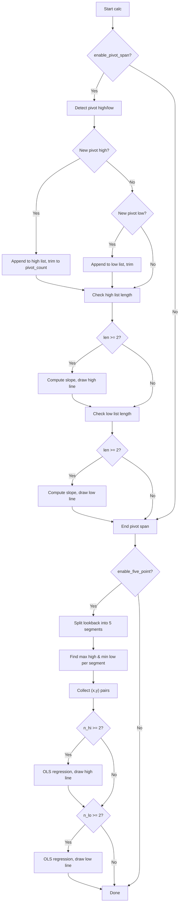

# Trend Line Methods (TLM) - Technical Guide

> Draws dynamic trend lines from recent pivot points and a 5-segment linear regression channel.

| | |
| --- | --- |
| **Language** | Indie Script v5 |
| **Platform** | [TakeProfit](https://takeprofit.com) |
| **Category** | Support & resistance |
| **Type** | Indicator |
| **Author** | @chartjunkie on TakeProfit |
| **License** | MIT |
| **Live script** | [Open on TakeProfit](https://takeprofit.com/indicator/trend-line-methods-tlm-indie-version-61) |
| **Source file** | [Trend Line Methods (TLM).indie5](Trend%20Line%20Methods%20(TLM).indie5) |

## Overview

The Trend Line Methods indicator draws two independent sets of trend lines on the price chart. The Pivot Span method connects the oldest and newest pivot highs and lows within a user-defined lookback, creating lines that adapt as new pivots form. The 5-Point Channel method divides the lookback into five segments of roughly equal length, finds the extreme high and low in each segment, and fits an ordinary least squares regression line through those points, forming a channel.

These lines are intended to highlight potential dynamic support and resistance levels and to visualize the prevailing slope of price extremes. By default, pivot span lines are dashed orange, and the 5-point channel lines are solid fuchsia. Both methods can be enabled independently and customized with color, width, and line style.

## How it works

1. If Pivot Span is enabled, detect pivot highs and lows using PivotHighLow with the given left/right bars.
2. When a new pivot high is confirmed (not NaN), append its bar index and price to a rolling list, keeping only the most recent pivot_count entries.
3. When a new pivot low is confirmed, do the same for the low list.
4. If at least two pivot highs exist, compute the slope between the oldest and newest pivot, then draw a line segment from the start of the lookback to the current bar using that slope.
5. Repeat the drawing step for pivot lows, erasing any previously drawn line first.
6. If 5-Point Channel is enabled and enough bars exist, split the lookback into five segments and find the maximum high and minimum low in each segment.
7. Collect the (x, y) pairs for the found highs and lows, then compute OLS regression slope and intercept for each set.
8. Draw the regression line for highs and for lows across the lookback, erasing previous lines.

## Mathematical model

**Pivot Span slope**

$$
slope = \frac{price_{newest} - price_{oldest}}{index_{newest} - index_{oldest}}
$$

$$
line\_price(x) = price_{oldest} + slope \cdot (x - index_{oldest})
$$

**5-Point Channel OLS regression**

For a set of \(n\) points \((x_i, y_i)\):

$$
slope = \frac{n \sum x_i y_i - \sum x_i \sum y_i}{n \sum x_i^2 - (\sum x_i)^2}
$$

$$
intercept = \frac{\sum y_i - slope \cdot \sum x_i}{n}
$$

$$
line\_price(x) = intercept + slope \cdot x
$$

## Logic flow



## Parameters

| Parameter | Type | Default | Range | Description |
| --- | --- | --- | --- | --- |
| `enable_pivot_span` | bool | true |  | Pivot Span |
| `pivot_high_color` | color | color.ORANGE |  | High Color |
| `pivot_low_color` | color | color.ORANGE |  | Low Color |
| `pivot_left` | int | 5 | ≥ 1 | Pivot Left |
| `pivot_right` | int | 5 | ≥ 1 | Pivot Right |
| `pivot_count` | int | 5 | ≥ 2 | Pivot Count |
| `pivot_lookback` | int | 150 | ≥ 10 | Lookback |
| `pivot_line_width` | int | 2 | 1 - 10 | Pivot Line Width |
| `pivot_line_style` | int | 1 | 0 - 2 | Pivot Style 0/1/2 |
| `enable_five_point` | bool | false |  | 5-Point Channel |
| `five_high_color` | color | color.FUCHSIA |  | 5pt High |
| `five_low_color` | color | color.FUCHSIA |  | 5pt Low |
| `five_lookback` | int | 100 | ≥ 10 | 5pt Lookback |
| `five_line_width` | int | 3 | 1 - 10 | 5pt Line Width |
| `five_line_style` | int | 0 | 0 - 2 | 5pt Style 0/1/2 |

## Code walkthrough

### Collecting pivot points

Lines 76-93 of [Trend Line Methods (TLM).indie5](Trend%20Line%20Methods%20(TLM).indie5):

```python
            if not isnan(ph[0]):
                piv_hi_idx = self.bar_index - pivot_right
                piv_hi_price = self.high[pivot_right]
                self._high_idx_points.get().append(piv_hi_idx)
                self._high_val_points.get().append(piv_hi_price)
                while len(self._high_idx_points.get()) > pivot_count:
                    self._high_idx_points.get().pop(0)
                    self._high_val_points.get().pop(0)

            # Collect pivot lows
            if not isnan(pl[0]):
                piv_lo_idx = self.bar_index - pivot_right
                piv_lo_price = self.low[pivot_right]
                self._low_idx_points.get().append(piv_lo_idx)
                self._low_val_points.get().append(piv_lo_price)
                while len(self._low_idx_points.get()) > pivot_count:
                    self._low_idx_points.get().pop(0)
                    self._low_val_points.get().pop(0)
```

When a pivot high is detected (ph[0] is not NaN), the code calculates the bar index where the pivot actually occurred (pivot_right bars ago) and the corresponding high price. These values are appended to rolling lists. The while loop ensures the lists never exceed pivot_count entries by removing the oldest element from the front. The same logic is applied for pivot lows. This maintains a sliding window of the most recent confirmed pivots.

### Drawing the pivot high trend line

Lines 96-125 of [Trend Line Methods (TLM).indie5](Trend%20Line%20Methods%20(TLM).indie5):

```python
            if len(self._high_idx_points.get()) >= 2:
                far_hi_idx = self._high_idx_points.get()[0]
                far_hi_val = self._high_val_points.get()[0]
                near_hi_idx = self._high_idx_points.get()[-1]
                near_hi_val = self._high_val_points.get()[-1]
                hi_bar_diff = near_hi_idx - far_hi_idx

                # Declare slope before conditional (Indie scoping)
                hi_slope = 0.0
                if hi_bar_diff != 0:
                    hi_slope = (near_hi_val - far_hi_val) / hi_bar_diff
                hi_intercept = far_hi_val - hi_slope * far_hi_idx

                x1_hi = self.bar_index - (pivot_lookback - 1)
                x2_hi = self.bar_index
                y1_hi = hi_intercept + hi_slope * x1_hi
                y2_hi = hi_intercept + hi_slope * x2_hi

                if self._high_trend_line.get() is not None:
                    self.chart.erase(self._high_trend_line.get().value())

                line = LineSegment(
                    AbsolutePosition(self.time[pivot_lookback - 1], y1_hi),
                    AbsolutePosition(self.time[0], y2_hi),
                    color=pivot_high_color,
                    line_style=p_style,
                    line_width=pivot_line_width
                )
                self._high_trend_line.set(line)
                self.chart.draw(line)
```

If at least two pivot highs are stored, the oldest (index 0) and newest (index -1) are used to compute the slope. A zero bar difference is guarded against to avoid division by zero. The line’s y-values are calculated for the left edge (pivot_lookback - 1 bars ago) and the current bar using the linear equation. Any previously drawn high line is erased, then a new LineSegment is created with the chosen color, style, and width, and drawn on the chart.

### Segment loop for 5-point channel

Lines 178-220 of [Trend Line Methods (TLM).indie5](Trend%20Line%20Methods%20(TLM).indie5):

```python
                for k in range(5):
                    seg_start = k * seg_len_base
                    remaining = five_lookback - seg_start
                    if remaining <= 0:
                        break

                    seg_len_k = min(seg_len_base, remaining) if k < 4 else remaining

                    max_hi = nan
                    barsAgo_hi = -1
                    for i in range(seg_len_k):
                        sh = seg_start + i
                        v = self.high[sh]
                        if not isnan(v) and (isnan(max_hi) or v > max_hi):
                            max_hi = v
                            barsAgo_hi = sh

                    if barsAgo_hi >= 0:
                        x_hi = float(self.bar_index - barsAgo_hi)
                        y_hi = self.high[barsAgo_hi]
                        sum_x_hi += x_hi
                        sum_y_hi += y_hi
                        sum_xy_hi += x_hi * y_hi
                        sum_x2_hi += x_hi * x_hi
                        n_hi += 1

                    min_lo = nan
                    barsAgo_lo = -1
                    for i in range(seg_len_k):
                        sl = seg_start + i
                        v2 = self.low[sl]
                        if not isnan(v2) and (isnan(min_lo) or v2 < min_lo):
                            min_lo = v2
                            barsAgo_lo = sl

                    if barsAgo_lo >= 0:
                        x_lo = float(self.bar_index - barsAgo_lo)
                        y_lo = self.low[barsAgo_lo]
                        sum_x_lo += x_lo
                        sum_y_lo += y_lo
                        sum_xy_lo += x_lo * y_lo
                        sum_x2_lo += x_lo * x_lo
                        n_lo += 1
```

The lookback is divided into five segments of roughly equal length. For each segment, the code scans all bars in that segment to find the maximum high and minimum low, ignoring NaN values. The bar index (converted to an x-coordinate (the bar index)) and the price are accumulated into sums for later regression. The loop handles the last segment’s remaining bars and breaks early if no bars are left.

### OLS regression for the high line

Lines 223-231 of [Trend Line Methods (TLM).indie5](Trend%20Line%20Methods%20(TLM).indie5):

```python
                if n_hi >= 2:
                    nf_hi = float(n_hi)
                    denom_hi = nf_hi * sum_x2_hi - sum_x_hi * sum_x_hi

                    # Declare slope before conditional
                    slope_hi = 0.0
                    if denom_hi != 0.0:
                        slope_hi = (nf_hi * sum_xy_hi - sum_x_hi * sum_y_hi) / denom_hi
                    intercept_hi = (sum_y_hi - slope_hi * sum_x_hi) / nf_hi
```

With at least two high points collected, the ordinary least squares formulas are applied. The denominator is checked for zero to avoid division errors. The slope and intercept are computed from the accumulated sums. These coefficients define the best-fit line through the segment highs.

### Drawing the 5-point high line

Lines 241-249 of [Trend Line Methods (TLM).indie5](Trend%20Line%20Methods%20(TLM).indie5):

```python
                    line = LineSegment(
                        AbsolutePosition(self.time[five_lookback - 1], y1_hi_5pt),
                        AbsolutePosition(self.time[0], y2_hi_5pt),
                        color=five_high_color,
                        line_style=f_style,
                        line_width=five_line_width
                    )
                    self._five_high_line.set(line)
                    self.chart.draw(line)
```

The regression line is extended across the entire lookback by evaluating the linear equation at the leftmost and rightmost bar indices. The previous high line is erased, and a new LineSegment is drawn using the five_high_color and the selected line style and width. The same pattern is repeated for the low line.

## Reading the chart

- **Pivot Span lines** (default dashed orange): Connect the oldest and newest pivot highs/lows within the lookback. They act as dynamic trendlines that may serve as support (low line) or resistance (high line).
- **5-Point Channel lines** (default solid fuchsia): Represent a linear regression channel through the extreme highs and lows of five segments. The upper line often acts as resistance, the lower as support.
- Both line types extend from the start of the lookback to the current bar and update on each new bar. Because pivot lines are drawn only after confirmation (pivot_right bars later), they may repaint historically.
- No markers or labels are drawn; only the line segments appear on the chart.

## Implementation notes

- Pivot lines repaint: a pivot is confirmed only after pivot_right bars, so the line may change as new pivots appear within that window.
- NaN values from PivotHighLow are explicitly checked; pivots are only collected when ph[0] or pl[0] is not NaN.
- Line style integers 0,1,2 are mapped to SOLID, DASHED, DOTTED via conditional blocks; any other value defaults to SOLID.
- The 5-point channel requires bar_index >= five_lookback to avoid accessing negative indices; segment length calculation uses floor division and handles the last segment’s remainder.

## FAQ

**How can I change the number of pivot points used for the Pivot Span line?**

Adjust the 'Pivot Count' parameter. The indicator keeps only the most recent N pivot highs and lows, then draws a line between the oldest and newest in that set.

**Why do the lines sometimes disappear or jump?**

Pivot lines require at least two confirmed pivots within the lookback. If fewer exist, no line is drawn. Also, because pivots confirm after pivot_right bars, the line may repaint as new pivots appear or old ones fall out of the rolling window.

**Can I use this indicator on a higher timeframe while viewing a lower one?**

The code does not use sec_context or calc_on, so it operates only on the chart’s current timeframe. To apply it to a higher timeframe, you would need to modify the script to request a secondary context.

## Full source code

Indie Script v5, as published on TakeProfit. Copy it into the platform's script editor or [open the live script](https://takeprofit.com/indicator/trend-line-methods-tlm-indie-version-61).

```python
# indie:lang_version = 5
# =============================================================================
# Trend Line Methods Indicator v1.0.0
# =============================================================================
#
# METHOD 1: PIVOT SPAN - Two-point pivot trendlines (oldest <-> newest pivot)
# METHOD 2: 5-POINT CHANNEL - OLS linear regression through 5 segment extremes
#
# REPAINT: Pivot lines confirm after pivot_right bars. This is expected behavior.
# LINE STYLES: 0 = Solid, 1 = Dashed, 2 = Dotted
# =============================================================================

from indie import indicator, param, color, MainContext, Optional
from indie.algorithms import PivotHighLow
from indie.drawings import LineSegment, AbsolutePosition, line_segment_style
from math import isnan, nan, floor

@indicator('Trend Line Methods', overlay_main_pane=True)
@param.bool('enable_pivot_span', default=True, title='Pivot Span')
@param.color('pivot_high_color', default=color.ORANGE, title='High Color')
@param.color('pivot_low_color', default=color.ORANGE, title='Low Color')
@param.int('pivot_left', default=5, min=1, title='Pivot Left')
@param.int('pivot_right', default=5, min=1, title='Pivot Right')
@param.int('pivot_count', default=5, min=2, title='Pivot Count')
@param.int('pivot_lookback', default=150, min=10, title='Lookback')
@param.int('pivot_line_width', default=2, min=1, max=10, title='Pivot Line Width')
@param.int('pivot_line_style', default=1, min=0, max=2, title='Pivot Style 0/1/2')
@param.bool('enable_five_point', default=False, title='5-Point Channel')
@param.color('five_high_color', default=color.FUCHSIA, title='5pt High')
@param.color('five_low_color', default=color.FUCHSIA, title='5pt Low')
@param.int('five_lookback', default=100, min=10, title='5pt Lookback')
@param.int('five_line_width', default=3, min=1, max=10, title='5pt Line Width')
@param.int('five_line_style', default=0, min=0, max=2, title='5pt Style 0/1/2')
class Main(MainContext):
    def __init__(self):
        empty_int_list: list[int] = []
        empty_float_list: list[float] = []
        self._high_idx_points = self.new_var(empty_int_list)
        self._high_val_points = self.new_var(empty_float_list)
        self._low_idx_points = self.new_var(empty_int_list)
        self._low_val_points = self.new_var(empty_float_list)

        none_line: Optional[LineSegment] = None
        self._high_trend_line = self.new_var(none_line)
        self._low_trend_line = self.new_var(none_line)
        self._five_high_line = self.new_var(none_line)
        self._five_low_line = self.new_var(none_line)

    def calc(self, enable_pivot_span, pivot_high_color, pivot_low_color,
             pivot_left, pivot_right, pivot_count, pivot_lookback,
             pivot_line_width, pivot_line_style,
             enable_five_point, five_high_color, five_low_color, five_lookback,
             five_line_width, five_line_style):

        # Get line styles
        p_style = line_segment_style.SOLID
        if pivot_line_style == 1:
            p_style = line_segment_style.DASHED
        elif pivot_line_style == 2:
            p_style = line_segment_style.DOTTED

        f_style = line_segment_style.SOLID
        if five_line_style == 1:
            f_style = line_segment_style.DASHED
        elif five_line_style == 2:
            f_style = line_segment_style.DOTTED

        # =====================================================================
        # METHOD 1: PIVOT SPAN
        # =====================================================================
        if enable_pivot_span:
            ph, _ = PivotHighLow.new(self.high, left_bars=pivot_left, right_bars=pivot_right)
            _, pl = PivotHighLow.new(self.low, left_bars=pivot_left, right_bars=pivot_right)

            # Collect pivot highs
            if not isnan(ph[0]):
                piv_hi_idx = self.bar_index - pivot_right
                piv_hi_price = self.high[pivot_right]
                self._high_idx_points.get().append(piv_hi_idx)
                self._high_val_points.get().append(piv_hi_price)
                while len(self._high_idx_points.get()) > pivot_count:
                    self._high_idx_points.get().pop(0)
                    self._high_val_points.get().pop(0)

            # Collect pivot lows
            if not isnan(pl[0]):
                piv_lo_idx = self.bar_index - pivot_right
                piv_lo_price = self.low[pivot_right]
                self._low_idx_points.get().append(piv_lo_idx)
                self._low_val_points.get().append(piv_lo_price)
                while len(self._low_idx_points.get()) > pivot_count:
                    self._low_idx_points.get().pop(0)
                    self._low_val_points.get().pop(0)

            # Draw high trend line
            if len(self._high_idx_points.get()) >= 2:
                far_hi_idx = self._high_idx_points.get()[0]
                far_hi_val = self._high_val_points.get()[0]
                near_hi_idx = self._high_idx_points.get()[-1]
                near_hi_val = self._high_val_points.get()[-1]
                hi_bar_diff = near_hi_idx - far_hi_idx

                # Declare slope before conditional (Indie scoping)
                hi_slope = 0.0
                if hi_bar_diff != 0:
                    hi_slope = (near_hi_val - far_hi_val) / hi_bar_diff
                hi_intercept = far_hi_val - hi_slope * far_hi_idx

                x1_hi = self.bar_index - (pivot_lookback - 1)
                x2_hi = self.bar_index
                y1_hi = hi_intercept + hi_slope * x1_hi
                y2_hi = hi_intercept + hi_slope * x2_hi

                if self._high_trend_line.get() is not None:
                    self.chart.erase(self._high_trend_line.get().value())

                line = LineSegment(
                    AbsolutePosition(self.time[pivot_lookback - 1], y1_hi),
                    AbsolutePosition(self.time[0], y2_hi),
                    color=pivot_high_color,
                    line_style=p_style,
                    line_width=pivot_line_width
                )
                self._high_trend_line.set(line)
                self.chart.draw(line)

            # Draw low trend line
            if len(self._low_idx_points.get()) >= 2:
                far_lo_idx = self._low_idx_points.get()[0]
                far_lo_val = self._low_val_points.get()[0]
                near_lo_idx = self._low_idx_points.get()[-1]
                near_lo_val = self._low_val_points.get()[-1]
                lo_bar_diff = near_lo_idx - far_lo_idx

                # Declare slope before conditional (Indie scoping)
                lo_slope = 0.0
                if lo_bar_diff != 0:
                    lo_slope = (near_lo_val - far_lo_val) / lo_bar_diff
                lo_intercept = far_lo_val - lo_slope * far_lo_idx

                x1_lo = self.bar_index - (pivot_lookback - 1)
                x2_lo = self.bar_index
                y1_lo = lo_intercept + lo_slope * x1_lo
                y2_lo = lo_intercept + lo_slope * x2_lo

                if self._low_trend_line.get() is not None:
                    self.chart.erase(self._low_trend_line.get().value())

                line = LineSegment(
                    AbsolutePosition(self.time[pivot_lookback - 1], y1_lo),
                    AbsolutePosition(self.time[0], y2_lo),
                    color=pivot_low_color,
                    line_style=p_style,
                    line_width=pivot_line_width
                )
                self._low_trend_line.set(line)
                self.chart.draw(line)

        # =====================================================================
        # METHOD 2: 5-POINT CHANNEL
        # =====================================================================
        if enable_five_point:
            if self.bar_index >= five_lookback:
                sum_x_hi = 0.0
                sum_y_hi = 0.0
                sum_xy_hi = 0.0
                sum_x2_hi = 0.0
                n_hi = 0

                sum_x_lo = 0.0
                sum_y_lo = 0.0
                sum_xy_lo = 0.0
                sum_x2_lo = 0.0
                n_lo = 0

                seg_len_base = max(1, floor(five_lookback / 5))

                for k in range(5):
                    seg_start = k * seg_len_base
                    remaining = five_lookback - seg_start
                    if remaining <= 0:
                        break

                    seg_len_k = min(seg_len_base, remaining) if k < 4 else remaining

                    max_hi = nan
                    barsAgo_hi = -1
                    for i in range(seg_len_k):
                        sh = seg_start + i
                        v = self.high[sh]
                        if not isnan(v) and (isnan(max_hi) or v > max_hi):
                            max_hi = v
                            barsAgo_hi = sh

                    if barsAgo_hi >= 0:
                        x_hi = float(self.bar_index - barsAgo_hi)
                        y_hi = self.high[barsAgo_hi]
                        sum_x_hi += x_hi
                        sum_y_hi += y_hi
                        sum_xy_hi += x_hi * y_hi
                        sum_x2_hi += x_hi * x_hi
                        n_hi += 1

                    min_lo = nan
                    barsAgo_lo = -1
                    for i in range(seg_len_k):
                        sl = seg_start + i
                        v2 = self.low[sl]
                        if not isnan(v2) and (isnan(min_lo) or v2 < min_lo):
                            min_lo = v2
                            barsAgo_lo = sl

                    if barsAgo_lo >= 0:
                        x_lo = float(self.bar_index - barsAgo_lo)
                        y_lo = self.low[barsAgo_lo]
                        sum_x_lo += x_lo
                        sum_y_lo += y_lo
                        sum_xy_lo += x_lo * y_lo
                        sum_x2_lo += x_lo * x_lo
                        n_lo += 1

                # Draw five-point high line
                if n_hi >= 2:
                    nf_hi = float(n_hi)
                    denom_hi = nf_hi * sum_x2_hi - sum_x_hi * sum_x_hi

                    # Declare slope before conditional
                    slope_hi = 0.0
                    if denom_hi != 0.0:
                        slope_hi = (nf_hi * sum_xy_hi - sum_x_hi * sum_y_hi) / denom_hi
                    intercept_hi = (sum_y_hi - slope_hi * sum_x_hi) / nf_hi

                    x1_5pt = self.bar_index - five_lookback + 1
                    x2_5pt = self.bar_index
                    y1_hi_5pt = intercept_hi + slope_hi * float(x1_5pt)
                    y2_hi_5pt = intercept_hi + slope_hi * float(x2_5pt)

                    if self._five_high_line.get() is not None:
                        self.chart.erase(self._five_high_line.get().value())

                    line = LineSegment(
                        AbsolutePosition(self.time[five_lookback - 1], y1_hi_5pt),
                        AbsolutePosition(self.time[0], y2_hi_5pt),
                        color=five_high_color,
                        line_style=f_style,
                        line_width=five_line_width
                    )
                    self._five_high_line.set(line)
                    self.chart.draw(line)

                # Draw five-point low line
                if n_lo >= 2:
                    nf_lo = float(n_lo)
                    denom_lo = nf_lo * sum_x2_lo - sum_x_lo * sum_x_lo

                    # Declare slope before conditional
                    slope_lo = 0.0
                    if denom_lo != 0.0:
                        slope_lo = (nf_lo * sum_xy_lo - sum_x_lo * sum_y_lo) / denom_lo
                    intercept_lo = (sum_y_lo - slope_lo * sum_x_lo) / nf_lo

                    x1_5pt = self.bar_index - five_lookback + 1
                    x2_5pt = self.bar_index
                    y1_lo_5pt = intercept_lo + slope_lo * float(x1_5pt)
                    y2_lo_5pt = intercept_lo + slope_lo * float(x2_5pt)

                    if self._five_low_line.get() is not None:
                        self.chart.erase(self._five_low_line.get().value())

                    line = LineSegment(
                        AbsolutePosition(self.time[five_lookback - 1], y1_lo_5pt),
                        AbsolutePosition(self.time[0], y2_lo_5pt),
                        color=five_low_color,
                        line_style=f_style,
                        line_width=five_line_width
                    )
                    self._five_low_line.set(line)
                    self.chart.draw(line)

        return
```
