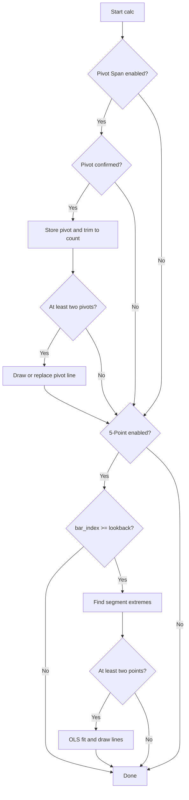

# Trend Line Methods (TLM) - Technical Guide

> Draws two-point pivot trend lines through confirmed swing highs and lows, plus OLS regression channel lines through five segment extremes.

| | |
| --- | --- |
| **Language** | Indie Script v5 |
| **Platform** | [TakeProfit](https://takeprofit.com) |
| **Category** | Trend |
| **Type** | Indicator |
| **Author** | @chartjunkie on TakeProfit |
| **License** | MIT |
| **Live script** | [Open on TakeProfit](https://takeprofit.com/indicator/trend-line-methods-tlm-indie-version-61) |
| **Source file** | [Trend Line Methods (TLM).indie5](Trend%20Line%20Methods%20(TLM).indie5) |

## Overview

Trend Line Methods places two independent trend-line systems on the main chart. The Pivot Span method stores confirmed pivot highs and pivot lows, connects the oldest and newest stored pivot in each list, and extends that line across a configurable lookback window. The 5-Point Channel method splits a lookback window into five segments, takes the highest high and lowest low of each segment, and fits a least-squares regression line through those extremes.

Pivot Span lines appear after a pivot has been confirmed on the right, so they follow the swing structure rather than every bar. The 5-Point lines show the slope and average level of the extreme prices over the last `five_lookback` bars and can be used as channel edges. Both methods are independent; each can be enabled or disabled from the settings.

## How it works

1. On each bar, if Pivot Span is enabled, PivotHighLow.new is called on self.high and self.low with pivot_left and pivot_right.
2. When ph[0] or pl[0] is not nan, a pivot is treated as confirmed at bar_index - pivot_right; the bar index and price are appended to the matching list.
3. Each pivot list is trimmed to the most recent pivot_count entries, removing the oldest pivot when the limit is exceeded.
4. With at least two stored pivots, the line slope and intercept are computed from the oldest and newest stored pivots, then the line is evaluated from pivot_lookback bars ago to the current bar.
5. If 5-Point Channel is enabled and bar_index >= five_lookback, the lookback is split into five segments and each segment's highest high and lowest low are found.
6. The high and low extremes are accumulated into the sums needed for ordinary least-squares regression.
7. If at least two high or two low extremes were found, the corresponding slope and intercept are calculated and a LineSegment is drawn from five_lookback bars ago to the current bar.
8. Before drawing a new line, any previously drawn line for that method and side is erased with chart.erase.

## Mathematical model

Pivot Span uses two stored points:

$$
m=\frac{y_{\text{near}}-y_{\text{far}}}{x_{\text{near}}-x_{\text{far}}}
$$

$$
b=y_{\text{far}}-m\,x_{\text{far}}
$$

The line is evaluated at the left and right edges of the lookback window: $y(x)=b+m\,x$.

5-Point Channel uses ordinary least squares on the collected extremes:

$$
m=\frac{n\sum xy-\sum x\sum y}{n\sum x^2-(\sum x)^2}
$$

$$
b=\frac{\sum y-m\sum x}{n}
$$

## Logic flow



## Parameters

| Parameter | Type | Default | Range | Description |
| --- | --- | --- | --- | --- |
| `enable_pivot_span` | bool | true |  | Pivot Span |
| `pivot_high_color` | color | color.ORANGE |  | High Color |
| `pivot_low_color` | color | color.ORANGE |  | Low Color |
| `pivot_left` | int | 5 | ≥ 1 | Pivot Left |
| `pivot_right` | int | 5 | ≥ 1 | Pivot Right |
| `pivot_count` | int | 5 | ≥ 2 | Pivot Count |
| `pivot_lookback` | int | 150 | ≥ 10 | Lookback |
| `pivot_line_width` | int | 2 | 1 - 10 | Pivot Line Width |
| `pivot_line_style` | int | 1 | 0 - 2 | Pivot Style 0/1/2 |
| `enable_five_point` | bool | false |  | 5-Point Channel |
| `five_high_color` | color | color.FUCHSIA |  | 5pt High |
| `five_low_color` | color | color.FUCHSIA |  | 5pt Low |
| `five_lookback` | int | 100 | ≥ 10 | 5pt Lookback |
| `five_line_width` | int | 3 | 1 - 10 | 5pt Line Width |
| `five_line_style` | int | 0 | 0 - 2 | 5pt Style 0/1/2 |

## Code walkthrough

### Pivot confirmation and collection

Lines 71-93 of [Trend Line Methods (TLM).indie5](Trend%20Line%20Methods%20(TLM).indie5):

```python
        if enable_pivot_span:
            ph, _ = PivotHighLow.new(self.high, left_bars=pivot_left, right_bars=pivot_right)
            _, pl = PivotHighLow.new(self.low, left_bars=pivot_left, right_bars=pivot_right)

            # Collect pivot highs
            if not isnan(ph[0]):
                piv_hi_idx = self.bar_index - pivot_right
                piv_hi_price = self.high[pivot_right]
                self._high_idx_points.get().append(piv_hi_idx)
                self._high_val_points.get().append(piv_hi_price)
                while len(self._high_idx_points.get()) > pivot_count:
                    self._high_idx_points.get().pop(0)
                    self._high_val_points.get().pop(0)

            # Collect pivot lows
            if not isnan(pl[0]):
                piv_lo_idx = self.bar_index - pivot_right
                piv_lo_price = self.low[pivot_right]
                self._low_idx_points.get().append(piv_lo_idx)
                self._low_val_points.get().append(piv_lo_price)
                while len(self._low_idx_points.get()) > pivot_count:
                    self._low_idx_points.get().pop(0)
                    self._low_val_points.get().pop(0)
```

The PivotHighLow algorithm returns a series where ph[0] and pl[0] are nan until a pivot is confirmed. When ph[0] is not nan, the pivot bar is identified as bar_index - pivot_right and the price is taken from high[pivot_right]. The same logic runs for pivot lows, and both lists are trimmed to the last pivot_count entries.

### High pivot slope and extrapolation

Lines 95-113 of [Trend Line Methods (TLM).indie5](Trend%20Line%20Methods%20(TLM).indie5):

```python
            # Draw high trend line
            if len(self._high_idx_points.get()) >= 2:
                far_hi_idx = self._high_idx_points.get()[0]
                far_hi_val = self._high_val_points.get()[0]
                near_hi_idx = self._high_idx_points.get()[-1]
                near_hi_val = self._high_val_points.get()[-1]
                hi_bar_diff = near_hi_idx - far_hi_idx

                # Declare slope before conditional (Indie scoping)
                hi_slope = 0.0
                if hi_bar_diff != 0:
                    hi_slope = (near_hi_val - far_hi_val) / hi_bar_diff
                hi_intercept = far_hi_val - hi_slope * far_hi_idx

                x1_hi = self.bar_index - (pivot_lookback - 1)
                x2_hi = self.bar_index
                y1_hi = hi_intercept + hi_slope * x1_hi
                y2_hi = hi_intercept + hi_slope * x2_hi

```

The first and last stored pivot highs are used as the two points of the trend line. The slope is the price change divided by the bar-index difference, and the intercept is derived from the farthest pivot. The line is then evaluated at the left edge of the lookback window and at the current bar.

### Low pivot slope and extrapolation

Lines 127-144 of [Trend Line Methods (TLM).indie5](Trend%20Line%20Methods%20(TLM).indie5):

```python
            # Draw low trend line
            if len(self._low_idx_points.get()) >= 2:
                far_lo_idx = self._low_idx_points.get()[0]
                far_lo_val = self._low_val_points.get()[0]
                near_lo_idx = self._low_idx_points.get()[-1]
                near_lo_val = self._low_val_points.get()[-1]
                lo_bar_diff = near_lo_idx - far_lo_idx

                # Declare slope before conditional (Indie scoping)
                lo_slope = 0.0
                if lo_bar_diff != 0:
                    lo_slope = (near_lo_val - far_lo_val) / lo_bar_diff
                lo_intercept = far_lo_val - lo_slope * far_lo_idx

                x1_lo = self.bar_index - (pivot_lookback - 1)
                x2_lo = self.bar_index
                y1_lo = lo_intercept + lo_slope * x1_lo
                y2_lo = lo_intercept + lo_slope * x2_lo
```

The low side repeats the same two-point calculation with the stored pivot lows. Using separate variables for the low slope and intercept keeps the high and low lines independent. The resulting y values feed the LineSegment drawn with the pivot line style and width.

### Segment scanning for 5-point channel

Lines 178-202 of [Trend Line Methods (TLM).indie5](Trend%20Line%20Methods%20(TLM).indie5):

```python
                for k in range(5):
                    seg_start = k * seg_len_base
                    remaining = five_lookback - seg_start
                    if remaining <= 0:
                        break

                    seg_len_k = min(seg_len_base, remaining) if k < 4 else remaining

                    max_hi = nan
                    barsAgo_hi = -1
                    for i in range(seg_len_k):
                        sh = seg_start + i
                        v = self.high[sh]
                        if not isnan(v) and (isnan(max_hi) or v > max_hi):
                            max_hi = v
                            barsAgo_hi = sh

                    if barsAgo_hi >= 0:
                        x_hi = float(self.bar_index - barsAgo_hi)
                        y_hi = self.high[barsAgo_hi]
                        sum_x_hi += x_hi
                        sum_y_hi += y_hi
                        sum_xy_hi += x_hi * y_hi
                        sum_x2_hi += x_hi * x_hi
                        n_hi += 1
```

The lookback is divided into five segments with a base segment length of floor(five_lookback / 5). For each segment, the highest high is found by scanning high[sh], and its absolute bar index is recorded. The sums for x, y, x*y and x^2 are accumulated for the later regression. The low side uses the same scan pattern on low[sh].

### OLS fit for the high channel line

Lines 222-240 of [Trend Line Methods (TLM).indie5](Trend%20Line%20Methods%20(TLM).indie5):

```python
                # Draw five-point high line
                if n_hi >= 2:
                    nf_hi = float(n_hi)
                    denom_hi = nf_hi * sum_x2_hi - sum_x_hi * sum_x_hi

                    # Declare slope before conditional
                    slope_hi = 0.0
                    if denom_hi != 0.0:
                        slope_hi = (nf_hi * sum_xy_hi - sum_x_hi * sum_y_hi) / denom_hi
                    intercept_hi = (sum_y_hi - slope_hi * sum_x_hi) / nf_hi

                    x1_5pt = self.bar_index - five_lookback + 1
                    x2_5pt = self.bar_index
                    y1_hi_5pt = intercept_hi + slope_hi * float(x1_5pt)
                    y2_hi_5pt = intercept_hi + slope_hi * float(x2_5pt)

                    if self._five_high_line.get() is not None:
                        self.chart.erase(self._five_high_line.get().value())

```

The high-side sums are converted into an OLS slope and intercept. If the denominator is zero, the slope is set to 0.0 to avoid division by zero. The regression line is evaluated at the left and right edges of the lookback window, then drawn as a LineSegment.

### OLS fit for the low channel line

Lines 251-260 of [Trend Line Methods (TLM).indie5](Trend%20Line%20Methods%20(TLM).indie5):

```python
                # Draw five-point low line
                if n_lo >= 2:
                    nf_lo = float(n_lo)
                    denom_lo = nf_lo * sum_x2_lo - sum_x_lo * sum_x_lo

                    # Declare slope before conditional
                    slope_lo = 0.0
                    if denom_lo != 0.0:
                        slope_lo = (nf_lo * sum_xy_lo - sum_x_lo * sum_y_lo) / denom_lo
                    intercept_lo = (sum_y_lo - slope_lo * sum_x_lo) / nf_lo
```

The low side uses the same OLS formula on the low extremes. It only runs when at least two low extremes were found, and it produces y1/y2 values that are drawn with the same five-point color and style settings.

## Reading the chart

- Pivot high line: colored `pivot_high_color` (default orange), drawn through the oldest and newest confirmed pivot highs and extended over `pivot_lookback` bars.
- Pivot low line: colored `pivot_low_color` (default orange), drawn through the oldest and newest confirmed pivot lows.
- Pivot line style and width come from `pivot_line_style` and `pivot_line_width`; style 0 is solid, 1 dashed, 2 dotted.
- 5-Point high and low lines: colored `five_high_color`/`five_low_color` (default fuchsia), drawn as OLS regressions through the segment extremes of the last `five_lookback` bars.
- A rising line means later extremes are higher than earlier extremes; a falling line means the opposite. The lines are visual structure only and produce no signals.
- No pivot markers or extreme markers are drawn; only line segments are visible.

## Implementation notes

- Pivot lines repaint by design: they are only stored and drawn after pivot_right bars of confirmation, so the line can appear or change once the pivot is confirmed.
- The 5-Point lines are recalculated on every bar and therefore move as new bars are added.
- List state is kept in self.new_var containers; .get() returns the list and mutations persist between bars.
- The slope denominator can be zero; the code then sets the slope to 0.0 instead of skipping the line.

## FAQ

**Why do the pivot lines appear only after a delay?**

PivotHighLow.new needs pivot_right bars to the right of a pivot before it can confirm that pivot. The code stores the pivot only when ph[0] or pl[0] is not nan, so the line is first drawn pivot_right bars after the pivot bar.

**How do I enable only one of the two methods?**

Use the enable_pivot_span and enable_five_point checkboxes in the indicator settings. Each method is wrapped in its own if block, so disabling one prevents its lines from being stored or drawn.

**What do the style parameters 0/1/2 mean?**

The pivot_line_style and five_line_style parameters map to solid, dashed and dotted line styles. The code maps 0 to SOLID, 1 to DASHED, and 2 to DOTTED before any line is drawn.

## Full source code

Indie Script v5, as published on TakeProfit. Copy it into the platform's script editor or [open the live script](https://takeprofit.com/indicator/trend-line-methods-tlm-indie-version-61).

```python
# indie:lang_version = 5
# =============================================================================
# Trend Line Methods Indicator v1.0.0
# =============================================================================
#
# METHOD 1: PIVOT SPAN - Two-point pivot trendlines (oldest <-> newest pivot)
# METHOD 2: 5-POINT CHANNEL - OLS linear regression through 5 segment extremes
#
# REPAINT: Pivot lines confirm after pivot_right bars. This is expected behavior.
# LINE STYLES: 0 = Solid, 1 = Dashed, 2 = Dotted
# =============================================================================

from indie import indicator, param, color, MainContext, Optional
from indie.algorithms import PivotHighLow
from indie.drawings import LineSegment, AbsolutePosition, line_segment_style
from math import isnan, nan, floor

@indicator('Trend Line Methods', overlay_main_pane=True)
@param.bool('enable_pivot_span', default=True, title='Pivot Span')
@param.color('pivot_high_color', default=color.ORANGE, title='High Color')
@param.color('pivot_low_color', default=color.ORANGE, title='Low Color')
@param.int('pivot_left', default=5, min=1, title='Pivot Left')
@param.int('pivot_right', default=5, min=1, title='Pivot Right')
@param.int('pivot_count', default=5, min=2, title='Pivot Count')
@param.int('pivot_lookback', default=150, min=10, title='Lookback')
@param.int('pivot_line_width', default=2, min=1, max=10, title='Pivot Line Width')
@param.int('pivot_line_style', default=1, min=0, max=2, title='Pivot Style 0/1/2')
@param.bool('enable_five_point', default=False, title='5-Point Channel')
@param.color('five_high_color', default=color.FUCHSIA, title='5pt High')
@param.color('five_low_color', default=color.FUCHSIA, title='5pt Low')
@param.int('five_lookback', default=100, min=10, title='5pt Lookback')
@param.int('five_line_width', default=3, min=1, max=10, title='5pt Line Width')
@param.int('five_line_style', default=0, min=0, max=2, title='5pt Style 0/1/2')
class Main(MainContext):
    def __init__(self):
        empty_int_list: list[int] = []
        empty_float_list: list[float] = []
        self._high_idx_points = self.new_var(empty_int_list)
        self._high_val_points = self.new_var(empty_float_list)
        self._low_idx_points = self.new_var(empty_int_list)
        self._low_val_points = self.new_var(empty_float_list)

        none_line: Optional[LineSegment] = None
        self._high_trend_line = self.new_var(none_line)
        self._low_trend_line = self.new_var(none_line)
        self._five_high_line = self.new_var(none_line)
        self._five_low_line = self.new_var(none_line)

    def calc(self, enable_pivot_span, pivot_high_color, pivot_low_color,
             pivot_left, pivot_right, pivot_count, pivot_lookback,
             pivot_line_width, pivot_line_style,
             enable_five_point, five_high_color, five_low_color, five_lookback,
             five_line_width, five_line_style):

        # Get line styles
        p_style = line_segment_style.SOLID
        if pivot_line_style == 1:
            p_style = line_segment_style.DASHED
        elif pivot_line_style == 2:
            p_style = line_segment_style.DOTTED

        f_style = line_segment_style.SOLID
        if five_line_style == 1:
            f_style = line_segment_style.DASHED
        elif five_line_style == 2:
            f_style = line_segment_style.DOTTED

        # =====================================================================
        # METHOD 1: PIVOT SPAN
        # =====================================================================
        if enable_pivot_span:
            ph, _ = PivotHighLow.new(self.high, left_bars=pivot_left, right_bars=pivot_right)
            _, pl = PivotHighLow.new(self.low, left_bars=pivot_left, right_bars=pivot_right)

            # Collect pivot highs
            if not isnan(ph[0]):
                piv_hi_idx = self.bar_index - pivot_right
                piv_hi_price = self.high[pivot_right]
                self._high_idx_points.get().append(piv_hi_idx)
                self._high_val_points.get().append(piv_hi_price)
                while len(self._high_idx_points.get()) > pivot_count:
                    self._high_idx_points.get().pop(0)
                    self._high_val_points.get().pop(0)

            # Collect pivot lows
            if not isnan(pl[0]):
                piv_lo_idx = self.bar_index - pivot_right
                piv_lo_price = self.low[pivot_right]
                self._low_idx_points.get().append(piv_lo_idx)
                self._low_val_points.get().append(piv_lo_price)
                while len(self._low_idx_points.get()) > pivot_count:
                    self._low_idx_points.get().pop(0)
                    self._low_val_points.get().pop(0)

            # Draw high trend line
            if len(self._high_idx_points.get()) >= 2:
                far_hi_idx = self._high_idx_points.get()[0]
                far_hi_val = self._high_val_points.get()[0]
                near_hi_idx = self._high_idx_points.get()[-1]
                near_hi_val = self._high_val_points.get()[-1]
                hi_bar_diff = near_hi_idx - far_hi_idx

                # Declare slope before conditional (Indie scoping)
                hi_slope = 0.0
                if hi_bar_diff != 0:
                    hi_slope = (near_hi_val - far_hi_val) / hi_bar_diff
                hi_intercept = far_hi_val - hi_slope * far_hi_idx

                x1_hi = self.bar_index - (pivot_lookback - 1)
                x2_hi = self.bar_index
                y1_hi = hi_intercept + hi_slope * x1_hi
                y2_hi = hi_intercept + hi_slope * x2_hi

                if self._high_trend_line.get() is not None:
                    self.chart.erase(self._high_trend_line.get().value())

                line = LineSegment(
                    AbsolutePosition(self.time[pivot_lookback - 1], y1_hi),
                    AbsolutePosition(self.time[0], y2_hi),
                    color=pivot_high_color,
                    line_style=p_style,
                    line_width=pivot_line_width
                )
                self._high_trend_line.set(line)
                self.chart.draw(line)

            # Draw low trend line
            if len(self._low_idx_points.get()) >= 2:
                far_lo_idx = self._low_idx_points.get()[0]
                far_lo_val = self._low_val_points.get()[0]
                near_lo_idx = self._low_idx_points.get()[-1]
                near_lo_val = self._low_val_points.get()[-1]
                lo_bar_diff = near_lo_idx - far_lo_idx

                # Declare slope before conditional (Indie scoping)
                lo_slope = 0.0
                if lo_bar_diff != 0:
                    lo_slope = (near_lo_val - far_lo_val) / lo_bar_diff
                lo_intercept = far_lo_val - lo_slope * far_lo_idx

                x1_lo = self.bar_index - (pivot_lookback - 1)
                x2_lo = self.bar_index
                y1_lo = lo_intercept + lo_slope * x1_lo
                y2_lo = lo_intercept + lo_slope * x2_lo

                if self._low_trend_line.get() is not None:
                    self.chart.erase(self._low_trend_line.get().value())

                line = LineSegment(
                    AbsolutePosition(self.time[pivot_lookback - 1], y1_lo),
                    AbsolutePosition(self.time[0], y2_lo),
                    color=pivot_low_color,
                    line_style=p_style,
                    line_width=pivot_line_width
                )
                self._low_trend_line.set(line)
                self.chart.draw(line)

        # =====================================================================
        # METHOD 2: 5-POINT CHANNEL
        # =====================================================================
        if enable_five_point:
            if self.bar_index >= five_lookback:
                sum_x_hi = 0.0
                sum_y_hi = 0.0
                sum_xy_hi = 0.0
                sum_x2_hi = 0.0
                n_hi = 0

                sum_x_lo = 0.0
                sum_y_lo = 0.0
                sum_xy_lo = 0.0
                sum_x2_lo = 0.0
                n_lo = 0

                seg_len_base = max(1, floor(five_lookback / 5))

                for k in range(5):
                    seg_start = k * seg_len_base
                    remaining = five_lookback - seg_start
                    if remaining <= 0:
                        break

                    seg_len_k = min(seg_len_base, remaining) if k < 4 else remaining

                    max_hi = nan
                    barsAgo_hi = -1
                    for i in range(seg_len_k):
                        sh = seg_start + i
                        v = self.high[sh]
                        if not isnan(v) and (isnan(max_hi) or v > max_hi):
                            max_hi = v
                            barsAgo_hi = sh

                    if barsAgo_hi >= 0:
                        x_hi = float(self.bar_index - barsAgo_hi)
                        y_hi = self.high[barsAgo_hi]
                        sum_x_hi += x_hi
                        sum_y_hi += y_hi
                        sum_xy_hi += x_hi * y_hi
                        sum_x2_hi += x_hi * x_hi
                        n_hi += 1

                    min_lo = nan
                    barsAgo_lo = -1
                    for i in range(seg_len_k):
                        sl = seg_start + i
                        v2 = self.low[sl]
                        if not isnan(v2) and (isnan(min_lo) or v2 < min_lo):
                            min_lo = v2
                            barsAgo_lo = sl

                    if barsAgo_lo >= 0:
                        x_lo = float(self.bar_index - barsAgo_lo)
                        y_lo = self.low[barsAgo_lo]
                        sum_x_lo += x_lo
                        sum_y_lo += y_lo
                        sum_xy_lo += x_lo * y_lo
                        sum_x2_lo += x_lo * x_lo
                        n_lo += 1

                # Draw five-point high line
                if n_hi >= 2:
                    nf_hi = float(n_hi)
                    denom_hi = nf_hi * sum_x2_hi - sum_x_hi * sum_x_hi

                    # Declare slope before conditional
                    slope_hi = 0.0
                    if denom_hi != 0.0:
                        slope_hi = (nf_hi * sum_xy_hi - sum_x_hi * sum_y_hi) / denom_hi
                    intercept_hi = (sum_y_hi - slope_hi * sum_x_hi) / nf_hi

                    x1_5pt = self.bar_index - five_lookback + 1
                    x2_5pt = self.bar_index
                    y1_hi_5pt = intercept_hi + slope_hi * float(x1_5pt)
                    y2_hi_5pt = intercept_hi + slope_hi * float(x2_5pt)

                    if self._five_high_line.get() is not None:
                        self.chart.erase(self._five_high_line.get().value())

                    line = LineSegment(
                        AbsolutePosition(self.time[five_lookback - 1], y1_hi_5pt),
                        AbsolutePosition(self.time[0], y2_hi_5pt),
                        color=five_high_color,
                        line_style=f_style,
                        line_width=five_line_width
                    )
                    self._five_high_line.set(line)
                    self.chart.draw(line)

                # Draw five-point low line
                if n_lo >= 2:
                    nf_lo = float(n_lo)
                    denom_lo = nf_lo * sum_x2_lo - sum_x_lo * sum_x_lo

                    # Declare slope before conditional
                    slope_lo = 0.0
                    if denom_lo != 0.0:
                        slope_lo = (nf_lo * sum_xy_lo - sum_x_lo * sum_y_lo) / denom_lo
                    intercept_lo = (sum_y_lo - slope_lo * sum_x_lo) / nf_lo

                    x1_5pt = self.bar_index - five_lookback + 1
                    x2_5pt = self.bar_index
                    y1_lo_5pt = intercept_lo + slope_lo * float(x1_5pt)
                    y2_lo_5pt = intercept_lo + slope_lo * float(x2_5pt)

                    if self._five_low_line.get() is not None:
                        self.chart.erase(self._five_low_line.get().value())

                    line = LineSegment(
                        AbsolutePosition(self.time[five_lookback - 1], y1_lo_5pt),
                        AbsolutePosition(self.time[0], y2_lo_5pt),
                        color=five_low_color,
                        line_style=f_style,
                        line_width=five_line_width
                    )
                    self._five_low_line.set(line)
                    self.chart.draw(line)

        return
```
