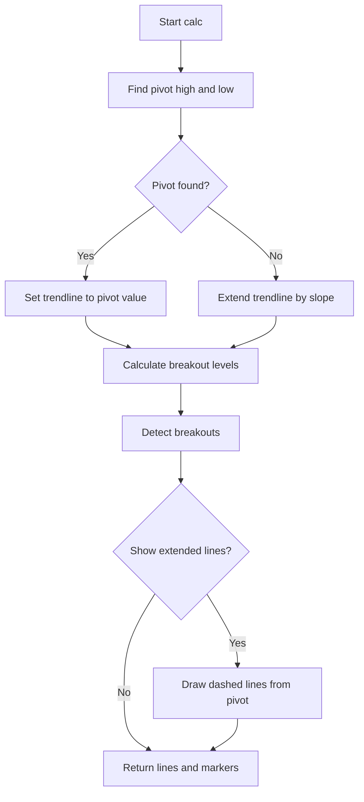

# Trendlines with Breaks - Technical Guide

> Plots trendlines based on pivot highs/lows and marks breakout events when price crosses them.

| | |
| --- | --- |
| **Language** | Indie Script v5 |
| **Platform** | [TakeProfit](https://takeprofit.com) |
| **Category** | Trend |
| **Type** | Indicator |
| **Author** | @dr_jones on TakeProfit |
| **Original** | Ported to Indie from https://www.tradingview.com/script/IYL88A1N-Trendlines-with-Breaks-LuxAlgo/ created by @LuxAlgo |
| **License** | licensed under a Attribution-NonCommercial-ShareAlike 4.0 International (CC BY-NC-SA 4.0) (see the header of the source file) |
| **Live script** | [Open on TakeProfit](https://takeprofit.com/indicator/trendlines-with-breaks-27) |
| **Source file** | [Trendlines with Breaks.indie5](Trendlines%20with%20Breaks.indie5) |

## Overview

This indicator is a port of LuxAlgo's Trendlines with Breaks script. It identifies pivot highs and lows using a swing detection lookback, then draws trendlines with a slope calculated from ATR, standard deviation, or linear regression. It marks breakouts when price crosses the trendline levels. It is designed to help detect trend changes and potential breakout points.

On the chart, the indicator draws an upper trendline (teal) and a lower trendline (red). When a pivot is found and extended lines are enabled, dashed lines are drawn from the pivot point extending to the right. Breakout events are marked with a 'B' label: teal 'B' below the bar for upper breakouts, red 'B' above the bar for lower breakouts.

## How it works

1. Find pivot highs and lows by checking if a bar's high/low is the highest/lowest within a symmetric lookback window.
2. Calculate slope using the selected method: ATR, standard deviation of close, or linear regression of close vs bar index.
3. Update trendline values: when a pivot is found, set the trendline to the pivot value; otherwise, extend the previous trendline by the slope (subtract for upper, add for lower).
4. Compute breakout levels as the trendline value offset by slope multiplied by the lookback length.
5. Detect breakouts by comparing the current close price to the breakout level; update a stateful counter that triggers a marker when the state increases.
6. Draw extended dashed lines from the pivot point to the right if show_ext is enabled and a pivot exists.
7. Return plot lines with an offset for backpainting and marker objects for breakout events.

## Mathematical model

### Slope Calculation

**ATR method:**
$$
\text{slope} = \frac{\text{ATR}(\text{length})}{\text{length}} \times \text{mult}
$$

**Stdev method:**
$$
\text{slope} = \frac{\sigma(\text{close}, \text{length})}{\text{length}} \times \text{mult}
$$

**Linreg method:**
$$
\text{slope} = \frac{|\rho \cdot \frac{\sigma_y}{\sigma_x}|}{2} \times \text{mult}
$$
where $\rho$ is the correlation between close and bar index, $\sigma_y$ is the standard deviation of close, and $\sigma_x$ is the standard deviation of bar index.

### Breakout Levels

$$
\text{upper\_break} = \text{upper} - \text{slope\_ph} \times \text{length}
$$
$$
\text{lower\_break} = \text{lower} + \text{slope\_pl} \times \text{length}
$$

## Logic flow



## Parameters

| Parameter | Type | Default | Range | Description |
| --- | --- | --- | --- | --- |
| `length` | int | 14 | ≥ 1 | Swing Detection Lookback |
| `mult` | float | 1.0 | ≥ 0.0 | Slope |
| `calc_method` | str | Atr |  | Slope Calculation Method |
| `backpaint` | bool | true |  | Backpainting |
| `show_ext` | bool | true |  | Show Extended Lines |

## Code walkthrough

### Pivot Detection

Lines 32-50 of [Trendlines with Breaks.indie5](Trendlines%20with%20Breaks.indie5):

```python
    def pivot_high(self, length_left: int, length_right: int) -> float:
        """Find pivot high"""
        if self.bar_count < length_left + length_right + 1:
            return nan

        center_idx = length_right
        center_high = self.high[center_idx]

        # Check left side
        for i in range(length_left):
            if self.high[center_idx + i + 1] >= center_high:
                return nan

        # Check right side
        for i in range(length_right):
            if self.high[i] >= center_high:
                return nan

        return center_high
```

The `pivot_high` and `pivot_low` methods check if the current bar's high/low is strictly greater/less than all bars within a symmetric window of `length_left` and `length_right` (both set to `length`). If the bar count is insufficient, they return `nan`. This identifies local extremes.

### Slope Calculation

Lines 72-88 of [Trendlines with Breaks.indie5](Trendlines%20with%20Breaks.indie5):

```python
    def calculate_slope(self, length: int, mult: float, calc_method: str) -> float:
        if calc_method == 'Atr':
            atr = Atr.new(length)
            return atr[0] / length * mult
        elif calc_method == 'Stdev':
            stdev = StdDev.new(self.close, length)
            return stdev[0] / length * mult
        else:
            # Linear regression slope calculation
            y = self.close
            x = MutSeriesF.new(self.bar_index)
            dev_x = StdDev.new(x, length)[0]
            dev_y = StdDev.new(y, length)[0]
            corr = Corr.new(x, y, length)[0]
            slope = corr * divide(dev_y, dev_x, 0)
            return abs(slope) / 2.0 * mult
        return 0.0
```

The `calculate_slope` method computes a slope value based on the selected method. For ATR, it uses `Atr.new(length)` and divides by length. For Stdev, it uses `StdDev.new(self.close, length)`. For Linreg, it computes standard deviations of close and bar index, their correlation, and derives slope as `abs(corr * dev_y / dev_x) / 2 * mult`. The result is used to define the steepness of the trendlines.

### Trendline Update

Lines 100-112 of [Trendlines with Breaks.indie5](Trendlines%20with%20Breaks.indie5):

```python
        # Update slopes when pivots are found
        slope_ph = Var[float].new(0)
        slope_pl = Var[float].new(0)
        if has_ph:
            slope_ph.set(slope)
        if has_pl:
            slope_pl.set(slope)

        # Calculate trendlines
        upper = Var[float].new(0)
        lower = Var[float].new(0)
        upper.set(ph if has_ph else upper.get() - slope_ph.get())
        lower.set(pl if has_pl else lower.get() + slope_pl.get())
```

Stateful variables `slope_ph`, `slope_pl`, `upper`, and `lower` are updated each bar. When a pivot is found, the trendline is set to the pivot value and the slope is stored. Otherwise, the trendline is extended by subtracting (upper) or adding (lower) the stored slope, creating a continuous line.

### Breakout Detection

Lines 114-122 of [Trendlines with Breaks.indie5](Trendlines%20with%20Breaks.indie5):

```python
        # Breakout detection levels
        upper_break_level = upper.get() - slope_ph.get() * length
        lower_break_level = lower.get() + slope_pl.get() * length

        # Update breakout states
        upos = MutSeries[int].new(init=0)
        dnos = MutSeries[int].new(init=0)
        upos[0] = 0 if has_ph else 1 if self.close[0] > upper_break_level else upos[0]
        dnos[0] = 0 if has_pl else 1 if self.close[0] < lower_break_level else dnos[0]
```

Breakout levels are computed as the trendline value offset by `slope * length`. `MutSeries` variables `upos` and `dnos` track breakout state: they are set to 1 when the close price crosses the breakout level and no pivot is found. A breakout marker is triggered when the state increases from the previous bar (i.e., `upos[0] > upos[1]`).

### Extended Lines Drawing

Lines 134-150 of [Trendlines with Breaks.indie5](Trendlines%20with%20Breaks.indie5):

```python
        if has_ph and show_ext:
            start_y = ph if backpaint else upper_break_level
            end_y = (ph - slope) if backpaint else upper_break_level - slope_ph.get()

            self._uptl.point_a = AbsolutePosition(start_x, start_y)
            self._uptl.point_b = AbsolutePosition(end_x, end_y)

            self.chart.draw(self._uptl)

        if has_pl and show_ext:
            start_y = pl if backpaint else lower_break_level
            end_y = (pl + slope) if backpaint else lower_break_level + slope_pl.get()

            self._dntl.point_a = AbsolutePosition(start_x, start_y)
            self._dntl.point_b = AbsolutePosition(end_x, end_y)

            self.chart.draw(self._dntl)
```

If a pivot is found and `show_ext` is enabled, dashed `LineSegment` objects are drawn from the pivot point (or breakout level if backpainting is off) extending to the right. The start and end positions are set using `AbsolutePosition` with time coordinates.

### Return Values

Lines 152-164 of [Trendlines with Breaks.indie5](Trendlines%20with%20Breaks.indie5):

```python
        # Create Line objects with offset
        upper_plot = plot.Line(
            upper.get() if backpaint else upper_break_level,
            color=color.BLACK(0) if has_ph else None, offset=-offset)
        lower_plot = plot.Line(
            lower.get() if backpaint else lower_break_level,
            color=color.BLACK(0) if has_pl else None, offset=-offset)

        # Breakout markers
        upper_break_marker = plot.Marker(self.low[0] if upos[0] > upos[1] else nan)
        lower_break_marker = plot.Marker(self.high[0] if dnos[0] > dnos[1] else nan)

        return upper_plot, lower_plot, upper_break_marker, lower_break_marker
```

The method returns two `plot.Line` objects and two `plot.Marker` objects. The lines use an offset for backpainting and are made transparent (`color.BLACK(0)`) when a pivot is found, relying on the extended lines for visual representation. The markers are placed at the low or high price when a breakout is detected.

## Reading the chart

- **Upper Trendline (Teal)**: Represents a dynamic resistance level derived from pivot highs. When a pivot high is found, the line starts at that high and slopes downward (subtracting slope each bar).
- **Lower Trendline (Red)**: Represents a dynamic support level derived from pivot lows. When a pivot low is found, the line starts at that low and slopes upward (adding slope each bar).
- **Dashed Extended Lines**: When enabled, dashed lines extend from the pivot point to the right, showing the projected trendline direction.
- **Breakout Markers ('B')**: A teal 'B' below the bar indicates an upper breakout (price moved above the upper breakout level). A red 'B' above the bar indicates a lower breakout (price moved below the lower breakout level).
- **Backpainting**: When enabled, the trendlines are shifted left by the lookback length, aligning them with the pivot points that generated them.

## Implementation notes

- The indicator uses `MutSeries` for stateful breakout detection, which persists between bars and allows detecting transitions.
- Pivot detection returns `nan` when no pivot is found; the code handles this with `isnan` checks.
- The `backpaint` parameter controls whether trendlines are drawn from the pivot point (backpainting on) or from the current bar (off).
- Extended lines are only drawn when a pivot is found and `show_ext` is enabled; they use `LineSegment` with `extend_type=RIGHT` and dashed style.

## FAQ

**How can I adjust the sensitivity of the trendlines?**

Increase the 'Swing Detection Lookback' length to require more bars for a pivot, making trendlines smoother. Increase the 'Slope' multiplier to make trendlines steeper.

**What is the difference between the three slope calculation methods?**

ATR uses the Average True Range over the lookback period, producing consistent angles. Stdev uses the standard deviation of close prices, which can vary more. Linreg derives slope from linear regression of close vs bar index, often resulting in different steepness.

**How are breakouts detected exactly?**

A breakout occurs when the close price crosses a level computed as the current trendline value plus/minus slope times lookback length. The indicator tracks state changes and marks the breakout only once per event.

## Full source code

Indie Script v5, as published on TakeProfit. Copy it into the platform's script editor or [open the live script](https://takeprofit.com/indicator/trendlines-with-breaks-27).

```python
# Ported to Indie from https://www.tradingview.com/script/IYL88A1N-Trendlines-with-Breaks-LuxAlgo/ created by @LuxAlgo

# This source code is licensed under a Attribution-NonCommercial-ShareAlike 4.0 International (CC BY-NC-SA 4.0) 
# To view a copy of this license, visit https://creativecommons.org/licenses/by-nc-sa/4.0/ 

# indie:lang_version = 5
from math import isnan, nan
from indie import indicator, param, color, plot, MainContext, Var, MutSeriesF, MutSeries
from indie.drawings import LineSegment, AbsolutePosition, extend_type, line_segment_style
from indie.algorithms import Atr, StdDev, Corr
from indie.math import divide


@indicator('Trendlines with Breaks', overlay_main_pane=True)
@param.int('length', default=14, min=1, title='Swing Detection Lookback')
@param.float('mult', default=1.0, min=0.0, step=0.1, title='Slope')
@param.str('calc_method', default='Atr', options=['Atr', 'Stdev', 'Linreg'], title='Slope Calculation Method')
@param.bool('backpaint', default=True, title='Backpainting')
@param.bool('show_ext', default=True, title='Show Extended Lines')
@plot.line(color=color.TEAL, title='Upper')
@plot.line(color=color.RED, title='Lower')
@plot.marker('Upper Break', color=color.TEAL, position=plot.marker_position.BELOW, text='B', style=plot.marker_style.LABEL, size=6)
@plot.marker('Lower Break', color=color.RED, position=plot.marker_position.ABOVE, text='B', style=plot.marker_style.LABEL, size=6)
class Main(MainContext):
    def __init__(self):
        # Drawing objects
        self._uptl = LineSegment(AbsolutePosition(0, 0), AbsolutePosition(0, 0), color=color.TEAL,
                                 extend_type=extend_type.RIGHT, line_style=line_segment_style.DASHED)
        self._dntl = LineSegment(AbsolutePosition(0, 0), AbsolutePosition(0, 0), color=color.RED,
                                 extend_type=extend_type.RIGHT, line_style=line_segment_style.DASHED)

    def pivot_high(self, length_left: int, length_right: int) -> float:
        """Find pivot high"""
        if self.bar_count < length_left + length_right + 1:
            return nan

        center_idx = length_right
        center_high = self.high[center_idx]

        # Check left side
        for i in range(length_left):
            if self.high[center_idx + i + 1] >= center_high:
                return nan

        # Check right side
        for i in range(length_right):
            if self.high[i] >= center_high:
                return nan

        return center_high

    def pivot_low(self, length_left: int, length_right: int) -> float:
        """Find pivot low"""
        if self.bar_count < length_left + length_right + 1:
            return nan

        center_idx = length_right
        center_low = self.low[center_idx]

        # Check left side
        for i in range(length_left):
            if self.low[center_idx + i + 1] <= center_low:
                return nan

        # Check right side
        for i in range(length_right):
            if self.low[i] <= center_low:
                return nan

        return center_low

    def calculate_slope(self, length: int, mult: float, calc_method: str) -> float:
        if calc_method == 'Atr':
            atr = Atr.new(length)
            return atr[0] / length * mult
        elif calc_method == 'Stdev':
            stdev = StdDev.new(self.close, length)
            return stdev[0] / length * mult
        else:
            # Linear regression slope calculation
            y = self.close
            x = MutSeriesF.new(self.bar_index)
            dev_x = StdDev.new(x, length)[0]
            dev_y = StdDev.new(y, length)[0]
            corr = Corr.new(x, y, length)[0]
            slope = corr * divide(dev_y, dev_x, 0)
            return abs(slope) / 2.0 * mult
        return 0.0

    def calc(self, length, mult, calc_method, backpaint, show_ext):
        # Find pivots
        ph = self.pivot_high(length, length)
        pl = self.pivot_low(length, length)
        has_ph = not isnan(ph)
        has_pl = not isnan(pl)

        # Calculate slope
        slope = self.calculate_slope(length, mult, calc_method)

        # Update slopes when pivots are found
        slope_ph = Var[float].new(0)
        slope_pl = Var[float].new(0)
        if has_ph:
            slope_ph.set(slope)
        if has_pl:
            slope_pl.set(slope)

        # Calculate trendlines
        upper = Var[float].new(0)
        lower = Var[float].new(0)
        upper.set(ph if has_ph else upper.get() - slope_ph.get())
        lower.set(pl if has_pl else lower.get() + slope_pl.get())

        # Breakout detection levels
        upper_break_level = upper.get() - slope_ph.get() * length
        lower_break_level = lower.get() + slope_pl.get() * length

        # Update breakout states
        upos = MutSeries[int].new(init=0)
        dnos = MutSeries[int].new(init=0)
        upos[0] = 0 if has_ph else 1 if self.close[0] > upper_break_level else upos[0]
        dnos[0] = 0 if has_pl else 1 if self.close[0] < lower_break_level else dnos[0]

        offset = length if backpaint else 0

        # Extended lines drawing
        start_x = self.time[offset]
        end_x = 0.0
        if offset > 0:
            end_x = self.time[offset - 1]
        else:
            end_x = self.time[0] + (self.time[0] - self.time[1])

        if has_ph and show_ext:
            start_y = ph if backpaint else upper_break_level
            end_y = (ph - slope) if backpaint else upper_break_level - slope_ph.get()

            self._uptl.point_a = AbsolutePosition(start_x, start_y)
            self._uptl.point_b = AbsolutePosition(end_x, end_y)

            self.chart.draw(self._uptl)

        if has_pl and show_ext:
            start_y = pl if backpaint else lower_break_level
            end_y = (pl + slope) if backpaint else lower_break_level + slope_pl.get()

            self._dntl.point_a = AbsolutePosition(start_x, start_y)
            self._dntl.point_b = AbsolutePosition(end_x, end_y)

            self.chart.draw(self._dntl)

        # Create Line objects with offset
        upper_plot = plot.Line(
            upper.get() if backpaint else upper_break_level,
            color=color.BLACK(0) if has_ph else None, offset=-offset)
        lower_plot = plot.Line(
            lower.get() if backpaint else lower_break_level,
            color=color.BLACK(0) if has_pl else None, offset=-offset)

        # Breakout markers
        upper_break_marker = plot.Marker(self.low[0] if upos[0] > upos[1] else nan)
        lower_break_marker = plot.Marker(self.high[0] if dnos[0] > dnos[1] else nan)

        return upper_plot, lower_plot, upper_break_marker, lower_break_marker
```
