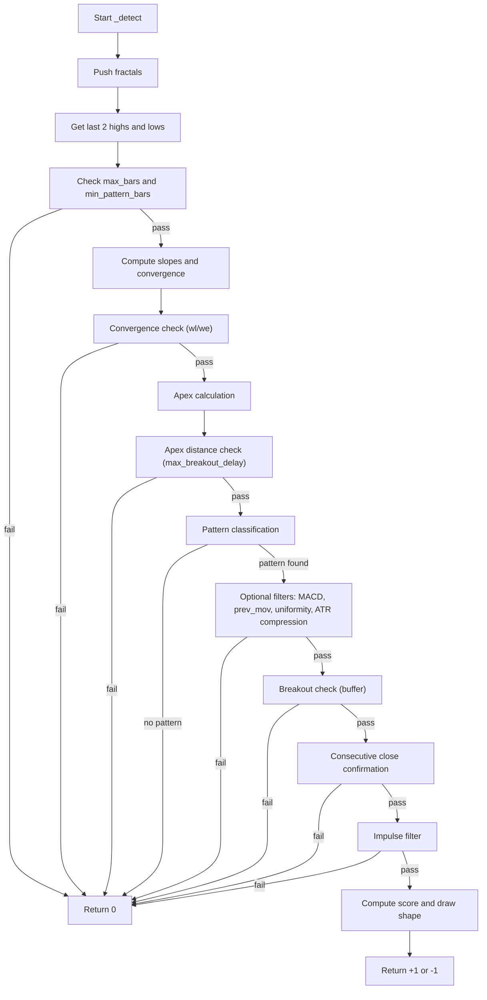

# Triangle & Wedge Breakout Pro - Technical Guide

> Detects symmetrical, ascending, descending triangles and falling/rising wedges, draws the pattern shape with apex projection, and generates buy/sell signals with a quality score.

| | |
| --- | --- |
| **Language** | Indie Script v5 |
| **Platform** | [TakeProfit](https://takeprofit.com) |
| **Category** | Candlestick patterns |
| **Type** | Indicator |
| **Author** | @pavel_medvedev on TakeProfit |
| **License** | MIT |
| **Live script** | [Open on TakeProfit](https://takeprofit.com/indicator/triangle-wedge-breakout-pro-59) |
| **Source file** | [Triangle & Wedge Breakout Pro.indie5](Triangle%20&%20Wedge%20Breakout%20Pro.indie5) |

## Overview

This indicator identifies classic triangle and wedge patterns (symmetrical, ascending, descending, falling wedge, rising wedge) by locating swing highs and lows using fractal pivots. It is designed for traders who want to trade breakouts from these consolidation patterns. The indicator projects the theoretical apex of the pattern and draws a true triangle shape with three edges and a fill, making the pattern visually clear on the chart.

On the chart, the indicator draws the upper and lower boundary lines extended to the apex (solid lines), a dashed back chord connecting the first swing high and low, and a filled triangle. A label at the second swing point shows the pattern type and quality (+, ++). At the breakout bar, a BUY or SELL label appears with a numeric score (0-100). Optionally, a vertical target line and 'T' label are drawn based on the pattern height.

## How it works

1. Identify swing highs and lows using fractal pivots (left_bars and right_bars parameters).
2. Compute slopes of the upper and lower trendlines from the two most recent swing points.
3. Check convergence: the distance between lines must decrease from the early reference bar to the late reference bar (triangularity filter).
4. Classify the pattern based on slope signs and tolerances (ST, AT, DT, FW, RW).
5. Calculate the theoretical apex intersection point of the two lines; reject if apex is too far or too close.
6. Apply optional filters: MACD trend, prior movement, uniformity, ATR compression, breakout impulse.
7. Require breakout beyond the projected line by a buffer, with optional consecutive bar confirmation.
8. Draw the true triangle shape (h1 → apex → l1) and place a signal label with a quality score.
9. Optionally draw a vertical target line equal to the pattern height at breakout.
10. Store a key to avoid redrawing the same pattern multiple times.

## Mathematical model

$$
\text{slope}_h = \frac{h_{2p} - h_{1p}}{h_{2bi} - h_{1bi}}, \quad \text{slope}_l = \frac{l_{2p} - l_{1p}}{l_{2bi} - l_{1bi}}
$$

$$
\text{apex}_x = \frac{l_{1p} - h_{1p} + \text{slope}_h \cdot h_{1bi} - \text{slope}_l \cdot l_{1bi}}{\text{slope}_h - \text{slope}_l}
$$

$$
w_e = (h_{1p} + \text{slope}_h \cdot (\text{ref}_{early} - h_{1bi})) - (l_{1p} + \text{slope}_l \cdot (\text{ref}_{early} - l_{1bi}))
$$

$$
w_l = (h_{1p} + \text{slope}_h \cdot (\text{ref}_{late} - h_{1bi})) - (l_{1p} + \text{slope}_l \cdot (\text{ref}_{late} - l_{1bi}))
$$

$$
\text{conv\_fac} = 1 - \frac{w_l}{w_e}, \quad \text{clamped to } [0,1]
$$

$$
\text{score} = \lfloor \text{conv\_fac} \times 25 \rfloor + \text{uniformity bonus} + \text{quality bonus} + \text{ATR compression bonus} + \text{impulse bonus} + \text{pattern length bonus}
$$

## Logic flow



## Parameters

| Parameter | Type | Default | Range | Description |
| --- | --- | --- | --- | --- |
| `left_bars` | int | 5 | 2 - 30 | Bars Left (Fractal) |
| `right_bars` | int | 2 | 1 - 15 | Bars Right (Fractal) |
| `use_sym_tri` | bool | true |  | Symmetrical Triangle |
| `use_asc_tri` | bool | true |  | Ascending Triangle |
| `use_desc_tri` | bool | true |  | Descending Triangle |
| `use_fall_wdg` | bool | true |  | Falling Wedge |
| `use_rise_wdg` | bool | true |  | Rising Wedge |
| `slope_tol` | float | 0.002 | 0.001 - 0.5 | Slope Tolerance  AT / DT  (%/bar of price) |
| `triangularity` | float | 0.5 | 0.0 - 1.0 | Convergence  0=loose  1=strict |
| `min_pattern_bars` | int | 10 | 3 - 300 | Min Pattern Length (bars) |
| `st_symmetry_tol` | float | 0.5 | 0.05 - 2.0 | ST Slope Symmetry Tolerance |
| `breakout_buffer` | float | 0.1 | 0.0 - 2.0 | Breakout Buffer (%) |
| `wait_for_close` | bool | true |  | Wait for Bar Close  (anti-repaint) |
| `confirm_bars` | int | 1 | 1 - 3 | Consecutive Close Confirmations |
| `max_breakout_delay` | float | 0.35 | 0.1 - 1.0 | Max Breakout Delay  (apex fraction) |
| `atr_period` | int | 14 | 5 - 50 | ATR Period |
| `use_atr_compression` | bool | false |  | ATR Compression Filter |
| `atr_compression_ratio` | float | 0.8 | 0.3 - 1.0 | ATR Compression Ratio |
| `use_breakout_impulse` | bool | true |  | Breakout Impulse Filter |
| `breakout_atr_mult` | float | 0.25 | 0.05 - 2.0 | Breakout ATR Multiplier |
| `require_3rd_touch` | bool | false |  | Require 3rd Touch |
| `fill_pattern` | bool | true |  | Fill Pattern Body |
| `fill_opacity` | float | 0.15 | 0.05 - 0.50 | Fill Opacity  0.05-0.50 |
| `show_target` | bool | true |  | Show Target Projection |
| `color_st` | color | color.BLUE |  | Symmetrical Triangle Color |
| `color_at` | color | color.GREEN |  | Ascending Triangle Color |
| `color_dt` | color | color.RED |  | Descending Triangle Color |
| `color_fw` | color | color.LIME |  | Falling Wedge Color |
| `color_rw` | color | color.ORANGE |  | Rising Wedge Color |
| `enable_alerts` | bool | true |  | Enable Alerts  (configure via Set Alert dialog) |
| `use_macd` | bool | false |  | Enable MACD Filter |
| `macd_price` | source | source.CLOSE |  | MACD Applied Price |
| `macd_fast` | int | 12 | ≥ 1 | MACD Fast EMA |
| `macd_slow` | int | 26 | ≥ 1 | MACD Slow EMA |
| `macd_sig_len` | int | 9 | ≥ 1 | MACD Signal Period |
| `check_prev_mov` | bool | false |  | Require Prior Trend |
| `prev_mov_bars` | int | 20 | 5 - 300 | Prev-movement Lookback (bars) |
| `use_uniform` | bool | false |  | Use Uniformity Filter |
| `max_bars` | int | 300 | 50 - 1500 | Max Bars Lookback |

## Code walkthrough

### Fractal Pivot Detection

Lines 550-584 of [Triangle & Wedge Breakout Pro.indie5](Triangle%20&%20Wedge%20Breakout%20Pro.indie5):

```python
    def _push_fractals(self, lb: int, rb: int, bi: int, bc: int) -> None:
        total = lb + rb + 1
        if bc < total:
            return
        ch = self.high[rb]
        cl = self.low[rb]
        if isnan(ch) or isnan(cl):
            return
        is_h = True
        is_l = True
        for j in range(total):
            if j == rb:
                continue
            if is_h:
                hj = self.high[j]
                if not isnan(hj) and hj >= ch:
                    is_h = False
            if is_l:
                lj = self.low[j]
                if not isnan(lj) and lj <= cl:
                    is_l = False
            if not is_h and not is_l:
                break
        cbi = bi - rb
        ct  = self.time[rb]
        nh  = len(self.hbi)
        if is_h and (nh == 0 or self.hbi[nh - 1] != cbi):
            self.hbi.append(cbi); self.ht.append(ct); self.hp.append(ch)
            if len(self.hbi) > 3:
                self.hbi.pop(0); self.ht.pop(0); self.hp.pop(0)
        nl = len(self.lbi)
        if is_l and (nl == 0 or self.lbi[nl - 1] != cbi):
            self.lbi.append(cbi); self.lt.append(ct); self.lp.append(cl)
            if len(self.lbi) > 3:
                self.lbi.pop(0); self.lt.pop(0); self.lp.pop(0)
```

This method identifies swing highs and lows by checking if the bar at offset `rb` (right_bars) is a local high or low within a window of `lb + rb + 1` bars. It compares the high/low of the center bar against all others in the window. If it is a new extreme and not a duplicate, it appends the bar index, time, and price to the respective lists. The lists are kept to a maximum of 3 entries (the most recent three swing points).

### Pattern Classification

Lines 281-308 of [Triangle & Wedge Breakout Pro.indie5](Triangle%20&%20Wedge%20Breakout%20Pro.indie5):

```python
        if self.use_sym_tri and h_slp < 0.0 and l_slp > 0.0:
            sym_diff = abs(abs(h_slp) - abs(l_slp)) / avg_p
            avg_pct  = (h_pct + l_pct) * 0.5
            if sym_diff >= self.st_symmetry_tol * avg_pct + 0.001:
                return 0.0
            pattern        = 'ST'
            is_bull_known  = False
            need_apex_dist = True
        elif self.use_asc_tri and h_pct < tol and l_slp > 0.0:
            pattern        = 'AT'
            is_bull_known  = True
            is_bull        = True
            need_apex_dist = False
        elif self.use_desc_tri and h_slp < 0.0 and l_pct < tol:
            pattern        = 'DT'
            is_bull_known  = True
            is_bull        = False
            need_apex_dist = False
        elif self.use_fall_wdg and h_slp < 0.0 and l_slp < 0.0 and h_slp < l_slp:
            pattern        = 'FW'
            is_bull_known  = True
            is_bull        = True
            need_apex_dist = True
        elif self.use_rise_wdg and h_slp > 0.0 and l_slp > 0.0 and l_slp > h_slp:
            pattern        = 'RW'
            is_bull_known  = True
            is_bull        = False
            need_apex_dist = True
```

Based on the slopes of the upper and lower trendlines, the code classifies the pattern into one of five types: Symmetrical Triangle (ST), Ascending Triangle (AT), Descending Triangle (DT), Falling Wedge (FW), or Rising Wedge (RW). Each type has specific slope sign conditions and tolerance checks. For ST, it also checks slope symmetry using `st_symmetry_tol`. The variable `is_bull` is set for bullish patterns (AT, FW) and bearish for DT, RW; ST is determined later by breakout direction.

### Apex Calculation and Convergence

Lines 228-252 of [Triangle & Wedge Breakout Pro.indie5](Triangle%20&%20Wedge%20Breakout%20Pro.indie5):

```python
        we = (h1p + h_slp * (ref_early - h1bi)) - (l1p + l_slp * (ref_early - l1bi))
        wl = (h1p + h_slp * (ref_late  - h1bi)) - (l1p + l_slp * (ref_late  - l1bi))
        if we <= 0.0:
            return 0.0
        if (wl / we) > (1.0 - self.triangularity * 0.5):
            return 0.0

        conv_fac = 1.0 - (wl / we)
        if conv_fac > 1.0:
            conv_fac = 1.0
        if conv_fac < 0.0:
            conv_fac = 0.0

        slp_diff   = abs(h_slp - l_slp)
        apex_valid = False
        apex_x: float = 0.0
        if slp_diff > 1e-12:
            apex_x     = (l1p - h1p + h_slp * h1bi - l_slp * l1bi) / (h_slp - l_slp)
            apex_valid = True

        pat_len = newest_bi - oldest_bi

        if apex_valid:
            if bi > apex_x - pat_len * self.max_breakout_delay:
                return 0.0
```

The code computes the width of the pattern at an early reference bar (`we`) and a late reference bar (`wl`). If `wl/we` is too close to 1 (i.e., lines are not converging), the pattern is rejected. The convergence factor `conv_fac` is derived from the ratio. The apex x-coordinate is computed as the intersection of the two lines. If the apex is valid, the code ensures the breakout occurs well before the apex (using `max_breakout_delay`), otherwise the pattern is rejected.

### Drawing the True Triangle

Lines 467-511 of [Triangle & Wedge Breakout Pro.indie5](Triangle%20&%20Wedge%20Breakout%20Pro.indie5):

```python
        if apex_ok:
            self.chart.draw(LineSegment(
                AbsolutePosition(h1t, h1p),
                AbsolutePosition(t_apex, apex_p),
                color=lc, line_width=2))
            self.chart.draw(LineSegment(
                AbsolutePosition(l1t, l1p),
                AbsolutePosition(t_apex, apex_p),
                color=lc, line_width=2))
            self.chart.draw(LineSegment(
                AbsolutePosition(h1t, h1p),
                AbsolutePosition(l1t, l1p),
                color=lc, line_width=1, line_style=line_style.DASHED))
            if self.fill_pattern:
                self.chart.draw(Triangle(
                    AbsolutePosition(h1t, h1p),
                    AbsolutePosition(t_apex, apex_p),
                    AbsolutePosition(l1t, l1p),
                    line_color=color.TRANSPARENT, bg_color=lc(fill_op)))
        else:
            self.chart.draw(LineSegment(
                AbsolutePosition(h1t, h1p),
                AbsolutePosition(t0, cur_h),
                color=lc, line_width=2))
            self.chart.draw(LineSegment(
                AbsolutePosition(l1t, l1p),
                AbsolutePosition(t0, cur_l),
                color=lc, line_width=2))
            self.chart.draw(LineSegment(
                AbsolutePosition(h1t, h1p),
                AbsolutePosition(l1t, l1p),
                color=lc, line_width=1, line_style=line_style.DASHED))
            if self.fill_pattern:
                fc = lc(fill_op)
                self.chart.draw(Triangle(
                    AbsolutePosition(h1t, h1p),
                    AbsolutePosition(t0, cur_h),
                    AbsolutePosition(t0, cur_l),
                    line_color=color.TRANSPARENT, bg_color=fc))
                self.chart.draw(Triangle(
                    AbsolutePosition(h1t, h1p),
                    AbsolutePosition(t0, cur_l),
                    AbsolutePosition(l1t, l1p),
                    line_color=color.TRANSPARENT, bg_color=fc))

```

When `apex_ok` is true, the indicator draws three line segments: upper (h1 → apex), lower (l1 → apex), and back (h1 → l1, dashed). A filled `Triangle` object is drawn with the three corners. If the apex is not available (fallback), it uses the breakout bar's projected lines and draws two triangles to fill the shape. The color is chosen based on pattern type via `_pat_lc`.

### Signal Label and Target

Lines 520-548 of [Triangle & Wedge Breakout Pro.indie5](Triangle%20&%20Wedge%20Breakout%20Pro.indie5):

```python
    def _draw_signal(self, p: str, is_bull: bool,
                     cur_h: float, cur_l: float,
                     we: float, score: int, t0: float) -> None:

        score_s = str(score)
        lbl = 'SELL ' + p + ' ' + score_s
        bg  = color.RED
        sp  = cur_h * 1.0002
        if is_bull:
            lbl = 'BUY ' + p + ' ' + score_s
            bg  = color.GREEN
            sp  = cur_l * 0.9998
        self.chart.draw(LabelAbs(
            lbl, AbsolutePosition(t0, sp),
            bg_color=bg, text_color=color.WHITE))

        if self.show_target:
            tc: Color = color.TEAL
            tp = cur_h + we
            if not is_bull:
                tc = color.PURPLE
                tp = cur_l - we
            self.chart.draw(LineSegment(
                AbsolutePosition(t0, sp),
                AbsolutePosition(t0, tp),
                color=tc, line_width=2))
            self.chart.draw(LabelAbs(
                'T', AbsolutePosition(t0, tp),
                bg_color=tc, text_color=color.WHITE))
```

A label is placed at the breakout bar showing 'BUY' or 'SELL' followed by the pattern code and the quality score. The background color is green for buy, red for sell. If `show_target` is enabled, a vertical line is drawn from the label to the target price (pattern height projected from the breakout side), with a 'T' label at the target.

## Reading the chart

- **Pattern lines**: Upper and lower boundary lines are drawn solid, extended to the apex. A dashed line connects the first swing high and low (back chord). The color corresponds to the pattern type (blue=ST, green=AT, red=DT, lime=FW, orange=RW).
- **Fill**: A semi-transparent fill inside the triangle, opacity adjusted by convergence factor.
- **Pattern label**: At the second swing point, a label shows the pattern code (e.g., 'ST+') where '+' or '++' indicates one or two additional touches of the trendlines (quality).
- **Signal label**: At the breakout bar, a green 'BUY' or red 'SELL' label appears with the pattern code and a numeric score (0-100). Higher scores indicate stronger patterns.
- **Target line**: If enabled, a vertical line (teal for buy, purple for sell) extends from the signal label to the projected target, with a 'T' label at the target price.

## Implementation notes

- The indicator uses fractal pivots that repaint until the right_bars window is closed; enabling 'Wait for Bar Close' prevents repainting by only acting on closed bars.
- The apex projection is based on the intersection of the two trendlines; if the apex is too far or the timeframe cannot be computed, it falls back to drawing lines only to the breakout bar.
- The drawn list (`self.drawn`) prevents redrawing the same pattern on subsequent bars, but it is capped at 400 entries to avoid memory issues.
- The MACD filter and prior trend check can be applied both before and after breakout direction is known, with slightly different logic for ST patterns.

## FAQ

**How can I reduce false signals?**

Increase the 'Convergence' parameter (triangularity) to require stronger convergence, increase 'Min Pattern Length', or enable the 'ATR Compression Filter' and 'Breakout Impulse Filter' to require volume/volatility confirmation.

**What does the score number mean?**

The score (0-100) is a composite of convergence quality, uniformity, additional touches, ATR compression, breakout impulse, and pattern length. Higher scores mean the pattern meets more of the indicator's own criteria.

**Can I use this indicator on lower timeframes?**

Yes, but adjust the 'Max Bars Lookback' and 'Min Pattern Length' to suit the timeframe. The fractal pivot detection depends on the bar structure, so shorter timeframes may require smaller left/right bars values.

## Full source code

Indie Script v5, as published on TakeProfit. Copy it into the platform's script editor or [open the live script](https://takeprofit.com/indicator/triangle-wedge-breakout-pro-59).

```python
# indie:lang_version = 5
# ─────────────────────────────────────────────────────────────────────────────
#  Triangle & Wedge Breakout Pro  –  v5.6  (true apex triangle)
#  TakeProfit Indie port  |  ST / AT / DT / FW / RW
#
#   
#  ─────────────────────────────────────────────────────────────────────────────
#  Lines were drawn anchor → breakout bar. But the breakout is REQUIRED to
#  happen well before the apex (max_breakout_delay keeps bi at least
#  pat_len*delay bars ahead of apex_x), so at the breakout bar the lines are
#  still far apart. The right side stayed an open gap → a 4-corner shape, not
#  a triangle. With staggered anchors the long dashed back chord made it look
#  even more like an arbitrary quad.
#
#  v5.6 solution
#  ─────────────────────────────────────────────────────────────────────────────
#  Draw the ACTUAL triangle: both lines are extended forward to their true
#  intersection point (the apex), which always exists for a detected pattern
#  and is bounded (convergence filter ⇒ apex ≲ 3 pattern lengths ahead;
#  ST/FW/RW additionally ≤ 2). Three corners, three edges:
#      upper:  (h1t, h1p) → (t_apex, apex_p)     solid
#      lower:  (l1t, l1p) → (t_apex, apex_p)     solid
#      back:   (h1t, h1p) → (l1t, l1p)           dashed
#  FILL: one single Triangle(h1, apex, l1) — literally a triangle, edges
#  coincide exactly with the lines.
#  Apex time is projected as t0 + (apex_x - bi) * timeframe_ms (timeframe
#  taken from the last two bars). If the apex or timeframe is unavailable
#  (degenerate case), falls back to the v5.5 breakout-bar geometry.
#
#  Since v5.5: slope_tol default 0.002 (per-bar fraction of price).
#  Since v5.4: drawing happens only on confirmed breakout.
# ─────────────────────────────────────────────────────────────────────────────

from math import isnan
from indie import (
    indicator, param, color, Color, source, SeriesF,
    plot, MainContext, MutSeriesF, line_style
)
from indie.algorithms import Ema, Atr
from indie.drawings import LineSegment, LabelAbs, AbsolutePosition, Triangle


@indicator('Triangle & Wedge Breakout Pro', overlay_main_pane=True)

@plot.line('signal', title='Signal  +1/-1/0', color=color.TRANSPARENT,
           display_options=plot.LineDisplayOptions(pane=False, price_label=False, status_line=False))

@param.int('left_bars',              default=5,    min=2,    max=30,   title='Bars Left (Fractal)')
@param.int('right_bars',             default=2,    min=1,    max=15,   title='Bars Right (Fractal)')

@param.bool('use_sym_tri',           default=True,                     title='Symmetrical Triangle')
@param.bool('use_asc_tri',           default=True,                     title='Ascending Triangle')
@param.bool('use_desc_tri',          default=True,                     title='Descending Triangle')
@param.bool('use_fall_wdg',          default=True,                     title='Falling Wedge')
@param.bool('use_rise_wdg',          default=True,                     title='Rising Wedge')

@param.float('slope_tol',            default=0.002, min=0.001, max=0.5, title='Slope Tolerance  AT / DT  (%/bar of price)')
@param.float('triangularity',        default=0.5,  min=0.0,   max=1.0, title='Convergence  0=loose  1=strict')
@param.int('min_pattern_bars',       default=10,   min=3,     max=300, title='Min Pattern Length (bars)')
@param.float('st_symmetry_tol',      default=0.5,  min=0.05,  max=2.0, title='ST Slope Symmetry Tolerance')

@param.float('breakout_buffer',      default=0.1,  min=0.0,   max=2.0, title='Breakout Buffer (%)')
@param.bool('wait_for_close',        default=True,                     title='Wait for Bar Close  (anti-repaint)')
@param.int('confirm_bars',           default=1,    min=1,     max=3,   title='Consecutive Close Confirmations')

@param.float('max_breakout_delay',   default=0.35, min=0.1,   max=1.0, title='Max Breakout Delay  (apex fraction)')

@param.int('atr_period',             default=14,   min=5,     max=50,  title='ATR Period')
@param.bool('use_atr_compression',   default=False,                    title='ATR Compression Filter')
@param.float('atr_compression_ratio',default=0.8,  min=0.3,   max=1.0, title='ATR Compression Ratio')
@param.bool('use_breakout_impulse',  default=True,                     title='Breakout Impulse Filter')
@param.float('breakout_atr_mult',    default=0.25, min=0.05,  max=2.0, title='Breakout ATR Multiplier')

@param.bool('require_3rd_touch',     default=False,                    title='Require 3rd Touch')

@param.bool('fill_pattern',          default=True,                     title='Fill Pattern Body')
@param.float('fill_opacity',         default=0.15, min=0.05,  max=0.50, title='Fill Opacity  0.05-0.50')
@param.bool('show_target',           default=True,                     title='Show Target Projection')

@param.color('color_st',             default=color.BLUE,               title='Symmetrical Triangle Color')
@param.color('color_at',             default=color.GREEN,              title='Ascending Triangle Color')
@param.color('color_dt',             default=color.RED,                title='Descending Triangle Color')
@param.color('color_fw',             default=color.LIME,               title='Falling Wedge Color')
@param.color('color_rw',             default=color.ORANGE,             title='Rising Wedge Color')

@param.bool('enable_alerts',         default=True,                     title='Enable Alerts  (configure via Set Alert dialog)')

@param.bool('use_macd',              default=False,                    title='Enable MACD Filter')
@param.source('macd_price',          default=source.CLOSE,             title='MACD Applied Price')
@param.int('macd_fast',              default=12,   min=1,              title='MACD Fast EMA')
@param.int('macd_slow',              default=26,   min=1,              title='MACD Slow EMA')
@param.int('macd_sig_len',           default=9,    min=1,              title='MACD Signal Period')

@param.bool('check_prev_mov',        default=False,                    title='Require Prior Trend')
@param.int('prev_mov_bars',          default=20,   min=5,    max=300,  title='Prev-movement Lookback (bars)')
@param.bool('use_uniform',           default=False,                    title='Use Uniformity Filter')

@param.int('max_bars',               default=300,  min=50,   max=1500, title='Max Bars Lookback')


class Main(MainContext):

    def __init__(self,
                 left_bars: int, right_bars: int,
                 use_sym_tri: bool, use_asc_tri: bool, use_desc_tri: bool,
                 use_fall_wdg: bool, use_rise_wdg: bool,
                 slope_tol: float, triangularity: float, min_pattern_bars: int,
                 st_symmetry_tol: float,
                 breakout_buffer: float, wait_for_close: bool, confirm_bars: int,
                 max_breakout_delay: float,
                 atr_period: int,
                 use_atr_compression: bool, atr_compression_ratio: float,
                 use_breakout_impulse: bool, breakout_atr_mult: float,
                 require_3rd_touch: bool,
                 fill_pattern: bool, fill_opacity: float, show_target: bool,
                 color_st: Color, color_at: Color, color_dt: Color,
                 color_fw: Color, color_rw: Color,
                 enable_alerts: bool,
                 use_macd: bool, macd_price: SeriesF,
                 macd_fast: int, macd_slow: int, macd_sig_len: int,
                 check_prev_mov: bool, prev_mov_bars: int,
                 use_uniform: bool,
                 max_bars: int):

        self._ml = self.new_mut_series_f(0.0)

        self.hbi: list[int]   = []
        self.ht:  list[float] = []
        self.hp:  list[float] = []

        self.lbi: list[int]   = []
        self.lt:  list[float] = []
        self.lp:  list[float] = []

        self.drawn: list[str] = []
        self.touch_tol = 0.003

        self.left_bars             = left_bars
        self.right_bars            = right_bars
        self.use_sym_tri           = use_sym_tri
        self.use_asc_tri           = use_asc_tri
        self.use_desc_tri          = use_desc_tri
        self.use_fall_wdg          = use_fall_wdg
        self.use_rise_wdg          = use_rise_wdg
        self.slope_tol             = slope_tol
        self.triangularity         = triangularity
        self.min_pattern_bars      = min_pattern_bars
        self.st_symmetry_tol       = st_symmetry_tol
        self.breakout_buffer       = breakout_buffer
        self.wait_for_close        = wait_for_close
        self.confirm_bars          = confirm_bars
        self.max_breakout_delay    = max_breakout_delay
        self.atr_period            = atr_period
        self.use_atr_compression   = use_atr_compression
        self.atr_compression_ratio = atr_compression_ratio
        self.use_breakout_impulse  = use_breakout_impulse
        self.breakout_atr_mult     = breakout_atr_mult
        self.require_3rd_touch     = require_3rd_touch
        self.fill_pattern          = fill_pattern
        self.fill_opacity          = fill_opacity
        self.show_target           = show_target
        self.color_st              = color_st
        self.color_at              = color_at
        self.color_dt              = color_dt
        self.color_fw              = color_fw
        self.color_rw              = color_rw
        self.enable_alerts         = enable_alerts
        self.use_macd              = use_macd
        self.macd_price            = macd_price
        self.macd_fast             = macd_fast
        self.macd_slow             = macd_slow
        self.macd_sig_len          = macd_sig_len
        self.check_prev_mov        = check_prev_mov
        self.prev_mov_bars         = prev_mov_bars
        self.use_uniform           = use_uniform
        self.max_bars              = max_bars

    def calc(self) -> float:
        atr          = Atr.new(self.atr_period)
        fema         = Ema.new(self.macd_price, self.macd_fast)
        sema         = Ema.new(self.macd_price, self.macd_slow)
        self._ml[0]  = fema[0] - sema[0]
        slma         = Ema.new(self._ml, self.macd_sig_len)
        hist         = self._ml[0] - slma[0]
        return self._detect(hist, atr)

    def _detect(self, hist: float, atr: SeriesF) -> float:
        bi = self.bar_index
        bc = self.bar_count
        c0 = self.close[0]
        t0 = self.time[0]

        self._push_fractals(self.left_bars, self.right_bars, bi, bc)

        nh = len(self.hbi)
        nl = len(self.lbi)
        if nh < 2 or nl < 2:
            return 0.0

        h1bi = self.hbi[nh - 2]; h1t = self.ht[nh - 2]; h1p = self.hp[nh - 2]
        h2bi = self.hbi[nh - 1]; h2t = self.ht[nh - 1]; h2p = self.hp[nh - 1]
        l1bi = self.lbi[nl - 2]; l1t = self.lt[nl - 2]; l1p = self.lp[nl - 2]
        l2bi = self.lbi[nl - 1]; l2t = self.lt[nl - 1]; l2p = self.lp[nl - 1]

        oldest_bi = min(h1bi, l1bi)
        newest_bi = max(h2bi, l2bi)

        if (bi - oldest_bi) > self.max_bars:
            return 0.0
        if (newest_bi - oldest_bi) < self.min_pattern_bars:
            return 0.0

        h_dx  = max(1, h2bi - h1bi)
        l_dx  = max(1, l2bi - l1bi)
        h_slp = (h2p - h1p) / h_dx
        l_slp = (l2p - l1p) / l_dx

        avg_p = (h1p + h2p + l1p + l2p) * 0.25
        if avg_p <= 0.0:
            return 0.0

        h_pct = abs(h_slp) / avg_p
        l_pct = abs(l_slp) / avg_p
        tol   = self.slope_tol

        ref_early = max(h1bi, l1bi)
        ref_late  = max(h2bi, l2bi)
        we = (h1p + h_slp * (ref_early - h1bi)) - (l1p + l_slp * (ref_early - l1bi))
        wl = (h1p + h_slp * (ref_late  - h1bi)) - (l1p + l_slp * (ref_late  - l1bi))
        if we <= 0.0:
            return 0.0
        if (wl / we) > (1.0 - self.triangularity * 0.5):
            return 0.0

        conv_fac = 1.0 - (wl / we)
        if conv_fac > 1.0:
            conv_fac = 1.0
        if conv_fac < 0.0:
            conv_fac = 0.0

        slp_diff   = abs(h_slp - l_slp)
        apex_valid = False
        apex_x: float = 0.0
        if slp_diff > 1e-12:
            apex_x     = (l1p - h1p + h_slp * h1bi - l_slp * l1bi) / (h_slp - l_slp)
            apex_valid = True

        pat_len = newest_bi - oldest_bi

        if apex_valid:
            if bi > apex_x - pat_len * self.max_breakout_delay:
                return 0.0

        atr_comp_ok = False
        if self.use_atr_compression:
            offset_old     = bi - oldest_bi
            atr_old: float = atr[0]
            if offset_old < bc:
                atr_old = atr[offset_old]
            if atr_old > 0.0:
                if atr[0] > atr_old * self.atr_compression_ratio:
                    return 0.0
                atr_comp_ok = True

        if self.use_uniform:
            h_dt   = h2bi - h1bi
            l_dt   = l2bi - l1bi
            dt_max = max(h_dt, l_dt)
            dt_min = min(h_dt, l_dt)
            ratio: float = 0.0
            if dt_max > 0:
                ratio = dt_min / dt_max
            if ratio < 0.5:
                return 0.0

        pattern:        str  = ''
        is_bull_known:  bool = False
        is_bull:        bool = False
        need_apex_dist: bool = False

        if self.use_sym_tri and h_slp < 0.0 and l_slp > 0.0:
            sym_diff = abs(abs(h_slp) - abs(l_slp)) / avg_p
            avg_pct  = (h_pct + l_pct) * 0.5
            if sym_diff >= self.st_symmetry_tol * avg_pct + 0.001:
                return 0.0
            pattern        = 'ST'
            is_bull_known  = False
            need_apex_dist = True
        elif self.use_asc_tri and h_pct < tol and l_slp > 0.0:
            pattern        = 'AT'
            is_bull_known  = True
            is_bull        = True
            need_apex_dist = False
        elif self.use_desc_tri and h_slp < 0.0 and l_pct < tol:
            pattern        = 'DT'
            is_bull_known  = True
            is_bull        = False
            need_apex_dist = False
        elif self.use_fall_wdg and h_slp < 0.0 and l_slp < 0.0 and h_slp < l_slp:
            pattern        = 'FW'
            is_bull_known  = True
            is_bull        = True
            need_apex_dist = True
        elif self.use_rise_wdg and h_slp > 0.0 and l_slp > 0.0 and l_slp > h_slp:
            pattern        = 'RW'
            is_bull_known  = True
            is_bull        = False
            need_apex_dist = True

        if pattern == '':
            return 0.0

        if need_apex_dist and apex_valid:
            apex_dist = apex_x - newest_bi
            pat_len_f = float(pat_len)
            if apex_dist <= 0.0 or apex_dist > pat_len_f * 2.0:
                return 0.0

        if self.use_macd and is_bull_known:
            if is_bull:
                if hist < 0.0:
                    return 0.0
            else:
                if hist > 0.0:
                    return 0.0

        if self.check_prev_mov and is_bull_known:
            if not self._prev_ok(oldest_bi, is_bull, bi, bc):
                return 0.0

        q = self._quality(h_slp, l_slp, h1bi, h1p, l1bi, l1p, nh, nl)

        if self.require_3rd_touch and q == '':
            return 0.0

        if self.wait_for_close and not self.is_closed_bar:
            return 0.0

        cur_h = h1p + h_slp * (bi - h1bi)
        cur_l = l1p + l_slp * (bi - l1bi)
        buf   = self.breakout_buffer / 100.0

        bull_ok = c0 > cur_h * (1.0 + buf)
        bear_ok = c0 < cur_l * (1.0 - buf)

        if is_bull_known:
            if is_bull:
                if not bull_ok:
                    return 0.0
            else:
                if not bear_ok:
                    return 0.0
        else:
            is_bull = False
            if bull_ok:
                is_bull = True
            elif not bear_ok:
                return 0.0

        if self.use_macd:
            if is_bull:
                if hist < 0.0:
                    return 0.0
            else:
                if hist > 0.0:
                    return 0.0
        if self.check_prev_mov and pattern == 'ST':
            if not self._prev_ok(oldest_bi, is_bull, bi, bc):
                return 0.0

        n_conf = self.confirm_bars
        if n_conf > 1:
            i_conf = 1
            while i_conf < n_conf:
                past_bi  = bi - i_conf
                proj_h_i = h1p + h_slp * (past_bi - h1bi)
                proj_l_i = l1p + l_slp * (past_bi - l1bi)
                if is_bull:
                    if self.close[i_conf] <= proj_h_i * (1.0 + buf):
                        return 0.0
                else:
                    if self.close[i_conf] >= proj_l_i * (1.0 - buf):
                        return 0.0
                i_conf = i_conf + 1

        impulse_ok = False
        if self.use_breakout_impulse:
            needed = atr[0] * self.breakout_atr_mult
            if is_bull:
                if (c0 - cur_h) < needed:
                    return 0.0
                impulse_ok = True
            else:
                if (cur_l - c0) < needed:
                    return 0.0
                impulse_ok = True

        score = self._score(conv_fac, q, atr_comp_ok, impulse_ok, pat_len)

        dc = 'B'
        if not is_bull:
            dc = 'S'
        bk = 'B:' + pattern + ':' + str(h1bi) + ':' + str(l1bi) + ':' + dc
        if bk not in self.drawn:
            fill_op = self.fill_opacity * (0.4 + 0.6 * conv_fac)
            if fill_op > 0.90:
                fill_op = 0.90

            # apex point in chart coordinates (time projected forward
            # from the current bar using the timeframe of the last 2 bars)
            tf: float = 0.0
            if bc >= 2:
                t1 = self.time[1]
                if not isnan(t1):
                    tf = t0 - t1
            apex_ok = apex_valid and tf > 0.0
            t_apex: float = t0
            apex_p: float = (cur_h + cur_l) * 0.5
            if apex_ok:
                t_apex = t0 + (apex_x - bi) * tf
                apex_p = h1p + h_slp * (apex_x - h1bi)

            self._draw_shape(pattern,
                             h1t, h1p, h2t, h2p,
                             l1t, l1p, l2t, l2p,
                             t0, cur_h, cur_l,
                             apex_ok, t_apex, apex_p,
                             q, fill_op)
            self._draw_signal(pattern, is_bull, cur_h, cur_l, we, score, t0)
            self._append_key(bk)

        out: float = -1.0
        if is_bull:
            out = 1.0
        return out

    def _pat_lc(self, p: str) -> Color:
        result: Color = self.color_st
        if p == 'AT':
            result = self.color_at
        elif p == 'DT':
            result = self.color_dt
        elif p == 'FW':
            result = self.color_fw
        elif p == 'RW':
            result = self.color_rw
        return result

    def _draw_shape(self,
                    p: str,
                    h1t: float, h1p: float,
                    h2t: float, h2p: float,
                    l1t: float, l1p: float,
                    l2t: float, l2p: float,
                    t0: float, cur_h: float, cur_l: float,
                    apex_ok: bool, t_apex: float, apex_p: float,
                    q: str, fill_op: float) -> None:
        """
        TRUE TRIANGLE: both boundary lines extended forward to their actual
        intersection (apex). Three corners — h1, apex, l1 — three edges:
        upper h1→apex (solid), lower l1→apex (solid), back h1→l1 (dashed).
        FILL: one Triangle(h1, apex, l1); edges coincide with the lines.
        Fallback (no apex / no timeframe): v5.5 breakout-bar geometry.
        """
        lc = self._pat_lc(p)

        if apex_ok:
            self.chart.draw(LineSegment(
                AbsolutePosition(h1t, h1p),
                AbsolutePosition(t_apex, apex_p),
                color=lc, line_width=2))
            self.chart.draw(LineSegment(
                AbsolutePosition(l1t, l1p),
                AbsolutePosition(t_apex, apex_p),
                color=lc, line_width=2))
            self.chart.draw(LineSegment(
                AbsolutePosition(h1t, h1p),
                AbsolutePosition(l1t, l1p),
                color=lc, line_width=1, line_style=line_style.DASHED))
            if self.fill_pattern:
                self.chart.draw(Triangle(
                    AbsolutePosition(h1t, h1p),
                    AbsolutePosition(t_apex, apex_p),
                    AbsolutePosition(l1t, l1p),
                    line_color=color.TRANSPARENT, bg_color=lc(fill_op)))
        else:
            self.chart.draw(LineSegment(
                AbsolutePosition(h1t, h1p),
                AbsolutePosition(t0, cur_h),
                color=lc, line_width=2))
            self.chart.draw(LineSegment(
                AbsolutePosition(l1t, l1p),
                AbsolutePosition(t0, cur_l),
                color=lc, line_width=2))
            self.chart.draw(LineSegment(
                AbsolutePosition(h1t, h1p),
                AbsolutePosition(l1t, l1p),
                color=lc, line_width=1, line_style=line_style.DASHED))
            if self.fill_pattern:
                fc = lc(fill_op)
                self.chart.draw(Triangle(
                    AbsolutePosition(h1t, h1p),
                    AbsolutePosition(t0, cur_h),
                    AbsolutePosition(t0, cur_l),
                    line_color=color.TRANSPARENT, bg_color=fc))
                self.chart.draw(Triangle(
                    AbsolutePosition(h1t, h1p),
                    AbsolutePosition(t0, cur_l),
                    AbsolutePosition(l1t, l1p),
                    line_color=color.TRANSPARENT, bg_color=fc))

        lbl_t = h2t
        if l2t > h2t:
            lbl_t = l2t
        lbl_p = (h2p + l2p) * 0.5
        self.chart.draw(LabelAbs(
            p + q, AbsolutePosition(lbl_t, lbl_p),
            bg_color=lc, text_color=color.WHITE))

    def _draw_signal(self, p: str, is_bull: bool,
                     cur_h: float, cur_l: float,
                     we: float, score: int, t0: float) -> None:

        score_s = str(score)
        lbl = 'SELL ' + p + ' ' + score_s
        bg  = color.RED
        sp  = cur_h * 1.0002
        if is_bull:
            lbl = 'BUY ' + p + ' ' + score_s
            bg  = color.GREEN
            sp  = cur_l * 0.9998
        self.chart.draw(LabelAbs(
            lbl, AbsolutePosition(t0, sp),
            bg_color=bg, text_color=color.WHITE))

        if self.show_target:
            tc: Color = color.TEAL
            tp = cur_h + we
            if not is_bull:
                tc = color.PURPLE
                tp = cur_l - we
            self.chart.draw(LineSegment(
                AbsolutePosition(t0, sp),
                AbsolutePosition(t0, tp),
                color=tc, line_width=2))
            self.chart.draw(LabelAbs(
                'T', AbsolutePosition(t0, tp),
                bg_color=tc, text_color=color.WHITE))

    def _push_fractals(self, lb: int, rb: int, bi: int, bc: int) -> None:
        total = lb + rb + 1
        if bc < total:
            return
        ch = self.high[rb]
        cl = self.low[rb]
        if isnan(ch) or isnan(cl):
            return
        is_h = True
        is_l = True
        for j in range(total):
            if j == rb:
                continue
            if is_h:
                hj = self.high[j]
                if not isnan(hj) and hj >= ch:
                    is_h = False
            if is_l:
                lj = self.low[j]
                if not isnan(lj) and lj <= cl:
                    is_l = False
            if not is_h and not is_l:
                break
        cbi = bi - rb
        ct  = self.time[rb]
        nh  = len(self.hbi)
        if is_h and (nh == 0 or self.hbi[nh - 1] != cbi):
            self.hbi.append(cbi); self.ht.append(ct); self.hp.append(ch)
            if len(self.hbi) > 3:
                self.hbi.pop(0); self.ht.pop(0); self.hp.pop(0)
        nl = len(self.lbi)
        if is_l and (nl == 0 or self.lbi[nl - 1] != cbi):
            self.lbi.append(cbi); self.lt.append(ct); self.lp.append(cl)
            if len(self.lbi) > 3:
                self.lbi.pop(0); self.lt.pop(0); self.lp.pop(0)

    def _score(self, conv_fac: float, q: str,
               atr_comp_ok: bool, impulse_ok: bool,
               pattern_len: int) -> int:
        s = 0
        c_pts = conv_fac * 25.0
        if c_pts > 25.0:
            c_pts = 25.0
        s = s + int(c_pts)
        if self.use_uniform:
            s = s + 15
        if q == '+':
            s = s + 10
        elif q == '++':
            s = s + 20
        if atr_comp_ok:
            s = s + 15
        if impulse_ok:
            s = s + 15
        len_pts = pattern_len // 10
        if len_pts > 10:
            len_pts = 10
        s = s + len_pts
        return s

    def _quality(self, h_slp: float, l_slp: float,
                 h1bi: int, h1p: float,
                 l1bi: int, l1p: float,
                 nh: int, nl: int) -> str:
        q = 0
        if nh >= 3:
            h3bi = self.hbi[nh - 3]; h3p = self.hp[nh - 3]
            diff = abs(h1p + h_slp * (h3bi - h1bi) - h3p)
            if h3p != 0.0 and diff / abs(h3p) < self.touch_tol:
                q = q + 1
        if nl >= 3:
            l3bi = self.lbi[nl - 3]; l3p = self.lp[nl - 3]
            diff = abs(l1p + l_slp * (l3bi - l1bi) - l3p)
            if l3p != 0.0 and diff / abs(l3p) < self.touch_tol:
                q = q + 1
        result: str = ''
        if q == 1:
            result = '+'
        elif q >= 2:
            result = '++'
        return result

    def _prev_ok(self, oldest_bi: int, is_bull: bool,
                 bi: int, bc: int) -> bool:
        off_old = bi - oldest_bi
        off_pre = off_old + self.prev_mov_bars
        if off_pre >= bc:
            return True
        cb = self.close[off_pre]
        ca = self.close[off_old]
        if isnan(cb) or isnan(ca):
            return True
        result: bool = cb < ca
        if is_bull:
            result = cb > ca
        return result

    def _append_key(self, key: str) -> None:
        self.drawn.append(key)
        if len(self.drawn) > 400:
            self.drawn = self.drawn[200:]
```
