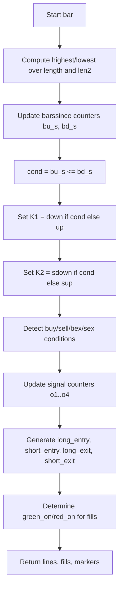

# Turtle Trade Channels - Indie Port Guide

> Computes Donchian-based channels with trend line K1 and exit line K2, generating entry/exit signals and background highlights.

| | |
| --- | --- |
| **Language** | Indie Script v5 |
| **Platform** | [TakeProfit](https://takeprofit.com) |
| **Category** | Trend |
| **Type** | Indicator, port from Pine Script |
| **Original** | Turtle Trade Channels Indicator by KivancOzbilgic (Pine Script v4) |
| **License** | MPL-2.0 (see the header of the source files) |
| **Original source** | [Turtle Trade Channels.pinescript4](Turtle%20Trade%20Channels.pinescript4) |
| **Source file** | [Turtle Trade Channels.indie5](Turtle%20Trade%20Channels.indie5) |

## Overview

The Turtle Trade Channels indicator is a trend-following tool derived from the classic Turtle Trading system. It plots two Donchian channels (upper/lower over a user-defined length) and two additional lines: K1 (Trend Line) and K2 (Exit Line), which adapt to the current trend direction based on which channel breakout occurred most recently. The indicator also marks potential entry and exit points with circle and label markers, and optionally fills the background with green or red to indicate the prevailing trend bias.

This indicator is designed for trending markets where breakouts of recent price ranges signal trade opportunities. The upper and lower lines represent the highest high and lowest low over the entry length. K1 and K2 are derived from the same channels but with a shorter exit length, and their selection depends on whether the last breakout was above the upper channel or below the lower channel. The background highlighter and markers help traders quickly identify long and short entry/exit conditions.

## How it works

1. Compute the highest high and lowest low over the entry length (length) and exit length (len2) using the high and low prices.
2. Maintain two barssince counters: one for how many bars since high crossed above the previous upper channel, and one for low crossed below the previous lower channel.
3. Determine the trend direction (cond) by comparing the two counters: if the upper breakout counter is smaller or equal, trend is up; otherwise down.
4. Set K1 (Trend Line) to the lower channel if trend is up, else to the upper channel. Set K2 (Exit Line) to the shorter exit channel accordingly.
5. Detect entry conditions: buy when high touches or breaks above the previous upper channel; sell when low touches or breaks below the previous lower channel.
6. Detect exit conditions: long exit when low touches or breaks below the previous exit lower channel; short exit when high touches or breaks above the previous exit upper channel.
7. Maintain separate barssince counters for each signal type and generate final entry/exit signals when the opposite signal counter is smaller (e.g., long entry when buy occurs and the long exit counter is less than the previous buy counter).
8. Optionally fill the background with green (long bias) or red (short bias) based on which signal counter is smallest, and plot markers for entry/exit signals.

## Logic flow



## Parameters

| Parameter | Type | Default | Range | Description |
| --- | --- | --- | --- | --- |
| `length` | int | 20 | ≥ 1 | Entry Length |
| `len2` | int | 10 | ≥ 1 | Exit Length |
| `show_signals` | bool | true |  | Show Entry/Exit Signals ? |
| `highlighting` | bool | true |  | Highlighter On/Off ? |

## Code walkthrough

### Barssince helper function

Lines 15-18 of [Turtle Trade Channels.indie5](Turtle%20Trade%20Channels.indie5):

```python
def _bs(cond: bool, prev: float) -> float:
    if cond:
        return 0.0
    return prev + 1.0
```

The _bs function implements a barssince counter: if the condition is true, it returns 0; otherwise it increments the previous value by 1. This is used to track how many bars have passed since a breakout event, replicating Pine Script's barssince() behavior.

### Channel computation and trend direction

Lines 42-65 of [Turtle Trade Channels.indie5](Turtle%20Trade%20Channels.indie5):

```python
        upper_s = Highest.new(self.high, length)
        lower_s = Lowest.new(self.low, length)
        up_s    = Highest.new(self.high, length)
        down_s  = Lowest.new(self.low, length)
        sup_s   = Highest.new(self.high, len2)
        sdown_s = Lowest.new(self.low, len2)

        upper: float = upper_s[0]
        lower: float = lower_s[0]
        up: float = up_s[0]
        down: float = down_s[0]
        sup: float = sup_s[0]
        sdown: float = sdown_s[0]
        h: float = self.high[0]
        l: float = self.low[0]

        # barssince(high >= up[1]) / barssince(low <= down[1]) for K1/K2
        bu_s = MutSeriesF.new(nan)
        bd_s = MutSeriesF.new(nan)
        bu_s[0] = _bs(h >= up_s[1], bu_s[1])
        bd_s[0] = _bs(l <= down_s[1], bd_s[1])
        cond: bool = bu_s[0] <= bd_s[0]
        k1: float = down if cond else up
        k2: float = sdown if cond else sup
```

Highest and Lowest algorithms compute the highest high and lowest low over the entry length (length) and exit length (len2). Two MutSeriesF variables (bu_s, bd_s) store the barssince counters for breakouts above the previous upper channel and below the previous lower channel. The trend direction cond is true if the upper breakout counter is less than or equal to the lower breakout counter. K1 and K2 are then set to the appropriate channel values based on cond.

### Entry and exit condition detection

Lines 78-81 of [Turtle Trade Channels.indie5](Turtle%20Trade%20Channels.indie5):

```python
        buy: bool  = h == us1 or (h > us1 and h_p <= us2)
        sell: bool = l == ls1 or (ls1 > l and ls2 <= l_p)
        bex: bool  = l == sd1 or (sd1 > l and sd2 <= l_p)
        sex: bool  = h == su1 or (h > su1 and h_p <= su2)
```

Buy condition is true when the current high equals the previous upper channel value, or when it crosses above it (current high > previous upper and previous high <= the channel two bars ago). Sell condition mirrors this for the lower channel. Long exit (bex) and short exit (sex) use the shorter exit channels (sdown_s, sup_s) with the same logic.

### Signal generation using counters

Lines 96-99 of [Turtle Trade Channels.indie5](Turtle%20Trade%20Channels.indie5):

```python
        long_entry: bool  = buy and o3 < o1_s[1]
        short_entry: bool = sell and o4 < o2_s[1]
        long_exit: bool   = bex and o1 < o3_s[1]
        short_exit: bool  = sex and o2 < o4_s[1]
```

Four MutSeriesF counters (o1..o4) track barssince for each signal type. A long entry is triggered when buy is true and the long exit counter (o3) is less than the previous buy counter (o1_s[1]). This ensures that a long entry signal only appears after a long exit has occurred, preventing repeated signals. Similar logic applies to short entry and exits.

### Background highlighting

Lines 101-106 of [Turtle Trade Channels.indie5](Turtle%20Trade%20Channels.indie5):

```python
        ok123: bool = not (isnan(o1) or isnan(o2) or isnan(o3))
        ok124: bool = not (isnan(o1) or isnan(o2) or isnan(o4))
        green_on: bool = highlighting and ok123 and min(o1, o2, o3) == o1
        red_on: bool   = highlighting and ok124 and min(o1, o2, o4) == o2
        fill1 = color.rgba(0, 200, 0, 0.12) if green_on else color.TRANSPARENT
        fill2 = color.rgba(255, 0, 0, 0.12) if red_on else color.TRANSPARENT
```

The background fill is determined by comparing the signal counters. If the buy counter (o1) is the smallest among o1, o2, o3, the background turns green (long bias). If the sell counter (o2) is smallest among o1, o2, o4, it turns red (short bias). The fill is transparent if highlighting is off or if the counters are NaN.

## Reading the chart

- **Upper and Lower lines** (blue, width 1): Donchian channel boundaries over the entry length (length).
- **K1 (Trend Line)** (red, width 2): Indicates the current trend direction – follows the lower channel in uptrends and the upper channel in downtrends.
- **K2 (Exit Line)** (blue, width 1): The opposite channel boundary using the shorter exit length (len2), used as a potential exit level.
- **Green fill** (when highlighting is on): Background tinted green when the buy signal counter is the smallest, suggesting a long bias.
- **Red fill** (when highlighting is on): Background tinted red when the sell signal counter is the smallest, suggesting a short bias.
- **Circle markers**: Green circle at the lower channel for long entry, red circle at the upper channel for short entry, blue circles for exits (long exit at upper channel, short exit at lower channel).
- **Label markers** (if show_signals is true): Text labels "Long Entry", "Short Entry", "Exit Long", "Exit Short" appear at the same price levels as the corresponding circle markers.

## Implementation notes

- The indicator uses high and low prices (not close) for channel calculations, matching the original Turtle Trading approach.
- Barssince counters are implemented using MutSeriesF to persist state between bars; the _bs helper increments the previous value or resets to 0.
- Signal generation relies on comparing barssince counters to avoid duplicate signals; for example, a long entry only triggers if a long exit has occurred since the last buy condition.
- NaN handling is critical: the background highlighting checks for NaN values in the signal counters to avoid incorrect fills on early bars.

## Port notes

Differences and decisions in the Indie port of the Pine Script v4 original (taken from the header of [Turtle Trade Channels.indie5](Turtle%20Trade%20Channels.indie5)):

- Logic ported 1:1 from the Pine original: Upper/Lower (high/low channel), Trend Line K1, Exit Line K2,
- entry/exit signals via barssince() counters, background highlighter
- plotshape circle+label pairs -> CIRCLE markers (always) + LABEL markers (show_signals)
- alertcondition() — no Indie equivalent
- In Pine Script v4, `highest(length)` without an explicit source reads `high` (and `lowest(length)` reads `low`), not `close`. The port passes `self.high` and `self.low` to `Highest.new` / `Lowest.new` to match.

The plotted series of the port were compared bar by bar with the original script running on the same candles, and the compared series matched.

## FAQ

**How do I adjust the sensitivity of the channels?**

Change the 'Entry Length' parameter (default 20) to set the lookback for the main Donchian channel. A smaller value makes the channel react faster to price changes.

**What do the K1 and K2 lines represent?**

K1 (Trend Line) shows the current trend direction by following either the lower or upper channel. K2 (Exit Line) is the opposite channel using a shorter lookback (Exit Length), often used as a trailing stop or exit level.

**Can I hide the entry/exit markers?**

Yes, set the 'Show Entry/Exit Signals ?' parameter to false. The circle and label markers will be hidden, but the lines and background highlighting will still appear.

## Full source code

Indie Script v5. Copy it into the platform's script editor. The original Pine Script is published next to it as [Turtle Trade Channels.pinescript4](Turtle%20Trade%20Channels.pinescript4).

```python
# indie:lang_version = 5
# Turtle Trade Channels (TuTCI) — Indie port
# Original Pine Script by KivancOzbilgic (© KivancOzbilgic)
# License: Mozilla Public License 2.0
# Migration notes:
#   Logic ported 1:1 from the Pine original: Upper/Lower (high/low channel), Trend Line K1, Exit Line K2,
#   entry/exit signals via barssince() counters, background highlighter
#   plotshape circle+label pairs -> CIRCLE markers (always) + LABEL markers (show_signals)
#   alertcondition() — no Indie equivalent

from math import nan, isnan
from indie import indicator, param, plot, MainContext, color, format, MutSeriesF
from indie.algorithms import Highest, Lowest

def _bs(cond: bool, prev: float) -> float:
    if cond:
        return 0.0
    return prev + 1.0

@indicator('Turtle Trade Channels', overlay_main_pane=True, format=format.PRICE)
@param.int('length', default=20, min=1, title='Entry Length')
@param.int('len2', default=10, min=1, title='Exit Length')
@param.bool('show_signals', default=True, title='Show Entry/Exit Signals ?')
@param.bool('highlighting', default=True, title='Highlighter On/Off ?')
@plot.line('upper', color=color.rgba(0, 148, 255, 1.0), line_width=1, title='Upper')
@plot.line('lower', color=color.rgba(0, 148, 255, 1.0), line_width=1, title='Lower')
@plot.line('k1', color=color.RED, line_width=2, title='Trend Line')
@plot.line('k2', color=color.BLUE, line_width=1, title='Exit Line')
@plot.fill('upper', 'k2', id='fill_up')
@plot.fill('lower', 'k2', id='fill_dn')
@plot.marker('long_entry', color=color.GREEN, style=plot.marker_style.CIRCLE)
@plot.marker('long_entry_lbl', color=color.GREEN, style=plot.marker_style.LABEL)
@plot.marker('short_entry', color=color.RED, style=plot.marker_style.CIRCLE)
@plot.marker('short_entry_lbl', color=color.RED, style=plot.marker_style.LABEL)
@plot.marker('long_exit', color=color.BLUE, style=plot.marker_style.CIRCLE)
@plot.marker('long_exit_lbl', color=color.BLUE, style=plot.marker_style.LABEL)
@plot.marker('short_exit', color=color.BLUE, style=plot.marker_style.CIRCLE)
@plot.marker('short_exit_lbl', color=color.BLUE, style=plot.marker_style.LABEL)
class Main(MainContext):
    def calc(self, length, len2, show_signals, highlighting):
        # Pine v4: highest(length)/lowest(length) без источника берут high/low, не close
        upper_s = Highest.new(self.high, length)
        lower_s = Lowest.new(self.low, length)
        up_s    = Highest.new(self.high, length)
        down_s  = Lowest.new(self.low, length)
        sup_s   = Highest.new(self.high, len2)
        sdown_s = Lowest.new(self.low, len2)

        upper: float = upper_s[0]
        lower: float = lower_s[0]
        up: float = up_s[0]
        down: float = down_s[0]
        sup: float = sup_s[0]
        sdown: float = sdown_s[0]
        h: float = self.high[0]
        l: float = self.low[0]

        # barssince(high >= up[1]) / barssince(low <= down[1]) for K1/K2
        bu_s = MutSeriesF.new(nan)
        bd_s = MutSeriesF.new(nan)
        bu_s[0] = _bs(h >= up_s[1], bu_s[1])
        bd_s[0] = _bs(l <= down_s[1], bd_s[1])
        cond: bool = bu_s[0] <= bd_s[0]
        k1: float = down if cond else up
        k2: float = sdown if cond else sup

        # signals
        us1: float = upper_s[1]
        us2: float = upper_s[2]
        ls1: float = lower_s[1]
        ls2: float = lower_s[2]
        sd1: float = sdown_s[1]
        sd2: float = sdown_s[2]
        su1: float = sup_s[1]
        su2: float = sup_s[2]
        h_p: float = self.high[1]
        l_p: float = self.low[1]
        buy: bool  = h == us1 or (h > us1 and h_p <= us2)
        sell: bool = l == ls1 or (ls1 > l and ls2 <= l_p)
        bex: bool  = l == sd1 or (sd1 > l and sd2 <= l_p)
        sex: bool  = h == su1 or (h > su1 and h_p <= su2)

        o1_s = MutSeriesF.new(nan)
        o2_s = MutSeriesF.new(nan)
        o3_s = MutSeriesF.new(nan)
        o4_s = MutSeriesF.new(nan)
        o1_s[0] = _bs(buy, o1_s[1])
        o2_s[0] = _bs(sell, o2_s[1])
        o3_s[0] = _bs(bex, o3_s[1])
        o4_s[0] = _bs(sex, o4_s[1])
        o1: float = o1_s[0]
        o2: float = o2_s[0]
        o3: float = o3_s[0]
        o4: float = o4_s[0]

        long_entry: bool  = buy and o3 < o1_s[1]
        short_entry: bool = sell and o4 < o2_s[1]
        long_exit: bool   = bex and o1 < o3_s[1]
        short_exit: bool  = sex and o2 < o4_s[1]

        ok123: bool = not (isnan(o1) or isnan(o2) or isnan(o3))
        ok124: bool = not (isnan(o1) or isnan(o2) or isnan(o4))
        green_on: bool = highlighting and ok123 and min(o1, o2, o3) == o1
        red_on: bool   = highlighting and ok124 and min(o1, o2, o4) == o2
        fill1 = color.rgba(0, 200, 0, 0.12) if green_on else color.TRANSPARENT
        fill2 = color.rgba(255, 0, 0, 0.12) if red_on else color.TRANSPARENT

        return (
            plot.Line(upper),
            plot.Line(lower),
            plot.Line(k1),
            plot.Line(k2),
            plot.Fill(fill1),
            plot.Fill(fill2),
            plot.Marker(down if long_entry else nan),
            plot.Marker(down if (long_entry and show_signals) else nan, text='Long Entry'),
            plot.Marker(up if short_entry else nan),
            plot.Marker(up if (short_entry and show_signals) else nan, text='Short Entry'),
            plot.Marker(up if long_exit else nan),
            plot.Marker(up if (long_exit and show_signals) else nan, text='Exit Long'),
            plot.Marker(down if short_exit else nan),
            plot.Marker(down if (short_exit and show_signals) else nan, text='Exit Short'),
        )
```
