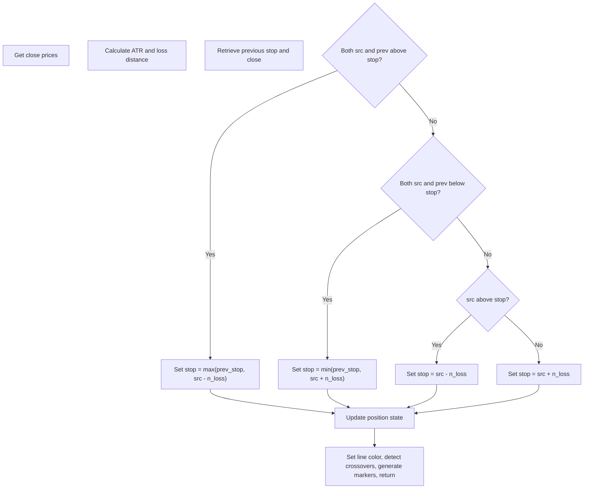

# Ultra Trend Alerts - Technical Guide

> Computes a dynamic trailing stop based on ATR and generates buy/sell signals on crossovers.

| | |
| --- | --- |
| **Language** | Indie Script v5 |
| **Platform** | [TakeProfit](https://takeprofit.com) |
| **Category** | Trend |
| **Type** | Indicator |
| **Author** | @pavelmedd on TakeProfit |
| **License** | MIT |
| **Live script** | [Open on TakeProfit](https://takeprofit.com/indicator/ultra-trend-alerts-93) |
| **Source file** | [Ultra Trend Alerts.indie5](Ultra%20Trend%20Alerts.indie5) |

## Overview

Ultra Trend Alerts is a volatility-based trend-following indicator that calculates a dynamic trailing stop using the Average True Range (ATR). It is designed to capture market reversals and manage position exits in trending markets. The indicator adapts to market volatility: the stop tightens during consolidation and widens during high-volatility moves, preventing premature stop-outs.

On the chart, the indicator draws a trailing stop line that changes color based on the trend direction: green for bullish (last crossover was upward), red for bearish (last crossover was downward), and blue for neutral. Buy markers (green "Buy" label) appear below the candle when price crosses above the stop, and Sell markers (red "Sell" label) appear above the candle when price crosses below the stop.

## How it works

1. Calculate the Average True Range (ATR) over the specified period.
2. Compute the loss distance as the sensitivity factor multiplied by the ATR.
3. Retrieve the previous trailing stop value and previous close price.
4. Update the trailing stop using conditional logic: if price and previous close are both above the stop, set stop to the maximum of previous stop and (current close minus loss distance); if both below, set stop to the minimum of previous stop and (current close plus loss distance); otherwise, set stop to current close minus (if above) or plus (if below) loss distance.
5. Track the position state (bullish/bearish/neutral) based on crossovers: set to 1.0 when crossing above, -1.0 when crossing below, else persist previous state.
6. Color the trailing stop line according to the position state: green for bullish, red for bearish, blue for neutral.
7. Detect crossovers between the price and the trailing stop using cross_over and cross_under functions.
8. Generate Buy marker when price crosses above the stop, Sell marker when price crosses below the stop.

## Logic flow



## Parameters

| Parameter | Type | Default | Range | Description |
| --- | --- | --- | --- | --- |
| `key_value` | float | 1.0 | ≥ 0.1 | Key Value (Sensitivity) |
| `atr_period` | int | 10 | ≥ 1 | ATR Period |

## Code walkthrough

### ATR and Loss Distance Calculation

Lines 30-31 of [Ultra Trend Alerts.indie5](Ultra%20Trend%20Alerts.indie5):

```python
    x_atr = Atr.new(length=atr_period)
    n_loss = key_value * x_atr[0]
```

Creates an ATR series with the specified lookback period and computes the loss distance as the product of the sensitivity factor and the ATR value. This distance determines how far the trailing stop trails behind the price, adapting to current market volatility.

### Trailing Stop Update Logic

Lines 34-46 of [Ultra Trend Alerts.indie5](Ultra%20Trend%20Alerts.indie5):

```python
    x_atr_trailing_stop = MutSeriesF.new(init=0.0)
    
    prev_stop = x_atr_trailing_stop[1]
    prev_src = src[1]
    
    if src[0] > prev_stop and prev_src > prev_stop:
        x_atr_trailing_stop[0] = max(prev_stop, src[0] - n_loss)
    elif src[0] < prev_stop and prev_src < prev_stop:
        x_atr_trailing_stop[0] = min(prev_stop, src[0] + n_loss)
    elif src[0] > prev_stop:
        x_atr_trailing_stop[0] = src[0] - n_loss
    else:
        x_atr_trailing_stop[0] = src[0] + n_loss
```

Initializes a mutable series for the trailing stop. The update uses four conditional branches to ensure the stop trails price at a volatility-adjusted distance while preventing it from moving against the trend. When both current and previous closes are above the stop, the stop is raised to the maximum of its previous value and the current close minus loss distance, effectively trailing upward. Symmetric logic applies when both are below. Transitional cases set the stop directly relative to the current close.

### Position State Tracking

Lines 49-56 of [Ultra Trend Alerts.indie5](Ultra%20Trend%20Alerts.indie5):

```python
    pos = MutSeriesF.new(init=0.0)
    
    if prev_src < prev_stop and src[0] > prev_stop:
        pos[0] = 1.0
    elif prev_src > prev_stop and src[0] < prev_stop:
        pos[0] = -1.0
    else:
        pos[0] = pos[1]
```

Tracks the current position state (bullish, bearish, or neutral) using a mutable series. The state is set to 1.0 when price crosses above the stop, -1.0 when crossing below, and persists otherwise. This state is used to color the trailing stop line and provides a smoothed indication of trend direction.

### Crossover Detection and Signal Generation

Lines 62-67 of [Ultra Trend Alerts.indie5](Ultra%20Trend%20Alerts.indie5):

```python
    above = cross_over(src, x_atr_trailing_stop)
    below = cross_under(src, x_atr_trailing_stop)
    
    # Buy/Sell signals
    buy = src[0] > x_atr_trailing_stop[0] and above
    sell = src[0] < x_atr_trailing_stop[0] and below
```

Uses the cross_over and cross_under functions to detect the exact bar where price crosses the trailing stop. Buy signals are generated only when price crosses above the stop and a crossover is detected; Sell signals when crossing below. This ensures markers appear only on the bar of the crossover, avoiding repeated signals.

## Reading the chart

- The trailing stop line is drawn in green when the position is bullish (last crossover was upward), red when bearish (last crossover was downward), and blue when neutral (no clear trend).
- Buy markers (green "Buy" label) appear below the candle when price crosses above the trailing stop.
- Sell markers (red "Sell" label) appear above the candle when price crosses below the trailing stop.
- The distance between the price and the trailing stop reflects the current volatility (ATR multiplied by sensitivity). Wider distance in volatile markets, tighter in consolidation.

## Implementation notes

- The trailing stop is initialized to 0, so the first few bars may show erratic behavior until the stop converges.
- The position state (pos) persists across bars using MutSeriesF, so it only changes on crossover events.
- Cross_over and cross_under functions detect the exact bar where the crossover occurs, ensuring signals are not repeated.
- The line color is determined by the position state, not by the current bar's crossover, so it changes on the same bar as the crossover.

## FAQ

**How do I adjust the sensitivity of the trailing stop?**

Change the "Key Value (Sensitivity)" parameter. Lower values (e.g., 1.0) make the stop tighter, generating more signals. Higher values (e.g., 2.0-3.0) widen the stop, reducing signals.

**What ATR period should I use?**

The default is 10. Shorter periods make the stop respond faster to volatility changes, longer periods smooth out noise. Adjust based on your trading timeframe.

**Why don't I see any signals on the first few bars?**

The trailing stop initializes to 0 and the position state starts neutral. It takes a few bars for the stop to adjust to the price level and for a crossover to occur.

## Full source code

Indie Script v5, as published on TakeProfit. Copy it into the platform's script editor or [open the live script](https://takeprofit.com/indicator/ultra-trend-alerts-93).

```python
# indie:lang_version = 5
from math import nan
from indie import indicator, param, plot, color, MutSeriesF
from indie.algorithms import Atr
from indie.math import cross_over, cross_under


@indicator('Ultra Trend Alerts', overlay_main_pane=True)
@param.float('key_value', default=1.0, min=0.1, title="Key Value (Sensitivity)")
@param.int('atr_period', default=10, min=1, title="ATR Period")
@plot.line(id='trailing_stop', title='ATR Trailing Stop', color=color.BLUE)
@plot.marker(
    title='Buy',
    style=plot.marker_style.LABEL,
    position=plot.marker_position.BELOW,
    size=5,
    color=color.GREEN,
)
@plot.marker(
    title='Sell',
    style=plot.marker_style.LABEL,
    position=plot.marker_position.ABOVE,
    size=5,
    color=color.RED,
)
def Main(self, key_value, atr_period):
    src = self.close
    
    # Calculate ATR-based loss
    x_atr = Atr.new(length=atr_period)
    n_loss = key_value * x_atr[0]
    
    # ATR Trailing Stop calculation
    x_atr_trailing_stop = MutSeriesF.new(init=0.0)
    
    prev_stop = x_atr_trailing_stop[1]
    prev_src = src[1]
    
    if src[0] > prev_stop and prev_src > prev_stop:
        x_atr_trailing_stop[0] = max(prev_stop, src[0] - n_loss)
    elif src[0] < prev_stop and prev_src < prev_stop:
        x_atr_trailing_stop[0] = min(prev_stop, src[0] + n_loss)
    elif src[0] > prev_stop:
        x_atr_trailing_stop[0] = src[0] - n_loss
    else:
        x_atr_trailing_stop[0] = src[0] + n_loss
    
    # Position tracking
    pos = MutSeriesF.new(init=0.0)
    
    if prev_src < prev_stop and src[0] > prev_stop:
        pos[0] = 1.0
    elif prev_src > prev_stop and src[0] < prev_stop:
        pos[0] = -1.0
    else:
        pos[0] = pos[1]
    
    # Color for trailing stop line based on position
    x_color = color.RED if pos[0] == -1 else (color.GREEN if pos[0] == 1 else color.BLUE)
    
    # Crossover detection (src used directly instead of EMA(src,1))
    above = cross_over(src, x_atr_trailing_stop)
    below = cross_under(src, x_atr_trailing_stop)
    
    # Buy/Sell signals
    buy = src[0] > x_atr_trailing_stop[0] and above
    sell = src[0] < x_atr_trailing_stop[0] and below
    
    # Return trailing stop line and markers
    buy_marker = plot.Marker(
        value=self.low[0],
        color=color.GREEN,
        text='Buy'
    ) if buy else plot.Marker(value=nan, color=color.TRANSPARENT)
    
    sell_marker = plot.Marker(
        value=self.high[0],
        color=color.RED,
        text='Sell'
    ) if sell else plot.Marker(value=nan, color=color.TRANSPARENT)
    
    return (
        plot.Line(x_atr_trailing_stop[0], color=x_color),
        buy_marker,
        sell_marker
    )
```
