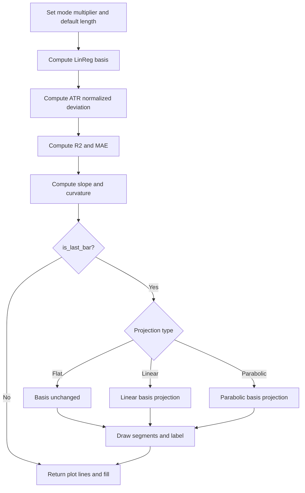

# Universal Forecast Funnel [UFF] - Technical Guide

> Computes a linear-regression basis line, volatility-scaled upper/lower funnel, R² confidence, and a projected forecast funnel with MAE label on the last bar.

| | |
| --- | --- |
| **Language** | Indie Script v5 |
| **Platform** | [TakeProfit](https://takeprofit.com) |
| **Category** | Trend |
| **Type** | Indicator |
| **Author** | @pavelmedd on TakeProfit |
| **License** | licensed under the MIT License (see the header of the source file) |
| **Live script** | [Open on TakeProfit](https://takeprofit.com/indicator/universal-forecast-funnel-uff-55) |
| **Source file** | [Universal Forecast Funnel UFF.indie5](Universal%20Forecast%20Funnel%20UFF.indie5) |

## Overview

The indicator computes a linear regression of close prices over a lookback and draws a volatility-scaled funnel around it. The funnel width reacts to both standard deviation and the current ATR position inside its recent range, so it expands in rising volatility and contracts in low volatility. A squared correlation gives trend confidence, and a smoothed MAE percent is shown in the label.

On the chart, the historical basis, upper and lower bands, and the fill between them are plotted every bar. On the last bar, the indicator extends the basis forward as dotted forecast segments and the upper/lower bands as solid forecast segments, using a flat, linear, or parabolic projection. A label reports the projected target, trend direction, confidence, strength, optional MAE, and warnings for long horizons or low confidence.

## How it works

1. Resolve style multiplier (1.5/2.0/2.5) and asset-class default length (50/100/200); use custom length and multiplier when enabled.
2. Compute LinReg basis and StdDev deviation; normalize ATR position to scale the deviation between 0.8x and 1.6x.
3. Compute R² from the correlation between close and basis and smooth MAE% with Sma, floored by 0.1*ATR%.
4. Smooth the basis slope with Ema and derive curvature from slope changes, smoothing it again.
5. Weight curvature by R², normalize it by deviation, clamp it, and combine it with confidence into the final projection slope.
6. On the last bar, split fwd bars into segments and project the basis using Flat, Linear or Parabolic formulas.
7. Expand the funnel deviation per segment using distance ratio, R² growth factor, curvature, and a 1.5x per-step cap.
8. Draw dotted basis forecast, solid bands, and a label; return basis/upper/lower plot lines with fill.

## Mathematical model

**Definitions**

$$
B = \mathrm{LinReg}(P, L, 0)
$$

$$
D_0 = \mathrm{StdDev}(P, L) \cdot m
$$

$$
D = D_0 \left(0.8 + 0.8 \frac{\mathrm{ATR} - \min(\mathrm{ATR})}{\max(\mathrm{ATR}) - \min(\mathrm{ATR})}\right)
$$

$$
U = B + D,\qquad B_{\mathrm{lo}} = B - D
$$

**Confidence and error**

$$
r = \mathrm{Corr}(P, B, L),\qquad R^2 = r^2
$$

$$
M = \max\left(\mathrm{SMA}\left(\frac{|P_0 - B|}{\max(|B|,10^{-9})} \cdot 100,\; L\right),\; 0.1 \cdot \frac{\mathrm{ATR}}{|B|} \cdot 100\right)
$$

**Slope, curvature and projection**

$$
s = \mathrm{EMA}(B_0 - B_1, S),\qquad c = \mathrm{EMA}(s_0 - s_1, 2S)
$$

$$
w = \begin{cases} 1 + 2(R^2 - 0.5) & R^2 > 0.5 \\ 2R^2 & \text{otherwise} \end{cases}
$$

$$
c_a = c \cdot w,\qquad \kappa = \frac{c_a}{D},\qquad \eta = \mathrm{clamp}\left(\kappa \frac{L}{100},\; -0.25,\; 0.25\right)
$$

$$
s_f = s \cdot (0.3 + 1.7 R^2)(1 + \eta)
$$

$$
B_t = B \quad (\text{Flat})
$$

$$
B_t = B + s_f \left(1 + \eta \cdot t \cdot 0.1\right) t \quad (\text{Linear})
$$

$$
B_t = B + s_f t + 0.5 c_a t^2 \quad (\text{Parabolic})
$$

**Forecast band expansion**

$$
\rho = \min\left(1,\; \frac{t}{L}\right),\qquad g = 1 + (1 - R^2)^{1.3}
$$

$$
D'_t = \max\left(D,\; D \cdot g \cdot \rho^{e}\right)\left(1 + 0.5|\kappa|\right)
$$

$$
D_t = \min\left(1.5\, D_{t-1},\; D'_t\right),\qquad e = 2.0 \ \text{or}\ 1.5
$$

## Logic flow



## Parameters

| Parameter | Type | Default | Range | Description |
| --- | --- | --- | --- | --- |
| `mode` | str | Moderate |  | Style |
| `asset_class` | str | Stocks |  | Asset Class |
| `proj_type` | str | Linear |  | Projection Type |
| `use_custom` | bool | false |  | Use Custom Params |
| `length` | int | 50 | ≥ 10 | Length |
| `mult` | float | 2.0 | ≥ 0.1 | Multiplier |
| `fwd` | int | 20 | ≥ 1 | Forecast |
| `smooth` | int | 5 | 1 - 20 | Slope Smoothing |
| `show_warnings` | bool | true |  | Show Warnings |
| `show_mae` | bool | true |  | Show MAE |
| `curve_segments` | int | 5 | 2 - 10 | Curve Segments |

## Code walkthrough

### Mode and asset-class presets

Lines 51-65 of [Universal Forecast Funnel UFF.indie5](Universal%20Forecast%20Funnel%20UFF.indie5):

```python
        mode_mult = 2.0
        if self._mode == 'Conservative':
            mode_mult = 1.5
        elif self._mode == 'Aggressive':
            mode_mult = 2.5

        # Default length depending on asset class
        default_len = 50
        if self._asset_class == 'Stocks':
            default_len = 200
        elif self._asset_class == 'Forex':
            default_len = 100
        
        length = self._length_in if self._use_custom else default_len
        mult = self._mult_in if self._use_custom else mode_mult
```

A style string selects a base multiplier: 1.5 for Conservative, 2.0 for Moderate, 2.5 for Aggressive. Asset class selects a default regression length: 50 for Crypto, 100 for Forex, 200 for Stocks. If use_custom is true, the user length and mult replace these presets.

### ATR-normalized funnel width

Lines 71-86 of [Universal Forecast Funnel UFF.indie5](Universal%20Forecast%20Funnel%20UFF.indie5):

```python
        # Volatility-based funnel width
        std = StdDev.new(self.close, length)
        dev_base = std[0] * mult
        
        atr_len = max(10, min(50, int(length / 3)))
        atr = Atr.new(atr_len)
        min_atr = Lowest.new(atr, atr_len)[0]
        max_atr = Highest.new(atr, atr_len)[0]
        
        atr_range = max_atr - min_atr
        norm = 0.0
        if atr_range > 1e-9:
            norm = (atr[0] - min_atr) / atr_range
        
        vol_factor = 0.8 + norm * 0.8
        dev = dev_base * vol_factor
```

The base deviation is StdDev times mult. ATR is computed over roughly length/3 bars, and its position between its own lowest and highest values over that window is converted to a 0..1 norm. Multiplying by 0.8..1.6 makes the funnel wider when ATR is near its high and narrower when ATR is near its low.

### Confidence and MAE

Lines 92-106 of [Universal Forecast Funnel UFF.indie5](Universal%20Forecast%20Funnel%20UFF.indie5):

```python
        # Trend confidence (R²)
        r_val = Corr.new(self.close, lin, length)[0]
        r_val = r_val if not isnan(r_val) else 0.0
        r2 = r_val * r_val
        
        # Mean Absolute Error % for display
        basis_safe = max(1e-9, abs(basis))
        mae_pct_raw = abs(self.close[0] - basis) / basis_safe * 100
        mae_pct_series = MutSeriesF.new(reset=mae_pct_raw)
        mae_pct_sma = Sma.new(mae_pct_series, length)[0]
        mae_pct_sma = mae_pct_sma if not isnan(mae_pct_sma) else 0.0
        
        # MAE minimum threshold = ATR * 0.1 (in percent)
        atr_pct = (atr[0] / basis_safe) * 100 * 0.1
        mae_pct = max(mae_pct_sma, atr_pct)
```

R² is the squared correlation between close and the basis, with NaN replaced by 0. MAE% is the smoothed absolute basis error in percent. The displayed MAE is raised to at least 0.1*ATR% so the label never shows an unrealistically tiny error.

### Slope and curvature smoothing

Lines 109-122 of [Universal Forecast Funnel UFF.indie5](Universal%20Forecast%20Funnel%20UFF.indie5):

```python
        slope_raw = lin[0] - lin[1]
        slope_series = MutSeriesF.new(reset=slope_raw)
        slope_ema = Ema.new(slope_series, self._smooth)
        slope_smooth = slope_ema[0]
        
        prev = slope_ema[1]
        if isnan(prev):
            prev = slope_smooth
        curv_raw = slope_smooth - prev
        
        curv_series = MutSeriesF.new(reset=curv_raw)
        curv_smooth_len = self._smooth * 2
        curv_ema = Ema.new(curv_series, curv_smooth_len)
        curvature = curv_ema[0]
```

The raw slope is the current regression value minus the previous one. MutSeriesF.new(reset=...) turns that scalar into a series so Ema can smooth it. Curvature is the change in the smoothed slope, smoothed again with a window twice as long.

### Curvature weighting and final slope

Lines 126-139 of [Universal Forecast Funnel UFF.indie5](Universal%20Forecast%20Funnel%20UFF.indie5):

```python
        curv_weight = 1.0
        if r2 > 0.5:
            curv_weight = 1.0 + (r2 - 0.5) * 2.0
        else:
            curv_weight = r2 * 2.0

        # Normalize curvature relative to forecast band
        curvature_adj = curvature * curv_weight
        
        curvature_norm = curvature_adj / max(1e-8, dev)
        curv_factor = curvature_norm * (length / 100.0)
        curv_factor = max(-0.25, min(0.25, curv_factor))
        
        slope = slope_smooth * (0.3 + r2 * 1.7) * (1.0 + curv_factor)
```

Curvature gets more weight when R² is above 0.5 and less when R² is low. It is normalized by the funnel deviation, scaled by length/100, and clamped to +/-0.25. The final slope is the smoothed slope amplified by confidence and adjusted by the curvature factor.

### Forecast projection loop

Lines 186-209 of [Universal Forecast Funnel UFF.indie5](Universal%20Forecast%20Funnel%20UFF.indie5):

```python
            for i in range(1, n_seg + 1):
                t_step = step * i
                
                bars_ahead = int(round(t_step))
                bars_ahead = max(prev_bars + 1, bars_ahead)
                if i == n_seg:
                    bars_ahead = self._fwd
                
                curr_t = self.time[0] + bars_ahead * tf_step

                # Calculate projected basis depending on projection type
                curr_basis = basis
                if self._proj_type == 'Flat':
                    curr_basis = basis
                elif self._proj_type == 'Linear':
                    slope_adj = slope * (1.0 + curv_factor * t_step * 0.1)
                    curr_basis = basis + slope_adj * t_step
                elif self._proj_type == 'Parabolic':
                    curr_basis = basis + slope * t_step + 0.5 * curvature_adj * t_step * t_step
                
                # Forecast band expansion
                ratio_i = min(1.0, t_step / max(1, length))
                dev_i = base_dev * growth_factor * pow(ratio_i, funnel_exp)
                dev_i = max(dev, dev_i)
```

The forecast horizon is split into segments so the projection can curve. Each step chooses a projected basis according to the projection type: unchanged for Flat, slope-adjusted for Linear, or with a quadratic term for Parabolic. The deviation expands with distance, but is capped by the previous segment's deviation times 1.5.

## Reading the chart

- The basis line is green when the final slope is positive and red when it is zero or negative, using `rgba(0,184,148,255)` or `rgba(255,107,107,255)`.
- The upper and lower bands use the same hue with alpha 200; the fill uses `color.GREEN(0.2)` or `color.RED(0.2)`.
- On the last bar, the forecast basis is a dotted line of width 2 and forecast bands are solid lines of width 1, extending `fwd` bars into the future.
- The label sits at the final forecast time and upper price. It shows `Target: <value>`, `UP/DOWN | Conf: <percent>%`, `Strong/Medium/Weak`, optional `MAE: <percent>%`, and optional warnings `! Horizon >> Len` or `! Low R2 (noisy)`.
- Historical lines are plotted on every bar; the forecast drawing block runs only when `is_last_bar` is true.

## Implementation notes

- `use_custom` only selects custom `length` and `mult`; `fwd`, `smooth`, `curve_segments`, and display toggles always apply.
- The projection is only drawn when `is_last_bar` is true, so it is recreated on each new bar and no historical forecast path is retained.
- All forecast segments use 30 preallocated `LineSegment` objects; with `curve_segments` max 10 and 3 segments per step, the buffer is exactly sized.
- `tf_step` switches between seconds and milliseconds by checking `self.time[0] > 1e12`, so the forward spacing matches the chart timeframe.

## FAQ

**Why does changing Length or Multiplier have no effect?**

Those inputs are only used when Use Custom Params is enabled. Otherwise Length comes from the Asset Class preset and Multiplier comes from the Style preset.

**What is the difference between Flat, Linear and Parabolic projection?**

Flat keeps the forecast basis at the current basis value. Linear adds the adjusted slope times the distance. Parabolic adds both the slope term and a quadratic term from the weighted curvature, so the path can curve.

**Can I hide the extra label information?**

Yes. Set Show Warnings to false to hide the warnings, and set Show MAE to false to hide the MAE line. The rest of the label, target, trend, confidence, and strength, is always drawn.

## Full source code

Indie Script v5, as published on TakeProfit. Copy it into the platform's script editor or [open the live script](https://takeprofit.com/indicator/universal-forecast-funnel-uff-55).

```python
# Copyright (c) 2025 @pavelmedd. All rights reserved.

# This work is licensed under the MIT License.
# For a copy, see <https://opensource.org/licenses/MIT>.

# indie:lang_version = 5
from indie import indicator, MainContext, plot, color, param, MutSeriesF
from indie.algorithms import LinReg, StdDev, Corr, Ema, Atr, Highest, Lowest, Sma
from indie.drawings import LineSegment, LabelAbs, AbsolutePosition, line_segment_style
from indie.color import rgba
from math import isnan, pow

@indicator('UFF Pro', overlay_main_pane=True)
@param.str('mode', default='Moderate', options=['Conservative', 'Moderate', 'Aggressive'], title='Style')
@param.str('asset_class', default='Stocks', options=['Crypto', 'Forex', 'Stocks'], title='Asset Class')
@param.str('proj_type', default='Linear', options=['Linear', 'Flat', 'Parabolic'], title='Projection Type')
@param.bool('use_custom', default=False, title='Use Custom Params')
@param.int('length', default=50, min=10, title='Length')
@param.float('mult', default=2.0, min=0.1, title='Multiplier')
@param.int('fwd', default=20, min=1, title='Forecast')
@param.int('smooth', default=5, min=1, max=20, title='Slope Smoothing')
@param.bool('show_warnings', default=True, title='Show Warnings')
@param.bool('show_mae', default=True, title='Show MAE')
@param.int('curve_segments', default=5, min=2, max=10, title='Curve Segments')
@plot.line('basis', title='Basis')
@plot.line('upper', title='Upper')
@plot.line('lower', title='Lower')
@plot.fill('upper', 'lower', title='Fill')
class Main(MainContext):
    def __init__(self, mode, asset_class, proj_type, use_custom, length, mult, fwd, smooth, show_warnings, show_mae, curve_segments):
        self._mode = mode
        self._asset_class = asset_class
        self._proj_type = proj_type
        self._use_custom = use_custom
        self._length_in = length
        self._mult_in = mult
        self._fwd = fwd
        self._smooth = smooth
        self._show_warnings = show_warnings
        self._show_mae = show_mae
        self._curve_segments = curve_segments
        
        self._proj_label = LabelAbs('', AbsolutePosition(0, 0))
        
        self._lines: list[LineSegment] = []
        for _ in range(30):
            self._lines.append(LineSegment(AbsolutePosition(0, 0), AbsolutePosition(0, 0)))

    def calc(self):
        # Determine multiplier based on trading style
        mode_mult = 2.0
        if self._mode == 'Conservative':
            mode_mult = 1.5
        elif self._mode == 'Aggressive':
            mode_mult = 2.5

        # Default length depending on asset class
        default_len = 50
        if self._asset_class == 'Stocks':
            default_len = 200
        elif self._asset_class == 'Forex':
            default_len = 100
        
        length = self._length_in if self._use_custom else default_len
        mult = self._mult_in if self._use_custom else mode_mult

        # Main regression line (basis)
        lin = LinReg.new(self.close, length, 0)
        basis = lin[0]

        # Volatility-based funnel width
        std = StdDev.new(self.close, length)
        dev_base = std[0] * mult
        
        atr_len = max(10, min(50, int(length / 3)))
        atr = Atr.new(atr_len)
        min_atr = Lowest.new(atr, atr_len)[0]
        max_atr = Highest.new(atr, atr_len)[0]
        
        atr_range = max_atr - min_atr
        norm = 0.0
        if atr_range > 1e-9:
            norm = (atr[0] - min_atr) / atr_range
        
        vol_factor = 0.8 + norm * 0.8
        dev = dev_base * vol_factor

        # Upper and lower forecast bands
        upper = basis + dev
        lower = basis - dev

        # Trend confidence (R²)
        r_val = Corr.new(self.close, lin, length)[0]
        r_val = r_val if not isnan(r_val) else 0.0
        r2 = r_val * r_val
        
        # Mean Absolute Error % for display
        basis_safe = max(1e-9, abs(basis))
        mae_pct_raw = abs(self.close[0] - basis) / basis_safe * 100
        mae_pct_series = MutSeriesF.new(reset=mae_pct_raw)
        mae_pct_sma = Sma.new(mae_pct_series, length)[0]
        mae_pct_sma = mae_pct_sma if not isnan(mae_pct_sma) else 0.0
        
        # MAE minimum threshold = ATR * 0.1 (in percent)
        atr_pct = (atr[0] / basis_safe) * 100 * 0.1
        mae_pct = max(mae_pct_sma, atr_pct)
        
        # Slope and curvature for projection
        slope_raw = lin[0] - lin[1]
        slope_series = MutSeriesF.new(reset=slope_raw)
        slope_ema = Ema.new(slope_series, self._smooth)
        slope_smooth = slope_ema[0]
        
        prev = slope_ema[1]
        if isnan(prev):
            prev = slope_smooth
        curv_raw = slope_smooth - prev
        
        curv_series = MutSeriesF.new(reset=curv_raw)
        curv_smooth_len = self._smooth * 2
        curv_ema = Ema.new(curv_series, curv_smooth_len)
        curvature = curv_ema[0]
        curvature = curvature if not isnan(curvature) else 0.0

        # Adjust curvature weight based on confidence
        curv_weight = 1.0
        if r2 > 0.5:
            curv_weight = 1.0 + (r2 - 0.5) * 2.0
        else:
            curv_weight = r2 * 2.0

        # Normalize curvature relative to forecast band
        curvature_adj = curvature * curv_weight
        
        curvature_norm = curvature_adj / max(1e-8, dev)
        curv_factor = curvature_norm * (length / 100.0)
        curv_factor = max(-0.25, min(0.25, curv_factor))
        
        slope = slope_smooth * (0.3 + r2 * 1.7) * (1.0 + curv_factor)
        
        is_up = slope > 0

        # Colors for trend and funnel
        col_main = rgba(0, 184, 148, 255) if is_up else rgba(255, 107, 107, 255)
        col_line = rgba(0, 184, 148, 200) if is_up else rgba(255, 107, 107, 200)
        col_fill = color.GREEN(0.2) if is_up else color.RED(0.2)
        
        if self.is_last_bar:
            tf_min = self.time_frame.to_minutes()
            tf_step = tf_min * 60
            if self.time[0] > 1e12:
                tf_step = tf_min * 60 * 1000
            
            growth_factor = 1.0 + pow(1.0 - r2, 1.3)
            base_dev = dev
            
            # Determine number of segments in forecast funnel
            n_seg = self._curve_segments
            if tf_min <= 5 and n_seg > 6:
                n_seg = 6
            if self._fwd > 200 and n_seg > 8:
                n_seg = 8
            n_seg = min(n_seg, max(1, self._fwd))
            
            funnel_exp = 2.0
            if n_seg > 4 or length < 30:
                funnel_exp = 1.5
            
            step = float(self._fwd) / n_seg
            max_step_increase = 1.5
            
            prev_t = self.time[0]
            prev_basis = basis
            prev_upper = upper
            prev_lower = lower
            prev_dev = dev
            prev_bars = 0
            
            final_basis = basis
            final_upper = upper
            final_time = self.time[0]
            
            line_idx = 0

            # Draw forecast funnel segments
            for i in range(1, n_seg + 1):
                t_step = step * i
                
                bars_ahead = int(round(t_step))
                bars_ahead = max(prev_bars + 1, bars_ahead)
                if i == n_seg:
                    bars_ahead = self._fwd
                
                curr_t = self.time[0] + bars_ahead * tf_step

                # Calculate projected basis depending on projection type
                curr_basis = basis
                if self._proj_type == 'Flat':
                    curr_basis = basis
                elif self._proj_type == 'Linear':
                    slope_adj = slope * (1.0 + curv_factor * t_step * 0.1)
                    curr_basis = basis + slope_adj * t_step
                elif self._proj_type == 'Parabolic':
                    curr_basis = basis + slope * t_step + 0.5 * curvature_adj * t_step * t_step
                
                # Forecast band expansion
                ratio_i = min(1.0, t_step / max(1, length))
                dev_i = base_dev * growth_factor * pow(ratio_i, funnel_exp)
                dev_i = max(dev, dev_i)
                dev_i = dev_i * (1.0 + abs(curvature_norm) * 0.5)
                dev_i = min(prev_dev * max_step_increase, dev_i)
                
                curr_upper = curr_basis + dev_i
                curr_lower = curr_basis - dev_i

                # Draw basis line segment
                self._lines[line_idx].point_a = AbsolutePosition(prev_t, prev_basis)
                self._lines[line_idx].point_b = AbsolutePosition(curr_t, curr_basis)
                self._lines[line_idx].color = col_main
                self._lines[line_idx].line_width = 2
                self._lines[line_idx].line_style = line_segment_style.DOTTED
                self.chart.draw(self._lines[line_idx])
                line_idx = line_idx + 1
                
                # Draw upper band segment
                self._lines[line_idx].point_a = AbsolutePosition(prev_t, prev_upper)
                self._lines[line_idx].point_b = AbsolutePosition(curr_t, curr_upper)
                self._lines[line_idx].color = col_line
                self._lines[line_idx].line_width = 1
                self._lines[line_idx].line_style = line_segment_style.SOLID
                self.chart.draw(self._lines[line_idx])
                line_idx = line_idx + 1
                
                # Draw lower band segment
                self._lines[line_idx].point_a = AbsolutePosition(prev_t, prev_lower)
                self._lines[line_idx].point_b = AbsolutePosition(curr_t, curr_lower)
                self._lines[line_idx].color = col_line
                self._lines[line_idx].line_width = 1
                self._lines[line_idx].line_style = line_segment_style.SOLID
                self.chart.draw(self._lines[line_idx])
                line_idx = line_idx + 1
                
                # Update previous points for next segment
                prev_t = curr_t
                prev_basis = curr_basis
                prev_upper = curr_upper
                prev_lower = curr_lower
                prev_dev = dev_i
                prev_bars = bars_ahead
                
                final_basis = curr_basis
                final_upper = curr_upper
                final_time = curr_t
            
            # Trend labels
            trend = 'UP' if is_up else 'DOWN'
            conf = int(r2 * 100)
            strength = 'Strong' if r2 > 0.7 else 'Medium' if r2 > 0.4 else 'Weak'
            
            warn = ''
            if self._show_warnings:
                if self._fwd > length * 4:
                    warn = warn + '\n! Horizon >> Len'
                if r2 < 0.18:
                    warn = warn + '\n! Low R2 (noisy)'
            
            mae_str = ''
            if self._show_mae:
                mae_str = '\nMAE: ' + str(round(mae_pct, 2)) + '%'

            # Display projection label on chart
            lbl_text = 'Target: ' + str(round(final_basis, 2)) + '\n' + trend + ' | Conf: ' + str(conf) + '%\n' + strength + mae_str + warn
            
            self._proj_label.text = lbl_text
            self._proj_label.position = AbsolutePosition(final_time, final_upper)
            self._proj_label.bg_color = col_main
            self._proj_label.text_color = color.WHITE
            self._proj_label.font_size = 11
            self.chart.draw(self._proj_label)
        
        # Return main lines and fill for plotting
        return (
            plot.Line(basis, color=col_main),
            plot.Line(upper, color=col_line),
            plot.Line(lower, color=col_line),
            plot.Fill(color=col_fill)
        )
```
