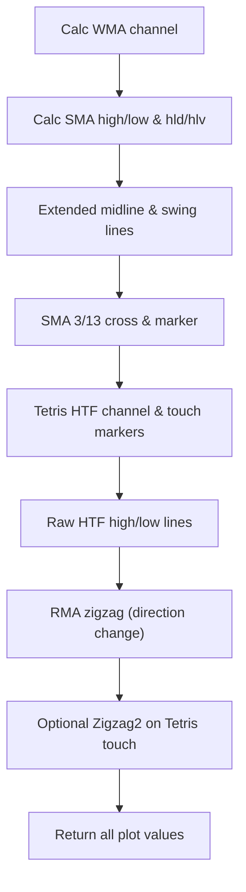

# VD binary pro 3 (port) - Technical Guide

> Multi-block volatility indicator with WMA channel, SMA band, RMA zigzag, HTF levels, and cross signals.

| | |
| --- | --- |
| **Language** | Indie Script v5 |
| **Platform** | [TakeProfit](https://takeprofit.com) |
| **Category** | Volatility |
| **Type** | Indicator |
| **Author** | @insurgent on TakeProfit |
| **Original (TradingView)** | [VDUB_BINARY_PRO_3_V2 FINAL + Strategy](https://www.tradingview.com/script/Qeq1OFuM-VDUB-BINARY-PRO-3-V2-FINAL-Strategy/) by vdubus |
| **License** | [MPL-2.0](https://mozilla.org/MPL/2.0/) (derivative work) |
| **Live script** | [Open on TakeProfit](https://takeprofit.com/indicator/vd-binary-pro-3-port-25) |
| **Source file** | [VD binary pro 3 (port).indie5](VD%20binary%20pro%203%20(port).indie5) |

## Overview

VD binary pro 3 is a port of the TradingView study "VDUB_BINARY_PRO_3_V2. It combines seven distinct signal blocks on a single price chart: a WMA-based volatility channel, an SMA(high/low) band with a state machine, a midline, fast/slow SMA cross signals with markers, a higher-timeframe (HTF) channel with touch markers, raw HTF high/low lines, and a direction-based RMA zigzag with an optional touch zigzag.

The indicator is designed for traders who want multiple contextual layers — trend direction, volatility bands, HTF reference levels, and reversal points — all in one overlay. It is meant to be used on any timeframe, with configurable lengths for the WMA, SMA, ATR, and RMA components.

## How it works

1. Compute WMA(close, length) as the channel midline, add/subtract 2× and 3× WMA(TR, atrlen) for four band edges.
2. Calculate SMA(high, periods) and SMA(low, periods); track a state machine (hld/hlv) based on close crossing those SMAs.
3. Derive the extended midline as (SMA(high) + SMA(low))/2; plot swing high/low lines when the pc parameter is enabled.
4. Compute short SMA(close, 3) and long SMA(close, 13); plot a circle marker when they cross and set background color (fully transparent by default).
5. Fetch HTF highest/lowest (Tetris channel) via sec_context on lrg_tf; draw lines that hide jumps between bars and place touch markers above/below the chart.
6. Fetch raw HTF high/low on sml_tf; draw them similarly with colour transitions at repaint boundaries.
7. Compute RMA(hl2, zigzag_length) and detect direction changes; plot a zigzag at the extreme price when direction flips, plus an optional second zigzag based on Tetris touch conditions.

## Mathematical model

$$
\text{ma} = \text{WMA}(\text{close}, \text{length})
$$

$$
\text{rangema} = \text{WMA}(\text{TR}, \text{atrlen})
$$

$$
\text{up}_1 = \text{ma} + 2\cdot\text{rangema},\quad \text{up}_2 = \text{ma} + 3\cdot\text{rangema}
$$

$$
\text{dn}_1 = \text{ma} - 2\cdot\text{rangema},\quad \text{dn}_2 = \text{ma} - 3\cdot\text{rangema}
$$

## Logic flow



## Parameters

| Parameter | Type | Default | Range | Description |
| --- | --- | --- | --- | --- |
| `length` | int | 56 | ≥ 1 | WMA Length |
| `atrlen` | int | 100 | ≥ 1 | ATR Length |
| `nlookback` | int | 20 | ≥ 1 | Number of Lookback (unused in original) |
| `scale` | int | 1 |  | scale of ATR (unused in original) |
| `n_atr` | int | 14 |  | ATR Parameter (unused in original) |
| `periods` | int | 21 | ≥ 1 | MA Period |
| `pc` | bool | true |  | MA BAND |
| `lrg_tf` | time_frame | 30m |  | LRG Channel TF |
| `tetris_range` | int | 1 | ≥ 1 | Range2 |
| `sml_tf` | time_frame | 4h |  | SML Channel TF |
| `zigzag_length` | int | 7 | ≥ 1 | Zingzag length |
| `zigzag2` | bool | false |  | Zigzag2 |

## Code walkthrough

### NaN-hardened SMA and RMA helpers

Lines 30-65 of [VD binary pro 3 (port).indie5](VD%20binary%20pro%203%20(port).indie5):

```python
from math import nan, isnan
from indie import (indicator, param, param_ref, plot, color, sec_context,
                   MainContext, MutSeriesF, Var, algorithm, SeriesF)
from indie.algorithms import Wma, Tr, Highest, Lowest
from indie.math import cross


@algorithm
def LoopSma(self, src: SeriesF, length: int) -> SeriesF:
    # Direct-window SMA, Pine-faithful: NaN inside the window -> NaN for those
    # bars only, then full recovery (unlike the built-in cumsum-based Sma).
    src.request_size(length)
    s = 0.0
    for i in range(length):
        s += src[i]
    return MutSeriesF.new(s / length)


@algorithm
def SafeRma(self, src: SeriesF, length: int) -> SeriesF:
    # RMA/SMMA: SMA seed + Wilder recursion (rma = prev + (src - prev)/length),
    # identical to Pine's rma() on clean data. NaN input carries the previous
    # value forward instead of poisoning the recursion forever.
    src.request_size(length)
    res = MutSeriesF.new(init=nan)
    if isnan(src[0]):
        res[0] = res[1]
    elif isnan(res[1]):
        s = 0.0
        for i in range(length):
            s += src[i]
        res[0] = s / length  # stays NaN until a clean seed window exists
    else:
        res[0] = (res[1] * (length - 1) + src[0]) / length
    return res

```

Two custom algorithms replace the built-in Sma/Sum to avoid permanent NaN corruption. LoopSma computes the window directly each bar (O(length) but recovers after a bad candle). SafeRma uses a SMA seed then Wilder recursion, but carries the previous value over NaN candles so the recursion never dies.

### Multi-timeframe channel fetchers

Lines 68-79 of [VD binary pro 3 (port).indie5](VD%20binary%20pro%203%20(port).indie5):

```python
@sec_context
@param_ref('tetris_range')
def TetrisChannelSec(self, tetris_range):
    hi = Highest.new(self.high, tetris_range)
    lo = Lowest.new(self.low, tetris_range)
    return hi[0], lo[0]


# --- SML channel: security(tickerid, SML_TF, high) / low
@sec_context
def RawHighLowSec(self):
    return self.high[0], self.low[0]
```

TetrisChannelSec uses sec_context and param_ref to fetch highest/lowest over the tetris_range on a separate timeframe lrg_tf. RawHighLowSec returns the raw high/low of sml_tf. Both are called via self.calc_on in __init__ so their series are available per-bar.

### Block 2 – SMA band and hld/hlv state machine

Lines 157-189 of [VD binary pro 3 (port).indie5](VD%20binary%20pro%203%20(port).indie5):

```python
        # ===== Block 2: SMA(high/low) band + hld/hlv state machine ==========
        sma_high = LoopSma.new(self.high, self._periods)
        sma_low = LoopSma.new(self.low, self._periods)

        # hld = iff(close > sma(high,periods)[1], 1, iff(close < sma(low,periods)[1], -1, 0))
        hld = 0.0
        if self.close[0] > sma_high[1]:
            hld = 1.0
        elif self.close[0] < sma_low[1]:
            hld = -1.0

        # hlv = valuewhen(hld != 0, hld, 1): value of hld on the SECOND most
        # recent bar where hld != 0 (the current bar counts as occurrence 0).
        occ0 = Var[float].new(init=nan)
        occ1 = Var[float].new(init=nan)
        if hld != 0.0:
            occ1.set(occ0.get())
            occ0.set(hld)
        hlv = occ1.get()
        # NOTE: hi/lo below are DEAD CODE in the original study (the fill that
        # used them is commented out and they are never plotted). Computed for
        # 1:1 parity, intentionally not returned.
        hi_band = sma_high[0] if self._pc and hlv == -1.0 else nan
        lo_band = sma_low[0] if self._pc and hlv == 1.0 else nan

        # ===== Block 3: extended midline =====================================
        # avg(smaH + 2.5*(smaH-smaL), smaL - 2.5*(smaH-smaL))
        # The +/-2.5*range terms cancel algebraically: == (smaH + smaL) / 2.
        band_range = sma_high[0] - sma_low[0]
        midline = ((sma_high[0] + 2.5 * band_range) + (sma_low[0] - 2.5 * band_range)) / 2

        swing_high = sma_high[0] if self._pc else nan
        swing_low = sma_low[0] if self._pc else nan
```

SMA of high/low over periods is computed with LoopSma. The hld variable tracks whether close is above/below the prior SMA values. A valuewhen-like logic with two Var cells stores the second most recent non-zero hld into hlv. The hi_band/lo_band are computed for parity but never returned.

### Block 3 – Extended midline with cancelling terms

Lines 183-189 of [VD binary pro 3 (port).indie5](VD%20binary%20pro%203%20(port).indie5):

```python
        # avg(smaH + 2.5*(smaH-smaL), smaL - 2.5*(smaH-smaL))
        # The +/-2.5*range terms cancel algebraically: == (smaH + smaL) / 2.
        band_range = sma_high[0] - sma_low[0]
        midline = ((sma_high[0] + 2.5 * band_range) + (sma_low[0] - 2.5 * band_range)) / 2

        swing_high = sma_high[0] if self._pc else nan
        swing_low = sma_low[0] if self._pc else nan
```

The midline formula adds ±2.5× the SMA band range to each side then averages them. The terms cancel algebraically to (sma_high + sma_low)/2, shown in the code comment. The swing_high/swing_low variables simply pass sma_high/sma_low through when pc is true.

### Blocks 5 & 6 – Tetris and raw HTF lines with colour transitions

Lines 202-218 of [VD binary pro 3 (port).indie5](VD%20binary%20pro%203%20(port).indie5):

```python
        # ===== Block 5: Vdub Tetris ==========================================
        sell = self._sell[0]
        buy = self._buy[0]
        # color = SELL != SELL[1] ? na : <color>  ->  hide the vertical jump segment
        sell_color = color.TRANSPARENT if sell != self._sell[1] else color.rgba(255, 82, 82)
        buy_color = color.TRANSPARENT if buy != self._buy[1] else color.rgba(11, 209, 163)
        h_con = self.high[0] >= sell
        l_con = self.low[0] <= buy
        tri_down = plot.Marker(value=self.high[0] if h_con else nan)
        tri_up = plot.Marker(value=self.low[0] if l_con else nan)
        # range2 = SELL - BUY  (dead code in the original - never used)

        # ===== Block 6: raw HTF high/low lines ===============================
        m_high = self._m_high[0]
        m_low = self._m_low[0]
        m_high_color = color.TRANSPARENT if m_high != self._m_high[1] else color.rgba(124, 77, 255)
        m_low_color = color.TRANSPARENT if m_low != self._m_low[1] else color.rgba(124, 77, 255)
```

Both HTF lines (sell/buy from Tetris and m_high/m_low from raw) are drawn with transparency when their current value differs from the previous bar. This hides vertical jump segments at repaint boundaries. Touch markers (tri_down, tri_up) are placed when price touches the Tetris levels.

## Reading the chart

- WMA channel edges: upper x2/x3 (white lines) and lower x2/x3 (white lines) with translucent fills; the centre fill between dn1 and up1 is a different hue.
- Extended midline: thick cyber-rose line (RGBA 255,42,109) — the smoothed centre of the SMA band.
- Swing high/low: thin silver lines plotted only when pc is enabled, matching sma_high/sma_low.
- Base line VX1: aqua SMA(3) and royal blue SMA(13). A blue circle prints when they cross.
- Tetris channel: coral SELL line (top) and mint BUY line (bottom). Coral circles above the bar when high touches SELL; mint circles below when low touches BUY.
- SML HTF levels: two indigo lines showing sml_tf high/low.
- RMA ZigZag: gold line that jumps to the period extreme when the RMA(hl2,7) direction flips.
- Zigzag2 (optional): coral thick line that draws a zigzag when price touches the Tetris channel boundaries.
- Background colour is fully transparent by default; raising the alpha value would tint bars red (short) or gray (long) based on the VX1 signal.

## Implementation notes

- LoopSma recomputes the full window each bar — acceptable for typical lengths but may be slower on very large lengths or high-frequency data.
- SafeRma carries the previous value over NaN candles, diverging from Pine's rma which would produce NaN after a NaN input.
- The Tetris and raw HTF lines change colour to TRANSPARENT on bars where the value repaints (i.e., when the current value differs from the previous). This is intentional to hide discontinuous jumps.
- Three input parameters (nlookback, scale, n_atr) are declared but never referenced in the logic — they are kept only for UI parity with the original Pine study.

## FAQ

**How do I make the VX1 background colour visible?**

In the indicator settings, the background fill has alpha = 0.0 by default. To see it, modify the code to set a non-zero alpha in the bg object's color (the @plot.background decorator does not control the color).

**Why do the HTF lines (Tetris and SML) sometimes disappear?**

Those lines are drawn with TRANSPARENT colour on bars where the value changes from the previous bar. This hides the vertical 'jump' that would otherwise connect two different HTF values. The line reappears once the value stabilises.

**What is the purpose of the nlookback, scale, and n_atr inputs?**

These inputs are present in the original Pine script but are never used in any calculation. They are kept in the Indie port only for settings-panel compatibility. Changing them has no effect on the indicator output.

## License and attribution

This Indie script is a derivative work of **VDUB_BINARY_PRO_3_V2 by vdubus** on TradingView. This is a port of an open-source TradingView script whose header we could not retrieve; TradingView applies MPL-2.0 by default to open-source scripts, so that license is assumed. A modified version of MPL-2.0 code must stay under [MPL-2.0](https://mozilla.org/MPL/2.0/), so this file is distributed under that license (the notice is appended to the end of the source file). The original author keeps the credit for the algorithm; this page is not affiliated with or endorsed by them.

## Full source code

Indie Script v5, as published on TakeProfit. Copy it into the platform's script editor or [open the live script](https://takeprofit.com/indicator/vd-binary-pro-3-port-25).

```python
# indie:lang_version = 5
# =============================================================================
# VDUB_BINARY_PRO_3_V2 - full Indie port of the TradingView Pine v2 study
# Color scheme: "Midnight Premium"
#   SELL signals ....... Coral       rgba(255, 82, 82)
#   BUY signals ........ Mint        rgba(11, 209, 163)
#   Swing High/Low ..... Silver      rgba(176, 190, 197)
#   SML HTF levels ..... Indigo      rgba(124, 77, 255)
#   Trend midline ...... Cyber Rose  rgba(255, 42, 109)
#   RMA ZigZag ......... Gold        rgba(255, 215, 0)
#   Fast MA(3) ......... Aqua        rgba(0, 229, 255)
#   Slow MA(13) ........ Royal Blue  rgba(41, 98, 255)
#
# 100% block coverage:
#   1. WMA channel (wma(close,56) +/- wma(tr,100) x2 / x3) with dual-band fills
#   2. SMA(high/low, 21) band + hld/hlv state machine (dead code in original,
#      kept for parity)
#   3. Extended midline (algebraically == (smaHigh + smaLow) / 2)
#   4. Base Line VX1: SMA(3) vs SMA(13), cross circles, bgcolor (transp=100 ->
#      invisible in original, replicated as fully transparent background)
#   5. Vdub Tetris: HTF highest/lowest channel via calc_on + touch markers
#   6. Raw HTF high/low lines on a second configurable time frame
#   7. RMA(hl2, 7) direction zigzag + optional touch-zigzag (Zigzag2)
#
# NaN-HARDENING NOTE: the built-in Sma/Sum gets permanently corrupted if the
# instrument's history contains even one NaN candle. LoopSma computes the
# window directly (Pine-faithful, recovers after the bad candle) and SafeRma
# carries its previous value over NaN candles so the recursion never dies.
# =============================================================================
from math import nan, isnan
from indie import (indicator, param, param_ref, plot, color, sec_context,
                   MainContext, MutSeriesF, Var, algorithm, SeriesF)
from indie.algorithms import Wma, Tr, Highest, Lowest
from indie.math import cross


@algorithm
def LoopSma(self, src: SeriesF, length: int) -> SeriesF:
    # Direct-window SMA, Pine-faithful: NaN inside the window -> NaN for those
    # bars only, then full recovery (unlike the built-in cumsum-based Sma).
    src.request_size(length)
    s = 0.0
    for i in range(length):
        s += src[i]
    return MutSeriesF.new(s / length)


@algorithm
def SafeRma(self, src: SeriesF, length: int) -> SeriesF:
    # RMA/SMMA: SMA seed + Wilder recursion (rma = prev + (src - prev)/length),
    # identical to Pine's rma() on clean data. NaN input carries the previous
    # value forward instead of poisoning the recursion forever.
    src.request_size(length)
    res = MutSeriesF.new(init=nan)
    if isnan(src[0]):
        res[0] = res[1]
    elif isnan(res[1]):
        s = 0.0
        for i in range(length):
            s += src[i]
        res[0] = s / length  # stays NaN until a clean seed window exists
    else:
        res[0] = (res[1] * (length - 1) + src[0]) / length
    return res


# --- Vdub_Tetris_V2: security(tickerid, LRG_TF, highest(Range2)/lowest(Range2))
@sec_context
@param_ref('tetris_range')
def TetrisChannelSec(self, tetris_range):
    hi = Highest.new(self.high, tetris_range)
    lo = Lowest.new(self.low, tetris_range)
    return hi[0], lo[0]


# --- SML channel: security(tickerid, SML_TF, high) / low
@sec_context
def RawHighLowSec(self):
    return self.high[0], self.low[0]


@indicator('VD binary pro 3', overlay_main_pane=True)
# ---- inputs (1:1 with the Pine study; three of them are dead code there too)
@param.int('length', default=56, min=1, title='WMA Length')
@param.int('atrlen', default=100, min=1, title='ATR Length')
@param.int('nlookback', default=20, min=1, title='Number of Lookback (unused in original)')
@param.int('scale', default=1, title='scale of ATR (unused in original)')
@param.int('n_atr', default=14, title='ATR Parameter (unused in original)')
@param.int('periods', default=21, min=1, title='MA Period')
@param.bool('pc', default=True, title='MA BAND')
@param.time_frame('lrg_tf', default='30m', title='LRG Channel TF')
@param.int('tetris_range', default=1, min=1, title='Range2')
@param.time_frame('sml_tf', default='4h', title='SML Channel TF')
@param.int('zigzag_length', default=7, min=1, title='Zingzag length')
@param.bool('zigzag2', default=False, title='Zigzag2')
# ---- Block 1: WMA channel
@plot.line('u4', color=color.WHITE, title='Upper band x2')
@plot.line('u8', color=color.WHITE, title='Upper band x3')
@plot.line('d4', color=color.WHITE, title='Lower band x2')
@plot.line('d8', color=color.WHITE, title='Lower band x3')
@plot.fill('u8', 'u4', color=color.rgba(48, 98, 142, 0.2), title='Upper band fill')
@plot.fill('d8', 'd4', color=color.rgba(48, 98, 142, 0.2), title='Lower band fill')
@plot.fill('d4', 'u4', color=color.rgba(18, 142, 137, 0.2), title='Center fill')
# ---- Blocks 2 + 3: SMA band + extended midline
@plot.line(color=color.rgba(255, 42, 109), line_width=4, title='Extended midline (Cyber Rose)')
@plot.line(color=color.rgba(176, 190, 197), line_width=1, title='Swing High Plot (Silver)')
@plot.line(color=color.rgba(176, 190, 197), line_width=1, title='Swing Low Plot (Silver)')
# ---- Block 4: Base Line VX1
@plot.line(color=color.rgba(0, 229, 255), line_width=2, title='Base line SMA(3) (Aqua)')
@plot.line(color=color.rgba(41, 98, 255), line_width=4, title='Base line SMA(13) (Royal Blue)')
@plot.marker(style=plot.marker_style.CIRCLE, position=plot.marker_position.CENTER,
             size=7, color=color.BLUE, title='SMA cross')
@plot.background(title='VX1 signal bg (transp=100 in original -> invisible)')
# ---- Block 5: Vdub Tetris
@plot.line('thi', color=color.rgba(255, 82, 82), line_width=2, title='Tetris SELL (Coral)')
@plot.line('tlo', color=color.rgba(11, 209, 163), line_width=2, title='Tetris BUY (Mint)')
@plot.fill('thi', 'tlo', color=color.rgba(227, 202, 241, 0.0), title='Tetris fill (transp=100 in original)')
@plot.marker(style=plot.marker_style.CIRCLE, position=plot.marker_position.ABOVE,
             color=color.rgba(255, 82, 82), title='High touch / SELL (Coral)')
@plot.marker(style=plot.marker_style.CIRCLE, position=plot.marker_position.BELOW,
             color=color.rgba(11, 209, 163), title='Low touch / BUY (Mint)')
# ---- Block 6: raw HTF high/low
@plot.line(color=color.rgba(124, 77, 255), line_width=2, title='SML M_HIGH (Indigo)')
@plot.line(color=color.rgba(124, 77, 255), line_width=2, title='SML M_LOW (Indigo)')
# ---- Block 7: zigzags
@plot.line(color=color.rgba(255, 215, 0), title='RMA ZigZag (Gold)')
@plot.line(color=color.rgba(255, 82, 82), line_width=3, title='Touch ZigZag (Zigzag2, Coral)')
class Main(MainContext):
    def __init__(self, length, atrlen, nlookback, scale, n_atr, periods, pc,
                 lrg_tf, sml_tf, zigzag_length, zigzag2):
        self._length = length
        self._atrlen = atrlen
        # nlookback / scale / n_atr are declared inputs in the original Pine
        # script but are never referenced by its code (dead "Linear regression
        # band" inputs). Kept only for Settings-panel parity.
        self._nlookback = nlookback
        self._scale = scale
        self._n_atr = n_atr
        self._periods = periods
        self._pc = pc
        self._zigzag_length = zigzag_length
        self._zigzag2 = zigzag2
        self._sell, self._buy = self.calc_on(TetrisChannelSec, time_frame=lrg_tf)
        self._m_high, self._m_low = self.calc_on(RawHighLowSec, time_frame=sml_tf)

    def calc(self):
        # ===== Block 1: WMA channel ==========================================
        # ma = wma(close, length); rangema = wma(tr, atrlen)
        # Indie Tr.new(True) == Pine's plain `tr` (NaN on the very first bar).
        ma = Wma.new(self.close, self._length)
        rangema = Wma.new(Tr.new(True), self._atrlen)
        up1 = ma[0] + rangema[0] * 2
        up2 = ma[0] + rangema[0] * 3
        dn1 = ma[0] - rangema[0] * 2
        dn2 = ma[0] - rangema[0] * 3

        # ===== Block 2: SMA(high/low) band + hld/hlv state machine ==========
        sma_high = LoopSma.new(self.high, self._periods)
        sma_low = LoopSma.new(self.low, self._periods)

        # hld = iff(close > sma(high,periods)[1], 1, iff(close < sma(low,periods)[1], -1, 0))
        hld = 0.0
        if self.close[0] > sma_high[1]:
            hld = 1.0
        elif self.close[0] < sma_low[1]:
            hld = -1.0

        # hlv = valuewhen(hld != 0, hld, 1): value of hld on the SECOND most
        # recent bar where hld != 0 (the current bar counts as occurrence 0).
        occ0 = Var[float].new(init=nan)
        occ1 = Var[float].new(init=nan)
        if hld != 0.0:
            occ1.set(occ0.get())
            occ0.set(hld)
        hlv = occ1.get()
        # NOTE: hi/lo below are DEAD CODE in the original study (the fill that
        # used them is commented out and they are never plotted). Computed for
        # 1:1 parity, intentionally not returned.
        hi_band = sma_high[0] if self._pc and hlv == -1.0 else nan
        lo_band = sma_low[0] if self._pc and hlv == 1.0 else nan

        # ===== Block 3: extended midline =====================================
        # avg(smaH + 2.5*(smaH-smaL), smaL - 2.5*(smaH-smaL))
        # The +/-2.5*range terms cancel algebraically: == (smaH + smaL) / 2.
        band_range = sma_high[0] - sma_low[0]
        midline = ((sma_high[0] + 2.5 * band_range) + (sma_low[0] - 2.5 * band_range)) / 2

        swing_high = sma_high[0] if self._pc else nan
        swing_low = sma_low[0] if self._pc else nan

        # ===== Block 4: Base Line VX1 ========================================
        short_ma = LoopSma.new(self.close, 3)
        long_ma = LoopSma.new(self.close, 13)
        crossed = cross(long_ma, short_ma)
        cross_marker = plot.Marker(value=long_ma[0] if crossed else nan)
        output_signal = 1 if long_ma[0] >= short_ma[0] else 0
        # bgcolor(OutputSignal>0 ? red : gray, transp=100): alpha 0 -> invisible,
        # replicated verbatim. Raise the alpha values to make it visible.
        bg = plot.Background(color=color.rgba(255, 82, 82, 0.0) if output_signal > 0
                             else color.rgba(128, 128, 128, 0.0))

        # ===== Block 5: Vdub Tetris ==========================================
        sell = self._sell[0]
        buy = self._buy[0]
        # color = SELL != SELL[1] ? na : <color>  ->  hide the vertical jump segment
        sell_color = color.TRANSPARENT if sell != self._sell[1] else color.rgba(255, 82, 82)
        buy_color = color.TRANSPARENT if buy != self._buy[1] else color.rgba(11, 209, 163)
        h_con = self.high[0] >= sell
        l_con = self.low[0] <= buy
        tri_down = plot.Marker(value=self.high[0] if h_con else nan)
        tri_up = plot.Marker(value=self.low[0] if l_con else nan)
        # range2 = SELL - BUY  (dead code in the original - never used)

        # ===== Block 6: raw HTF high/low lines ===============================
        m_high = self._m_high[0]
        m_low = self._m_low[0]
        m_high_color = color.TRANSPARENT if m_high != self._m_high[1] else color.rgba(124, 77, 255)
        m_low_color = color.TRANSPARENT if m_low != self._m_low[1] else color.rgba(124, 77, 255)

        # ===== Block 7: RMA zigzag ===========================================
        hls = SafeRma.new(self.hl2, self._zigzag_length)
        is_rising = MutSeriesF.new(1.0 if hls[0] >= hls[1] else 0.0)
        lowest_n = Lowest.new(self.low, self._zigzag_length)
        highest_n = Highest.new(self.high, self._zigzag_length)
        zigzag1 = nan
        if not isnan(is_rising[1]):
            if is_rising[0] == 1.0 and is_rising[1] != 1.0:
                zigzag1 = lowest_n[0]
            elif is_rising[0] != 1.0 and is_rising[1] == 1.0:
                zigzag1 = highest_n[0]

        # zigzag = Hcon ? high : Lcon ? low : na; plotted only if Zigzag2
        zigzag_touch = self.high[0] if h_con else (self.low[0] if l_con else nan)
        zigzag2_val = zigzag_touch if self._zigzag2 else nan

        return (
            up1, up2, dn1, dn2,
            plot.Fill(), plot.Fill(), plot.Fill(),
            midline, swing_high, swing_low,
            short_ma[0], long_ma[0], cross_marker, bg,
            plot.Line(sell, color=sell_color), plot.Line(buy, color=buy_color), plot.Fill(),
            tri_down, tri_up,
            plot.Line(m_high, color=m_high_color), plot.Line(m_low, color=m_low_color),
            zigzag1, zigzag2_val,
        )

# ---------------------------------------------------------------------------
# This Source Code Form is subject to the terms of the Mozilla Public
# License, v. 2.0. If a copy of the MPL was not distributed with this
# file, You can obtain one at https://mozilla.org/MPL/2.0/
# Derived from "VDUB_BINARY_PRO_3_V2 by vdubus" (TradingView).
# ---------------------------------------------------------------------------
```
