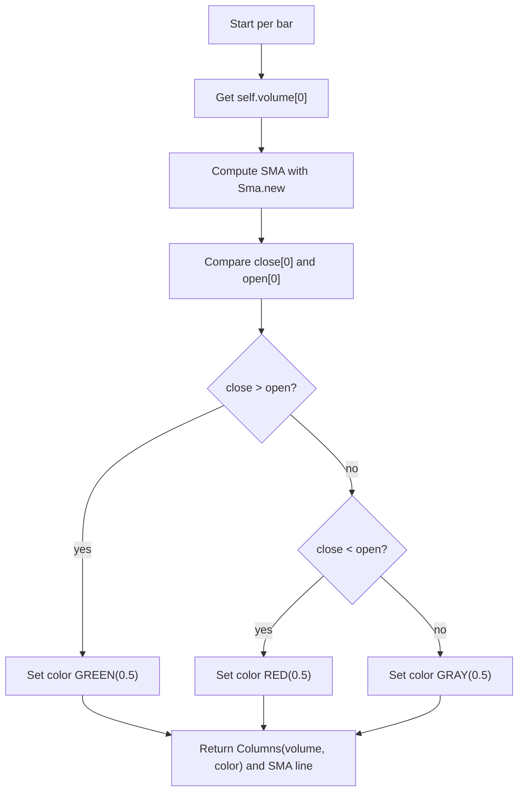

# Volume with SMA - Technical Guide

> Volume columns colored by price direction with an overlapping simple moving average line.

| | |
| --- | --- |
| **Language** | Indie Script v5 |
| **Platform** | [TakeProfit](https://takeprofit.com) |
| **Category** | Volume |
| **Type** | Indicator |
| **Author** | @juan on TakeProfit |
| **License** | MIT |
| **Live script** | [Open on TakeProfit](https://takeprofit.com/indicator/volume-with-sma-10) |
| **Source file** | [Volume with SMA.indie5](Volume%20with%20SMA.indie5) |

## Overview

This indicator displays volume as columns, with each column colored green, red, or gray depending on whether the bar closed higher, lower, or unchanged relative to its open. A simple moving average (SMA) line is overlaid to help assess whether current volume is above or below the recent average.

The SMA length is configurable (default 200 bars). The indicator is intended to make it easy to visually compare the current volume against its recent average, highlighting periods of unusually high or low activity.

## How it works

1. Define the indicator with a user-configurable SMA length parameter (default 200).
2. On each bar, retrieve the current volume value via self.volume[0].
3. Compute the simple moving average of volume over the specified length using Sma.new.
4. Determine the column color by comparing close and open prices: green if close > open, red if close < open, gray otherwise.
5. Return a tuple containing a Columns plot object (with the volume value and color) and the SMA value as a line.

## Mathematical model

$$
\text{SMA}_t = \frac{1}{n} \sum_{i=t-n+1}^{t} \text{volume}_i
$$

where \(n\) = sma_len.

## Logic flow



## Parameters

| Parameter | Type | Default | Range | Description |
| --- | --- | --- | --- | --- |
| `sma_len` | int | 200 | ≥ 1 | SMA |

## Code walkthrough

### Decorators and parameters

Lines 6-9 of [Volume with SMA.indie5](Volume%20with%20SMA.indie5):

```python
@indicator('SMA on Volume', format=format.PRICE)  # Volume Oscillator  # TODO: format=format.PERCENT
@param.int('sma_len', default=200, min=1, title='SMA')
@plot.columns(rel_width=0.9, title='VOL')
@plot.line(color=color.YELLOW, title='SMA')
```

The @indicator decorator sets the display name and format (PRICE, though a TODO suggests PERCENT). @param.int adds a user-adjustable SMA length with default 200. @plot.columns and @plot.line configure the chart style: columns with relative width 0.9 and a yellow line for the SMA.

### SMA computation and color logic

Lines 11-12 of [Volume with SMA.indie5](Volume%20with%20SMA.indie5):

```python
    sma = Sma.new(self.volume, sma_len)
    vol_color = color.GREEN(0.5) if self.close[0] > self.open[0] else color.RED(0.5) if self.close[0] < self.open[0] else color.GRAY(0.5)
```

Sma.new(self.volume, sma_len) creates a moving average series; accessing [0] gives the current bar's average. The column color is chosen based on whether the bar closed higher (green), lower (red), or equal (gray) to its open, each with 50% opacity.

### Return statement

Lines 13-13 of [Volume with SMA.indie5](Volume%20with%20SMA.indie5):

```python
    return plot.Columns(self.volume[0], color=vol_color), sma[0]
```

The function returns a tuple: a Columns object (volume value with dynamic color) and the SMA value. The @plot.columns and @plot.line decorators ensure these are rendered as columns and a line respectively.

## Reading the chart

- Volume bars are drawn as columns.
- Column color: green (0.5 alpha) if close > open (bullish bar), red (0.5 alpha) if close < open (bearish bar), gray (0.5 alpha) if close == open (flat bar).
- A yellow line shows the simple moving average of volume over the specified period (default 200 bars).
- The SMA line helps identify whether current volume is above or below the recent average.

## Implementation notes

- The SMA is computed using Sma.new, which returns a series; accessing [0] gives the value for the current bar.
- The color alpha is set to 0.5, making columns semi-transparent.
- The indicator uses format.PRICE, but there is a TODO comment suggesting format.PERCENT might be more appropriate.
- The SMA length is configurable via the settings UI (default 200, minimum 1).

## FAQ

**How do I change the SMA period?**

Adjust the 'SMA' parameter in the indicator settings; the default is 200 bars.

**What do the column colors mean?**

Green indicates the bar closed higher than it opened, red indicates it closed lower, and gray indicates no change.

**Can I use this indicator on other timeframes?**

The script does not specify a secondary timeframe, so it runs on the chart's primary timeframe. You can apply it to different timeframes by changing the chart's resolution.

## Full source code

Indie Script v5, as published on TakeProfit. Copy it into the platform's script editor or [open the live script](https://takeprofit.com/indicator/volume-with-sma-10).

```python
# indie:lang_version = 5
from indie import indicator, format, param, level, color, plot
from indie.algorithms import Sma
from indie.math import divide

@indicator('SMA on Volume', format=format.PRICE)  # Volume Oscillator  # TODO: format=format.PERCENT
@param.int('sma_len', default=200, min=1, title='SMA')
@plot.columns(rel_width=0.9, title='VOL')
@plot.line(color=color.YELLOW, title='SMA')
def Main(self, sma_len):
    sma = Sma.new(self.volume, sma_len)
    vol_color = color.GREEN(0.5) if self.close[0] > self.open[0] else color.RED(0.5) if self.close[0] < self.open[0] else color.GRAY(0.5)
    return plot.Columns(self.volume[0], color=vol_color), sma[0]
```
