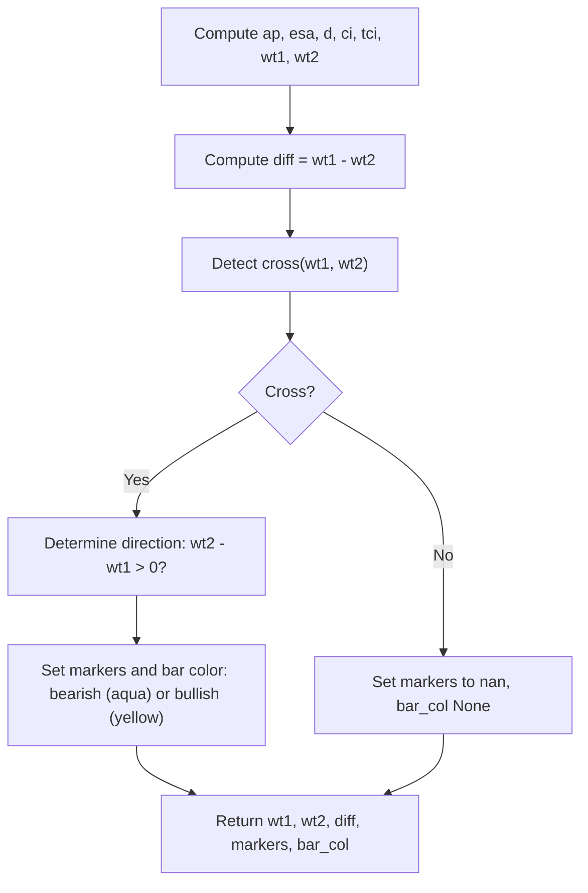

# WaveTrend with Crosses - Technical Guide

> Computes a double-smoothed momentum oscillator (WaveTrend) with crossover signals for reversal detection.

| | |
| --- | --- |
| **Language** | Indie Script v5 |
| **Platform** | [TakeProfit](https://takeprofit.com) |
| **Category** | Oscillators |
| **Type** | Indicator |
| **Author** | @pavel_medvedev on TakeProfit |
| **Original (TradingView)** | [WaveTrend with Crosses [LazyBear]](https://www.tradingview.com/script/jFQn4jYZ-WaveTrend-with-Crosses-LazyBear/) by lonestar108 (LazyBear's WaveTrend) |
| **License** | [MPL-2.0](https://mozilla.org/MPL/2.0/) (derivative work) |
| **Live script** | [Open on TakeProfit](https://takeprofit.com/indicator/wavetrend-with-crosses-51) |
| **Source file** | [WaveTrend with Crosses.indie5](WaveTrend%20with%20Crosses.indie5) |

## Overview

WaveTrend is a momentum oscillator derived from the Commodity Channel Index (CCI) family. It measures how far price is stretched from its average and applies two layers of exponential smoothing to produce a clean oscillating line (WT1). A secondary line (WT2) is a simple moving average of WT1. Crosses between WT1 and WT2, especially when they occur inside the overbought (+53/+60) or oversold (−53/−60) zones, indicate potential momentum shifts. This indicator is commonly used for reversal trading in crypto and FX markets on timeframes from 5 minutes to daily.

On the chart, the indicator draws two oscillator lines: WT1 (green) and WT2 (red). The spread between them is shown as a translucent blue histogram. Static horizontal levels mark the overbought and oversold thresholds at ±53 and ±60. When a cross occurs, a black circle with a direction-colored inner dot (red for bearish, lime for bullish) is plotted at the cross point, and the price bar is colored aqua (bearish) or yellow (bullish).

## How it works

1. Compute the average price (ap) from the selected source (default HLC3).
2. Apply a first EMA of length n1 to the source series to get the smoothed average (esa).
3. Compute the absolute deviation |ap - esa| and smooth it with another EMA of length n1 to get d.
4. Calculate the channel index ci = (ap - esa) / (0.015 * d) using safe division to avoid division by zero.
5. Apply a second EMA of length n2 to ci to obtain the smoothed index tci (WT1).
6. Compute WT2 as a simple moving average of WT1 over 4 bars.
7. Detect crosses between WT1 and WT2 using the cross() function.
8. On a cross, draw markers (outer black circle, inner direction-colored dot) and color the price bar (aqua for bearish, yellow for bullish).

## Mathematical model

$$
\text{esa} = \text{EMA}(\text{src}, n1)
$$

$$
d = \text{EMA}(|\text{ap} - \text{esa}|, n1)
$$

$$
\text{ci} = \frac{\text{ap} - \text{esa}}{0.015 \cdot d}
$$

$$
\text{tci} = \text{EMA}(\text{ci}, n2)
$$

$$
\text{WT1} = \text{tci}, \quad \text{WT2} = \text{SMA}(\text{WT1}, 4)
$$

## Logic flow



## Parameters

| Parameter | Type | Default | Range | Description |
| --- | --- | --- | --- | --- |
| `n1` | int | 10 | ≥ 1 | Channel Length |
| `n2` | int | 21 | ≥ 1 | Average Length |
| `src` | source | source.HLC3 |  | Source |

## Code walkthrough

### Computing smoothed average and deviation

Lines 26-33 of [WaveTrend with Crosses.indie5](WaveTrend%20with%20Crosses.indie5):

```python
    ap = src[0]

    # esa = ema(ap, n1)
    esa = Ema.new(src, n1)

    # d = ema(abs(ap - esa), n1)
    abs_diff = MutSeriesF.new(abs(ap - esa[0]))
    d = Ema.new(abs_diff, n1)
```

The average price ap is taken from the source array. esa is the first EMA of the source series with length n1. Then the absolute difference between ap and esa is computed and stored in a MutSeriesF to be used as input for another EMA of the same length, producing d, the smoothed deviation.

### Channel index with safe division

Lines 35-37 of [WaveTrend with Crosses.indie5](WaveTrend%20with%20Crosses.indie5):

```python
    # ci = (ap - esa) / (0.015 * d)  -- safe divide to avoid div-by-zero
    ci_val = divide(ap - esa[0], 0.015 * d[0], 0.0)
    ci = MutSeriesF.new(ci_val)
```

The channel index ci is calculated as (ap - esa) divided by 0.015 * d. The divide() function from indie.math is used to safely handle division by zero, returning 0.0 when the denominator is zero. The result is wrapped in a MutSeriesF for use in subsequent EMA.

### Second smoothing and WT1/WT2

Lines 39-46 of [WaveTrend with Crosses.indie5](WaveTrend%20with%20Crosses.indie5):

```python
    # tci = ema(ci, n2)
    tci = Ema.new(ci, n2)

    # wt1 = tci, wt2 = sma(wt1, 4)
    wt1_val = tci[0]
    wt1 = MutSeriesF.new(wt1_val)
    wt2_s = Sma.new(wt1, 4)
    wt2_val = wt2_s[0]
```

A second EMA of length n2 is applied to ci to produce tci, which becomes WT1. WT1 is then smoothed with a simple moving average of period 4 to produce WT2. Both values are extracted with [0] to get the current bar's value.

### Cross detection and visual elements

Lines 51-68 of [WaveTrend with Crosses.indie5](WaveTrend%20with%20Crosses.indie5):

```python
    # Cross detection
    is_cross = cross(wt1, wt2_s)

    # Outer black circle on cross
    outer_marker = plot.Marker(
        value=wt2_val if is_cross else nan,
        color=color.BLACK,
    )
    # Direction-colored inner circle on cross
    inner_color = color.RED if (wt2_val - wt1_val) > 0 else color.LIME
    inner_marker = plot.Marker(
        value=wt2_val if is_cross else nan,
        color=inner_color,
    )

    # Bar coloring on cross: aqua (bearish cross) / yellow (bullish cross), default otherwise
    bar_col = plot.BarColor(
        color=(color.AQUA if (wt2_val - wt1_val) > 0 else color.YELLOW) if is_cross else None
```

The cross() function checks if WT1 and WT2 have crossed on this bar. If a cross is detected, markers are created: an outer black circle at the WT2 value, and an inner circle colored red if WT2 > WT1 (bearish) or lime otherwise (bullish). The bar color is set to aqua for bearish crosses or yellow for bullish crosses. When there is no cross, markers are set to nan and bar color to None, hiding them.

## Reading the chart

- WT1 (green line) and WT2 (red line) oscillate around zero. When WT1 is above WT2, momentum is bullish; when below, bearish.
- The blue histogram shows the spread WT1 - WT2; taller bars indicate stronger momentum.
- Horizontal gray line at 0, red lines at +53 and +60 (overbought), green lines at -53 and -60 (oversold).
- Black circle markers appear on bars where WT1 crosses WT2. The inner dot is red if WT2 > WT1 (bearish cross) or lime otherwise (bullish cross).
- Price bars are colored aqua on bearish crosses and yellow on bullish crosses, making signals visible on the main chart.

## Implementation notes

- The indicator uses MutSeriesF to hold intermediate series (abs_diff, ci, wt1) because EMA and SMA inputs must be series objects, not plain numbers.
- The divide() function prevents division by zero when d is zero, returning 0.0 as fallback.
- Markers and bar color are conditionally set to nan/None when no cross occurs, so they do not appear on non-cross bars.
- The cross() function from indie.math detects line crosses between two series; it returns True when the lines intersect on the current bar.

## FAQ

**How do I adjust the sensitivity of the indicator?**

Decrease n1 (Channel Length) and n2 (Average Length) to make the oscillator react faster to price changes, or increase them for smoother, less frequent signals.

**What do the levels ±53 and ±60 represent?**

These are static overbought and oversold thresholds. Crosses inside these zones (above +53 or below -53) are considered stronger reversal signals. The values are conventional from the original WaveTrend design.

**Can I use a different price source?**

Yes, the Source parameter allows you to choose any standard price source (open, high, low, close, HL2, OHLC4, etc.). The default is HLC3, which is the average of high, low, and close.

## License and attribution

This Indie script is a derivative work of **WaveTrend with Crosses [LazyBear] by LazyBear** on TradingView. This is a port of an open-source TradingView script whose header we could not retrieve; TradingView applies MPL-2.0 by default to open-source scripts, so that license is assumed. A modified version of MPL-2.0 code must stay under [MPL-2.0](https://mozilla.org/MPL/2.0/), so this file is distributed under that license (the notice is appended to the end of the source file). The original author keeps the credit for the algorithm; this page is not affiliated with or endorsed by them.

## Full source code

Indie Script v5, as published on TakeProfit. Copy it into the platform's script editor or [open the live script](https://takeprofit.com/indicator/wavetrend-with-crosses-51).

```python
# indie:lang_version = 5
# WaveTrend with Crosses [LazyBear]  -> Indie conversion
from math import nan
from indie import indicator, param, source, color, plot, level, MutSeriesF
from indie.algorithms import Ema, Sma
from indie.math import cross, divide


@indicator('WaveTrend with Crosses')
@param.int('n1', default=10, min=1, title='Channel Length')
@param.int('n2', default=21, min=1, title='Average Length')
@param.source('src', default=source.HLC3, title='Source')
@level(0, line_color=color.GRAY, title='Zero')
@level(60, line_color=color.RED, title='Over Bought 1')
@level(53, line_color=color.RED, title='Over Bought 2')
@level(-60, line_color=color.GREEN, title='Over Sold 1')
@level(-53, line_color=color.GREEN, title='Over Sold 2')
@plot.line(id='wt1', color=color.GREEN, title='WT1')
@plot.line(id='wt2', color=color.RED, title='WT2')
@plot.histogram(color=color.BLUE(0.5), title='WT1-WT2', line_width=5)
@plot.marker(style=plot.marker_style.CIRCLE, size=5, title='Cross (outer)')
@plot.marker(style=plot.marker_style.CIRCLE, size=3, title='Cross (direction)')
@plot.bar_color(title='Cross Bar Color')
def Main(self, n1, n2, src):
    # Average price (HLC3 by default, configurable via 'src')
    ap = src[0]

    # esa = ema(ap, n1)
    esa = Ema.new(src, n1)

    # d = ema(abs(ap - esa), n1)
    abs_diff = MutSeriesF.new(abs(ap - esa[0]))
    d = Ema.new(abs_diff, n1)

    # ci = (ap - esa) / (0.015 * d)  -- safe divide to avoid div-by-zero
    ci_val = divide(ap - esa[0], 0.015 * d[0], 0.0)
    ci = MutSeriesF.new(ci_val)

    # tci = ema(ci, n2)
    tci = Ema.new(ci, n2)

    # wt1 = tci, wt2 = sma(wt1, 4)
    wt1_val = tci[0]
    wt1 = MutSeriesF.new(wt1_val)
    wt2_s = Sma.new(wt1, 4)
    wt2_val = wt2_s[0]

    # WT1 - WT2 (Pine's "area" style approximated by a translucent histogram)
    diff = wt1_val - wt2_val

    # Cross detection
    is_cross = cross(wt1, wt2_s)

    # Outer black circle on cross
    outer_marker = plot.Marker(
        value=wt2_val if is_cross else nan,
        color=color.BLACK,
    )
    # Direction-colored inner circle on cross
    inner_color = color.RED if (wt2_val - wt1_val) > 0 else color.LIME
    inner_marker = plot.Marker(
        value=wt2_val if is_cross else nan,
        color=inner_color,
    )

    # Bar coloring on cross: aqua (bearish cross) / yellow (bullish cross), default otherwise
    bar_col = plot.BarColor(
        color=(color.AQUA if (wt2_val - wt1_val) > 0 else color.YELLOW) if is_cross else None
    )

    return wt1_val, wt2_val, diff, outer_marker, inner_marker, bar_col

# ---------------------------------------------------------------------------
# This Source Code Form is subject to the terms of the Mozilla Public
# License, v. 2.0. If a copy of the MPL was not distributed with this
# file, You can obtain one at https://mozilla.org/MPL/2.0/
# Derived from "WaveTrend with Crosses [LazyBear] by LazyBear" (TradingView).
# ---------------------------------------------------------------------------
```
