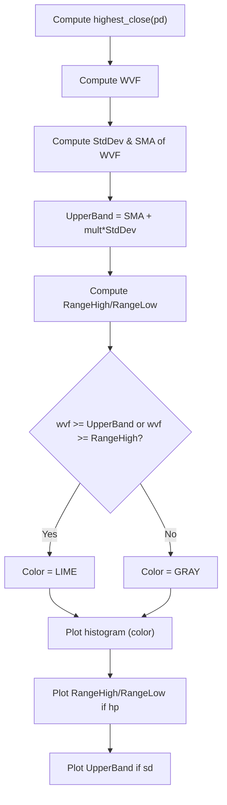

# Williams_VIX_Fix - Technical Guide

> Computes a volatility indicator similar to VIX for any asset using highest-low ratio and Bollinger Bands.

| | |
| --- | --- |
| **Language** | Indie Script v5 |
| **Platform** | [TakeProfit](https://takeprofit.com) |
| **Category** | Volatility |
| **Type** | Indicator |
| **Author** | @dr_jones on TakeProfit |
| **Original** | Ported to Indie from https://www.tradingview.com/v/og7JPrRA/ The author of the original indicator is @ChrisMoody |
| **License** | MPL-2.0 (see the header of the source file) |
| **Live script** | [Open on TakeProfit](https://takeprofit.com/indicator/williams-vix-fix-25) |
| **Source file** | [Williams VIX Fix.indie5](Williams%20VIX%20Fix.indie5) |

## Overview

This indicator implements Larry Williams' VIX Fix, originally designed to replicate the behavior of the VIX volatility index for stock indices, but applicable to any asset class. It measures the distance of the current low from the highest close over a lookback period, normalized as a percentage, then applies Bollinger Bands and percentile-based levels to identify extreme conditions.

On the chart, the core signal is drawn as a histogram (Williams VIX Fix) colored green when it exceeds either the Bollinger upper band or a percentile-based high threshold, and gray otherwise. Optionally, the user can display the range high and low percentile lines (red) and the upper Bollinger Band (aqua). These optional lines help visualise the extreme thresholds that drive the histogram color.

## How it works

1. Compute the highest closing price over the 'pd' lookback period.
2. Calculate the Williams VIX Fix (WVF) as: (highest_close - low) / highest_close * 100.
3. Calculate the standard deviation of WVF over the 'bbl' period and multiply by 'mult'.
4. Calculate the simple moving average of WVF over the same 'bbl' period (midline).
5. Derive the upper Bollinger Band as: midline + (mult * standard deviation).
6. Compute the range high as the highest WVF over 'lb' period multiplied by percentile factor 'ph'.
7. Compute the range low as the lowest WVF over 'lb' period multiplied by percentile factor 'pl'.
8. Color the histogram lime (green) when WVF >= upper_band OR WVF >= range_high; otherwise gray.

## Mathematical model

$$
\text{WVF} = \frac{\text{highest\_close}(pd) - \text{low}}{\text{highest\_close}(pd)} \times 100
$$

$$
\text{Upper Band} = \text{SMA}(\text{WVF}, bbl) + mult \times \text{StdDev}(\text{WVF}, bbl)
$$

$$
\text{Range High} = \max(\text{WVF}, lb) \times ph
$$

$$
\text{Range Low} = \min(\text{WVF}, lb) \times pl
$$

## Logic flow



## Parameters

| Parameter | Type | Default | Range | Description |
| --- | --- | --- | --- | --- |
| `pd` | int | 22 | ≥ 1 | LookBack Period Standard Deviation High |
| `bbl` | int | 20 | ≥ 1 | Bolinger Band Length |
| `mult` | float | 2.0 | 1.0 - 5.0 | Bollinger Band Standard Devaition Up |
| `lb` | int | 50 | ≥ 1 | Look Back Period Percentile High |
| `ph` | float | 0.85 | 0.0 - 1.0 | Highest Percentile - 0.90=90%, 0.95=95%, 0.99=99% |
| `pl` | float | 1.01 | 1.0 - 2.0 | Lowest Percentile - 1.10=90%, 1.05=95%, 1.01=99% |
| `hp` | bool | false |  | Show High Range - Based on Percentile and LookBack Period? |
| `sd` | bool | false |  | Show Standard Deviation Line? |

## Code walkthrough

### Core WVF Calculation

Lines 28-29 of [Williams VIX Fix.indie5](Williams%20VIX%20Fix.indie5):

```python
    highest_close = Highest.new(self.close, pd)[0]
    wvf = MutSeriesF.new((highest_close - self.low[0]) / highest_close * 100)
```

Line 28 computes the highest close over the `pd` lookback using `Highest.new(self.close, pd)[0]`. Line 29 defines the WVF series using `MutSeriesF.new` to persist the series across bars. The formula `(highest_close - self.low[0]) / highest_close * 100` converts the price distance into a percentage scale.

### Bollinger Bands on WVF

Lines 31-33 of [Williams VIX Fix.indie5](Williams%20VIX%20Fix.indie5):

```python
    s_dev = mult * StdDev.new(wvf, bbl)[0]
    mid_line = Sma.new(wvf, bbl)[0]
    upper_band = mid_line + s_dev
```

The standard deviation of WVF over `bbl` bars is computed via `StdDev.new(wvf, bbl)[0]` and multiplied by `mult`. The SMA of WVF (`mid_line`) is used as the central line. The upper band is the sum of the midline and the scaled deviation, creating a dynamic volatility threshold.

### Percentile High and Low Levels

Lines 35-36 of [Williams VIX Fix.indie5](Williams%20VIX%20Fix.indie5):

```python
    range_high = Highest.new(wvf, lb)[0] * ph
    range_low = Lowest.new(wvf, lb)[0] * pl
```

`range_high` is the highest value of WVF over `lb` bars multiplied by the `ph` factor (e.g., 0.85 for 85th percentile). `range_low` is the lowest WVF multiplied by `pl` (e.g., 1.01). These provide fixed extreme reference levels relative to recent history.

### Histogram Color Logic

Lines 38-38 of [Williams VIX Fix.indie5](Williams%20VIX%20Fix.indie5):

```python
    col = color.LIME if wvf[0] >= upper_band or wvf[0] >= range_high else color.GRAY
```

The color variable `col` is set to `LIME` if the current WVF value (`wvf[0]`) is greater than or equal to either the upper band or the range high percentile. Otherwise it is `GRAY`. This single condition drives the visual alarm for extreme readings.

### Conditional Plot Outputs

Lines 40-45 of [Williams VIX Fix.indie5](Williams%20VIX%20Fix.indie5):

```python
    return (
        range_high if hp and range_high else math.nan,
        range_low if hp and range_low else math.nan,
        plot.Histogram(wvf[0], color=col),
        upper_band if sd and upper_band else math.nan,
    )
```

The return tuple contains four plot values. The first two plot the range high and low percentile lines only if `hp` is true and the value is non-zero; otherwise `math.nan` suppresses them. The third is a histogram with the calculated color. The fourth plots the upper band only if `sd` is true. This design allows the user to toggle auxiliary lines without changing the core indicator logic.

## Reading the chart

- The **histogram** (Williams VIX Fix) is the primary output. When it is **lime green**, it indicates that the current WVF value is above the Bollinger upper band or the range high percentile, suggesting elevated volatility or fear (similar to a VIX spike). When **gray**, the reading is within normal bounds.
- The **red lines** (Range High Percentile and Range Low Percentile) are shown only when the `Show High Range` parameter (`hp`) is enabled. They provide static percentile-based thresholds.
- The **aqua line** (Upper Band) is shown only when the `Show Standard Deviation Line` parameter (`sd`) is enabled. It represents the dynamic Bollinger upper band.
- All optional lines are hidden when their respective toggle is off, keeping the chart clean when only the histogram is needed.

## Implementation notes

- The indicator uses `MutSeriesF` for the WVF series to ensure cross-bar persistence of the intermediate calculation.
- When `hp` or `sd` is false, the corresponding plot lines are set to `math.nan`, effectively hiding them from the chart without removing the plot definition.
- The `Highest`, `Lowest`, `StdDev`, and `Sma` algorithms return series that are accessed with `[0]` for the current bar; they do not repaint because they are based on fixed-length rolling windows.
- The percentile factors `ph` and `pl` are applied multiplicatively to the historical extremes, so adjusting them changes the sensitivity of the extreme thresholds.

## FAQ

**What does the green histogram signal?**

The green histogram indicates that the Williams VIX Fix has exceeded either the Bollinger upper band or the range high percentile. This is interpreted as an extreme volatility event, similar to a VIX spike in stock indices.

**How should I adjust the percentile parameters for different assets?**

The default `ph=0.85` (85th percentile) and `pl=1.01` may need tuning. For more sensitive signals, lower `ph` (e.g., 0.80). The `pl` parameter adjusts the range low line but does not affect the histogram color. Backtest on historical data to find thresholds that produce meaningful extremes for your specific asset.

**Can I use this indicator on intraday charts?**

Yes, the original description notes it works well on intraday charts. The lookback parameters (`pd`, `bbl`, `lb`) should be adjusted to the timeframe – for shorter timeframes, consider smaller values to capture recent volatility dynamics.

## Full source code

Indie Script v5, as published on TakeProfit. Copy it into the platform's script editor or [open the live script](https://takeprofit.com/indicator/williams-vix-fix-25).

```python
# Ported to Indie from https://www.tradingview.com/v/og7JPrRA/ 
# The author of the original indicator is @ChrisMoody

# This Source Code Form is subject to the terms of the Mozilla Public License, v. 2.0.  
# If a copy of the MPL was not distributed with this file, you can obtain one at  
# <https://mozilla.org/MPL/2.0/>.

# indie:lang_version = 5
import math
from indie import indicator, param, plot, color, MutSeriesF
from indie.algorithms import Highest, StdDev, Sma, Lowest


@indicator('Williams_VIX_Fix')
@param.int('pd', default=22, min=1, title='LookBack Period Standard Deviation High')
@param.int('bbl', default=20, min=1, title='Bolinger Band Length')
@param.float('mult', default=2.0, min=1.0, max=5.0, title='Bollinger Band Standard Devaition Up')
@param.int('lb', default=50, min=1, title='Look Back Period Percentile High')
@param.float('ph', default=0.85, min=0.0, max=1.0, title='Highest Percentile - 0.90=90%, 0.95=95%, 0.99=99%')
@param.float('pl', default=1.01, min=1.0, max=2.0, title='Lowest Percentile - 1.10=90%, 1.05=95%, 1.01=99%')
@param.bool('hp', default=False, title='Show High Range - Based on Percentile and LookBack Period?')
@param.bool('sd', default=False, title='Show Standard Deviation Line?')
@plot.line(line_width=4, color=color.RED, title='Range High Percentile', id='#plot_0')
@plot.line(line_width=4, color=color.RED, title='Range Low Percentile', id='#plot_1')
@plot.histogram(line_width=4, title='Williams Vix Fix', id='#plot_2')
@plot.line(line_width=3, color=color.AQUA, title='Upper Band', id='#plot_3')
def Main(self, pd, bbl, mult, lb, ph, pl, hp, sd):
    highest_close = Highest.new(self.close, pd)[0]
    wvf = MutSeriesF.new((highest_close - self.low[0]) / highest_close * 100)

    s_dev = mult * StdDev.new(wvf, bbl)[0]
    mid_line = Sma.new(wvf, bbl)[0]
    upper_band = mid_line + s_dev
    
    range_high = Highest.new(wvf, lb)[0] * ph
    range_low = Lowest.new(wvf, lb)[0] * pl
    
    col = color.LIME if wvf[0] >= upper_band or wvf[0] >= range_high else color.GRAY

    return (
        range_high if hp and range_high else math.nan,
        range_low if hp and range_low else math.nan,
        plot.Histogram(wvf[0], color=col),
        upper_band if sd and upper_band else math.nan,
    )
```
