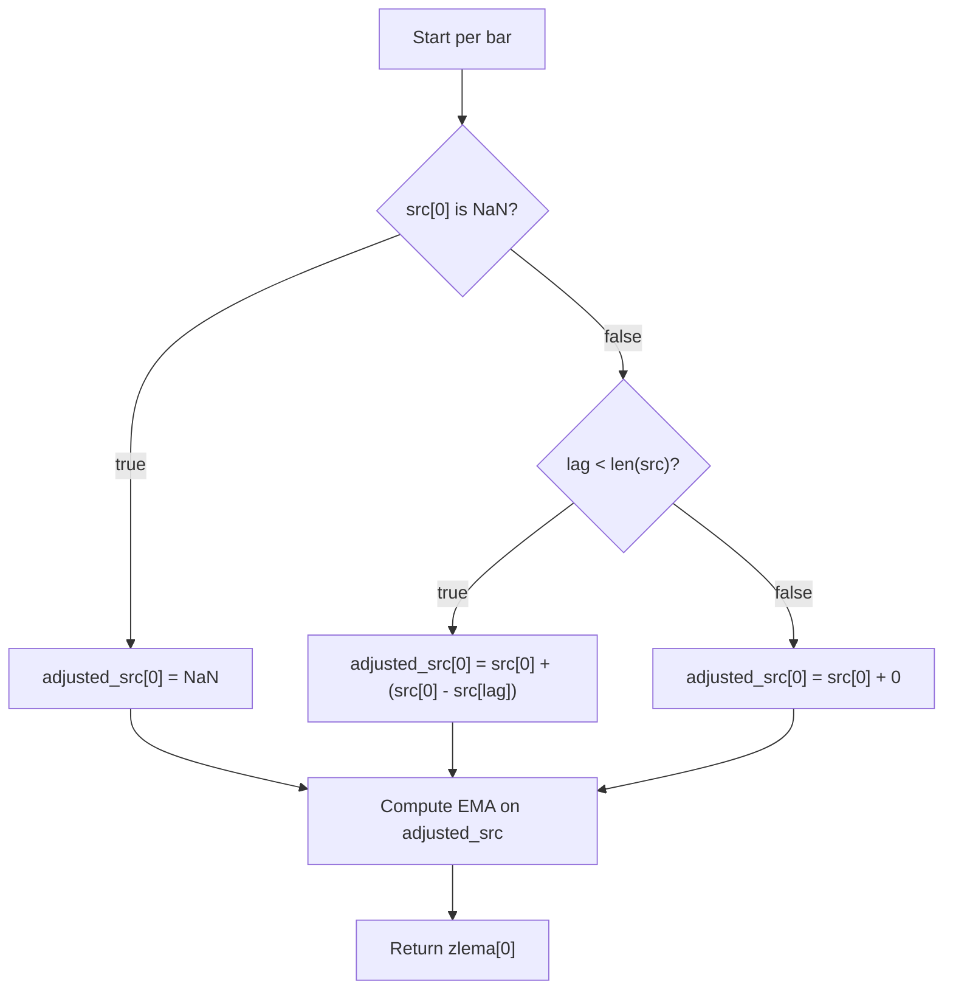

# ZLEMA - Technical Guide

> Zero Lag Exponential Moving Average that adjusts the source series to reduce lag before applying EMA.

| | |
| --- | --- |
| **Language** | Indie Script v5 |
| **Platform** | [TakeProfit](https://takeprofit.com) |
| **Category** | Moving averages |
| **Type** | Indicator |
| **Author** | @ammon on TakeProfit |
| **License** | licensed under the MIT License (see the header of the source file) |
| **Live script** | [Open on TakeProfit](https://takeprofit.com/indicator/zlema-14) |
| **Source file** | [ZLEMA.indie5](ZLEMA.indie5) |

## Overview

ZLEMA is a trend-following indicator that aims to minimize the lag inherent in standard moving averages. It does this by first adjusting the source series using a lag correction, then applying an exponential moving average.

It is designed for traders who want a more responsive moving average that closely tracks price swings while still smoothing noise. On the chart, it draws a line that follows price more closely than a standard EMA of the same period.

## How it works

1. Calculate the lag as half of (period - 1), rounded down to an integer.
2. For each bar, if the source value is valid, compute an adjusted value: current source plus the difference between current source and the source value lag bars ago.
3. If the source value is NaN, set the adjusted value to NaN.
4. If the lag index exceeds the available series length, use no adjustment (add zero).
5. Apply a standard Exponential Moving Average (EMA) to the adjusted series with the given period.
6. Return the current EMA value for plotting.

## Mathematical model

$$
\text{adjusted}[0] = \text{src}[0] + (\text{src}[0] - \text{src}[\text{lag}]) = 2 \cdot \text{src}[0] - \text{src}[\text{lag}]
$$

The underlying EMA is computed as:

$$
\text{EMA}[0] = \alpha \cdot \text{adjusted}[0] + (1-\alpha) \cdot \text{EMA}[-1]
$$

where $\alpha = \frac{2}{\text{period}+1}$ (standard EMA smoothing factor).

## Logic flow



## Parameters

| Parameter | Type | Default | Range | Description |
| --- | --- | --- | --- | --- |
| `length` | int | 26 | ≥ 1 | ZLEMA Period |
| `src` | source | source.CLOSE |  | Source |

## Code walkthrough

### Lag calculation and source adjustment

Lines 17-24 of [ZLEMA.indie5](ZLEMA.indie5):

```python
    lag = int((period - 1) / 2)
    adjusted_src = MutSeriesF.new(init=0)
    
    # Adjust the source series to remove lag
    if isnan(src[0]):
        adjusted_src[0] = nan
    else:
        adjusted_src[0] = src[0] + (src[0] - src[lag] if lag < len(src) else 0)
```

The lag is computed as half of (period - 1), truncated to an integer. For each bar, if the source value is valid, the adjusted value is set to the current source plus the difference between the current source and the source value from 'lag' bars ago. This correction aims to remove the lag before applying the EMA. If the lag index is out of bounds (e.g., at the start of the chart), no adjustment is applied (adds 0).

### Applying the EMA

Lines 27-29 of [ZLEMA.indie5](ZLEMA.indie5):

```python
    zlema = Ema.new(adjusted_src, period)
    
    return zlema
```

The adjusted source series is passed to `Ema.new`, which computes a standard exponential moving average with the given period. The result is a series that can be accessed with `[0]` for the current bar and `[1]` for the previous bar. The function returns this series.

### Indicator entry point

Lines 46-47 of [ZLEMA.indie5](ZLEMA.indie5):

```python
    zlema = Zlema.new(src, length)
    return zlema[0]  # Return the current ZLEMA value for plotting
```

The `Main` function is the indicator's entry point, decorated with `@indicator` and `@plot.line`. It creates a new ZLEMA calculation using the selected source and period, then returns the current ZLEMA value (`zlema[0]`) for plotting. The `@plot.line` decorator ensures the value is drawn as a line on the chart.

## Reading the chart

- The indicator plots a single line on the chart (color determined by the platform, typically blue or user-configurable).
- The line represents the ZLEMA value, which reacts faster to price changes than a standard EMA of the same period.
- When the source value is NaN, the ZLEMA value is also NaN, causing a gap in the plot.
- The line closely follows the price series, with the degree of smoothing controlled by the 'length' parameter.

## Implementation notes

- The lag is computed as `int((period - 1) / 2)`, which truncates toward zero. For odd periods, lag is exactly half; for even periods, it is the floor of half.
- If the lag index exceeds the available series length (e.g., at the start of the chart), the adjustment is skipped (adds 0), so ZLEMA behaves like a standard EMA until enough history is available.
- The indicator uses `Ema.new` from the `indie.algorithms` module, which implements a standard exponential moving average with smoothing factor α = 2/(period+1).
- The `@indicator` decorator's `overlay_main_pane=True` setting ensures the line is drawn in the main chart pane.

## FAQ

**What does the 'length' parameter control?**

It sets the period for the underlying EMA and also determines the lag used in the adjustment (lag = (period-1)/2). A longer period results in a smoother but slower line.

**How is ZLEMA different from a standard EMA?**

ZLEMA first adjusts the source series by adding the difference between the current value and the value 'lag' bars ago, which reduces the lag before applying the EMA. This makes it more responsive to price swings.

**Can I use a different source series?**

Yes, the 'src' parameter allows you to select any available series (e.g., CLOSE, HIGH, LOW, etc.) as the input for the calculation.

## Full source code

Indie Script v5, as published on TakeProfit. Copy it into the platform's script editor or [open the live script](https://takeprofit.com/indicator/zlema-14).

```python
# Copyright (c) 2024 Zvonimir Mostarac. All rights reserved.

# This work is licensed under the MIT License.
# For a copy, see <https://opensource.org/licenses/MIT>.

# indie:lang_version = 5
from math import isnan, nan
from indie import indicator, algorithm, param, source, SeriesF, MutSeriesF, plot
from indie.algorithms import Ema

# Define the ZLEMA algorithm
@algorithm
def Zlema(self, src: SeriesF, period: int = 26) -> SeriesF:
    '''Zero Lag Exponential Moving Average (ZLEMA)'''

    # Calculate the lag and ensure it's an integer
    lag = int((period - 1) / 2)
    adjusted_src = MutSeriesF.new(init=0)
    
    # Adjust the source series to remove lag
    if isnan(src[0]):
        adjusted_src[0] = nan
    else:
        adjusted_src[0] = src[0] + (src[0] - src[lag] if lag < len(src) else 0)
    
    # Calculate the ZLEMA using the adjusted source
    zlema = Ema.new(adjusted_src, period)
    
    return zlema

# Define the indicator based on ZLEMA
@indicator('ZLEMA', overlay_main_pane=True)
@param.int('length', default=26, min=1, title='ZLEMA Period')
@param.source('src', default=source.CLOSE, title='Source')
@plot.line(id='#plot_0')
def Main(self, src: SeriesF, length: int) -> float:
    """ZLEMA is an abbreviation of Zero Lag Exponential Moving Average.
    It was developed by John Ehlers and Rick Way.
    ZLEMA is a kind of Exponential moving average,
    but its main idea is to eliminate the lag arising from the very nature of the moving averages
    and other trend following indicators. As it follows price closer,
    it also provides better price averaging and responds better to price swings.
    """

    # Create a new ZLEMA calculation based on the selected source and period
    zlema = Zlema.new(src, length)
    return zlema[0]  # Return the current ZLEMA value for plotting
```
