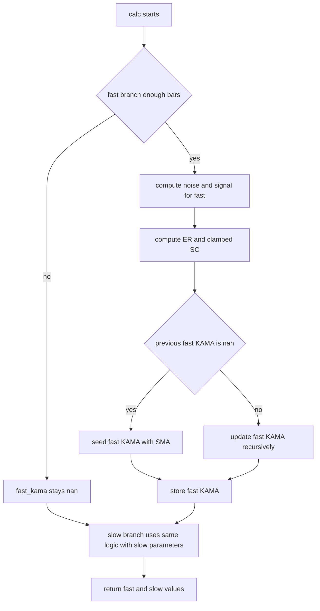

# kama_dual_fixed - Technical Guide

> Dual KAMA indicator plotting fast and slow Kaufman Adaptive Moving Average lines with independent periods and smoothing constants.

| | |
| --- | --- |
| **Language** | Indie Script v5 |
| **Platform** | [TakeProfit](https://takeprofit.com) |
| **Category** | Moving averages |
| **Type** | Indicator |
| **Author** | @mikhail_kultsov on TakeProfit |
| **License** | licensed under the MIT License (see the header of the source file) |
| **Live script** | [Open on TakeProfit](https://takeprofit.com/indicator/kama-dual-fixed-17) |
| **Source file** | [kama dual fixed.indie5](kama%20dual%20fixed.indie5) |

## Overview

Kaufman Adaptive Moving Average (KAMA) adjusts its smoothing based on an Efficiency Ratio. This indicator computes two independent KAMA lines: a Fast KAMA with its own ER period and smoothing constants, and a Slow KAMA with separate parameters. Both lines are drawn on the main price pane as an overlay, using the selected source (default close).

Because the smoothing constant adapts to the ratio of directional movement to total volatility, the lines are designed to follow trending moves more closely and flatten in choppy conditions. The dual setup lets a user compare short-term and long-term adaptive averages on the same chart. The source only draws the two plotted lines; it does not paint candles or generate signals.

## How it works

1. Initialize fast_kama and slow_kama to nan at the start of every calc call.
2. For each KAMA, once bar_index reaches the ER period, sum absolute one-bar source changes over the period as noise.
3. Take the absolute change from the current source value to the value period bars ago as signal, then compute ER = signal / noise (0 if noise is 0).
4. Map ER to a smoothing constant by interpolating between the fast and slow EMA constants, squaring, and clamping to [0, 1].
5. Read the previous KAMA from a Var that holds the value from the last closed bar; if it is nan, seed with the arithmetic mean of the source over the lookback window.
6. Update recursively as previous KAMA plus SC times the difference between current source and previous KAMA, then store the result back in the Var.
7. Repeat the same steps with the slow parameters and separate Var state.
8. Return the fast and slow KAMA floats, which the @plot.line decorators draw as two lines.

## Mathematical model

For each KAMA with lookback \(n\) and source values \(P_i\), where \(P_0\) is the current bar:

$$
\text{ER} = \frac{|P_0 - P_n|}{\sum_{i=0}^{n-1} |P_i - P_{i+1}|}
$$

If the denominator is zero, ER is set to 0. The smoothing constant is built from the fast and slow smoothing parameters \(s_f\) and \(s_s\):

$$
\text{SC} = \left( \text{ER} \cdot \left(\frac{2}{s_f+1} - \frac{2}{s_s+1}\right) + \frac{2}{s_s+1} \right)^2
$$

SC is clamped to \([0,1]\). The recursive update uses the stored previous KAMA \(K_{t-1}\):

$$
K_t = \begin{cases} \frac{1}{n}\sum_{i=0}^{n-1} P_i & \text{if } K_{t-1} \text{ is nan} \\ K_{t-1} + \text{SC} \cdot (P_0 - K_{t-1}) & \text{otherwise} \end{cases}
$$

## Logic flow



## Parameters

| Parameter | Type | Default | Range | Description |
| --- | --- | --- | --- | --- |
| `fast_er` | int | 10 | ≥ 1 | Fast KAMA ER Period |
| `fast_sc_fast` | int | 2 | ≥ 1 | Fast KAMA Fast EMA |
| `fast_sc_slow` | int | 20 | ≥ 1 | Fast KAMA Slow EMA |
| `slow_er` | int | 15 | ≥ 1 | Slow KAMA ER Period |
| `slow_sc_fast` | int | 3 | ≥ 1 | Slow KAMA Fast EMA |
| `slow_sc_slow` | int | 30 | ≥ 1 | Slow KAMA Slow EMA |
| `src` | source | source.CLOSE |  |  |

## Code walkthrough

### Recursive state stored in Var

Lines 20-28 of [kama dual fixed.indie5](kama%20dual%20fixed.indie5):

```python
    def __init__(self):
        # Var[T] remembers the value committed on the LAST CLOSED bar and
        # rolls back to it automatically every time a new realtime tick
        # starts a fresh recalculation of the still-open bar. That's what
        # a recursive (EMA-style) formula needs: every recalculation of
        # the open bar must start from the same fixed baseline, not from
        # whatever the previous tick of the SAME bar produced.
        self.kama_fast_v = self.new_var(nan)
        self.kama_slow_v = self.new_var(nan)
```

The two KAMA values live in Var slots initialized to nan. The comment explains why Var is needed: a recursive EMA-style formula must always start from the same last closed bar value when a realtime bar recalculates on each tick. The get() and set() calls later in the code read and write this state.

### Function-level declarations before branches

Lines 35-43 of [kama dual fixed.indie5](kama%20dual%20fixed.indie5):

```python
        # Declared BEFORE the if-blocks with an explicit type and a
        # default value, then only ever reassigned (never re-declared)
        # inside the blocks below. Indie scopes a variable to the block
        # where it is first declared, so a name that only exists inside
        # an if/else body is gone once the body ends, even if every
        # branch happens to assign it. Declaring it here keeps it alive
        # all the way to `return`.
        fast_kama: float = nan
        slow_kama: float = nan
```

Indie scopes a variable to the block where it is first declared. fast_kama and slow_kama are therefore declared before the if blocks with explicit type and nan defaults; the branches only reassign them. This keeps the values alive all the way to the return statement at the end.

### Fast KAMA ER and smoothing constant

Lines 48-68 of [kama dual fixed.indie5](kama%20dual%20fixed.indie5):

```python
        if bar_index >= fast_er:
            # Efficiency Ratio recomputed in full on every call instead of
            # an incremental +=/-= running sum. The incremental version is
            # only correct if calc() runs exactly once per NEW bar, which
            # is false on the forming (realtime) bar, where calc() reruns
            # on every tick. Re-summing the fixed window each time gives
            # the same result no matter how many times this bar reruns.
            noise = 0.0
            for i in range(fast_er):
                noise += abs(src[i] - src[i + 1])
            signal = abs(src[0] - src[fast_er])
            er = 0.0 if noise == 0.0 else signal / noise

            fastest_sc = 2.0 / (float(fast_sc_fast) + 1.0)
            slowest_sc = 2.0 / (float(fast_sc_slow) + 1.0)
            sc_raw = er * (fastest_sc - slowest_sc) + slowest_sc
            sc = sc_raw * sc_raw
            if sc > 1.0:
                sc = 1.0
            elif sc < 0.0:
                sc = 0.0
```

This block recomputes the full noise sum on every call instead of maintaining an incremental running sum. That is deliberate because calc() can rerun many times on the forming bar. It then computes ER from the current move over the lookback, interpolates between the fastest and slowest smoothing constants, squares the result, and clamps it to [0, 1].

### Seeding and recursive update

Lines 70-81 of [kama dual fixed.indie5](kama%20dual%20fixed.indie5):

```python
            prev_kama = self.kama_fast_v.get()
            if isnan(prev_kama):
                # First bar with enough history: seed with a plain SMA of
                # the lookback window, computed directly.
                seed = 0.0
                for i in range(fast_er):
                    seed += src[i]
                fast_kama = seed / float(fast_er)
            else:
                fast_kama = prev_kama + sc * (src[0] - prev_kama)

            self.kama_fast_v.set(fast_kama)
```

The previous KAMA is read from the Var. If no previous value exists yet, the first value is seeded with a simple arithmetic mean of the source over the ER lookback. Otherwise the KAMA updates with the adaptive smoothing constant and the result is stored back into the Var for the next bar.

### Slow KAMA state and return

Lines 102-113 of [kama dual fixed.indie5](kama%20dual%20fixed.indie5):

```python
            prev_kama = self.kama_slow_v.get()
            if isnan(prev_kama):
                seed = 0.0
                for i in range(slow_er):
                    seed += src[i]
                slow_kama = seed / float(slow_er)
            else:
                slow_kama = prev_kama + sc * (src[0] - prev_kama)

            self.kama_slow_v.set(slow_kama)

        return fast_kama, slow_kama
```

The slow KAMA repeats the same logic with its own ER period, smoothing constants, and separate Var state. It reads kama_slow_v, seeds or recursively updates, stores the new value, and finally returns both KAMA values as a tuple for the @plot.line decorators.

## Reading the chart

- Fast KAMA is drawn in aqua (color.AQUA).
- Slow KAMA is drawn in blue (color.BLUE).
- Before the corresponding ER period, the KAMA value is nan and no point is plotted for that line.
- The first plotted value on each line is the simple mean of the source over the ER lookback; afterwards the line adapts recursively.
- Both lines are overlays on the main price pane, so their position relative to price and to each other can be read directly. The code defines no cross-over signals, alerts, or candle coloring.

## Implementation notes

- The recursive update relies on Var rollback: each realtime recalculation of the open bar starts from the value committed on the last closed bar.
- Noise and signal are recomputed with full loops on every calc call, making the indicator O(period) per bar but stable when calc() reruns on ticks.
- If noise is zero, ER is forced to 0.0, so the update constant becomes the slowest smoothing constant squared.
- The code returns only the two plotted line values; there is no candle-color or alert code in this source.

## FAQ

**Why does each KAMA line only start after several bars?**

Each KAMA needs bar_index to reach its ER period before it can compute the noise sum, signal, and seed SMA. Until then the variable remains nan and the plot has no value for that line.

**What do the fast and slow smoothing parameters control?**

For each KAMA, the fast smoothing parameter defines the fastest EMA constant and the slow smoothing parameter defines the slowest EMA constant. The Efficiency Ratio interpolates between them, and the resulting SC is squared before being used in the recursive update.

**Does the current bar value change while it is still forming?**

Yes, the open-bar value can change tick to tick because src[0] changes, but the recursive baseline is rolled back to the last closed bar on every recalculation. This prevents the open-bar ticks from accumulating into the KAMA state.

## Full source code

Indie Script v5, as published on TakeProfit. Copy it into the platform's script editor or [open the live script](https://takeprofit.com/indicator/kama-dual-fixed-17).

```python
# Copyright (c) 2026 @sukunabtc. All rights reserved.
# This work is licensed under the MIT License.
# For a copy, see <https://opensource.org/licenses/MIT>.
# indie:lang_version = 5
from math import nan, isnan
from indie import indicator, param, source, color, plot, MainContext, SeriesF


@indicator('Kaufman Adaptive Moving Average (KAMA)', overlay_main_pane=True)
@param.int('fast_er', default=10, min=1, title='Fast KAMA ER Period')
@param.int('fast_sc_fast', default=2, min=1, title='Fast KAMA Fast EMA')
@param.int('fast_sc_slow', default=20, min=1, title='Fast KAMA Slow EMA')
@param.int('slow_er', default=15, min=1, title='Slow KAMA ER Period')
@param.int('slow_sc_fast', default=3, min=1, title='Slow KAMA Fast EMA')
@param.int('slow_sc_slow', default=30, min=1, title='Slow KAMA Slow EMA')
@param.source('src', default=source.CLOSE)
@plot.line('Fast KAMA', color=color.AQUA)
@plot.line('Slow KAMA', color=color.BLUE)
class Main(MainContext):
    def __init__(self):
        # Var[T] remembers the value committed on the LAST CLOSED bar and
        # rolls back to it automatically every time a new realtime tick
        # starts a fresh recalculation of the still-open bar. That's what
        # a recursive (EMA-style) formula needs: every recalculation of
        # the open bar must start from the same fixed baseline, not from
        # whatever the previous tick of the SAME bar produced.
        self.kama_fast_v = self.new_var(nan)
        self.kama_slow_v = self.new_var(nan)

    def calc(self, fast_er: int, fast_sc_fast: int, fast_sc_slow: int,
             slow_er: int, slow_sc_fast: int, slow_sc_slow: int,
             src: SeriesF) -> tuple[float, float]:
        bar_index = self.bar_index

        # Declared BEFORE the if-blocks with an explicit type and a
        # default value, then only ever reassigned (never re-declared)
        # inside the blocks below. Indie scopes a variable to the block
        # where it is first declared, so a name that only exists inside
        # an if/else body is gone once the body ends, even if every
        # branch happens to assign it. Declaring it here keeps it alive
        # all the way to `return`.
        fast_kama: float = nan
        slow_kama: float = nan

        # ---------------------------------------------------------------
        # Fast KAMA
        # ---------------------------------------------------------------
        if bar_index >= fast_er:
            # Efficiency Ratio recomputed in full on every call instead of
            # an incremental +=/-= running sum. The incremental version is
            # only correct if calc() runs exactly once per NEW bar, which
            # is false on the forming (realtime) bar, where calc() reruns
            # on every tick. Re-summing the fixed window each time gives
            # the same result no matter how many times this bar reruns.
            noise = 0.0
            for i in range(fast_er):
                noise += abs(src[i] - src[i + 1])
            signal = abs(src[0] - src[fast_er])
            er = 0.0 if noise == 0.0 else signal / noise

            fastest_sc = 2.0 / (float(fast_sc_fast) + 1.0)
            slowest_sc = 2.0 / (float(fast_sc_slow) + 1.0)
            sc_raw = er * (fastest_sc - slowest_sc) + slowest_sc
            sc = sc_raw * sc_raw
            if sc > 1.0:
                sc = 1.0
            elif sc < 0.0:
                sc = 0.0

            prev_kama = self.kama_fast_v.get()
            if isnan(prev_kama):
                # First bar with enough history: seed with a plain SMA of
                # the lookback window, computed directly.
                seed = 0.0
                for i in range(fast_er):
                    seed += src[i]
                fast_kama = seed / float(fast_er)
            else:
                fast_kama = prev_kama + sc * (src[0] - prev_kama)

            self.kama_fast_v.set(fast_kama)

        # ---------------------------------------------------------------
        # Slow KAMA (identical logic, independent parameters and state)
        # ---------------------------------------------------------------
        if bar_index >= slow_er:
            noise = 0.0
            for i in range(slow_er):
                noise += abs(src[i] - src[i + 1])
            signal = abs(src[0] - src[slow_er])
            er = 0.0 if noise == 0.0 else signal / noise

            fastest_sc = 2.0 / (float(slow_sc_fast) + 1.0)
            slowest_sc = 2.0 / (float(slow_sc_slow) + 1.0)
            sc_raw = er * (fastest_sc - slowest_sc) + slowest_sc
            sc = sc_raw * sc_raw
            if sc > 1.0:
                sc = 1.0
            elif sc < 0.0:
                sc = 0.0

            prev_kama = self.kama_slow_v.get()
            if isnan(prev_kama):
                seed = 0.0
                for i in range(slow_er):
                    seed += src[i]
                slow_kama = seed / float(slow_er)
            else:
                slow_kama = prev_kama + sc * (src[0] - prev_kama)

            self.kama_slow_v.set(slow_kama)

        return fast_kama, slow_kama
```
