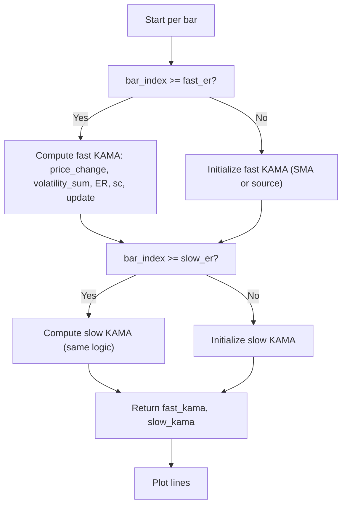

# kaufman Adaptive Moving Average dual KAMA - Technical Guide

> Plots two Kaufman Adaptive Moving Averages (fast and slow) based on Efficiency Ratio.

| | |
| --- | --- |
| **Language** | Indie Script v5 |
| **Platform** | [TakeProfit](https://takeprofit.com) |
| **Category** | Moving averages |
| **Type** | Indicator |
| **Author** | @USERNAME_NOT_SET on TakeProfit |
| **License** | licensed under the MIT License (see the header of the source file) |
| **Live script** | [Open on TakeProfit](https://takeprofit.com/indicator/kaufman-adaptive-moving-average-dual-kama-59) |
| **Source file** | [kaufman Adaptive Moving Average dual KAMA.indie5](kaufman%20Adaptive%20Moving%20Average%20dual%20KAMA.indie5) |

## Overview

The indicator computes two adaptive moving averages using Kaufman's Efficiency Ratio to adjust smoothing. The fast KAMA (cyan line) reacts quickly to price changes, while the slow KAMA (blue line) follows the longer-term trend. It is designed for long-term cycle analysis, with a recommended monthly timeframe. The two lines help identify trend direction and potential support/resistance zones.

## How it works

1. For each KAMA, compute the absolute price change over the specified ER period.
2. Maintain a running sum of absolute price changes (volatility) over the same period.
3. Calculate the Efficiency Ratio (ER) as price change divided by volatility sum.
4. Compute the smoothing constant sc = (ER*(fast_sc - slow_sc) + slow_sc)^2, clamped to [0,1].
5. Update KAMA as previous KAMA + sc * (current price - previous KAMA).
6. On the first bar of each KAMA, initialize with a simple moving average (SMA) of the period.
7. Plot the fast KAMA in cyan and the slow KAMA in blue.

## Mathematical model

$$
\text{price\_change} = |\text{src}[0] - \text{src}[\text{er\_period}]|
$$

$$
\text{volatility\_sum} = \sum_{i=0}^{\text{er\_period}-1} |\text{src}[i] - \text{src}[i+1]|
$$

$$
\text{ER} = \frac{\text{price\_change}}{\text{volatility\_sum}}
$$

$$
\text{fast\_sc} = \frac{2}{\text{fast\_sc\_fast}+1}, \quad \text{slow\_sc} = \frac{2}{\text{fast\_sc\_slow}+1}
$$

$$
\text{sc} = \min\left(1, \max\left(0, \left(\text{ER} \cdot (\text{fast\_sc} - \text{slow\_sc}) + \text{slow\_sc}\right)^2\right)\right)
$$

$$
\text{KAMA} = \text{KAMA}_{\text{prev}} + \text{sc} \cdot (\text{src}[0] - \text{KAMA}_{\text{prev}})
$$

## Logic flow



## Parameters

| Parameter | Type | Default | Range | Description |
| --- | --- | --- | --- | --- |
| `fast_er` | int | 10 | ≥ 1 | Fast KAMA ER Period |
| `fast_sc_fast` | int | 2 | ≥ 1 | Fast KAMA Fast EMA |
| `fast_sc_slow` | int | 20 | ≥ 1 | Fast KAMA Slow EMA |
| `slow_er` | int | 15 | ≥ 1 | Slow KAMA ER Period |
| `slow_sc_fast` | int | 3 | ≥ 1 | Slow KAMA Fast EMA |
| `slow_sc_slow` | int | 30 | ≥ 1 | Slow KAMA Slow EMA |
| `src` | source | source.CLOSE |  |  |

## Code walkthrough

### Fast KAMA initialization and volatility sum

Lines 38-51 of [kaufman Adaptive Moving Average dual KAMA.indie5](kaufman%20Adaptive%20Moving%20Average%20dual%20KAMA.indie5):

```python
        if bar_index >= fast_er:
            price_change = abs(src[0] - src[fast_er])
            if bar_index == fast_er:
                # first bar: calculate SMA as initial KAMA
                volatility_sum = 0.0
                for i in range(0, fast_er):
                    volatility_sum += abs(src[i] - src[i + 1])
                self.volatility_sum_fast = volatility_sum
                self.kama_fast = Sma.new(src, fast_er)[0]
                fast_kama = self.kama_fast
            else:
                # update volatility sum: add latest change, subtract oldest
                self.volatility_sum_fast += abs(src[0] - src[1])
                self.volatility_sum_fast -= abs(src[fast_er] - src[fast_er + 1])
```

When enough bars exist, the code computes the price change over the ER period and maintains a running volatility sum. On the first bar (bar_index == fast_er), it calculates the sum of absolute changes over the entire period and initializes KAMA with an SMA. On subsequent bars, it updates the sum by adding the latest change and subtracting the oldest change, avoiding a full recalculation.

### Smoothing constant calculation

Lines 56-62 of [kaufman Adaptive Moving Average dual KAMA.indie5](kaufman%20Adaptive%20Moving%20Average%20dual%20KAMA.indie5):

```python
                fast_sc = 2.0 / (float(fast_sc_fast) + 1.0)
                slow_sc = 2.0 / (float(fast_sc_slow) + 1.0)
                sc = pow(er * (fast_sc - slow_sc) + slow_sc, 2.0)
                if sc > 1.0:
                    sc = 1.0
                elif sc < 0.0:
                    sc = 0.0
```

The smoothing constant sc is derived from the Efficiency Ratio and the fast/slow EMA constants. It is squared to further reduce smoothing in trending markets and clamped to the [0,1] range to prevent overshoot.

### KAMA update formula

Lines 64-65 of [kaufman Adaptive Moving Average dual KAMA.indie5](kaufman%20Adaptive%20Moving%20Average%20dual%20KAMA.indie5):

```python
                self.kama_fast = self.kama_fast + sc * (src[0] - self.kama_fast)
                fast_kama = self.kama_fast
```

The KAMA value is updated using the adaptive smoothing constant: new KAMA = previous KAMA + sc * (current price - previous KAMA). This is the standard KAMA recursion, where sc acts as a dynamic alpha.

### Slow KAMA duplication

Lines 73-104 of [kaufman Adaptive Moving Average dual KAMA.indie5](kaufman%20Adaptive%20Moving%20Average%20dual%20KAMA.indie5):

```python
        # --- Slow KAMA calculation (same logic, different parameters) ---
        if bar_index >= slow_er:
            price_change = abs(src[0] - src[slow_er])
            if bar_index == slow_er:
                volatility_sum = 0.0
                for i in range(0, slow_er):
                    volatility_sum += abs(src[i] - src[i + 1])
                self.volatility_sum_slow = volatility_sum
                self.kama_slow = Sma.new(src, slow_er)[0]
                slow_kama = self.kama_slow
            else:
                self.volatility_sum_slow += abs(src[0] - src[1])
                self.volatility_sum_slow -= abs(src[slow_er] - src[slow_er + 1])
                er = 0.0
                if self.volatility_sum_slow != 0.0:
                    er = price_change / self.volatility_sum_slow
                
                fast_sc = 2.0 / (float(slow_sc_fast) + 1.0)
                slow_sc = 2.0 / (float(slow_sc_slow) + 1.0)
                sc = pow(er * (fast_sc - slow_sc) + slow_sc, 2.0)
                if sc > 1.0:
                    sc = 1.0
                elif sc < 0.0:
                    sc = 0.0
                
                self.kama_slow = self.kama_slow + sc * (src[0] - self.kama_slow)
                slow_kama = self.kama_slow
        else:
            if bar_index == slow_er - 1:
                slow_kama = src[0]
            else:
                slow_kama = 0.0
```

The slow KAMA calculation is identical in structure to the fast KAMA but uses separate parameters (slow_er, slow_sc_fast, slow_sc_slow) and its own state variables (volatility_sum_slow, kama_slow). This allows independent adaptation speeds.

## Reading the chart

- **Fast KAMA line** (cyan) – reacts quickly to price changes, useful for short-term momentum and exit timing.
- **Slow KAMA line** (blue) – follows the long-term trend, helps identify support/bottom zones.
- No other visual elements (candle coloring, markers) are drawn by this code; the indicator only outputs two line plots.

## Implementation notes

- State variables (volatility_sum_fast, kama_fast, etc.) are stored in the class instance and updated each bar; they are not reset between bars.
- On the first bar where bar_index equals the ER period, KAMA is initialized with an SMA of the period, not with the source value.
- The volatility sum is maintained as a running sum to avoid recalculating the entire sum each bar, improving performance.
- If there are not enough bars (bar_index < ER period), KAMA is set to 0.0 or the source value on the bar just before the ER period.

## FAQ

**How do I adjust the sensitivity of the fast KAMA?**

Increase the Fast KAMA ER Period to make it less sensitive, or decrease it to react faster. Also adjust Fast KAMA Fast EMA and Slow EMA to change the smoothing range.

**Can I use this indicator on intraday timeframes?**

Yes, the indicator works on any timeframe, but the author recommends monthly for long-term cycle analysis. Adjust the ER periods to suit the timeframe.

**Why are the KAMA lines sometimes flat or zero?**

During the initial bars (before enough data for the ER period), the KAMA values are set to 0.0 or the source value. Once enough bars are available, the lines become meaningful.

## Full source code

Indie Script v5, as published on TakeProfit. Copy it into the platform's script editor or [open the live script](https://takeprofit.com/indicator/kaufman-adaptive-moving-average-dual-kama-59).

```python
# Copyright (c) 2026 @sukunabtc. All rights reserved.

# This work is licensed under the MIT License.
# For a copy, see <https://opensource.org/licenses/MIT>.

# indie:lang_version = 5
from indie import indicator, param, source, color, plot, MainContext, SeriesF
from indie.algorithms import Sma
from math import pow

@indicator('Kaufman Adaptive Moving Average (KAMA)', overlay_main_pane=True)
@param.int('fast_er', default=10, min=1, title='Fast KAMA ER Period')
@param.int('fast_sc_fast', default=2, min=1, title='Fast KAMA Fast EMA')
@param.int('fast_sc_slow', default=20, min=1, title='Fast KAMA Slow EMA')
@param.int('slow_er', default=15, min=1, title='Slow KAMA ER Period')
@param.int('slow_sc_fast', default=3, min=1, title='Slow KAMA Fast EMA')
@param.int('slow_sc_slow', default=30, min=1, title='Slow KAMA Slow EMA')
@param.source('src', default=source.CLOSE)
@plot.line('Fast KAMA', color=color.AQUA)
@plot.line('Slow KAMA', color=color.BLUE)
class Main(MainContext):
    def __init__(self):
        self.volatility_sum_fast: float = 0.0
        self.kama_fast: float = 0.0
        self.volatility_sum_slow: float = 0.0
        self.kama_slow: float = 0.0

    def calc(self, fast_er: int, fast_sc_fast: int, fast_sc_slow: int,
             slow_er: int, slow_sc_fast: int, slow_sc_slow: int,
             src: SeriesF) -> tuple[float, float]:
        bar_index = self.bar_count - 1
        
        # Initialize variables before if blocks
        fast_kama = 0.0
        slow_kama = 0.0
        
        # --- Fast KAMA calculation ---
        if bar_index >= fast_er:
            price_change = abs(src[0] - src[fast_er])
            if bar_index == fast_er:
                # first bar: calculate SMA as initial KAMA
                volatility_sum = 0.0
                for i in range(0, fast_er):
                    volatility_sum += abs(src[i] - src[i + 1])
                self.volatility_sum_fast = volatility_sum
                self.kama_fast = Sma.new(src, fast_er)[0]
                fast_kama = self.kama_fast
            else:
                # update volatility sum: add latest change, subtract oldest
                self.volatility_sum_fast += abs(src[0] - src[1])
                self.volatility_sum_fast -= abs(src[fast_er] - src[fast_er + 1])
                er = 0.0
                if self.volatility_sum_fast != 0.0:
                    er = price_change / self.volatility_sum_fast
                
                fast_sc = 2.0 / (float(fast_sc_fast) + 1.0)
                slow_sc = 2.0 / (float(fast_sc_slow) + 1.0)
                sc = pow(er * (fast_sc - slow_sc) + slow_sc, 2.0)
                if sc > 1.0:
                    sc = 1.0
                elif sc < 0.0:
                    sc = 0.0
                
                self.kama_fast = self.kama_fast + sc * (src[0] - self.kama_fast)
                fast_kama = self.kama_fast
        else:
            # not enough bars: use SMA or source value
            if bar_index == fast_er - 1:
                fast_kama = src[0]
            else:
                fast_kama = 0.0
        
        # --- Slow KAMA calculation (same logic, different parameters) ---
        if bar_index >= slow_er:
            price_change = abs(src[0] - src[slow_er])
            if bar_index == slow_er:
                volatility_sum = 0.0
                for i in range(0, slow_er):
                    volatility_sum += abs(src[i] - src[i + 1])
                self.volatility_sum_slow = volatility_sum
                self.kama_slow = Sma.new(src, slow_er)[0]
                slow_kama = self.kama_slow
            else:
                self.volatility_sum_slow += abs(src[0] - src[1])
                self.volatility_sum_slow -= abs(src[slow_er] - src[slow_er + 1])
                er = 0.0
                if self.volatility_sum_slow != 0.0:
                    er = price_change / self.volatility_sum_slow
                
                fast_sc = 2.0 / (float(slow_sc_fast) + 1.0)
                slow_sc = 2.0 / (float(slow_sc_slow) + 1.0)
                sc = pow(er * (fast_sc - slow_sc) + slow_sc, 2.0)
                if sc > 1.0:
                    sc = 1.0
                elif sc < 0.0:
                    sc = 0.0
                
                self.kama_slow = self.kama_slow + sc * (src[0] - self.kama_slow)
                slow_kama = self.kama_slow
        else:
            if bar_index == slow_er - 1:
                slow_kama = src[0]
            else:
                slow_kama = 0.0
        
        return fast_kama, slow_kama
```
