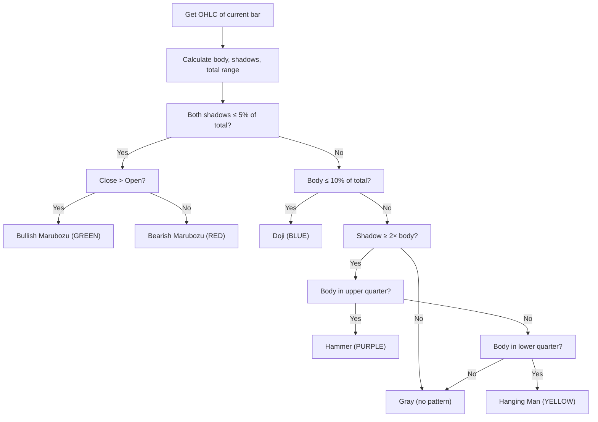

# mara doji hang man hammer - Technical Guide

> Scans for Marubozu, Doji, Hammer, and Hanging Man candlestick patterns and plots colored columns in a separate pane.

| | |
| --- | --- |
| **Language** | Indie Script v5 |
| **Platform** | [TakeProfit](https://takeprofit.com) |
| **Category** | Candlestick patterns |
| **Type** | Indicator |
| **Author** | @mustermann84 on TakeProfit |
| **License** | MIT |
| **Live script** | [Open on TakeProfit](https://takeprofit.com/indicator/mara-doji-hang-man-hammer-52) |
| **Source file** | [mara doji hang man hammer.indie5](mara%20doji%20hang%20man%20hammer.indie5) |

## Overview

This indicator analyzes the current candlestick's open, close, high, and low to detect four classic single-candle patterns: Marubozu (bullish or bearish), Doji, Hammer, and Hanging Man. It uses fixed thresholds for shadow size and body-to-shadow ratios, all relative to the total candle range. The detection logic is applied independently on each bar, with no state or smoothing.

The indicator draws a column in a separate pane below the chart. Each column is colored according to the detected pattern: green for bullish Marubozu, red for bearish Marubozu, blue for Doji, purple for Hammer, yellow for Hanging Man, and gray for candles that do not match any pattern. This gives a quick visual overview of pattern occurrences over time.

## How it works

1. Calculate candle metrics: body size, upper shadow, lower shadow, and total range from current bar OHLC.
2. Set shadow threshold as 5% of total range and doji threshold as 10% of total range.
3. If both shadows are below shadow threshold, classify as Marubozu: green if close > open, red otherwise.
4. Else if body size is below doji threshold, classify as Doji (blue).
5. Else if lower shadow ≥ 2× body or upper shadow ≥ 2× body, check body position.
6. If body is in the lower quarter of the range, classify as Hammer (purple); if in the upper quarter, classify as Hanging Man (yellow).
7. Otherwise, output gray (no pattern detected).

## Mathematical model

$$
\text{body\_size} = |\text{close} - \text{open}|
$$

$$
\text{upper\_shadow} = \text{high} - \max(\text{open}, \text{close})
$$

$$
\text{lower\_shadow} = \min(\text{open}, \text{close}) - \text{low}
$$

$$
\text{total\_size} = \text{high} - \text{low}
$$

$$
\text{shadow\_threshold} = \text{total\_size} \times 0.05
$$

$$
\text{doji\_threshold} = \text{total\_size} \times 0.1
$$

$$
\text{hammer\_shadow\_ratio} = 2
$$

## Logic flow



## Code walkthrough

### Candle metrics and thresholds

Lines 15-23 of [mara doji hang man hammer.indie5](mara%20doji%20hang%20man%20hammer.indie5):

```python
    open_price = self.open[0]
    close_price = self.close[0]
    high_price = self.high[0]
    low_price = self.low[0]

    body_size = abs(close_price - open_price)
    upper_shadow = high_price - max(open_price, close_price)
    lower_shadow = min(open_price, close_price) - low_price
    total_size = high_price - low_price
```

These lines extract OHLC prices from the current bar and compute body size, upper shadow, lower shadow, and total candle range. The thresholds for shadows and doji are defined later (lines 26-28) as percentages of total size. All calculations are based on the current bar only, using the [0] subscript for the latest value.

### Marubozu detection

Lines 30-35 of [mara doji hang man hammer.indie5](mara%20doji%20hang%20man%20hammer.indie5):

```python
    # Marubozu-Kerzen prüfen
    if upper_shadow <= shadow_threshold and lower_shadow <= shadow_threshold:
        if close_price > open_price:
            return plot.Columns(1, color=color_bullish)
        else:
            return plot.Columns(1, color=color_bearish)
```

If both upper and lower shadows are within the 5% threshold, the candle is considered a Marubozu. The color is green for a bullish body (close > open) and red for a bearish body. The function returns immediately, preventing further pattern checks.

### Doji detection

Lines 37-39 of [mara doji hang man hammer.indie5](mara%20doji%20hang%20man%20hammer.indie5):

```python
    # Doji-Kerzen prüfen
    if body_size <= doji_threshold:
        return plot.Columns(1, color=color_doji)
```

If the body size is ≤ 10% of the total range, the candle is classified as a Doji and colored blue. This check occurs only after the Marubozu condition fails, ensuring patterns are mutually exclusive.

### Hammer and Hanging Man

Lines 41-49 of [mara doji hang man hammer.indie5](mara%20doji%20hang%20man%20hammer.indie5):

```python
    # Hammer und Hanging Man prüfen
    body_middle = min(open_price, close_price) + body_size / 2
    if (lower_shadow >= hammer_shadow_ratio * body_size) or (upper_shadow >= hammer_shadow_ratio * body_size):
        if body_middle < (low_price + total_size / 4):
            # Hammer: Kleiner Körper am oberen Ende und langer unterer Schatten
            return plot.Columns(1, color=color_hammer)
        elif body_middle > (high_price - total_size / 4):
            # Hanging Man: Kleiner Körper am unteren Ende und langer oberer Schatten
            return plot.Columns(1, color=color_hanging_man)
```

A candle is considered a potential reversal pattern if either shadow is at least twice the body size. The body's position relative to the total range determines whether it is a Hammer (body in lower quarter, purple) or Hanging Man (body in upper quarter, yellow). The condition uses `body_middle` to decide which quarter the body lies in.

### Default fallback

Lines 51-52 of [mara doji hang man hammer.indie5](mara%20doji%20hang%20man%20hammer.indie5):

```python
    # Standardfarbe, wenn kein spezielles Muster erkannt wird
    return plot.Columns(1, color=color.GRAY)
```

If none of the pattern conditions are met, a gray column is drawn. This ensures every bar produces an output, so the indicator pane is always filled.

## Reading the chart

- **Green column**: Bullish Marubozu – long body, no shadows; strong buying pressure.
- **Red column**: Bearish Marubozu – long body, no shadows; strong selling pressure.
- **Blue column**: Doji – very small body; indecision.
- **Purple column**: Hammer – small body in lower quarter with at least one long shadow; potential bullish reversal.
- **Yellow column**: Hanging Man – small body in upper quarter with at least one long shadow; potential bearish reversal.
- **Gray column**: No recognized pattern; default state.

## Implementation notes

- All pattern checks are based solely on the current bar; there is no multi-bar confirmation or state.
- Thresholds (5% shadow, 10% doji, 2× shadow ratio) are hardcoded and cannot be adjusted via UI parameters.
- The indicator runs in a separate pane (`overlay_main_pane=False`) and uses `@plot.columns` to draw one column per bar.
- If multiple conditions could apply (e.g., a Marubozu also satisfies the Doji threshold), the order of checks determines the pattern; Marubozu takes precedence.

## FAQ

**Can I change the threshold values or add new patterns?**

The thresholds are hardcoded in the source (lines 26-28). To modify them, edit the `shadow_threshold`, `doji_threshold`, or `hammer_shadow_ratio` variables. Adding new patterns would require additional condition blocks before the default gray return.

**Why does the indicator plot in a separate pane instead of on the main chart?**

The decorator `@indicator(..., overlay_main_pane=False)` places the indicator in its own pane below the price chart. This is intentional because the output is a colored column, not an overlay line.

**Does the indicator repaint or use future data?**

No. It only uses the current bar's OHLC prices (`self.open[0]`, etc.). No lookahead or repainting occurs. The column for each bar is final once the bar closes.

## Full source code

Indie Script v5, as published on TakeProfit. Copy it into the platform's script editor or [open the live script](https://takeprofit.com/indicator/mara-doji-hang-man-hammer-52).

```python
# indie:lang_version = 5
from indie import indicator, plot, color

@indicator('Marubozu, Doji, Hammer, and Hanging Man Scanner', overlay_main_pane=False)
@plot.columns(id='#plot_0')
def Main(self):
    # Farben für bullische, bärische Marubozu-Kerzen, Doji-Kerzen, Hammer und Hanging Man
    color_bullish = color.GREEN
    color_bearish = color.RED
    color_doji = color.BLUE
    color_hammer = color.PURPLE
    color_hanging_man = color.YELLOW

    # Ermittle die Eigenschaften der aktuellen Kerze
    open_price = self.open[0]
    close_price = self.close[0]
    high_price = self.high[0]
    low_price = self.low[0]

    body_size = abs(close_price - open_price)
    upper_shadow = high_price - max(open_price, close_price)
    lower_shadow = min(open_price, close_price) - low_price
    total_size = high_price - low_price

    # Schwellenwerte für Schatten und Körper
    shadow_threshold = total_size * 0.05
    doji_threshold = total_size * 0.1
    hammer_shadow_ratio = 2  # Schatten ist mindestens doppelt so lang wie der Körper

    # Marubozu-Kerzen prüfen
    if upper_shadow <= shadow_threshold and lower_shadow <= shadow_threshold:
        if close_price > open_price:
            return plot.Columns(1, color=color_bullish)
        else:
            return plot.Columns(1, color=color_bearish)

    # Doji-Kerzen prüfen
    if body_size <= doji_threshold:
        return plot.Columns(1, color=color_doji)

    # Hammer und Hanging Man prüfen
    body_middle = min(open_price, close_price) + body_size / 2
    if (lower_shadow >= hammer_shadow_ratio * body_size) or (upper_shadow >= hammer_shadow_ratio * body_size):
        if body_middle < (low_price + total_size / 4):
            # Hammer: Kleiner Körper am oberen Ende und langer unterer Schatten
            return plot.Columns(1, color=color_hammer)
        elif body_middle > (high_price - total_size / 4):
            # Hanging Man: Kleiner Körper am unteren Ende und langer oberer Schatten
            return plot.Columns(1, color=color_hanging_man)

    # Standardfarbe, wenn kein spezielles Muster erkannt wird
    return plot.Columns(1, color=color.GRAY)
```
