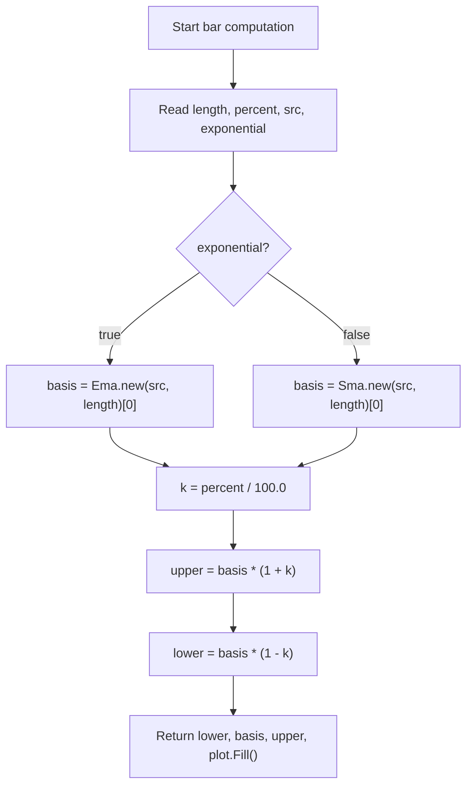

# Envelope (Env) - Built-in Indicator Guide

> Plots a moving-average basis (SMA or EMA) with upper and lower bands set at a fixed percentage from the basis.

| | |
| --- | --- |
| **Language** | Indie Script v5 |
| **Platform** | [TakeProfit](https://takeprofit.com) |
| **Category** | Moving averages |
| **Type** | Built-in indicator |
| **Author** | TakeProfit |
| **License** | MIT |
| **Documentation** | [Built-in indicators](https://takeprofit.com/docs/indie/Code-examples/built-in-indicators#envelope) |
| **Source file** | [Envelope.indie5](Envelope.indie5) |

## Overview

The Envelope indicator overlays a moving-average basis on the main chart and adds two symmetric bands at a constant percentage distance. By default the basis is a simple moving average of closing prices; enabling the exponential option switches the basis to an exponential moving average. The percent parameter controls how far the upper and lower bands are from the basis.

Because the bands are calculated relative to the moving average, their absolute width grows as the basis rises and shrinks as it falls. The chart displays the basis in red, the upper and lower bands in blue, and a translucent aqua fill between the bands. It is meant for observing percentage deviations of the selected source from its recent average.

## How it works

1. Read the settings: `length`, `percent`, `src`, and `exponential`.
2. If `exponential` is true, compute the basis with `Ema.new(src, length)[0]`; otherwise use `Sma.new(src, length)[0]`.
3. The `[0]` index reads the current bar value from the returned series object.
4. Convert the percentage to a decimal factor: `k = percent / 100.0`.
5. Compute the upper band as `basis * (1 + k)` and the lower band as `basis * (1 - k)`.
6. Return the tuple `(lower, basis, upper, plot.Fill())` so the plot decorators draw the lines and fill in the correct order.

## Mathematical model

$$
B_t =
\begin{cases}
\operatorname{EMA}_t(src, n), & \text{if exponential}\\
\operatorname{SMA}_t(src, n), & \text{otherwise}
\end{cases}
$$

$$
U_t = B_t \left(1+\frac{p}{100}\right), \quad L_t = B_t \left(1-\frac{p}{100}\right)
$$

## Logic flow



## Parameters

| Parameter | Type | Default | Range | Description |
| --- | --- | --- | --- | --- |
| `length` | int | 20 | ≥ 1 |  |
| `percent` | float | 10.0 |  |  |
| `src` | source | source.CLOSE |  | Source |
| `exponential` | bool | false |  |  |

## Code walkthrough

### Indicator and parameter declarations

Lines 6-10 of [Envelope.indie5](Envelope.indie5):

```python
@indicator('Env', overlay_main_pane=True)  # Envelope
@param.int('length', default=20, min=1)
@param.float('percent', default=10.0)
@param.source('src', default=source.CLOSE, title='Source')
@param.bool('exponential', default=False)
```

These decorators register the script as an overlay indicator named `Env` and generate the settings UI: `length`, `percent`, `src`, and `exponential`. The `overlay_main_pane=True` flag places the output directly on the main chart pane.

### Plot output contract

Lines 11-14 of [Envelope.indie5](Envelope.indie5):

```python
@plot.line('lower', color=color.BLUE, title='Lower')
@plot.line('basis', color=color.RED, title='Basis')
@plot.line('upper', color=color.BLUE, title='Upper')
@plot.fill('lower', 'upper', color=color.AQUA(0.05), title='Background')
```

Each `@plot.line` decorator declares one series to be plotted: `lower`, `basis`, and `upper`, with their colors and titles. The `@plot.fill` decorator declares a translucent aqua fill between the `lower` and `upper` plots. The value returned from `Main` must match the order of these decorators.

### Choosing the moving-average basis

Lines 15-20 of [Envelope.indie5](Envelope.indie5):

```python
def Main(self, length, percent, src, exponential):
    basis = 0.0
    if exponential:
        basis = Ema.new(src, length)[0]
    else:
        basis = Sma.new(src, length)[0]
```

`Main` receives the parameter values. `basis` is initialized to `0.0`, then assigned inside an if/else branch. `Ema.new` and `Sma.new` return series objects; indexing with `[0]` reads the current bar's value. The `exponential` flag selects the EMA path when enabled, otherwise the SMA path.

### Band calculation and output

Lines 21-24 of [Envelope.indie5](Envelope.indie5):

```python
    k = percent / 100.0
    upper = basis * (1 + k)
    lower = basis * (1 - k)
    return lower, basis, upper, plot.Fill()
```

The percentage is converted to a decimal factor `k`. The upper and lower bands are symmetric multiples of the basis. Returning `plot.Fill()` as the fourth value pairs with the `@plot.fill` decorator, drawing the filled area between the lower and upper bands.

## Reading the chart

Red line (`basis`): the SMA or EMA of the selected source.
Blue lines (`upper` and `lower`): the basis shifted up and down by `percent`.
Aqua translucent fill: the area between the lower and upper bands.
When the visible source value is outside the blue lines, it is more than `percent` away from the current moving-average basis.
The absolute distance between the bands is `2 * basis * percent / 100`, so it changes with the level of the basis itself.

## Implementation notes

- `basis = 0.0` is a fallback initialization; both branches of the if/else assign a real value.
- `Ema.new` and `Sma.new` create series objects; `[0]` is the current bar, and previous bars would be accessible as `[1]`, `[2]`, etc.
- The bands are not volatility-based; they scale linearly with the basis level.
- The default `exponential` value is `false`, so the indicator uses a simple moving average unless the user changes the setting.

## FAQ

**How do I make the envelope use an exponential moving average?**

Enable the `exponential` boolean setting. When it is true, `Main` calls `Ema.new(src, length)` instead of `Sma.new(src, length)` for the basis.

**What does percent mean exactly?**

It is the one-sided band distance as a percentage of the basis. At 10.0, upper equals basis * 1.10 and lower equals basis * 0.90.

**Can I apply the envelope to another data series?**

Yes, use the `Source` setting, which corresponds to the `src` parameter. The default is `close`, and the entire calculation runs on whatever source you select.

## Full source code

Indie Script v5, the built-in indicator as shipped with TakeProfit. Add it from the indicators menu or copy the code into the platform's script editor.

```python
# indie:lang_version = 5
from indie import indicator, param, source, plot, color
from indie.algorithms import Ema, Sma


@indicator('Env', overlay_main_pane=True)  # Envelope
@param.int('length', default=20, min=1)
@param.float('percent', default=10.0)
@param.source('src', default=source.CLOSE, title='Source')
@param.bool('exponential', default=False)
@plot.line('lower', color=color.BLUE, title='Lower')
@plot.line('basis', color=color.RED, title='Basis')
@plot.line('upper', color=color.BLUE, title='Upper')
@plot.fill('lower', 'upper', color=color.AQUA(0.05), title='Background')
def Main(self, length, percent, src, exponential):
    basis = 0.0
    if exponential:
        basis = Ema.new(src, length)[0]
    else:
        basis = Sma.new(src, length)[0]
    k = percent / 100.0
    upper = basis * (1 + k)
    lower = basis * (1 - k)
    return lower, basis, upper, plot.Fill()
```
