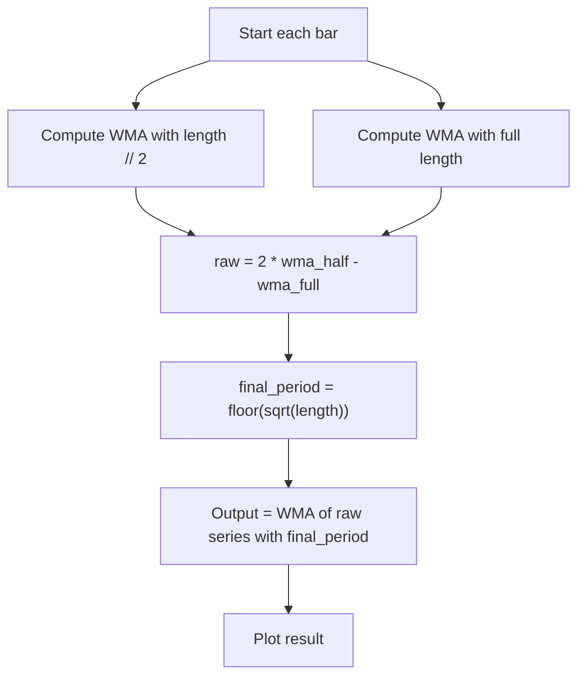

# Hull Moving Average (HMA) - Built-in Indicator Guide

> A smoothed moving average that reduces lag by combining two WMAs of different periods.

| | |
| --- | --- |
| **Language** | Indie Script v5 |
| **Platform** | [TakeProfit](https://takeprofit.com) |
| **Category** | Moving averages |
| **Type** | Built-in indicator |
| **Author** | TakeProfit |
| **License** | MIT |
| **Documentation** | [Built-in indicators](https://takeprofit.com/docs/indie/Code-examples/built-in-indicators#hull-moving-average) |
| **Source file** | [Hull Moving Average.indie5](Hull%20Moving%20Average.indie5) |

## Overview

The Hull Moving Average (HMA) is a technical indicator that aims to reduce the lag inherent in traditional moving averages while maintaining smoothness. It was developed by Alan Hull and is particularly useful in trending markets where traders want to identify direction changes more quickly.

The indicator plots a single blue line directly on the price chart. It is calculated using a two-step process: first, two weighted moving averages (WMAs) are computed from the source price (typically close), then a third WMA is applied to a transformed series to produce the final output.

## How it works

1. 1. Compute WMA of the source price with half the user-specified length.
2. 2. Compute WMA of the source price with the full user-specified length.
3. 3. Calculate the raw Hull value: 2 × (WMA of half length) − (WMA of full length).
4. 4. Determine the final HMA period as the integer square root of the length.
5. 5. Compute a third WMA of the raw Hull series using the final period to produce the smoothed output.

## Mathematical model

$$
\text{HMA} = \text{WMA}\big(2 \cdot \text{WMA}_{\lfloor L/2 \rfloor} - \text{WMA}_{L},\, \lfloor \sqrt{L} \rfloor \big)
$$

where $L$ is the user-specified `length` parameter and $\text{WMA}_n$ is a weighted moving average with period $n$.

## Logic flow



## Parameters

| Parameter | Type | Default | Range | Description |
| --- | --- | --- | --- | --- |
| `length` | int | 9 | ≥ 1 |  |
| `src` | source | source.CLOSE |  | Source |

## Code walkthrough

### Parameters and plot decorators

Lines 8-10 of [Hull Moving Average.indie5](Hull%20Moving%20Average.indie5):

```python
@param.int('length', default=9, min=1)
@param.source('src', default=source.CLOSE, title='Source')
@plot.line(color=color.BLUE)
```

The `length` parameter defaults to 9 with a minimum of 1. The source input defaults to `CLOSE` price. The `@plot.line` decorator specifies the output will be drawn as a blue line.

### Core calculation logic

Lines 12-14 of [Hull Moving Average.indie5](Hull%20Moving%20Average.indie5):

```python
    wma_l2 = Wma.new(src, length // 2)[0]
    wma_l = Wma.new(src, length)[0]
    return Wma.new(MutSeriesF.new(2 * wma_l2 - wma_l), floor(sqrt(length)))[0]
```

Two WMAs are computed on lines 12–13: one with half the length and one with the full length. The intermediate raw series is `2 * wma_l2 - wma_l`. A `MutSeriesF` is used to convert this scalar into a feedable series for the final WMA call.

### Final smoothing step

Lines 14-14 of [Hull Moving Average.indie5](Hull%20Moving%20Average.indie5):

```python
    return Wma.new(MutSeriesF.new(2 * wma_l2 - wma_l), floor(sqrt(length)))[0]
```

The `Wma.new` algorithm is called again with period `floor(sqrt(length))`. The result `[0]` is the current bar's HMA value, which is returned from `Main` for plotting.

## Reading the chart

* A rising HMA indicates an uptrend; a falling HMA indicates a downtrend.
* The blue line crossing the price can signal potential trend changes.
* Shorter `length` values produce a faster, more responsive line but with more noise; longer values produce a smoother line with less lag than a simple moving average of the same period.

## Implementation notes

- The HMA uses integer division for the half-length (`length // 2`), so odd lengths effectively use `(length - 1) / 2`.
- The final smoothing period uses `floor(sqrt(length))`, which is always at least 1 because the minimum length is 1.
- All WMAs are computed via the built-in `Wma.new` algorithm, which returns a series accessible with `[0]` for the current bar.

## FAQ

**What is the default length and why?**

The default length is 9, which provides a good balance between responsiveness and smoothness for most timeframes.

**Can I use a different source price?**

Yes, the `src` parameter accepts any price source (open, high, low, close, HL2, etc.) via the dropdown in the indicator settings.

**How does HMA differ from a simple moving average?**

The HMA reduces lag by weighting recent prices more heavily and applying a double-smoothing technique, making it more responsive to price changes while maintaining a smooth curve.

## Full source code

Indie Script v5, the built-in indicator as shipped with TakeProfit. Add it from the indicators menu or copy the code into the platform's script editor.

```python
# indie:lang_version = 5
from math import floor, sqrt
from indie import indicator, param, source, plot, color, MutSeriesF
from indie.algorithms import Wma


@indicator('HMA', overlay_main_pane=True)  # Hull Moving Average
@param.int('length', default=9, min=1)
@param.source('src', default=source.CLOSE, title='Source')
@plot.line(color=color.BLUE)
def Main(self, length, src):
    wma_l2 = Wma.new(src, length // 2)[0]
    wma_l = Wma.new(src, length)[0]
    return Wma.new(MutSeriesF.new(2 * wma_l2 - wma_l), floor(sqrt(length)))[0]
```
