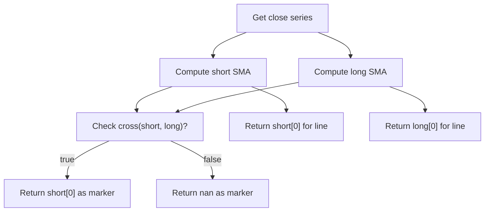

# MA Cross - Built-in Indicator Guide

> Plots two SMAs and a marker when they cross to signal trend changes.

| | |
| --- | --- |
| **Language** | Indie Script v5 |
| **Platform** | [TakeProfit](https://takeprofit.com) |
| **Category** | Moving averages |
| **Type** | Built-in indicator |
| **Author** | TakeProfit |
| **License** | MIT |
| **Documentation** | [Built-in indicators](https://takeprofit.com/docs/indie/Code-examples/built-in-indicators#ma-cross) |
| **Source file** | [MA Cross.indie5](MA%20Cross.indie5) |

## Overview

The MA Cross indicator displays two simple moving averages (SMAs) of the close price – a short period and a long period – on the chart. It is designed to help identify potential trend reversals or trend confirmations by detecting when the faster moving average crosses above or below the slower one.

On the chart, the short MA is drawn as a maroon line, the long MA as a green line. When the two SMAs cross (either direction), a blue cross‑shaped marker is plotted at the crossover point. This visual cue can be used as an entry or exit signal in trend‑following strategies.

## How it works

1. The indicator is configured by two integer parameters: short MA length and long MA length.
2. On each bar, it computes the short SMA and the long SMA of the close series using the Sma.new algorithm.
3. It returns the current values of both SMAs for continuous line plotting.
4. The cross function from indie.math determines whether the short SMA crosses the long SMA on the current bar (both up‑cross and down‑cross).
5. If a cross occurs, the current short SMA value is returned as the marker value; otherwise, math.nan is returned so no marker is drawn.

## Mathematical model

The simple moving average is defined as:

$$
SMA_n(t) = \frac{1}{n} \sum_{i=0}^{n-1} \text{close}_{t-i}
$$

The indicator uses a cross detection function that returns true when the relationship between the two series changes:

$$
\text{cross}(x, y) = 
\begin{cases}
\text{true} & \text{if } x[1] \leq y[1] \quad \text{and} \quad x[0] > y[0] \\
\text{true} & \text{if } x[1] \geq y[1] \quad \text{and} \quad x[0] < y[0] \\
\text{false} & \text{otherwise}
\end{cases}
$$

## Logic flow



## Parameters

| Parameter | Type | Default | Range | Description |
| --- | --- | --- | --- | --- |
| `short_len` | int | 9 | ≥ 1 | Short MA Length |
| `long_len` | int | 21 | ≥ 1 | Long MA Length |

## Code walkthrough

### Parameter and plot decorators

Lines 9-14 of [MA Cross.indie5](MA%20Cross.indie5):

```python
@param.int('short_len', default=9, min=1, title='Short MA Length')
@param.int('long_len', default=21, min=1, title='Long MA Length')
@plot.line(color=color.MAROON, title='Short')
@plot.line(color=color.GREEN, title='Long')
@plot.marker(color=color.BLUE, style=plot.marker_style.CROSS,
             position=plot.marker_position.CENTER, size=7, title='MA Cross')
```

Lines 9‑10 define two integer parameters with defaults of 9 and 21, both with a minimum of 1. Lines 11‑14 declare three plot outputs: two continuous lines (maroon for short, green for long) and a marker (blue cross, centered, size 7) for the crossover signal. The @plot.marker decorator binds the third return value of Main to the marker style.

### SMA computation with Sma.new

Lines 16-17 of [MA Cross.indie5](MA%20Cross.indie5):

```python
    short = Sma.new(self.close, short_len)
    long = Sma.new(self.close, long_len)
```

Two Sma series are created by calling Sma.new(self.close, length). This returns a series object; indexing with [0] retrieves the value for the current bar. The series are computed incrementally as new bars arrive, without manual looping.

### Return statement with conditional marker

Lines 18-18 of [MA Cross.indie5](MA%20Cross.indie5):

```python
    return short[0], long[0], short[0] if cross(short, long) else nan
```

The function returns a three‑element tuple: short SMA value, long SMA value, and the marker value. The marker value is the short SMA value if a cross occurs (using cross(short, long) which returns a boolean for the current bar), otherwise math.nan to suppress drawing. The cross function detects both up‑crosses and down‑crosses.

## Reading the chart

- **Maroon line**: Short‑period SMA (default 9 bars).  
- **Green line**: Long‑period SMA (default 21 bars).  
- **Blue cross marker**: Plotted at the center of the bar where the two SMAs cross (either direction). The marker uses the current short SMA value as its Y position.
- When no cross occurs, the marker output is math.nan, so no marker appears.

## Implementation notes

- Sma.new returns a series object; you must index it with [0] to get the current bar’s value.
- The cross function from indie.math evaluates the relationship between the current and previous bar; it returns True only on the exact bar where the lines cross.
- Only a single marker style is used (CROSS), not separate up/down arrows, because the code does not distinguish between up‑cross and down‑cross.
- The marker is drawn only when short[0] is returned; if cross returns False, math.nan suppresses the marker without affecting the line plots.

## FAQ

**Can I use exponential or weighted moving averages instead of SMAs?**

No, this implementation uses only SMAs. To change the type, you would need to replace Sma.new with another algorithm such as Ema.new from indie.algorithms.

**Does the marker indicate the direction of the cross (up or down)?**

No, the same blue CROSS marker is drawn for both up‑crosses and down‑crosses. You cannot tell the direction from the marker alone; you must observe which line is above the other.

**Can I adjust the marker size or position?**

Yes, the @plot.marker decorator includes parameters for size and position. You can change them in the source code before deploying the indicator.

## Full source code

Indie Script v5, the built-in indicator as shipped with TakeProfit. Add it from the indicators menu or copy the code into the platform's script editor.

```python
# indie:lang_version = 5
from math import nan
from indie import indicator, param, plot, color
from indie.algorithms import Sma
from indie.math import cross


@indicator('MA Cross', overlay_main_pane=True)  # MA Cross
@param.int('short_len', default=9, min=1, title='Short MA Length')
@param.int('long_len', default=21, min=1, title='Long MA Length')
@plot.line(color=color.MAROON, title='Short')
@plot.line(color=color.GREEN, title='Long')
@plot.marker(color=color.BLUE, style=plot.marker_style.CROSS,
             position=plot.marker_position.CENTER, size=7, title='MA Cross')
def Main(self, short_len, long_len):
    short = Sma.new(self.close, short_len)
    long = Sma.new(self.close, long_len)
    return short[0], long[0], short[0] if cross(short, long) else nan
```
