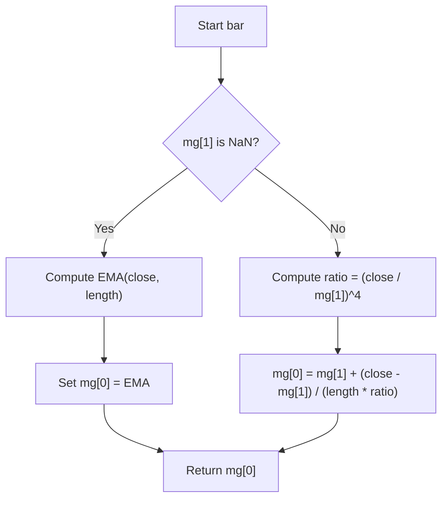

# McGinley Dynamic (McGinley) - Built-in Indicator Guide

> Adaptive moving average that smooths price while responding faster to trends.

| | |
| --- | --- |
| **Language** | Indie Script v5 |
| **Platform** | [TakeProfit](https://takeprofit.com) |
| **Category** | Moving averages |
| **Type** | Built-in indicator |
| **Author** | TakeProfit |
| **License** | MIT |
| **Documentation** | [Built-in indicators](https://takeprofit.com/docs/indie/Code-examples/built-in-indicators#mcginley-dynamic) |
| **Source file** | [McGinley Dynamic.indie5](McGinley%20Dynamic.indie5) |

## Overview

The McGinley Dynamic is an adaptive moving average designed to reduce lag and noise compared to traditional moving averages. It adjusts its smoothing factor based on the ratio of current price to the previous average, making it more responsive during fast moves and smoother during sideways markets.

This indicator is intended for trend-following strategies where reducing whipsaws and lag is important. It is plotted as a single line on the price chart, typically in blue, and can be used as dynamic support/resistance or for trend direction signals.

## How it works

1. On the first bar, the indicator initializes the McGinley value using an Exponential Moving Average (EMA) of the close price with the same length.
2. For each subsequent bar, it retrieves the previous McGinley value from the MutSeriesF state.
3. It computes the ratio of current close to the previous McGinley value.
4. The new McGinley value is calculated as: previous value + (close - previous value) / (length * ratio^4).
5. The result is stored in the MutSeriesF for the next bar and returned as the plot value.

## Mathematical model

$$
\text{MG}_t = \text{MG}_{t-1} + \frac{\text{close}_t - \text{MG}_{t-1}}{\text{length} \times \left(\frac{\text{close}_t}{\text{MG}_{t-1}}\right)^4}
$$

On the first bar, $\text{MG}_t = \text{EMA}(\text{close}, \text{length})$.

## Logic flow



## Parameters

| Parameter | Type | Default | Range | Description |
| --- | --- | --- | --- | --- |
| `length` | int | 14 | ≥ 1 |  |

## Code walkthrough

### Initialization with EMA

Lines 12-14 of [McGinley Dynamic.indie5](McGinley%20Dynamic.indie5):

```python
    mg = MutSeriesF.new(init=0)
    if isnan(mg[1]):
        mg[0] = Ema.new(self.close, length)[0]
```

The MutSeriesF holds the previous McGinley value. On the first bar, mg[1] is NaN, so the indicator seeds the series with an EMA of the close price. This avoids an undefined starting point and ensures smooth convergence.

### Adaptive formula

Lines 15-16 of [McGinley Dynamic.indie5](McGinley%20Dynamic.indie5):

```python
    else:
        mg[0] = mg[1] + divide(self.close[0] - mg[1], length * pow(divide(self.close[0], mg[1]), 4))
```

For all subsequent bars, the McGinley Dynamic uses a self-adjusting smoothing factor. The ratio of current close to the previous average is raised to the fourth power, making the smoothing more aggressive when price moves away from the average. The `divide` function is used to safely handle division by zero.

### Plotting and parameters

Lines 8-10 of [McGinley Dynamic.indie5](McGinley%20Dynamic.indie5):

```python
@indicator('McGinley', overlay_main_pane=True)  # McGinley Dynamic
@param.int('length', default=14, min=1)
@plot.line(color=color.BLUE)
```

The indicator is declared with `overlay_main_pane=True` so it draws directly on the price chart. The `length` parameter (default 14, minimum 1) controls the base smoothing period. The output line is colored blue.

## Reading the chart

- The blue line represents the McGinley Dynamic value.
- When price is above the line, the trend is considered bullish; below the line, bearish.
- The line acts as dynamic support/resistance: price bounces off it in strong trends.
- A steeper line indicates faster price movement; a flatter line indicates consolidation.
- Crossovers of price and the line can be used as entry/exit signals.

## Implementation notes

- The first bar uses an EMA as a seed; this means the indicator requires at least one bar of data before producing a valid value.
- The `divide` function from `indie.math` is used to avoid division by zero when the previous McGinley value is zero or the ratio is undefined.
- The `MutSeriesF` maintains state across bars; the previous value is accessed via `mg[1]` and the current via `mg[0]`.
- The exponent of 4 in the denominator makes the smoothing highly sensitive to price changes, which can cause overshoots in volatile markets.

## FAQ

**What does the `length` parameter control?**

The `length` parameter sets the base smoothing period, similar to a simple moving average. A larger length makes the McGinley Dynamic smoother but slower to react; a smaller length makes it more responsive.

**How is the McGinley Dynamic different from an EMA?**

The McGinley Dynamic uses an adaptive smoothing factor that depends on the ratio of current price to the previous average. This allows it to react faster during strong trends and remain smoother during sideways markets, reducing lag compared to a fixed-period EMA.

**Can I use this indicator for trading signals?**

Yes, common signals include price crossing above/below the line for trend direction, or using the line as dynamic support/resistance. However, like all indicators, it should be combined with other analysis for confirmation.

## Full source code

Indie Script v5, the built-in indicator as shipped with TakeProfit. Add it from the indicators menu or copy the code into the platform's script editor.

```python
# indie:lang_version = 5
from math import isnan, pow
from indie import indicator, param, plot, color, MutSeriesF
from indie.algorithms import Ema
from indie.math import divide


@indicator('McGinley', overlay_main_pane=True)  # McGinley Dynamic
@param.int('length', default=14, min=1)
@plot.line(color=color.BLUE)
def Main(self, length):
    mg = MutSeriesF.new(init=0)
    if isnan(mg[1]):
        mg[0] = Ema.new(self.close, length)[0]
    else:
        mg[0] = mg[1] + divide(self.close[0] - mg[1], length * pow(divide(self.close[0], mg[1]), 4))
    return mg[0]
```
