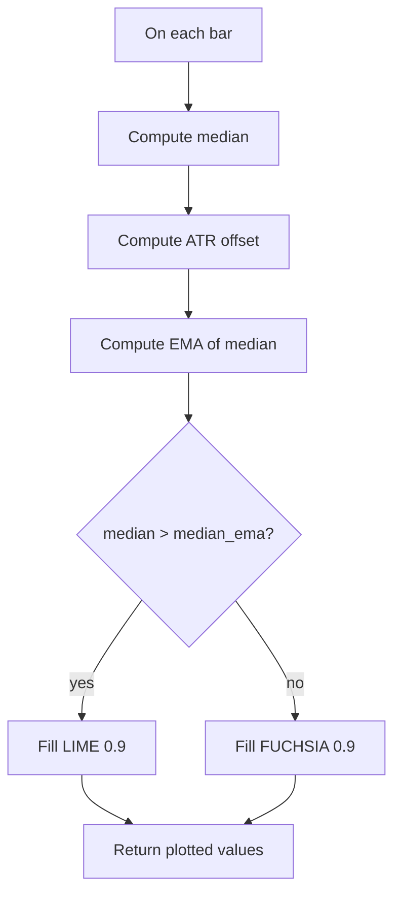

# Median - Built-in Indicator Guide

> Computes a rolling median of the chosen source, an EMA of that median, and ATR-based upper/lower bands around the median.

| | |
| --- | --- |
| **Language** | Indie Script v5 |
| **Platform** | [TakeProfit](https://takeprofit.com) |
| **Category** | Moving averages |
| **Type** | Built-in indicator |
| **Author** | TakeProfit |
| **License** | MIT |
| **Documentation** | [Built-in indicators](https://takeprofit.com/docs/indie/Code-examples/built-in-indicators#median) |
| **Source file** | [Median.indie5](Median.indie5) |

## Overview

The Median indicator is an overlay that plots three derived series in the main price pane: a rolling median of the input source, an exponential moving average of that median, and ATR-based upper/lower bands around the median. The default source is HL2, and the median length defaults to 3, so the line tracks short-term price centers.

The chart shows a red thicker median line, a blue EMA of the median, a lime upper band, and a fuchsia lower band. A translucent background fill between the median and its EMA switches color depending on whether the median is above or below that EMA.

## How it works

1. Read src, length, atr_length, and atr_mult from the settings created by the @param decorators.
2. Compute the rolling median of src over the last length bars using Median.new(src, length)[0].
3. Compute ATR at atr_length and scale it by atr_mult to obtain the band offset.
4. Wrap the current median in MutSeriesF and feed it to Ema.new(..., length)[0] to get the smoothed median.
5. Compare median with median_ema: choose translucent lime for the fill if median is above, fuchsia otherwise.
6. Return the five values in the order of the @plot decorators: median_ema, median - atr, median, median + atr, fill.

## Mathematical model

$$
M_t = \text{median}\left(\text{src}_{t}, \text{src}_{t-1}, \dots, \text{src}_{t-\text{length}+1}\right)
$$

$$
\text{ATR}_t = \text{ATR}\left(\text{atr\_length}\right)_t
$$

$$
\text{Upper}_t = M_t + \text{atr\_mult}\cdot\text{ATR}_t,\qquad \text{Lower}_t = M_t - \text{atr\_mult}\cdot\text{ATR}_t
$$

$$
\text{EMA}_t = \text{EMA}\left(M, \text{length}\right)_t
$$

## Logic flow



## Parameters

| Parameter | Type | Default | Range | Description |
| --- | --- | --- | --- | --- |
| `src` | source | source.HL2 |  | Source |
| `length` | int | 3 | ≥ 1 | Median Length |
| `atr_length` | int | 14 | ≥ 1 | ATR Length |
| `atr_mult` | int | 2 | ≥ 1 | ATR Multiplier |

## Code walkthrough

### Indicator and plot declarations

Lines 6-15 of [Median.indie5](Median.indie5):

```python
@indicator('Median', overlay_main_pane=True)
@param.source('src', default=source.HL2, title='Source')
@param.int('length', default=3, min=1, title='Median Length')
@param.int('atr_length', default=14, min=1, title='ATR Length')
@param.int('atr_mult', default=2, min=1, title='ATR Multiplier')
@plot.line('ema', color=color.BLUE, title='Median EMA')
@plot.line(color=color.FUCHSIA, title='Lower Band')
@plot.line('median', color=color.RED, line_width=3, title='Median')
@plot.line(color=color.LIME, title='Upper Band')
@plot.fill('median', 'ema', title='Background')
```

The decorators define chart placement, the settings UI, and the plot output. overlay_main_pane=True makes the indicator draw in the main chart pane. The plot decorators create named lines and a fill; the fill connects the 'median' and 'ema' line names.

### Median and ATR inputs

Lines 16-19 of [Median.indie5](Median.indie5):

```python
def Main(self, src, length, atr_length, atr_mult):
    median = Median.new(src, length)[0]

    atr = atr_mult * Atr.new(atr_length)[0]
```

Main receives the parameter values as arguments. The median is the current value of a rolling median of src over the length window. ATR is computed separately at atr_length and multiplied by atr_mult. The [0] subscript returns the current bar value from each algorithm's series.

### EMA of the median

Lines 21-23 of [Median.indie5](Median.indie5):

```python
    median_ema = Ema.new(MutSeriesF.new(median), length)[0]

    fill_color = color.LIME(0.9) if median > median_ema else color.FUCHSIA(0.9)
```

Ema.new expects a series, so MutSeriesF.new(median) wraps the current median value into a mutable series for the EMA. The fill color is then chosen per bar by comparing the median with its EMA; both colors use 0.9 alpha.

### Return tuple

Lines 24-29 of [Median.indie5](Median.indie5):

```python
    return (
        median_ema,
        median - atr,
        median,
        median + atr,
        plot.Fill(color=fill_color),
```

The returned tuple is matched by position to the plot decorators. The four numeric values are median_ema, lower band, median, and upper band. The final plot.Fill object paints the area between the median and its EMA with the selected color.

## Reading the chart

- The red line is the raw rolling median of the selected source and is thicker than the other lines because it has line_width=3.
- The blue line is an EMA of that median. When the red line is above the blue line, the median sits above its smoothed value.
- The lime line is the upper band, computed as median + atr.
- The fuchsia line is the lower band, computed as median - atr.
- The translucent background fill sits between the red median and the blue EMA, and is lime when median > median_ema, fuchsia otherwise.

## Implementation notes

- median, atr, and median_ema are all read with [0], so each bar's output depends on the current bar's value; the active bar's plot updates as new prices arrive.
- The upper and lower bands are symmetric around the median because they are simply median ± atr.
- The translucent fill is drawn only between the median and its EMA, not between the bands.
- No NaN or barstate checks are present in this script, so the indicator attempts to return values on every bar.

## FAQ

**What do the length and atr_length parameters do?**

length sets both the rolling window for the median and the period for the EMA of that median. atr_length sets the period for the ATR used to place the upper and lower bands.

**Why are there three lines plus a fill?**

The red median is the main line, the blue EMA is its smoothed version, and the lime and fuchsia lines are the upper and lower ATR bands. The background fill between the red and blue lines changes color depending on which is higher.

**Can I use a different price source?**

Yes. Change the Source parameter from the default HL2 to any available source, and the median, its EMA, and the band center will all be based on that source.

## Full source code

Indie Script v5, the built-in indicator as shipped with TakeProfit. Add it from the indicators menu or copy the code into the platform's script editor.

```python
# indie:lang_version = 5
from indie import indicator, param, source, plot, color, MutSeriesF
from indie.algorithms import Median, Atr, Ema


@indicator('Median', overlay_main_pane=True)
@param.source('src', default=source.HL2, title='Source')
@param.int('length', default=3, min=1, title='Median Length')
@param.int('atr_length', default=14, min=1, title='ATR Length')
@param.int('atr_mult', default=2, min=1, title='ATR Multiplier')
@plot.line('ema', color=color.BLUE, title='Median EMA')
@plot.line(color=color.FUCHSIA, title='Lower Band')
@plot.line('median', color=color.RED, line_width=3, title='Median')
@plot.line(color=color.LIME, title='Upper Band')
@plot.fill('median', 'ema', title='Background')
def Main(self, src, length, atr_length, atr_mult):
    median = Median.new(src, length)[0]

    atr = atr_mult * Atr.new(atr_length)[0]

    median_ema = Ema.new(MutSeriesF.new(median), length)[0]

    fill_color = color.LIME(0.9) if median > median_ema else color.FUCHSIA(0.9)
    return (
        median_ema,
        median - atr,
        median,
        median + atr,
        plot.Fill(color=fill_color),
    )
```
