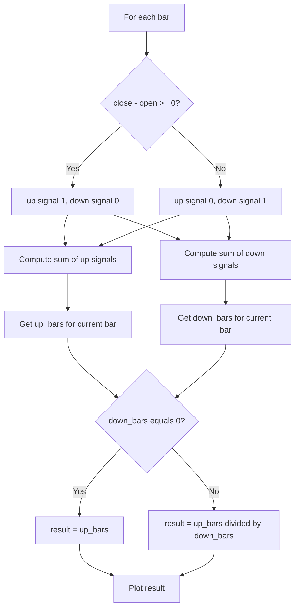

# Advance/Decline Ratio (Bars) (ADR_B) - Built-in Indicator Guide

> Computes the rolling ratio of up bars to down bars based on close vs open, with a reference line at 1.

| | |
| --- | --- |
| **Language** | Indie Script v5 |
| **Platform** | [TakeProfit](https://takeprofit.com) |
| **Category** | Oscillators |
| **Type** | Built-in indicator |
| **Author** | TakeProfit |
| **License** | MIT |
| **Documentation** | [Built-in indicators](https://takeprofit.com/docs/indie/Code-examples/built-in-indicators#advance%2Fdecline-ratio-bars) |
| **Source file** | [Advance-Decline Ratio (Bars).indie5](Advance-Decline%20Ratio%20(Bars).indie5) |

## Overview

ADR_B measures the balance between up bars and down bars over a rolling window. A bar is classified as up when close is greater than or equal to open, otherwise it is down. The indicator plots the ratio of the up-bar count to the down-bar count, with a fixed reference line at 1.

It is intended for tracking short-term directional pressure or bar-by-bar breadth. Values above 1 show advancing bars in the majority, values below 1 show declining bars in the majority. The ratio is drawn as a blue line and the equality level is drawn in gray.

## How it works

1. On each bar, `is_up` is true when `close[0] - open[0] >= 0.0`, classifying the bar as up; otherwise it is down.
2. Two `MutSeriesF` series store integer signals: `is_up_ints` is 1 for up bars and 0 for down bars, while `is_down_ints` is the inverse.
3. `Sum.new` builds a rolling sum over the user-defined `length` for each series, producing `up_bars` and `down_bars`.
4. The current rolling totals are read with `up_bars[0]` and `down_bars[0]`.
5. `divide` returns `up_bars[0] / down_bars[0]` when `down_bars[0]` is non-zero.
6. If `down_bars[0]` is zero, `divide` falls back to `up_bars[0]` so that the indicator still produces a numeric value.
7. The resulting value is plotted as a blue line; a gray level at 1 separates advancing and declining bar counts.

## Mathematical model

$$
U_t = \sum_{i=0}^{length-1} \mathbb{1}[close_{t-i} \ge open_{t-i}]
$$

$$
D_t = \sum_{i=0}^{length-1} \mathbb{1}[close_{t-i} < open_{t-i}]
$$

$$
ADR_t = \frac{U_t}{D_t} \quad \text{if } D_t > 0; \quad ADR_t = U_t \text{ if } D_t = 0
$$

## Logic flow



## Parameters

| Parameter | Type | Default | Range | Description |
| --- | --- | --- | --- | --- |
| `length` | int | 9 | ≥ 1 |  |

## Code walkthrough

### Indicator declaration and settings

Lines 7-10 of [Advance-Decline Ratio (Bars).indie5](Advance-Decline%20Ratio%20(Bars).indie5):

```python
@indicator('ADR_B', format=format.PRICE)  # Advance/Decline Ratio (Bars)
@param.int('length', default=9, min=1)
@level(1, line_color=color.GRAY, title='Equality Line')
@plot.line(color=color.BLUE, title='ADR_B')
```

Registers the indicator under the short name ADR_B, declares an integer `length` parameter with default 9 and minimum 1, draws a gray equality level at 1, and configures a blue line plot. These decorators generate the settings UI and chart styling.

### Converting bar direction to integer signals

Lines 12-15 of [Advance-Decline Ratio (Bars).indie5](Advance-Decline%20Ratio%20(Bars).indie5):

```python
    is_up = (self.close[0] - self.open[0]) >= 0.0

    is_down_ints = MutSeriesF.new(0 if is_up else 1)
    is_up_ints = MutSeriesF.new(1 if is_up else 0)
```

The bar is considered up when close is greater than or equal to open. Two `MutSeriesF` series are created, one for up bars and one for down bars, storing 1 or 0. This one-hot style lets rolling sums count bars of each type.

### Rolling sums over the lookback

Lines 17-18 of [Advance-Decline Ratio (Bars).indie5](Advance-Decline%20Ratio%20(Bars).indie5):

```python
    down_bars = Sum.new(is_down_ints, length)
    up_bars = Sum.new(is_up_ints, length)
```

`Sum.new` creates a rolling sum algorithm for each integer series. Reading index `[0]` gives the total for the current bar, while `[1]` would give the previous bar's total. The same `length` is used for both sums.

### Returning the ratio safely

Lines 20-20 of [Advance-Decline Ratio (Bars).indie5](Advance-Decline%20Ratio%20(Bars).indie5):

```python
    return divide(up_bars[0], down_bars[0], up_bars[0])
```

The result is `up_bars` divided by `down_bars`, but `divide` also receives `up_bars[0]` as a fallback. If no down bars are present in the window, the indicator outputs the up-bar count instead of dividing by zero.

## Reading the chart

The blue line is the ADR_B value. The gray horizontal line at 1 is the equality line: when the blue line is above it, there are more up bars than down bars over the lookback; below it, there are more down bars. Crossings of the gray line indicate a shift in the prevailing bar direction. When the down-bar count is non-zero, a value exactly equal to 1 means the number of up bars equals the number of down bars over the period. When there are no down bars, the value equals the up-bar count, which can be larger than the typical ratio range.

## Implementation notes

- The `length` parameter has a minimum of 1 and defaults to 9.
- A bar is considered 'up' when close equals open, so doji bars are counted as up.
- `divide` prevents division-by-zero by falling back to `up_bars[0]` when `down_bars[0]` is zero.
- The rolling sums are integer counts, so the ratio is discrete even though it is drawn as a line.

## FAQ

**What does a value above 1 mean?**

It means more up bars than down bars occurred over the last `length` bars. A value below 1 means the opposite.

**How do I change the lookback period?**

Use the `length` parameter in the indicator settings. It defaults to 9 and has a minimum of 1.

**Why is the value sometimes much larger than 1?**

When there are no down bars in the window, the code returns the up-bar count instead of a ratio, avoiding division by zero.

## Full source code

Indie Script v5, the built-in indicator as shipped with TakeProfit. Add it from the indicators menu or copy the code into the platform's script editor.

```python
# indie:lang_version = 5
from indie import indicator, format, param, level, color, plot, MutSeriesF
from indie.algorithms import Sum
from indie.math import divide


@indicator('ADR_B', format=format.PRICE)  # Advance/Decline Ratio (Bars)
@param.int('length', default=9, min=1)
@level(1, line_color=color.GRAY, title='Equality Line')
@plot.line(color=color.BLUE, title='ADR_B')
def Main(self, length):
    is_up = (self.close[0] - self.open[0]) >= 0.0

    is_down_ints = MutSeriesF.new(0 if is_up else 1)
    is_up_ints = MutSeriesF.new(1 if is_up else 0)

    down_bars = Sum.new(is_down_ints, length)
    up_bars = Sum.new(is_up_ints, length)

    return divide(up_bars[0], down_bars[0], up_bars[0])
```
