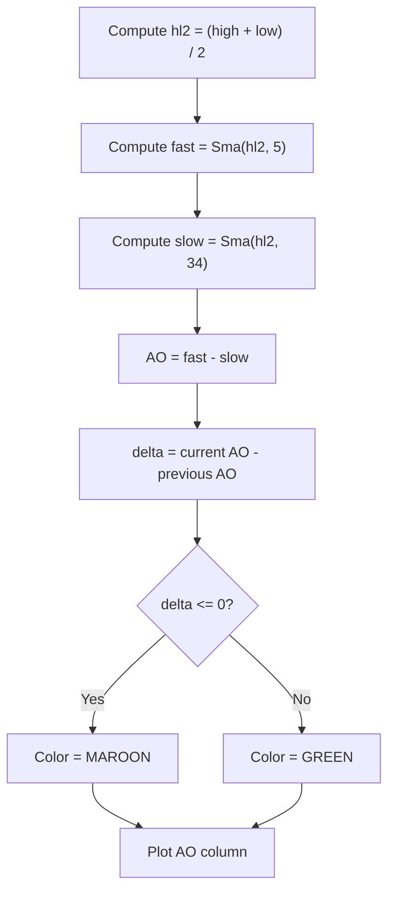

# Awesome Oscillator (AO) - Built-in Indicator Guide

> Computes the Awesome Oscillator as the difference between 5- and 34-period SMAs of median price, drawn as colored columns.

| | |
| --- | --- |
| **Language** | Indie Script v5 |
| **Platform** | [TakeProfit](https://takeprofit.com) |
| **Category** | Oscillators |
| **Type** | Built-in indicator |
| **Author** | TakeProfit |
| **License** | MIT |
| **Documentation** | [Built-in indicators](https://takeprofit.com/docs/indie/Code-examples/built-in-indicators#awesome-oscillator) |
| **Source file** | [Awesome Oscillator.indie5](Awesome%20Oscillator.indie5) |

## Overview

The Awesome Oscillator measures momentum by comparing a 5-period simple moving average of median price (the high/low midpoint) to a 34-period simple moving average of the same series. The result is plotted as columns around a zero line: positive values mean the fast average is above the slow average, negative values mean it is below.

The chart output is a histogram of the difference, with each column colored according to whether the oscillator rose or fell from the previous bar. Green columns indicate an increasing oscillator, maroon columns indicate a decreasing or unchanged oscillator.

## How it works

1. For each bar, calculate the median price hl2 = (high + low) / 2.
2. Compute a 5-period SMA of hl2 with Sma.new(self.hl2, 5).
3. Compute a 34-period SMA of hl2 with Sma.new(self.hl2, 34).
4. Set ao to the difference of the two current SMA values and store it in a MutSeriesF so the previous bar remains available.
5. Compute delta = ao[0] - ao[1] to see whether the oscillator rose or fell from the previous bar.
6. Choose color.MAROON when delta <= 0, otherwise color.GREEN.
7. Draw a column at the current AO value using the chosen color.

## Mathematical model

$$
\text{hl2}_t = \frac{\text{High}_t + \text{Low}_t}{2}
$$

$$
\text{AO}_t = \text{SMA}_t(\text{hl2}, 5) - \text{SMA}_t(\text{hl2}, 34)
$$

$$
d_t = \text{AO}_t - \text{AO}_{t-1}
$$

$$
\text{color} = \begin{cases} \text{MAROON} & d_t \le 0 \\ \text{GREEN} & d_t > 0 \end{cases}
$$

## Logic flow



## Code walkthrough

### Indicator declaration and column plot mode

Lines 7-9 of [Awesome Oscillator.indie5](Awesome%20Oscillator.indie5):

```python
@indicator('AO')  # Awesome Oscillator
@plot.columns()
def Main(self):
```

The @indicator decorator registers the script under the short name 'AO'. The @plot.columns decorator tells the platform that Main will return columns, which are drawn as vertical bars on the chart.

### Computing the oscillator value

Lines 10-10 of [Awesome Oscillator.indie5](Awesome%20Oscillator.indie5):

```python
    ao = MutSeriesF.new(Sma.new(self.hl2, 5)[0] - Sma.new(self.hl2, 34)[0])
```

Two SMAs are created over the same median-price series hl2, with periods 5 and 34. Indexing each SMA with [0] takes its current bar value, and the slow value is subtracted from the fast value. MutSeriesF.new stores the resulting AO series so that ao[1] refers to the previous bar.

### Coloring the column by direction

Lines 11-12 of [Awesome Oscillator.indie5](Awesome%20Oscillator.indie5):

```python
    d = ao[0] - ao[1]
    c = color.MAROON if d <= 0 else color.GREEN
```

The difference d between the current AO and the previous AO controls the color. If d is zero or negative the column is MAROON; otherwise it is GREEN. This means a flat or falling oscillator is drawn maroon, while a rising oscillator is drawn green.

### Returning the plot

Lines 13-13 of [Awesome Oscillator.indie5](Awesome%20Oscillator.indie5):

```python
    return plot.Columns(ao[0], color=c)
```

Main returns a plot.Columns object containing the current AO value and the selected color. The platform renders one such column for every bar where this return value is produced.

## Reading the chart

The zero level separates positive and negative oscillator values. Positive values mean the 5-period average is above the 34-period average; negative values mean it is below.

Green columns indicate that the oscillator value increased from the previous bar, maroon columns indicate that it decreased or stayed the same. The height of each column corresponds to the magnitude of the difference between the two SMAs.

## Implementation notes

- MutSeriesF is required because the color depends on the previous AO value; ao[1] is the prior bar's stored value.
- Sma.new returns a series, and taking [0] extracts the current bar's SMA value from that series.
- A zero change is treated as non-positive, so completely flat bars are drawn maroon.
- The calculation uses only high and low prices; open and close prices are not involved.

## FAQ

**What do the green and maroon columns mean?**

Green means the current AO value is greater than the previous AO value. Maroon means the current value is less than or equal to the previous value.

**How can I use different moving-average lengths?**

Change the 5 and 34 arguments in line 10. Both SMAs use the same hl2 series, so the indicator remains a difference between a fast and a slow average of median price.

**Where is the zero line on the chart?**

The plotted value is the difference between the two SMAs, so positive values appear above zero and negative values appear below zero by construction.

## Full source code

Indie Script v5, the built-in indicator as shipped with TakeProfit. Add it from the indicators menu or copy the code into the platform's script editor.

```python
# indie:lang_version = 5
from indie import indicator, plot, color, MutSeriesF
from indie.algorithms import Sma


# TODO: Support palettes of colors in indicators
@indicator('AO')  # Awesome Oscillator
@plot.columns()
def Main(self):
    ao = MutSeriesF.new(Sma.new(self.hl2, 5)[0] - Sma.new(self.hl2, 34)[0])
    d = ao[0] - ao[1]
    c = color.MAROON if d <= 0 else color.GREEN
    return plot.Columns(ao[0], color=c)
```
