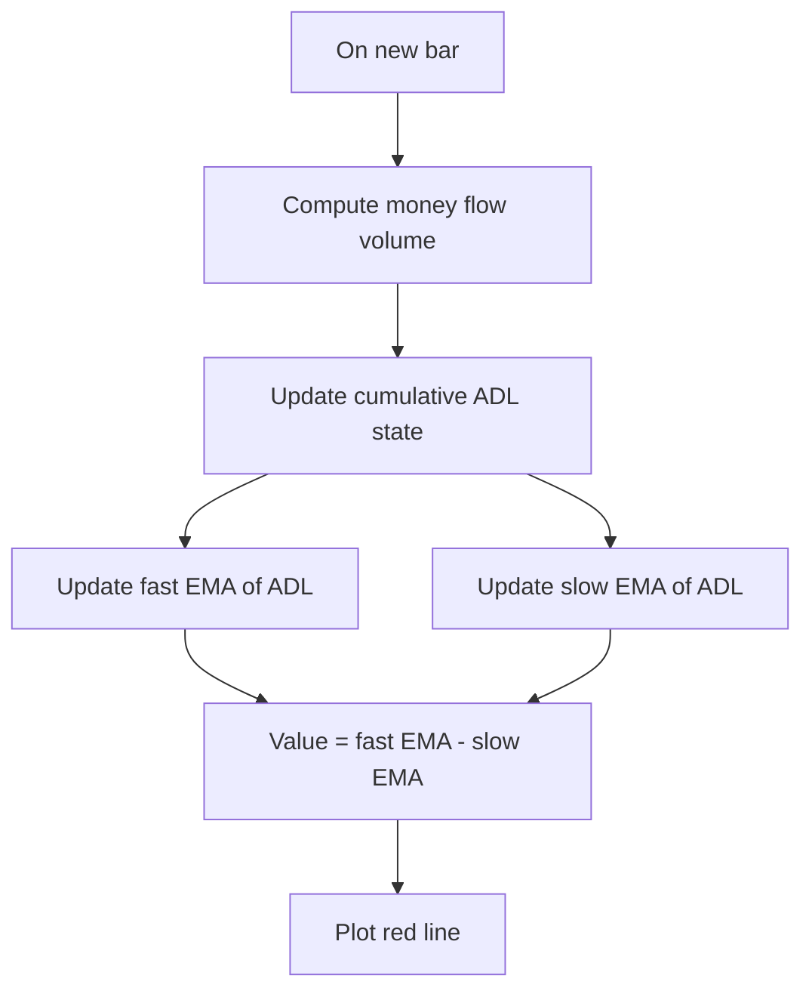

# Chaikin Oscillator (Chaikin Osc) - Built-in Indicator Guide

> Computes the difference between fast and slow EMAs of the cumulative money flow volume (Accumulation/Distribution Line).

| | |
| --- | --- |
| **Language** | Indie Script v5 |
| **Platform** | [TakeProfit](https://takeprofit.com) |
| **Category** | Oscillators |
| **Type** | Built-in indicator |
| **Author** | TakeProfit |
| **License** | MIT |
| **Documentation** | [Built-in indicators](https://takeprofit.com/docs/indie/Code-examples/built-in-indicators#chaikin-oscillator) |
| **Source file** | [Chaikin Oscillator.indie5](Chaikin%20Oscillator.indie5) |

## Overview

The Chaikin Oscillator is a volume-based oscillator built from the Accumulation/Distribution Line (ADL). It first forms the Money Flow Volume (MFV) for each bar, cumulates it into the ADL, then subtracts a slow exponential moving average of the ADL from a fast exponential moving average of the ADL. The result is shown as a single red line.

The gray horizontal zero line is drawn by the indicator and acts as a reference. The fast and slow EMA lengths are configurable through the settings panel generated by the parameter decorators. The indicator is meant to be read as a measure of how the volume-weighted price flow is changing relative to its slower trend.

## How it works

1. For each bar, calculate Money Flow Volume (`Mfv.new()`), which weights volume by the close position inside the bar's high-low range.
2. Keep a running cumulative sum of that series with `CumSum.new(Mfv.new())`; this is the Accumulation/Distribution Line (`ad`).
3. Create a fast EMA of `ad` using `fast_length`.
4. Create a slow EMA of `ad` using `slow_length`.
5. Read the current bar's values from both EMA series using `[0]`.
6. Subtract the slow EMA from the fast EMA to obtain `ch_osc`, and return that value for plotting.

## Mathematical model

$$
\mathrm{MFV}_i = \frac{(C_i - L_i) - (H_i - C_i)}{H_i - L_i} \cdot V_i
$$

$$
\mathrm{ADL}_i = \sum_{j=1}^{i} \mathrm{MFV}_j
$$

$$
\mathrm{ChaikinOsc}_i = \mathrm{EMA}(\mathrm{ADL},\mathrm{fast})_i - \mathrm{EMA}(\mathrm{ADL},\mathrm{slow})_i
$$

## Logic flow



## Parameters

| Parameter | Type | Default | Range | Description |
| --- | --- | --- | --- | --- |
| `fast_length` | int | 3 | ≥ 1 | Fast Length |
| `slow_length` | int | 10 | ≥ 1 | Slow Length |

## Code walkthrough

### Indicator declaration and decorators

Lines 6-10 of [Chaikin Oscillator.indie5](Chaikin%20Oscillator.indie5):

```python
@indicator('Chaikin Osc', format=format.VOLUME)  # Chaikin Oscillator
@param.int('fast_length', default=3, min=1, title='Fast Length')
@param.int('slow_length', default=10, min=1, title='Slow Length')
@level(0, line_color=color.GRAY, title='Zero')
@plot.line(color=color.RED, title='Chaikin Oscillator')
```

The `@indicator` decorator registers the plot under the short name `Chaikin Osc` and selects volume formatting. The two `@param.int` decorators create settings inputs with defaults of 3 and 10. `@level(0, ...)` draws a gray zero line, and `@plot.line(...)` colors the returned series red.

### Building the Accumulation/Distribution Line

Lines 12-12 of [Chaikin Oscillator.indie5](Chaikin%20Oscillator.indie5):

```python
    ad = CumSum.new(Mfv.new())
```

`Mfv.new()` produces the money-flow-volume value for the current bar. Wrapping it with `CumSum.new()` creates a stateful running total, so `ad` holds the cumulative sum of all money-flow volumes up to the current bar. This is the underlying series used by the oscillator.

### Computing the oscillator

Lines 13-13 of [Chaikin Oscillator.indie5](Chaikin%20Oscillator.indie5):

```python
    ch_osc = Ema.new(ad, fast_length)[0] - Ema.new(ad, slow_length)[0]
```

Two EMAs of `ad` are created, one for `fast_length` and one for `slow_length`. The `[0]` index reads the current bar's value from each EMA series. `ch_osc` is their difference and becomes the single returned value that is plotted.

## Reading the chart

- The red line is the oscillator value (`ch_osc`) on each bar.
- The gray horizontal line is the zero reference added by `@level(0, ...)`.
- Values above zero occur when the fast EMA of the ADL is above the slow EMA; values below zero occur when the fast EMA is below the slow EMA.
- The distance between the red line and zero reflects the magnitude of the difference between the two EMAs.

## Implementation notes

- `CumSum.new()` and `Ema.new()` create stateful algorithm objects; `Main` itself does not store previous-bar values.
- Using `[0]` reads the current bar from each series. `[1]` would access the previous bar, but it is not used here.
- There is no built-in constraint requiring `slow_length` > `fast_length`; both parameters only have `min=1`. The subtraction order stays as written.
- `format.VOLUME` affects how the returned value is scaled on the chart but not the calculation.

## FAQ

**What is the difference between the two length parameters?**

`fast_length` and `slow_length` are the periods of two exponential moving averages applied to the cumulative money-flow-volume line. The oscillator subtracts the slow EMA from the fast EMA, so the two lengths determine how quickly the line responds.

**How is the zero level used?**

The `@level(0, ...)` decorator draws a gray horizontal line at zero on the same scale. The oscillator is positive when the fast EMA is above the slow EMA and negative when it is below.

**Can I change the line color or format?**

Yes. The `@plot.line(color=...)` decorator controls the line color, and `format=format.VOLUME` in `@indicator` controls the display format. Changing these decorators adjusts chart presentation only, not the calculation.

## Full source code

Indie Script v5, the built-in indicator as shipped with TakeProfit. Add it from the indicators menu or copy the code into the platform's script editor.

```python
# indie:lang_version = 5
from indie import indicator, format, param, level, color, plot
from indie.algorithms import CumSum, Mfv, Ema


@indicator('Chaikin Osc', format=format.VOLUME)  # Chaikin Oscillator
@param.int('fast_length', default=3, min=1, title='Fast Length')
@param.int('slow_length', default=10, min=1, title='Slow Length')
@level(0, line_color=color.GRAY, title='Zero')
@plot.line(color=color.RED, title='Chaikin Oscillator')
def Main(self, fast_length, slow_length):
    ad = CumSum.new(Mfv.new())
    ch_osc = Ema.new(ad, fast_length)[0] - Ema.new(ad, slow_length)[0]
    return ch_osc
```
