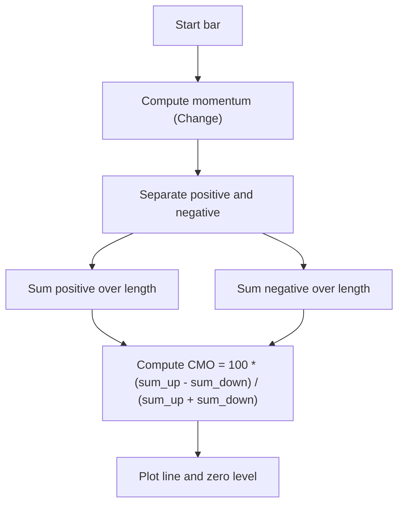

# Chande Momentum Oscillator (Chande MO) - Built-in Indicator Guide

> Computes the Chande Momentum Oscillator (CMO) as the ratio of price change sums over a specified period.

| | |
| --- | --- |
| **Language** | Indie Script v5 |
| **Platform** | [TakeProfit](https://takeprofit.com) |
| **Category** | Oscillators |
| **Type** | Built-in indicator |
| **Author** | TakeProfit |
| **License** | MIT |
| **Documentation** | [Built-in indicators](https://takeprofit.com/docs/indie/Code-examples/built-in-indicators#chande-momentum-oscillator) |
| **Source file** | [Chande Momentum Oscillator.indie5](Chande%20Momentum%20Oscillator.indie5) |

## Overview

The Chande Momentum Oscillator (CMO) is a momentum oscillator that measures the ratio of upward price changes to downward price changes over a given period. It is designed to identify overbought and oversold conditions and potential trend reversals. The indicator oscillates between -100 and +100. On the chart, a blue line represents the CMO value, and a gray horizontal line at zero serves as a reference level.

## How it works

1. Compute the momentum (change) of the source price from the previous bar.
2. Separate the momentum into positive (upward) and negative (downward) components.
3. Sum the positive momentum values over the specified length.
4. Sum the absolute values of negative momentum over the same length.
5. Calculate the CMO as 100 times the difference of the sums divided by the total sum.
6. Plot the result as a line, with a zero level line.

## Mathematical model

$$
CMO = 100 \times \frac{SU - SD}{SU + SD}
$$

where SU is the sum of positive price changes over the period, and SD is the sum of absolute negative price changes.

## Logic flow



## Parameters

| Parameter | Type | Default | Range | Description |
| --- | --- | --- | --- | --- |
| `length` | int | 9 | ≥ 1 |  |
| `src` | source | source.CLOSE |  | Source |

## Code walkthrough

### Momentum separation

Lines 13-16 of [Chande Momentum Oscillator.indie5](Chande%20Momentum%20Oscillator.indie5):

```python
    momm = Change.new(src)[0]

    m1 = momm if momm >= 0 else 0
    m2 = 0.0 if momm >= 0 else -momm
```

The momentum (change) of the source is computed on line 13. Lines 15-16 split this momentum into positive (m1) and negative (m2) components. If momentum is non-negative, m1 equals the momentum and m2 is zero; otherwise m1 is zero and m2 is the absolute value of the negative momentum.

### Summing over the period

Lines 18-19 of [Chande Momentum Oscillator.indie5](Chande%20Momentum%20Oscillator.indie5):

```python
    sm1 = Sum.new(MutSeriesF.new(m1), length)[0]
    sm2 = Sum.new(MutSeriesF.new(m2), length)[0]
```

Two Sum algorithms are created, each fed with a mutable series (MutSeriesF) wrapping the separated components. The Sum.new returns a series whose current value (index 0) is the sum over the last 'length' bars. This efficiently maintains rolling sums without manual loop logic.

### Final calculation and output

Lines 21-21 of [Chande Momentum Oscillator.indie5](Chande%20Momentum%20Oscillator.indie5):

```python
    return 100 * divide(sm1 - sm2, sm1 + sm2)
```

The CMO value is computed as 100 times the difference of the two sums divided by their total. The divide function safely handles division by zero (returns NaN). The result is returned as a single value (since only one plot is defined) and plotted as a blue line.

## Reading the chart

- The CMO line oscillates between -100 and +100.
- Values above +50 are typically considered overbought, below -50 oversold (common interpretation, not enforced by code).
- Crossings of the zero line may indicate a shift in momentum direction.
- The line is plotted in blue; a gray horizontal line marks the zero level.

## Implementation notes

- The indicator uses MutSeriesF to create mutable series for the sums, allowing efficient rolling updates.
- The divide function handles division by zero safely, returning NaN which is not plotted.
- Momentum is computed as change from the previous bar, so the first bar may produce NaN.
- The length parameter has a minimum of 1, but practical values are typically larger.

## FAQ

**What is the default length for the CMO?**

The default length is 9 bars.

**Can I change the source price used for calculation?**

Yes, the 'src' parameter defaults to close but can be changed to any price source (open, high, low, close, etc.).

**How does the indicator handle division by zero?**

The divide function returns NaN when the denominator is zero, which prevents plotting an invalid value.

## Full source code

Indie Script v5, the built-in indicator as shipped with TakeProfit. Add it from the indicators menu or copy the code into the platform's script editor.

```python
# indie:lang_version = 5
from indie import indicator, format, param, source, level, color, plot, MutSeriesF
from indie.algorithms import Change, Sum
from indie.math import divide


@indicator('Chande MO', format=format.PRICE)  # Chande Momentum Oscillator
@param.int('length', default=9, min=1)
@param.source('src', default=source.CLOSE, title='Source')
@level(0, line_color=color.GRAY, title='Zero')
@plot.line(color=color.BLUE, title='Chande MO')
def Main(self, length, src):
    momm = Change.new(src)[0]

    m1 = momm if momm >= 0 else 0
    m2 = 0.0 if momm >= 0 else -momm

    sm1 = Sum.new(MutSeriesF.new(m1), length)[0]
    sm2 = Sum.new(MutSeriesF.new(m2), length)[0]

    return 100 * divide(sm1 - sm2, sm1 + sm2)
```
