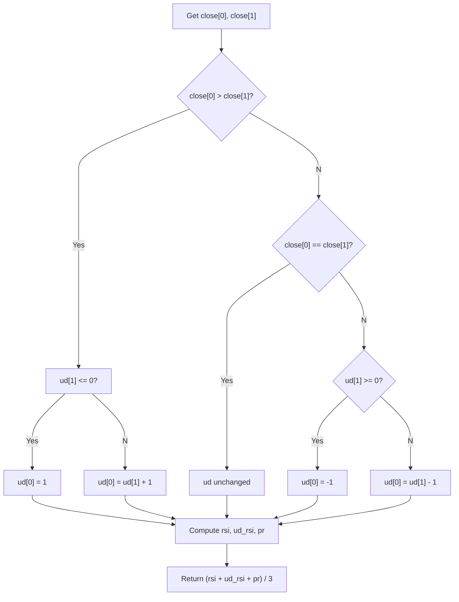

# Connors RSI (CRSI) - Built-in Indicator Guide

> A composite oscillator that averages RSI of price, RSI of directional streaks, and PercentRank of rate of change.

| | |
| --- | --- |
| **Language** | Indie Script v5 |
| **Platform** | [TakeProfit](https://takeprofit.com) |
| **Category** | Oscillators |
| **Type** | Built-in indicator |
| **Author** | TakeProfit |
| **License** | MIT |
| **Documentation** | [Built-in indicators](https://takeprofit.com/docs/indie/Code-examples/built-in-indicators#connors-rsi) |
| **Source file** | [Connors RSI.indie5](Connors%20RSI.indie5) |

## Overview

Connors RSI (CRSI) is a normalized oscillator that blends three distinct measures of price momentum and trend strength. It combines a standard RSI of closing prices, an RSI of a custom up/down streak counter, and a PercentRank of the one-period rate of change. The result is a single value between 0 and 100 that aims to smooth out noise while remaining sensitive to directional persistence.

The indicator is drawn as a blue line on a fixed scale, with a gray background band between 30 and 70 (light aqua fill) and a gray line at 50. It is typically used to identify overbought (above 70) and oversold (below 30) conditions in trending or mean‑reverting markets, where the streak component adds extra weight to sustained moves.

## How it works

1. Compare current close to previous close to determine direction (up, down, or equal).
2. Update a mutable series `ud` that counts consecutive moves in the same direction: reset to ±1 on a direction change, otherwise increment the streak.
3. Compute a standard RSI of closing prices over `len_rsi` bars.
4. Compute a second RSI of the `ud` streak series over `len_up_down` bars.
5. Compute the PercentRank of the 1‑period rate of change (ROC) over `len_roc` bars.
6. Average the three components to produce the final CRSI value for the current bar.

## Mathematical model

$$
\text{CRSI} = \frac{\text{RSI}(\text{close}, \text{len\_rsi}) + \text{RSI}(\text{ud}, \text{len\_up\_down}) + \text{PercentRank}(\text{ROC}(\text{close}, 1), \text{len\_roc})}{3}
$$

Where RSI is the standard Relative Strength Index and PercentRank is the rank‑based percentile normalisation provided by the platform’s library.

## Logic flow



## Parameters

| Parameter | Type | Default | Range | Description |
| --- | --- | --- | --- | --- |
| `len_rsi` | int | 3 | ≥ 1 | RSI Length |
| `len_up_down` | int | 2 | ≥ 1 | UpDown Length |
| `len_roc` | int | 100 | ≥ 1 | ROC Length |

## Code walkthrough

### Up/Down Streak Logic

Lines 19-31 of [Connors RSI.indie5](Connors%20RSI.indie5):

```python
    is_equal = self.close[0] == self.close[1]
    is_growing = self.close[0] > self.close[1]
    ud = MutSeriesF.new(0)  # why not mut_series(init=0)
    if is_growing:
        if nan_to_zero(ud[1]) <= 0:  # why not equal nan_to_zero(ud)[1]
            ud[0] = 1
        else:
            ud[0] = nan_to_zero(ud[1]) + 1
    elif not is_equal:
        if nan_to_zero(ud[1]) >= 0:
            ud[0] = -1
        else:
            ud[0] = nan_to_zero(ud[1]) - 1
```

This block determines the direction of price change and updates the `ud` mutable series. If price is growing and the previous streak was non‑positive, the streak resets to 1; otherwise it increments. For falling prices the logic mirrors with negative values. Equal prices set `ud` to 0. The `nan_to_zero` helper ensures that a `NaN` previous value is treated as zero.

### Component Calculations

Lines 33-35 of [Connors RSI.indie5](Connors%20RSI.indie5):

```python
    rsi = Rsi.new(self.close, len_rsi)[0]
    ud_rsi = Rsi.new(ud, len_up_down)[0]
    pr = PercentRank.new(Roc.new(self.close, 1), len_roc)[0]
```

Three normalised components are computed: a standard RSI of the close price, an RSI of the `ud` streak series, and a PercentRank of the one‑period rate of change. Each uses a configurable lookback length. The `[0]` index extracts the current value from the series returned by the `.new()` factory.

### Return Value

Lines 36-36 of [Connors RSI.indie5](Connors%20RSI.indie5):

```python
    return (rsi + ud_rsi + pr) / 3
```

The final CRSI value is the simple average of the three components. Because each component is already scaled between 0 and 100, the result also falls in that range and can be plotted directly with the defined bands and levels.

## Reading the chart

- The blue line oscillates between 0 and 100.
- Values above 70 (top of the gray band) suggest overbought conditions; values below 30 (bottom of the gray band) suggest oversold conditions.
- The gray line at 50 acts as a neutral midline.
- Because CRSI averages three different normalised signals, it may react more slowly to isolated price jumps but strengthens during sustained trends due to the streak component.
- The PercentRank of ROC adds a rank‑based perspective, making the indicator less sensitive to extreme price spikes than a pure RSI.

## Implementation notes

- The `ud` mutable series (`MutSeriesF`) retains state between bars; its initial value is 0, and it is updated in place using `ud[0]` and `ud[1]`.
- `nan_to_zero` is applied to `ud[1]` before comparisons to avoid `NaN` propagation when the series has not yet been fully initialised.
- All three `.new()` calls return series objects; the `[0]` index extracts the value for the current bar, while `[1]` would give the previous bar’s value.
- The `@band` and `@level` decorators only affect the visual overlay; they do not influence the computation.

## FAQ

**How do I adjust the sensitivity of CRSI?**

Increase `len_rsi` and `len_roc` to smooth the indicator, or decrease them to react faster. The `len_up_down` parameter controls how many bars the streak RSI looks back.

**What does the `ud` series represent?**

It is a counter that tracks consecutive bars moving in the same direction. It resets to ±1 when the direction changes and increments (or decrements) during a streak, giving extra weight to sustained moves.

**Can I use CRSI on timeframes other than the chart’s base timeframe?**

The code does not include a `sec_context` or `calc_on` decorator, so it runs on the chart’s primary timeframe. To apply it to a different timeframe you would need to add the appropriate decorator.

## Full source code

Indie Script v5, the built-in indicator as shipped with TakeProfit. Add it from the indicators menu or copy the code into the platform's script editor.

```python
# indie:lang_version = 5
from math import isnan
from indie import indicator, format, param, band, color, level, plot, MutSeriesF
from indie.algorithms import Rsi, PercentRank, Roc


def nan_to_zero(val: float) -> float:
    return 0 if isnan(val) else val


@indicator('CRSI', format=format.PRICE)  # Connors RSI
@param.int('len_rsi', default=3, min=1, title='RSI Length')
@param.int('len_up_down', default=2, min=1, title='UpDown Length')
@param.int('len_roc', default=100, min=1, title='ROC Length')
@band(30, 70, line_color=color.GRAY, fill_color=color.AQUA(0.1), title='Background')
@level(50, line_color=color.GRAY(0.5), title='Middle Band')
@plot.line(color=color.BLUE, title='CRSI')
def Main(self, len_rsi, len_up_down, len_roc):
    is_equal = self.close[0] == self.close[1]
    is_growing = self.close[0] > self.close[1]
    ud = MutSeriesF.new(0)  # why not mut_series(init=0)
    if is_growing:
        if nan_to_zero(ud[1]) <= 0:  # why not equal nan_to_zero(ud)[1]
            ud[0] = 1
        else:
            ud[0] = nan_to_zero(ud[1]) + 1
    elif not is_equal:
        if nan_to_zero(ud[1]) >= 0:
            ud[0] = -1
        else:
            ud[0] = nan_to_zero(ud[1]) - 1

    rsi = Rsi.new(self.close, len_rsi)[0]
    ud_rsi = Rsi.new(ud, len_up_down)[0]
    pr = PercentRank.new(Roc.new(self.close, 1), len_roc)[0]
    return (rsi + ud_rsi + pr) / 3
```
